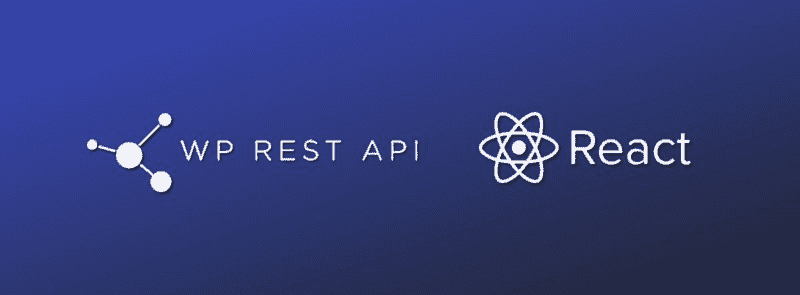

# 如何在 WordPress REST API 上构建 React 应用程序

> 原文：<https://www.freecodecamp.org/news/how-to-build-react-apps-on-top-of-the-wordpress-rest-api-bcc632808025/>

安德烈·波克罗夫斯基

# 如何在 WordPress REST API 上构建 React 应用程序



**更新 06/16/2017:**
***我更新了项目使用 ReactRouter 4 和 Webpack 2。一些部分被重构和简化。包括到前端 React 演示和 Wordpress 后端演示的链接。***

WordPress 是一个强大的内容管理工具。但是当涉及到在它之上进行开发时，可能会非常令人沮丧。WordPress 疯狂地混合了 HTML 和 PHP 循环，这往往被证明不容易理解，也很难维护。

不过，隧道的尽头有一线光明！从 4.7 版本开始，WordPress 自带内置 REST API，不再需要插件。这使得严格地将 WordPress 作为后端数据存储或 CMS 来使用更加容易，同时允许你选择完全定制的前端解决方案。

你不再需要安装本地 WordPress，也不再需要设置 vhosts。您的本地开发过程可能仅限于构建与远程服务器上的 WordPress 安装相连接的前端。

在本文中，我将使用 [ReactJS](https://facebook.github.io/react/) 构建应用程序的前端部分，使用 [React Router](https://github.com/ReactTraining/react-router) 进行路由，使用 [Webpack](https://webpack.js.org/) 将它们捆绑在一起。我还将向您展示如何集成高级定制字段，对于我们这些依赖它为客户创建直观解决方案的人来说。

栈看起来是这样的:
**-React js**
**-React 路由器 v4**
**- Alt(用于 Flux 实现)**
**- Webpack v2**

**GitHub repo**:【https://github.com/DreySkee/wp-api-react
React 前端演示 URL:[http://wp-api-react.surge.sh/](http://wp-api-react.surge.sh/)
**Wordpress 后端演示 URL**:[http://andreypokrovskiy.com/projects/wp-api-react/wp-admin](http://andreypokrovskiy.com/projects/wp-api-react/wp-admin)
**用户**:演示
**通过** : wp-react-demo

### 项目设置

我们把这个项目命名为“wp-api-react”。为了跟进，您需要做的第一件事是将它包含在您的 package.json 中并运行`npm install`:

如果还没有安装 webpack 和 webpack-dev-server，也要进行全局安装:

`npm i webpack webpack-dev-server -g`

现在，在项目文件夹中，为开发配置创建`wepack.dev.js`,为生产构建项目创建`webpack.production.js`。

将此粘贴到`webpack.dev.config.js`:

而这个在`webpack.production.config.js`:

在项目根目录下创建“src”文件夹，并在其中创建`index.html`。`index.html`文件将包含这段代码:

现在让我们向项目中添加几个文件夹。在“src”文件夹内创建“脚本”文件夹，在“脚本”内创建“组件”、“flux”和`index.js`文件。这种结构将有助于保持文件有组织。

现在，文件夹结构应该如下所示:

**WP-API-react/**
——**node _ modules/**
——**src/**
——**scripts/**
**————**components/**
————**flux/**
——**index . js**
——**index.html**** 

**`index.js`是 Webpack 的入口点，它将保存项目的所有路线。让我们在文件中包括 React、React 路由器和基本路由结构:**

**`index.js`在导入中引用主组件。我们需要在“组件”文件夹中创建它。`Home.js`将是主页的模板组件。在文件中包含以下内容:**

**如果您在项目文件夹内的终端中运行`npm start`，并在浏览器中打开 [http://localhost:8080/](http://localhost:8080/) ，您应该会看到一个“Hello world！”消息。如果您开始更改文件，Webpack 将为您热重新加载页面。**

### **含 Alt 的通量**

**现在是使用 [Alt](http://alt.js.org/guide/) 实现[通量](https://facebook.github.io/flux/)的时候了。您需要在“flux”文件夹中创建三个新文件夹:“alt”、“stores”和“actions”:**

****WP API/**
**——**【node _ modules/****——**【src/**
——******

******在“alt”文件夹中创建`Alt.js`，并将其粘贴到文件中:******

******这个文件所做的就是导出我们将在存储和操作中使用的 Alt 实例。******

******在“动作”文件夹中创建`DataActions.js`。这个文件将拥有从 WordPress REST API 端点获取数据的所有逻辑。为了与 API 对话，我们将使用 [axios](https://github.com/mzabriskie/axios) 。将此内容包含在`DataActions.js`中:******

******不要忘记用你的 URL 替换 WordPress 安装示例。******

******在“商店”文件夹中创建`DataStore.js`。这个文件将监听 DataActions.js' `getSuccess()`方法，该方法从 WordPress API 返回数据。然后，它将存储和处理数据。将此粘贴到`DataStore.js`:******

******为了从 WordPress API 获取数据并使其对应用程序可用，你需要在`index.js`中包含`DataActions.js`，并在`DataActions.getPages()`中包装渲染函数。返回的响应稍后将用于动态创建路由:******

******现在，每次应用程序启动时，`DataActions.getPages()`调用 WordPress API 端点，并将返回的数据存储在`DataStore.js`中。******

******要访问它，只需在任何组件中包含`DataStore.js`并调用适当的方法。例如，让我们获取`Home.js`文件中的所有数据并`console.log`它:******

******Webpack 刷新页面后，您应该会在控制台中看到返回的数据对象:******

```
****`Object {pages: Array[1], posts: Array[1]}`****
```

### ******动态路线******

******目前，除了索引路线，应用程序中没有设置其他路线。如果你有一些在 WordPress 后端创建的页面，你可能希望它们可以在前端使用。为了向 React 路由器动态添加路由，我们需要在`index.js`中添加另一个方法，姑且称之为`buildRoutes()`:******

******在`<Route path=”/” component={ Home } exact` / >之后包含 React 路由器内部的`{this.buildRoutes(response)}`。该方法简单地遍历由 WordPress API 返回的所有页面，并返回新的路径。请注意它是如何为每条路线添加“Home”组件的。这意味着“Home”组件将用于每条路由。******

******假设在 WordPress 中你有一个页面，上面有一个“关于**”**的标题。如果您转到“/about”页面的路径，它会加载，但您仍会看到相同的“Hello World”消息。如果每个页面只需要一个模板，您可以让它保持原样，通过调用`DataStore.getPageBySlug(slug)` 并提供当前页面段来获得页面特定的数据。******

****但是，在大多数情况下，不同的页面需要多个模板。****

### ****页面模板****

****为了使用页面模板，我们需要让 React 知道对于任何给定的页面使用什么样的模板。我们可以使用 API 返回的页面段来将模板映射到不同的路由。****

****让我们假设我们有两个页面，分别是“家”和“关于”。我们需要创建一个对象，将页面 slugs 映射到 React 组件路径。让我们命名对象模板并将其包含在`index.js`中:****

****我们还对`buildRoutes()`方法进行了更新，以要求正确的组件。不要忘记创建`About.js`组件来映射“about”slug。****

****为了获得特定于页面的数据，您需要做的就是调用`DataStore.getPageBySlug(slug)`方法并提供当前页面段:****

```
**`render() {    let page = DataStore.getPageBySlug(‘about’);`**
```

```
**`return (        <div>            <h1>{page.title.rendered}</h1>        </div>    );}`**
```

### ****动态导航****

****现在我们要添加一个全局导航来反映所有的 WordPress 后端页面链接。首先在“组件”文件夹中创建一个`Header.js`组件:****

****我们使用`DataStore.getAllPages()`从 WordPress 获取所有页面，然后我们使用 lodash 通过“menu_order”对它们进行排序，并循环遍历它们，以显示 React 路由器的`<Link` / >。请注意，主页路径被排除在 allPages 数组之外，并作为一个单独的链接包含在内。****

****将`Header.js`组件包含到`index.js`中，您会看到每页都包含动态导航:****

### ****高级自定义字段****

****大多数 WordPress 开发者都熟悉[高级定制字段](https://www.advancedcustomfields.com/)插件。它使 WordPress CMS 完全可定制和用户友好。幸运的是，利用 WordPress API 访问 ACF 数据非常容易。****

****为了从 API 端点获取 ACF 数据，我们需要安装另一个插件叫做 [ACF to REST API](https://wordpress.org/plugins/acf-to-rest-api/) 。这将在 WordPress API 返回的对象中包含一个 acf 属性。您可以像这样访问 acf 字段:****

```
**`render() {    let page = DataStore.getPageBySlug(‘about’);    let acf = page.acf; // Advanced Custom Fields data`**
```

```
**`return (        <div>            <h1>{acf.yourCustomFieldName}</h1>        </div>    );}`**
```

### ****后续步骤****

****好了，我们已经讨论了利用 WordPress CMS admin 和 React 前端的最常见的用例。****

****接下来的一些步骤可能是在 Less 或 Sass 中为项目添加样式。或者通过添加额外的 API 端点调用来扩展`DataAction.js`文件，以获取更多的数据，比如注释、类别和分类法。****

****我强烈推荐查看官方的 [WordPress REST API 手册](https://developer.wordpress.org/rest-api/)，其中很好地记录了 API 的功能。在那里，您可以找到关于 CRUD、分页、身份验证、查询、创建自定义端点等等的信息。这些资源将有助于扩展我们在这里建立的基础。****

*****by**Andrey Pokrovskiy***——*高级开发人员**at**[giga reef](http://gigareef.com/)*********

****如果你做到了这一步，你可能会成为非常适合 Gigareef 的那种开发人员。我们目前正在寻找有才华的开发人员参与 react js/MEAN Stack/handlebar/Node 项目。****

*****给[jobs@gigareef.com](mailto:jobs@gigareef.com)发一封电子邮件，告诉我们一些关于你自己的情况。*****

****[*巨礁*](http://gigareef.com) *，科技发达的地方*****