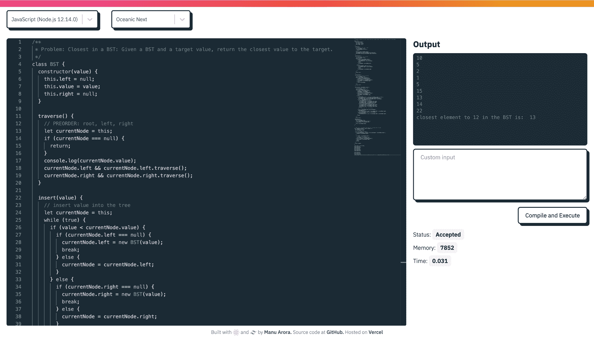
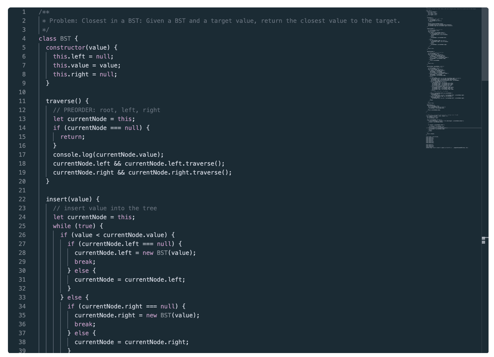
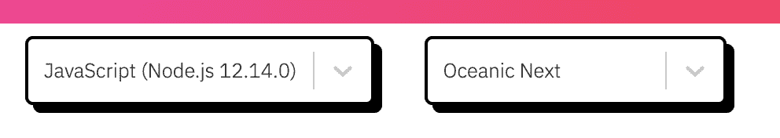
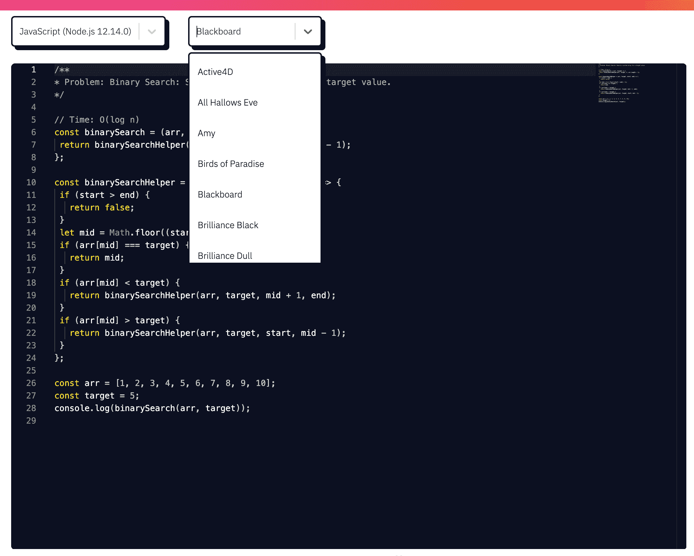
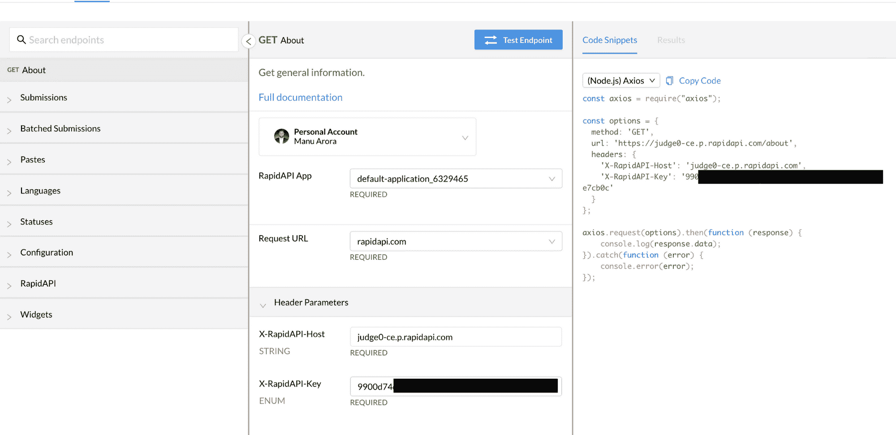
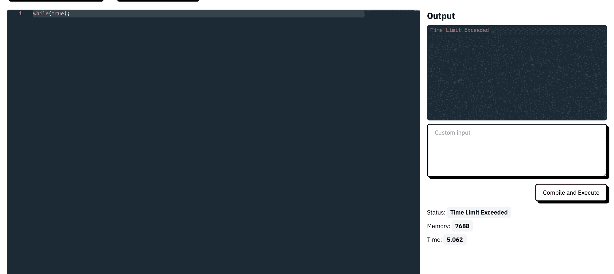
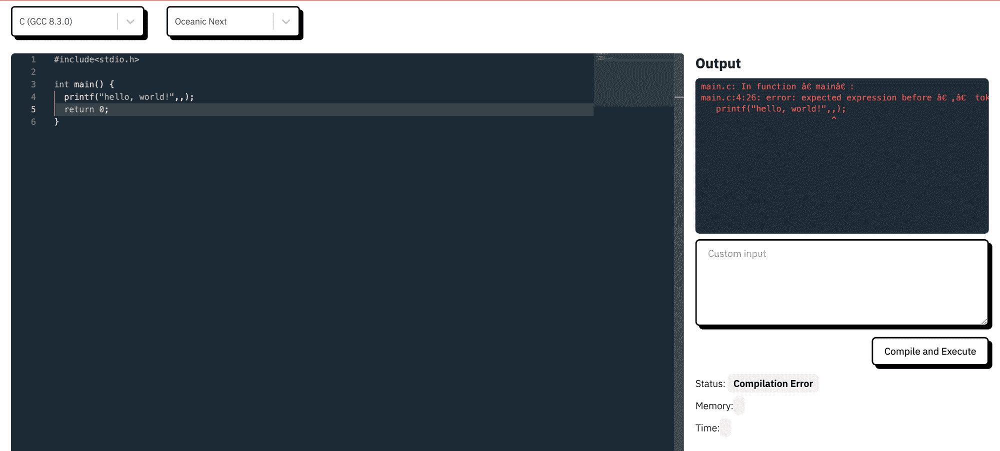
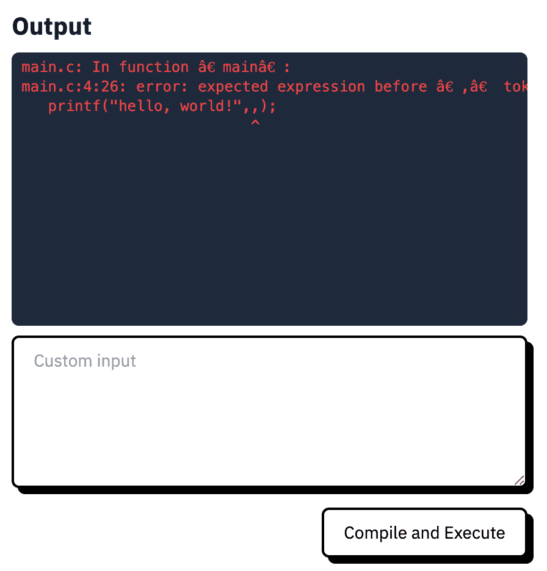
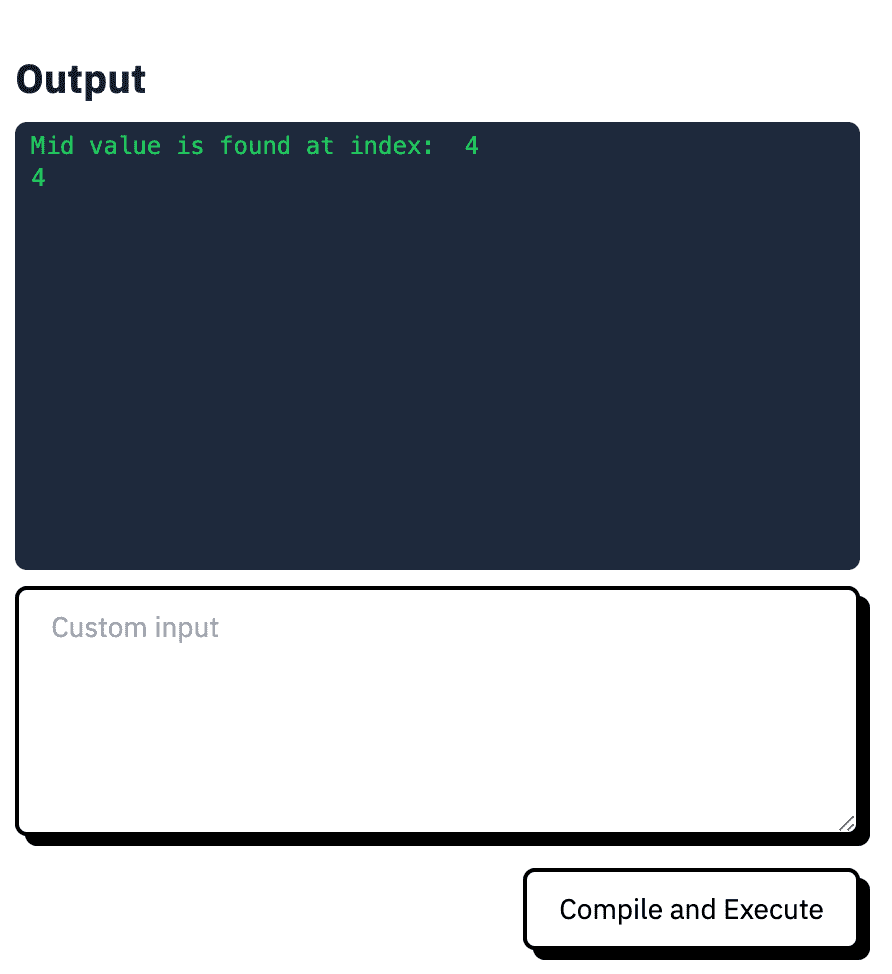
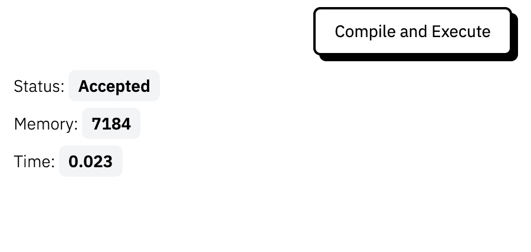

# 如何用 React 构建一个可以用 40 多种语言编译和执行的代码编辑器

> 原文：<https://www.freecodecamp.org/news/how-to-build-react-based-code-editor/>

一个在线代码执行平台可以让你用你最喜欢的编程语言编写代码，并在同一个平台上运行这些代码。

理想情况下，您可以看到自己编写的程序的输出(例如，用 JavaScript 编写的二分搜索法程序)。

今天我们要搭建一个名为 CodeRush 的在线代码执行平台，可以编译执行 40+种不同编程语言的代码。

## 我们在建造什么？



[源代码](https://github.com/manuarora700/react-code-editor) | [现场演示](https://coderush.vercel.app)

我们将构建一个丰富的代码编辑器，它具有以下特性:

*   一个也支持 VS 代码的代码编辑器( [Monaco Editor](https://www.npmjs.com/package/monaco-editor) )。
*   它可以在 web 应用程序上编译代码，具有标准的输入和输出，支持 40 多种编程语言。
*   您可以从可用主题列表中更改编辑器的主题。
*   您可以获得关于执行的代码的信息(代码所用的时间、使用的内存、状态等等)。

## 技术堆栈

对于该项目，我们将使用以下技术:

*   [react . js](https://reactjs.org)–用于前端
*   [TailwindCSS](https://tailwindcss.com)–用于款式
*   [judge 0](https://judge0.com)–用于编译和执行我们的代码。
*   [RapidAPI](https://rapidapi.com)–用于快速部署 Judge0 代码。
*   [Monaco Editor](https://www.npmjs.com/package/monaco-editor)——为项目提供动力的代码编辑器

## 项目结构

项目结构相当简单，易于理解:

*   **组件**:所有的组件/可重用代码片段都在这里(例如:CodeEditorWindow 和 Landing)
*   **钩子**:所有的定制钩子都在这里。(我们将使用按键挂钩来编译使用键盘事件的代码)
*   **lib** :所有的库函数都住在这里。(我们将在这里创建一个函数来定义我们的主题)
*   **常量**:下拉菜单的`languageOptions`和`customStyles`等常量都在这里。
*   **utils** :帮助维护代码的通用实用函数。

#### 申请流程:

在我们深入研究代码之前，让我们了解一下应用程序的流程，以及我们应该如何从头开始编写代码。

*   用户登录 web 应用程序，可以选择他们喜欢的编程语言(默认为 JavaScript)。
*   一旦用户编写完代码，他们就可以编译代码，并在输出窗口中看到输出/结果。
*   他们会看到他们的代码片段成功或失败。代码输出窗口中的所有内容都是可见的。
*   用户可以在他们的代码片段中添加自定义输入，法官(我们的在线编译器)会考虑用户提供的自定义输入。
*   用户可以看到所执行代码的相关细节(例如:代码编译和执行花费了 5 毫秒，使用了 2024 kb 的内存，运行时状态为成功)。

现在，我们对文件夹结构和应用程序的流程有了更多的了解，让我们深入代码并理解一切是如何工作的。

## 如何构建代码编辑器组件



代码编辑器组件主要由 Monaco 编辑器组成，这是一个我们可以使用和定制的 NPM 包。

```
// CodeEditorWindow.js

import React, { useState } from "react";

import Editor from "@monaco-editor/react";

const CodeEditorWindow = ({ onChange, language, code, theme }) => {
  const [value, setValue] = useState(code || "");

  const handleEditorChange = (value) => {
    setValue(value);
    onChange("code", value);
  };

  return (
    <div className="overlay rounded-md overflow-hidden w-full h-full shadow-4xl">
      <Editor
        height="85vh"
        width={`100%`}
        language={language || "javascript"}
        value={value}
        theme={theme}
        defaultValue="// some comment"
        onChange={handleEditorChange}
      />
    </div>
  );
};
export default CodeEditorWindow; 
```

`Editor`组件来自于`@monaco-editor/react`包，它让我们按照指定的`85vh`高度旋转代码编辑器。

`Editor`组件接受一堆道具:

*   我们需要语法高亮和智能感知的语言。
*   `theme`:代码片段的颜色和背景(我们将在教程的后面部分进行配置)。
*   `value`:进入代码编辑器的实际代码值
*   `onChange`:代码编辑器中的值改变时触发。我们需要将更改后的值保存在状态中，以便稍后调用`Judge0` API 来编译它。

编辑器从其父组件`Landing.js`接收道具`onChange`、`language`、`code`和`theme`。每次代码编辑器中的`value`改变时，我们调用父`Landing`组件中的`onChange`处理程序。

## 如何构建着陆组件

着陆组件主要由 3 部分组成:

*   具有`Languages`和`Themes`下拉组件的`Actions Bar`。
*   `Code Editor Window`组件
*   `Output and Custom Input`组件

```
// Landing.js

import React, { useEffect, useState } from "react";
import CodeEditorWindow from "./CodeEditorWindow";
import axios from "axios";
import { classnames } from "../utils/general";
import { languageOptions } from "../constants/languageOptions";

import { ToastContainer, toast } from "react-toastify";
import "react-toastify/dist/ReactToastify.css";

import { defineTheme } from "../lib/defineTheme";
import useKeyPress from "../hooks/useKeyPress";
import Footer from "./Footer";
import OutputWindow from "./OutputWindow";
import CustomInput from "./CustomInput";
import OutputDetails from "./OutputDetails";
import ThemeDropdown from "./ThemeDropdown";
import LanguagesDropdown from "./LanguagesDropdown";

const javascriptDefault = `// some comment`;

const Landing = () => {
  const [code, setCode] = useState(javascriptDefault);
  const [customInput, setCustomInput] = useState("");
  const [outputDetails, setOutputDetails] = useState(null);
  const [processing, setProcessing] = useState(null);
  const [theme, setTheme] = useState("cobalt");
  const [language, setLanguage] = useState(languageOptions[0]);

  const enterPress = useKeyPress("Enter");
  const ctrlPress = useKeyPress("Control");

  const onSelectChange = (sl) => {
    console.log("selected Option...", sl);
    setLanguage(sl);
  };

  useEffect(() => {
    if (enterPress && ctrlPress) {
      console.log("enterPress", enterPress);
      console.log("ctrlPress", ctrlPress);
      handleCompile();
    }
  }, [ctrlPress, enterPress]);
  const onChange = (action, data) => {
    switch (action) {
      case "code": {
        setCode(data);
        break;
      }
      default: {
        console.warn("case not handled!", action, data);
      }
    }
  };
  const handleCompile = () => {
    // We will come to the implementation later in the code
  };

  const checkStatus = async (token) => {
    // We will come to the implementation later in the code
  };

  function handleThemeChange(th) {
    // We will come to the implementation later in the code
  }
  useEffect(() => {
    defineTheme("oceanic-next").then((_) =>
      setTheme({ value: "oceanic-next", label: "Oceanic Next" })
    );
  }, []);

  const showSuccessToast = (msg) => {
    toast.success(msg || `Compiled Successfully!`, {
      position: "top-right",
      autoClose: 1000,
      hideProgressBar: false,
      closeOnClick: true,
      pauseOnHover: true,
      draggable: true,
      progress: undefined,
    });
  };
  const showErrorToast = (msg) => {
    toast.error(msg || `Something went wrong! Please try again.`, {
      position: "top-right",
      autoClose: 1000,
      hideProgressBar: false,
      closeOnClick: true,
      pauseOnHover: true,
      draggable: true,
      progress: undefined,
    });
  };

  return (
    <>
      <ToastContainer
        position="top-right"
        autoClose={2000}
        hideProgressBar={false}
        newestOnTop={false}
        closeOnClick
        rtl={false}
        pauseOnFocusLoss
        draggable
        pauseOnHover
      />
      <div className="h-4 w-full bg-gradient-to-r from-pink-500 via-red-500 to-yellow-500"></div>
      <div className="flex flex-row">
        <div className="px-4 py-2">
          <LanguagesDropdown onSelectChange={onSelectChange} />
        </div>
        <div className="px-4 py-2">
          <ThemeDropdown handleThemeChange={handleThemeChange} theme={theme} />
        </div>
      </div>
      <div className="flex flex-row space-x-4 items-start px-4 py-4">
        <div className="flex flex-col w-full h-full justify-start items-end">
          <CodeEditorWindow
            code={code}
            onChange={onChange}
            language={language?.value}
            theme={theme.value}
          />
        </div>

        <div className="right-container flex flex-shrink-0 w-[30%] flex-col">
          <OutputWindow outputDetails={outputDetails} />
          <div className="flex flex-col items-end">
            <CustomInput
              customInput={customInput}
              setCustomInput={setCustomInput}
            />
            <button
              onClick={handleCompile}
              disabled={!code}
              className={classnames(
                "mt-4 border-2 border-black z-10 rounded-md shadow-[5px_5px_0px_0px_rgba(0,0,0)] px-4 py-2 hover:shadow transition duration-200 bg-white flex-shrink-0",
                !code ? "opacity-50" : ""
              )}
            >
              {processing ? "Processing..." : "Compile and Execute"}
            </button>
          </div>
          {outputDetails && <OutputDetails outputDetails={outputDetails} />}
        </div>
      </div>
      <Footer />
    </>
  );
};
export default Landing; 
```

让我们更详细地了解登陆页面的基本结构。

### CodeEditorWindow 组件

正如我们之前看到的，CodeEditorWindow 组件将考虑代码(它一直在变化)和一个跟踪代码变化的`onChange`方法。

```
// onChange method implementation

 const onChange = (action, data) => {
    switch (action) {
      case "code": {
        setCode(data);
        break;
      }
      default: {
        console.warn("case not handled!", action, data);
      }
    }
  };
```

我们简单地设置`code`的状态并跟踪变化。

`CodeEditorWindow`组件还考虑了`language`属性，这是我们需要语法高亮和智能感知的当前选择的语言。

我已经创建了一个`languageOptions`数组，它跟踪 Monaco 编辑器接受的语言属性并处理编译(我们跟踪被`judge0`API 接受的`languageId`)。

```
// constants/languageOptions.js

export const languageOptions = [
  {
    id: 63,
    name: "JavaScript (Node.js 12.14.0)",
    label: "JavaScript (Node.js 12.14.0)",
    value: "javascript",
  },
  {
    id: 45,
    name: "Assembly (NASM 2.14.02)",
    label: "Assembly (NASM 2.14.02)",
    value: "assembly",
  },
    ...
    ...
    ...
    ...
    ...
    ...

  {
    id: 84,
    name: "Visual Basic.Net (vbnc 0.0.0.5943)",
    label: "Visual Basic.Net (vbnc 0.0.0.5943)",
    value: "vbnet",
  },
];
```

每个`languageOptions`对象包含一个`id`、`name`、`label`和`value`键。整个`languageOptions`数组可以放在下拉列表中，作为选项提供。

每当下拉菜单的状态改变时，`onSelectChange`方法会跟踪所选的`id`并相应地改变状态。

### LanguageDropdown 组件


```
// LanguageDropdown.js

import React from "react";
import Select from "react-select";
import { customStyles } from "../constants/customStyles";
import { languageOptions } from "../constants/languageOptions";

const LanguagesDropdown = ({ onSelectChange }) => {
  return (
    <Select
      placeholder={`Filter By Category`}
      options={languageOptions}
      styles={customStyles}
      defaultValue={languageOptions[0]}
      onChange={(selectedOption) => onSelectChange(selectedOption)}
    />
  );
};

export default LanguagesDropdown; 
```

对于下拉菜单，我们将使用包 [react-select](https://react-select.com) 来处理下拉菜单及其变更处理程序。

反应选择以`defaultValue`和`options`为主要参数。`options`是一个自动显示所有相关下拉列表值的数组(我们将在这里传递`languageOptions`)。

`defaultValue`属性是提供给组件的默认值。我们将保持 JavaScript 作为默认语言(这是我们的语言阵列中的第一种)。

每当用户改变语言时，我们用`onSelectChange`回调来改变语言:

```
const onSelectChange = (sl) => {
    setLanguage(sl);
};
```

### ThemeDropdown 组件



`ThemeDropdown`组件实际上非常类似于`LanguageDropdown`组件(带有 UI 和 react-select 包)。

```
// ThemeDropdown.js

import React from "react";
import Select from "react-select";
import monacoThemes from "monaco-themes/themes/themelist";
import { customStyles } from "../constants/customStyles";

const ThemeDropdown = ({ handleThemeChange, theme }) => {
  return (
    <Select
      placeholder={`Select Theme`}
      // options={languageOptions}
      options={Object.entries(monacoThemes).map(([themeId, themeName]) => ({
        label: themeName,
        value: themeId,
        key: themeId,
      }))}
      value={theme}
      styles={customStyles}
      onChange={handleThemeChange}
    />
  );
};

export default ThemeDropdown; 
```

在这里，我们将使用包`monacoThemes`来帮助我们在互联网上为 Monaco Editor 提供不同的美丽主题。

我们有一份可供我们使用的主题清单。

```
// lib/defineTheme.js

import { loader } from "@monaco-editor/react";

const monacoThemes = {
  active4d: "Active4D",
  "all-hallows-eve": "All Hallows Eve",
  amy: "Amy",
  "birds-of-paradise": "Birds of Paradise",
  blackboard: "Blackboard",
  "brilliance-black": "Brilliance Black",
  "brilliance-dull": "Brilliance Dull",
  "chrome-devtools": "Chrome DevTools",
  "clouds-midnight": "Clouds Midnight",
  clouds: "Clouds",
  cobalt: "Cobalt",
  dawn: "Dawn",
  dreamweaver: "Dreamweaver",
  eiffel: "Eiffel",
  "espresso-libre": "Espresso Libre",
  github: "GitHub",
  idle: "IDLE",
  katzenmilch: "Katzenmilch",
  "kuroir-theme": "Kuroir Theme",
  lazy: "LAZY",
  "magicwb--amiga-": "MagicWB (Amiga)",
  "merbivore-soft": "Merbivore Soft",
  merbivore: "Merbivore",
  "monokai-bright": "Monokai Bright",
  monokai: "Monokai",
  "night-owl": "Night Owl",
  "oceanic-next": "Oceanic Next",
  "pastels-on-dark": "Pastels on Dark",
  "slush-and-poppies": "Slush and Poppies",
  "solarized-dark": "Solarized-dark",
  "solarized-light": "Solarized-light",
  spacecadet: "SpaceCadet",
  sunburst: "Sunburst",
  "textmate--mac-classic-": "Textmate (Mac Classic)",
  "tomorrow-night-blue": "Tomorrow-Night-Blue",
  "tomorrow-night-bright": "Tomorrow-Night-Bright",
  "tomorrow-night-eighties": "Tomorrow-Night-Eighties",
  "tomorrow-night": "Tomorrow-Night",
  tomorrow: "Tomorrow",
  twilight: "Twilight",
  "upstream-sunburst": "Upstream Sunburst",
  "vibrant-ink": "Vibrant Ink",
  "xcode-default": "Xcode_default",
  zenburnesque: "Zenburnesque",
  iplastic: "iPlastic",
  idlefingers: "idleFingers",
  krtheme: "krTheme",
  monoindustrial: "monoindustrial",
};

const defineTheme = (theme) => {
  return new Promise((res) => {
    Promise.all([
      loader.init(),
      import(`monaco-themes/themes/${monacoThemes[theme]}.json`),
    ]).then(([monaco, themeData]) => {
      monaco.editor.defineTheme(theme, themeData);
      res();
    });
  });
};

export { defineTheme };
```

`monaco-themes`包为我们提供了一堆主题，我们可以用它们来定义我们的代码编辑器的外观。

`defineTheme`功能负责用户可能选择的不同主题。`defineTheme`函数通过使用`monaco.editor.defineTheme(theme, themeData)`动作返回一个实际设置摩纳哥编辑器主题的承诺。这行代码实际上负责更改 Monaco 编辑器代码窗口中的主题。

在前面我们在`ThemeDropdown.js`组件中看到的`onChange`回调的帮助下，`defineTheme`函数被调用。

```
// Landing.js - handleThemeChange() function

function handleThemeChange(th) {
    const theme = th;
    console.log("theme...", theme);

    if (["light", "vs-dark"].includes(theme.value)) {
      setTheme(theme);
    } else {
      defineTheme(theme.value).then((_) => setTheme(theme));
    }
  } 
```

`handleThemeChange()`功能检查主题是`light`还是`dark`。这些主题在`MonacoEditor`组件上默认可用，我们不需要为它调用`defineTheme()`方法。

如果没有，我们只需调用`defineTheme()`组件并设置选中的主题状态。



## 如何用 Judge0 编译代码

让我们进入应用程序的实质部分——用不同的语言编译代码。为了编译我们的代码，我们将使用 Judge0。Judge0 是一个简单的开源代码执行系统，我们可以与之交互。

我们可以使用一些参数(源代码、语言 ID)进行简单的 API 调用，并获得输出作为响应。

让我们设置判断 0，进入下一步:

*   前往[判断 0](https://judge0.com) 并选择基本计划
*   Judge0 实际上托管在 [RapidAPI](https://rapidapi.com) 上。继续订阅基本计划。
*   一旦您订阅了，您就可以复制对我们的代码执行系统进行 API 调用所需的`RAPIDAPI_HOST`和`RAPIDAPI_KEY`。

仪表板看起来像这样:



我们的 API 调用将需要`X-RapidAPI-Host`和`X-RapidAPI-Key`参数。将其保存在`.env`文件中，以备将来使用:

```
REACT_APP_RAPID_API_HOST = YOUR_HOST_URL
REACT_APP_RAPID_API_KEY = YOUR_SECRET_KEY
REACT_APP_RAPID_API_URL = YOUR_SUBMISSIONS_URL
```

在 React 中，用前缀`REACT_APP`初始化环境变量是很重要的。

`SUBMISSIONS_URL`是我们将要使用的 URL。它基本上由你的`host`组成，然后是`/submission`路线。

例如:`https://judge0-ce.p.rapidapi.com/submissions`在我们的例子中将是`submissions` URL。

一旦我们正确设置了变量，我们就可以继续处理`compilation`逻辑。

#### 编译流程和逻辑

编译的流程如下:

*   当点击按钮`Compile and Execute`时，调用方法`handleCompile()`。
*   `handleCompile()`函数调用我们在`submissions` URL 上的`Judge0 RapidAPI`后端，用`languageId`、`source_code`和`stdin`(在我们的例子中是 customInput)作为主体参数。
*   `options`也接受`host`和`secret`作为头。
*   `base64_encoded`和`fields`是可选参数，可以传递。
*   `submission` POST 请求在服务器中注册我们的请求并创建一个流程。对`post`请求的响应是一个`token`，可以进一步用来检查我们的执行状态。(有各种状态–处理中、已接受、超过时间限制、运行时异常等等。)
*   一旦返回结果，我们可以有条件地检查结果是成功还是失败，并在输出屏幕上显示结果。

让我们进入代码，了解一下`handleCompile()`方法。

```
const handleCompile = () => {
    setProcessing(true);
    const formData = {
      language_id: language.id,
      // encode source code in base64
      source_code: btoa(code),
      stdin: btoa(customInput),
    };
    const options = {
      method: "POST",
      url: process.env.REACT_APP_RAPID_API_URL,
      params: { base64_encoded: "true", fields: "*" },
      headers: {
        "content-type": "application/json",
        "Content-Type": "application/json",
        "X-RapidAPI-Host": process.env.REACT_APP_RAPID_API_HOST,
        "X-RapidAPI-Key": process.env.REACT_APP_RAPID_API_KEY,
      },
      data: formData,
    };

    axios
      .request(options)
      .then(function (response) {
        console.log("res.data", response.data);
        const token = response.data.token;
        checkStatus(token);
      })
      .catch((err) => {
        let error = err.response ? err.response.data : err;
        setProcessing(false);
        console.log(error);
      });
  };
```

如上所示，`handleCompile()`方法接收`languageId`、`source_code`和`stdin`。注意`source_code`和`stdin`前的`btoa`。这是对我们的字符串进行 base64 编码，因为我们在 API 的参数中使用了`base64_encoded: true`。

当有一个成功的响应并且我们有一个`token`时，我们调用`checkStatus()`方法来轮询`/submissions/${token}`路由。

```
const checkStatus = async (token) => {
    const options = {
      method: "GET",
      url: process.env.REACT_APP_RAPID_API_URL + "/" + token,
      params: { base64_encoded: "true", fields: "*" },
      headers: {
        "X-RapidAPI-Host": process.env.REACT_APP_RAPID_API_HOST,
        "X-RapidAPI-Key": process.env.REACT_APP_RAPID_API_KEY,
      },
    };
    try {
      let response = await axios.request(options);
      let statusId = response.data.status?.id;

      // Processed - we have a result
      if (statusId === 1 || statusId === 2) {
        // still processing
        setTimeout(() => {
          checkStatus(token)
        }, 2000)
        return
      } else {
        setProcessing(false)
        setOutputDetails(response.data)
        showSuccessToast(`Compiled Successfully!`)
        console.log('response.data', response.data)
        return
      }
    } catch (err) {
      console.log("err", err);
      setProcessing(false);
      showErrorToast();
    }
  };
```

为了获得我们之前提交的代码的结果，我们需要用一个作为响应收到的`token`来轮询`submissions` API。

如上所示，我们将向端点发出一个 GET 请求。一旦我们有了响应，我们就会检查`statusId === 1 || statusId === 2`。但这意味着什么呢？

我们提交给 API 的任何一段代码总共有`14`种状态，它们是:

```
export const statuses = [
  {
    id: 1,
    description: "In Queue",
  },
  {
    id: 2,
    description: "Processing",
  },
  {
    id: 3,
    description: "Accepted",
  },
  {
    id: 4,
    description: "Wrong Answer",
  },
  {
    id: 5,
    description: "Time Limit Exceeded",
  },
  {
    id: 6,
    description: "Compilation Error",
  },
  {
    id: 7,
    description: "Runtime Error (SIGSEGV)",
  },
  {
    id: 8,
    description: "Runtime Error (SIGXFSZ)",
  },
  {
    id: 9,
    description: "Runtime Error (SIGFPE)",
  },
  {
    id: 10,
    description: "Runtime Error (SIGABRT)",
  },
  {
    id: 11,
    description: "Runtime Error (NZEC)",
  },
  {
    id: 12,
    description: "Runtime Error (Other)",
  },
  {
    id: 13,
    description: "Internal Error",
  },
  {
    id: 14,
    description: "Exec Format Error",
  },
]; 
```

因此，如果`statusId ===1`或`statusId ===2`意味着我们的代码仍在处理，我们需要再次调用 API 来检查我们是否得到任何结果。

正因为如此，我们在`if`条件中有一个`setTimeout()`再次调用`checkStatus()`函数，该函数在内部再次调用 API 并检查状态。

如果状态不是`2`或`3`，这意味着我们的代码执行已经完成，我们有一个结果。要么是`successfully compiled`代码，要么是`Time Limit Exceeded`代码——或者可能是`Runtime Exception`。`statusId`代表每个场景，我们也可以复制这些场景。

例如，`while(true)`会给我们一个`time limit exceeded`错误:



或者，如果我们在语法上犯了一个错误，我们将得到一个编译错误:



无论如何，我们会得到一个结果。而且我们要把这个结果保存在`outputDetails`状态。这是为了确保我们在屏幕右侧(即输出窗口)显示一些内容。

### 输出窗口组件



```
import React from "react";

const OutputWindow = ({ outputDetails }) => {
  const getOutput = () => {
    let statusId = outputDetails?.status?.id;

    if (statusId === 6) {
      // compilation error
      return (
        <pre className="px-2 py-1 font-normal text-xs text-red-500">
          {atob(outputDetails?.compile_output)}
        </pre>
      );
    } else if (statusId === 3) {
      return (
        <pre className="px-2 py-1 font-normal text-xs text-green-500">
          {atob(outputDetails.stdout) !== null
            ? `${atob(outputDetails.stdout)}`
            : null}
        </pre>
      );
    } else if (statusId === 5) {
      return (
        <pre className="px-2 py-1 font-normal text-xs text-red-500">
          {`Time Limit Exceeded`}
        </pre>
      );
    } else {
      return (
        <pre className="px-2 py-1 font-normal text-xs text-red-500">
          {atob(outputDetails?.stderr)}
        </pre>
      );
    }
  };
  return (
    <>
      <h1 className="font-bold text-xl bg-clip-text text-transparent bg-gradient-to-r from-slate-900 to-slate-700 mb-2">
        Output
      </h1>
      <div className="w-full h-56 bg-[#1e293b] rounded-md text-white font-normal text-sm overflow-y-auto">
        {outputDetails ? <>{getOutput()}</> : null}
      </div>
    </>
  );
};

export default OutputWindow; 
```

这是一个简单的组件，只显示适当的成功或失败场景。

方法决定了文本的颜色和应该打印的内容。

*   如果`statusId`是`6`–我们有一个编译错误。为此，API 返回可以用来显示错误的`compile_output`。
*   如果`statusId`是`3`——我们有一个成功的场景，那就是`Accepted`。API 返回一个代表标准输出的`stdout`。这用于显示从我们提供给 API 的代码中返回的数据。
*   如果`statusId`是`5`–我们有一个时间限制超过错误。我们只是显示代码中有一个无限循环条件，或者它超过了代码执行的标准`5`秒时间。
*   对于其他状态，我们将获得一个标准的`stderr`对象，我们可以用它来显示错误。
*   注意正在使用的`atob()`方法。这是因为我们得到的输出是 base64 字符串。为了解码它，我们使用`atob()`方法。

这里有一个 JavaScript 中的`Binary Search`程序的成功场景:



### 输出详细信息组件



组件是一个简单的映射器，显示与我们最初编译的代码片段相关的细节。数据已经设置在`outputDetails`状态变量中。

```
import React from "react";

const OutputDetails = ({ outputDetails }) => {
  return (
    <div className="metrics-container mt-4 flex flex-col space-y-3">
      <p className="text-sm">
        Status:{" "}
        <span className="font-semibold px-2 py-1 rounded-md bg-gray-100">
          {outputDetails?.status?.description}
        </span>
      </p>
      <p className="text-sm">
        Memory:{" "}
        <span className="font-semibold px-2 py-1 rounded-md bg-gray-100">
          {outputDetails?.memory}
        </span>
      </p>
      <p className="text-sm">
        Time:{" "}
        <span className="font-semibold px-2 py-1 rounded-md bg-gray-100">
          {outputDetails?.time}
        </span>
      </p>
    </div>
  );
};

export default OutputDetails; 
```

`time`、`memory`和`status.description`都是从 API 响应中接收的，然后存储在`outputDetails`中并显示。

### 键盘事件

应用程序中的最后一件事是使用`ctrl+enter`来编译我们的代码。为此，我们将创建一个定制的钩子(因为它们很棒，也很干净)来监听 web 应用程序上的各种键盘事件。

```
// useKeyPress.js

import React, { useState } from "react";

const useKeyPress = function (targetKey) {
  const [keyPressed, setKeyPressed] = useState(false);

  function downHandler({ key }) {
    if (key === targetKey) {
      setKeyPressed(true);
    }
  }

  const upHandler = ({ key }) => {
    if (key === targetKey) {
      setKeyPressed(false);
    }
  };

  React.useEffect(() => {
    document.addEventListener("keydown", downHandler);
    document.addEventListener("keyup", upHandler);

    return () => {
      document.removeEventListener("keydown", downHandler);
      document.removeEventListener("keyup", upHandler);
    };
  });

  return keyPressed;
};

export default useKeyPress; 
```

```
// Landing.js

...
...
...
const Landing = () => {
    ...
    ...
      const enterPress = useKeyPress("Enter");
      const ctrlPress = useKeyPress("Control");
   ...
   ...
} 
```

这里，我们使用本地 JavaScript `Event Listeners`来监听我们将要使用的`target`键。

`Hook`监听`keydown`和`keyup`事件。我们用目标键`Enter`和`Control`初始化我们的钩子。

由于我们正在检查`targetKey === key`并相应地设置`keyPressed`，我们可以使用`keyPressed`返回的布尔值，它将是`true`或`false`。

现在，我们可以监听`useEffect`钩子中的这些事件，以确保它们同时被按下:

```
useEffect(() => {
    if (enterPress && ctrlPress) {
      console.log("enterPress", enterPress);
      console.log("ctrlPress", ctrlPress);
      handleCompile();
    }
  }, [ctrlPress, enterPress]);
```

所以每当用户相继或同时点击`control`和`enter`，就会调用`handleCompile()`方法。

## 一些需要记住的事情

这是一个有趣的项目。但是 Judge0 的基本计划有一些限制，即 100 个请求/天。

为了解决这个问题，你可以启动你自己的服务器/ droplet(在数字海洋上),自己托管开源项目(他们有很好的文档)。

## 结论

最后，我们有:

*   可以用 40 多种语言编译的代码编辑器
*   改变代码编辑器外观的主题切换器
*   在 RapidAPI 上交互和托管 API
*   使用自定义挂钩在 React 中使用键盘事件
*   非常非常有趣！；)

最后，如果你想让项目更深入，这里有一些你可以考虑实现的特性:

*   登录和注册模块-这样您就可以将您的代码保存在您自己的个人仪表板中。
*   一种通过互联网与其他人共享代码的方式
*   配置文件页面和自定义。
*   使用套接字编程和操作转换对单个代码段进行配对编程。
*   收藏最喜欢的代码片段
*   您的代码片段(已保存)的自定义仪表板-就像 CodePen 一样。

我真的很喜欢从头开始编写这个应用程序，TailwindCSS 是我的最爱，也是我设计应用程序的参考资料。

如果这篇文章对你有帮助，请在 [GitHub 库](https://github.com/manuarora700/react-code-editor)上留下⭐️。
如果你有任何问题，请通过我的[推特](https://twitter.com/mannupaaji)和/或[网站](https://manuarora.in)联系我，我很乐意帮忙。

[源代码](https://github.com/manuarora700/react-code-editor) | [现场演示](https://coderush.vercel.app)