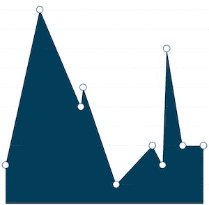
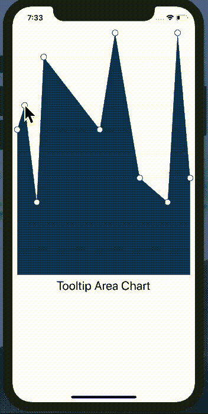

# 如何构建带有动态工具提示的 React 原生图表

> 原文：<https://www.freecodecamp.org/news/how-to-build-react-native-charts-with-dynamic-tooltips-64aefc550c95/>

作者:维克兰特·内吉

# 如何构建带有动态工具提示的 React 原生图表


Area Chart with tappable tooltip

创建图表，无论是在网络上还是在移动应用程序上，一直都是一项有趣且具有挑战性的任务，尤其是在 React Native 中。很难找到一个合适的库可以同时满足你的功能和设计需求。您可以尝试制作自己的图表，但这通常会带来从头学习和实施的开销。

如果你像我一样是初学者，你可能想使用现有的图表库。考虑到 React Native 社区还很年轻，您可以用来实现和定制图表的选项非常少。

#### 问题陈述

在开始我们深入森林的旅程之前，我想向您介绍一下我们的问题陈述。

在本教程中，我们将绘制一个面积图，并在每个数据点添加一个圆形标记，可以进一步点击该标记来显示包含 x 和 y 坐标值的工具提示。

为了解决这个问题，我对一些现有的 React 原生库做了一些研究，并将范围缩小到其中两个，[React-Native-charts-wrapper](https://github.com/wuxudong/react-native-charts-wrapper)和 [react-native-svg-charts](https://github.com/JesperLekland/react-native-svg-charts) 。

#### React 本机图表包装器

我们的第一个竞争者，`[react-native-charts-wrapper](https://github.com/wuxudong/react-native-charts-wrapper)`是流行的本地图表库 [MPAndroidChart](https://github.com/PhilJay/MPAndroidChart) 和[chart](https://github.com/danielgindi/Charts)的 React 本地包装器。

这个库是高度可配置的，因为它使用了原生图表库，所以它提供了如丝般平滑的过渡和触摸支持。它在 Github repo 上也有大量的用例。

一开始，考虑到它的性能和定制，它是我的首选。它有一个很长很具体的[安装](https://github.com/wuxudong/react-native-charts-wrapper/blob/master/installation_guide/README.md)指南，按照这个指南，我可以在 iOS 和 Android 设备上安装和运行它。

在 Android 上，一切似乎都很顺利。然而，当我试图创建一个 iOS 版本时，它给了我一个错误。在 GitHub 问题和谷歌上搜索了无数个小时后，我决定反对它。

#### 反应本地 SVG 图表

在放弃`react-native-charts-wrapper`之后，这是我能找到的下一个最好的解决方案。

`[react-native-svg-charts](https://github.com/JesperLekland/react-native-svg-charts)`使用罩下的`[react-native-svg](https://github.com/react-native-community/react-native-svg)`渲染图表。它也有大量的[例子](https://github.com/JesperLekland/react-native-svg-charts-examples)，展示了许多用例。

因为它不使用任何本地链接，所以安装和实现非常简单明了。

> 如果你只是想看示例项目的源代码，在这里找到项目 repo [。](https://github.com/vikrantnegi/react-native-tooltip-chart)

好了，让我们开始派对吧。

#### 入门指南

创建一个 React 本地项目，并安装所有必需的依赖项。

```
~ react-native init ReactNativeTooltip
```

我们还需要安装并链接`react-native-svg`库。

```
~ npm i react-native-svg
```

```
~ react-native link react-native-svg
```

如果您在使用 link 命令自动链接库时遇到任何问题，请遵循官方文档中提到的[手动](https://github.com/react-native-community/react-native-svg)步骤。

现在，最后安装`react-native-svg-charts` 。

```
~ npm install react-native-svg-charts
```

#### 获取虚拟数据

在我们继续深入之前，我们需要一些数据来渲染我们的`AreaChart`。我们将使用名为 [Mockaroo](https://www.mockaroo.com/) 的第三方服务为我们的面积图生成一些模拟数据。

理想情况下，我们将从一个 API 获取这些数据，我们将把它存储在组件状态中，然后提供给我们的区域组件。

下面是我的虚拟 JSON 数据的样子。完整的 JSON 数据文件见[这里](https://github.com/vikrantnegi/react-native-tooltip-chart/blob/master/src/Data.js)。

```
export const DATA = [  {    id: 1,    date: ‘2019–01–26T22:37:01Z’,    score: 3,  },  {    id: 2,    date: ‘2019–01–06T06:03:09Z’,    score: 9,  },  {    id: 3,    date: ‘2019–01–28T14:10:00Z’,    score: 10,  },  {    id: 4,    date: ‘2019–01–03T02:07:38Z’,    score: 7,  },  ...]
```

#### 使用 React 本机 SVG 图表

有很多我们可以用来创建图表的组件。在本教程中，我们将使用`AreaChart`组件，但是您可以使用任何一个可用的图表组件。下面是一个`Areachart`图表组件的样子:

```
<AreaChart  style={{ height: '70%' }}  data={data}  yAccessor={({ item }) => item.score}  xAccessor={({ item }) => moment(item.date)}  contentInset={contentInset}  svg={{ fill: '#003F5A' }}  numberOfTicks={10}  yMin={0}  yMax={10}>
```

让我们来看一下`AreaChart`中使用的重要道具。

*   `data`:这是必填字段，必须是数组。
*   `yAccessor`:接受`data`(名为“item”)的每个条目以及索引并返回该条目的 y 值的函数。
*   `xAccessor:` 与`yAccessor`相同，但返回该项的 x 值。

你可以在官方文档中读到更多关于其他可用道具的信息。

#### 添加装饰者

React 原生 SVG 图表被构建为尽可能具有可扩展性。所有的图表都可以用“装饰者”来扩展，这是一个以某种方式设计或增强您的图表的组件。只需将一个符合`react-native-svg`的组件作为子组件传递给图形，它将被调用，并提供所有必要的信息来布局您的装饰器。

对于本教程，我们需要两个装饰器，一个用于数据点标记，另一个用于工具提示。

> 确保在`*AreaChart*`组件中放置了装饰器。否则他们不会渲染。

#### 添加标记数据点

让我们创建一个装饰器，用作图表中每个数据点的标记。

```
const ChartPoints = ({ x, y, color }) =>  data.map((item, index) => (   <Circle     key={index}     cx={x(moment(item.date))}     cy={y(item.score)}     r={6}     stroke={color}     fill=”white”     onPress={() =>       this.setState({         tooltipX: moment(item.date),         tooltipY: item.score,         tooltipIndex: index,       })     }  />));
```

我们需要为数据数组中的每一项设置一个圆形标记。为此，我们将遍历数据数组中的每一项，并为每一项返回`Circle` SVG 组件。

现在，为了在图表上定位它们，我们将使用`cx`和`cy`道具分别水平和垂直定位它们。对于`cx`，我们将使用`date`键，对于`cy`，我们将使用`score`键。

除此之外，我们还将通过`onPress` prop 来设置三种状态，当任何数据点被按下时，`tooltipX`、`tooltipY`和`tooltipIndex`。我们将使用这些状态来定位`Tooltip`装饰器。



Area charts with the markers

#### 添加工具提示

现在我们已经有了必要的信息，如 x 轴(tooltipX)、y 轴(tooltipY)和所按标记的索引(tooltipIndex)，我们可以使用它们将`Tooltip`放置在`AreaChart`上。

我们将为`Tooltip`装饰器创建一个新的[文件](https://github.com/vikrantnegi/react-native-tooltip-chart/blob/master/src/Tooltip.js)。

```
const Tooltip = ({ x, y, tooltipX, tooltipY, color, index, dataLength,}) => {
```

```
let xAxis = 4;  if (dataLength > 4) {    if (index < 2) {      xAxis = 35;    } else if (index > dataLength — 2) {      xAxis = -20;    } else {     xAxis = 4;    }  }
```

```
return (    <;G x={x(tooltipX) — 40} y={y(tooltipY)}>      <G y={tooltipY > 9 ? 20 : -29} x={xAxis}>        <Rect x={-2} y={0} height={22} width={70} stroke={color} fill=”white” ry={10} rx={10} />        <Rect x={-2} y={0} height={22} width={18} fill={color} ry={10} rx={10} />        <Rect x={10} y={0} height={22} width={tooltipY > 9 ? 12 : 10} fill={color} /&gt;        <Text x={6} y={14} stroke=”#fff”>          {tooltipY}        </Text>        <Text x={tooltipY > 9 ? 24 : 22} y={14}>          {moment(tooltipX).format(‘MMM DD’)}        </Text>      </G>    </G>  );};
```

不要被这里所有的`React`、`G`和`Text`标签所迷惑或吓倒，它们大多数只是为了工具提示的样式。

只需关注我们用来在图表上水平和垂直定位`Tooltip`的`tooltipX`和`tooltipY`。这些值与我们用于标记的`cx`和`cy`相同，除了我们在图表上增加和减去一些值来调整它们。

除此之外，我们使用`tooltipIndex`来偏移第一个和最后一个工具提示，这样它们就不会被切掉。

> [这里的](https://github.com/vikrantnegi/react-native-tooltip-chart)是一个工作示例的完整源代码。



Area chart with tappable tooltips

#### 最后的想法

这就是我们创建图表、标记和工具提示所需要做的一切。这只是使用`react-native-svg-charts`库可以实现的一个基本实现。

如果您想探索更多，请查看他们的[示例](https://github.com/JesperLekland/react-native-svg-charts-examples)回购，其中展示了大量其他用例。

> 为了简洁起见，我跳过了一些样板代码，这些代码可以在 Github repo 上找到。

如果你发现有什么困惑，请告诉我。如果你曾经做过 react native charts，请分享你遇到的库和用例。