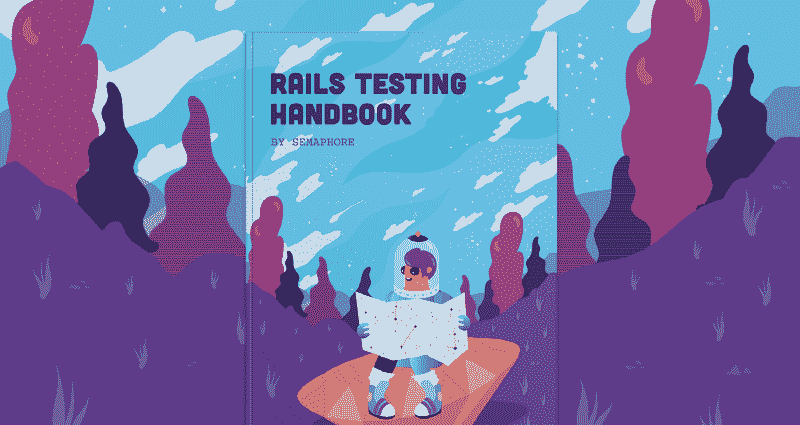
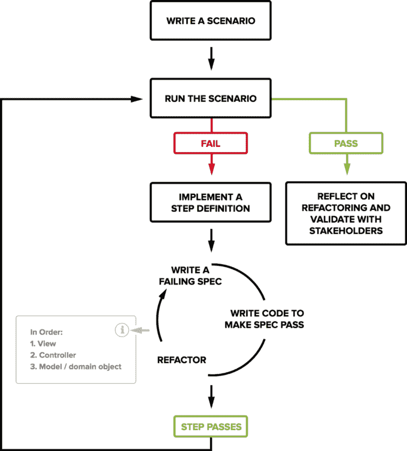

# 如何用 BDD 构建坚如磐石的 Ruby on Rails 应用程序

> 原文：<https://www.freecodecamp.org/news/how-to-build-rock-solid-ruby-on-rails-apps-with-bdd-735de9319cc6/>

马尔科·阿纳斯塔索夫

# 如何用 BDD 构建坚如磐石的 Ruby on Rails 应用程序

#### 了解使用行为驱动开发构建可持续 web 应用的最佳实践。



> *我们为什么会跌倒先生？这样我们才能学会振作起来。 *—《蝙蝠侠诞生》中的阿尔弗雷德(迈克尔·凯恩)**

**十年前，我开发了第一个 Rails 应用。我已经尝试了所有的方法，如果有一件事我可以肯定，那就是不写测试我就无法工作。首先编写测试对我提高编程技能帮助最大。**

**这很简单。我们希望在项目的第 1000 天能像第 1 天一样有感觉和有成效。我们想要快。为此，我们需要干净的代码。**

**我们不可能第一遍就把所有事情都做对，所以我们需要重构。然而，我们不能在持续的恐惧下进行重构，因为我们会在不知情的情况下破坏东西并将错误发布到产品中。我们需要确信，当我们破解代码时，我们可以立即检测并修复问题。**

**自信从何而来？自动化测试套件给了我们信心。相信我们可以更改、删除或添加新代码，只要我们的测试通过，就不会发生大的问题。**

**所以如果测试是基础，那就先写吧。这样做一段时间，你会注意到你的代码和测试是多么的干净和有效。**

### **理解“行为”的观点**

**当应用测试驱动开发(TDD)时，开发人员很容易陷入使用单元测试来测试一个对象或方法**是什么**，而不是它**做什么**的陷阱，这要有用得多。**

**一个例子是编写一个测试，断言一个注释集合是一个数组，而不是它的一个独特的特性，比如按时间排序。在大多数情况下，如果我们更改该集合的实现来返回一个自定义的可枚举类，应该没有关系。更一般地说:**

> **改变一个对象的实现不应该破坏它的测试套件，只要对象做的事情保持不变。**

****行为驱动开发** (BDD)将焦点放在行为上——一个事物做什么——在开发的所有层面上。**

**最初，“行为”这个词可能看起来很奇怪。另一种方法是考虑描述。我们可以向另一个人描述每一个低级的方法、对象、按钮或屏幕——我们将要描述的正是一个行为。采用这种方法改变了我们编写代码的方式。**

#### **“给定/何时/然后”沟通模式**

**软件开发中的大部分问题都是沟通问题。例如，产品经理无法描述所提议功能的每个用例。开发人员误解了特性的范围。产品团队没有一个协议来验证一个功能是否完成。**

**BDD 简化了我们用来描述软件应用场景的语言:**

> ****Given** 世界的某种语境或状态，**

> *** *当** 有事发生时，**

> **然后，我们期待一些结果。**

***Given，When，Then* 是简单的词，我们可以用它们来同样好地描述复杂的特性、代码对象或单个方法。这是一种不同角色的所有团队成员都能理解的模式。**

**这些表达式也内置在很多测试框架中，比如 [Cucumber](https://cucumber.io) 。我们需要实现的问题和解决方案的清晰表述有助于我们编写更好的代码。**

### **Rails 工具概述**

**Ruby on Rails 是第一个带有集成测试框架的 web 框架。这成为该工艺进一步发展的跳板。**

**与此同时，Ruby 的表现力和使用 Rails 开发 web 应用程序的生产力提升吸引了许多经验丰富的知名工程师加入社区。**

**当您使用默认选项生成一个新的 Rails 应用程序时，它使用 Ruby 自带的测试库`test/unit`设置测试场景。然而，有一些工具使得 BDD 更容易应用。我推荐使用 [RSpec](http://rspec.info/) 作为主测试库，使用[cumber](https://cukes.info/)编写高水平的验收测试。**

#### **RSpec**

**RSpec 是一个流行的 Ruby BDD 测试库。使用 RSpec 编写的测试——称为**规范**——是一段代码在特定上下文中预期行为的可执行示例。阅读下面的代码会更容易理解这一点:**

```
**`describe ShoppingCart do  context "when first created" do    it "is empty" do      shopping_cart = ShoppingCart.new      expect(shopping_cart).to be_empty    end  endend`**
```

**写得好的规范容易阅读，因此也容易理解。试着大声朗读上面的代码片段。我们正在**描述**一个购物车，也就是说，给定一个空白的上下文，当我们创建一个新的购物车时，我们`expect(shopping_cart).to be_empty`。**

**运行该规范会产生类似于规范的输出:**

```
**`ShoppingCart  when first created    is empty`**
```

**我们可以使用 RSpec 来指定整个系统，但是我们也可以使用一个工具来帮助我们更自然地编写和交流。**

#### **黄瓜**

**正如我在本指南的第一章中所解释的，我们想要测试每个新特性的分析阶段。为了做到这一点，我们需要**客户验收测试**来驱动实际实现该特性的代码的开发。**

**如果你是一个在足够复杂的组织中工作的开发人员，你可能想让其他人，比如客户或产品经理为你编写验收测试(免责声明:我从未在这样的环境中工作过)。在大多数情况下，开发人员编写它们。这是一个很好的实践，因为它帮助我们更好地理解我们需要构建什么。Cucumber 为此提供了语言和格式。**

**Cucumber 阅读应用程序特性的纯文本描述，这些描述被组织在**场景**中。场景中的每一步都是使用具体的代码实现的，从用户的角度来看，它自动化了与应用程序的交互。例如:**

```
**`Feature: Reading articles`**
```

```
**`Scenario: Commenting on an article  Given I am logged in  And I am reading an article with "2" comments  When I reply to the last comment  Then the article should have "3" comments  And I should be subscribed to follow-up comments`**
```

**如果这是一个 web 应用程序，上面的场景可以自动引导应用程序的一个测试实例，在 web 浏览器中打开它，像任何用户一样执行步骤，然后检查是否满足了某些期望。**

### **Rails 中的 BDD 循环**

**实际上，BDD 意味着一种**由外向内**的方法。我们从验收测试开始，然后在视图中编写代码，并向下工作到模型。这种方法帮助我们发现任何新的对象或变量，我们可能需要在早期有效地实现我们的功能，并在此基础上做出正确的设计决策。**

**Rails 中的 BDD 循环包括以下步骤:**

1.  ****从一个新的黄瓜场景**开始。在写之前，一定要分析明白问题。在这一点上，你需要知道用户界面是如何允许用户完成工作的。不要担心场景步骤的实现。**
2.  ****运行场景，看着它失败**。这将告诉您哪些步骤失败了，或者哪些步骤正在等待实现。首先，您的大多数步骤都是待定的(未定义)。**
3.  ****写下第一个失败或待定规格的定义**。运行该场景并观察其失败。**
4.  ****使用 RSpec 的红绿重构循环测试 Rails 视图的实现**。您将发现视图完成工作所需的实例变量、控制器和控制器动作。这也是实践中被证明是可选的唯一阶段。另一种方法是在进入下一步之前简单地准备视图和控制器。**
5.  ****使用 RSpec 的红绿重构循环测试驱动控制器**。确保实例变量已分配，并且操作响应正确。控制器通常以模仿的方式驱动。有了控制器，您将知道模型或您的域对象应该做什么。**
6.  ****使用与 RSpec 相同的红绿重构周期测试驱动域对象**。确保它们提供了控制器和视图所需的方法。如果您正在开发一个还没有模型的新特性，那么您现在应该生成模型和相应的数据库迁移。在这一点上，你会确切地知道你需要他们做什么。**
7.  **一旦您实现了您需要的所有对象和方法，并且相应的规范通过了，**运行您开始的 Cucumber 场景，以确保该步骤得到满足**。**

**

The BDD cycle in Ruby on Rails web development** 

**一旦第一个场景步骤通过，就进入下一个，并遵循相同的步骤。一旦你的整个场景被实现了——场景和所有底层规范都通过了——花一点时间来思考是否有你可以进一步重构的地方。**

**一旦你确定你已经完成了这个场景，要么继续下一个，要么向其他人展示你的作品。如果你和一个团队一起工作，**创建一个拉请求**或者一个等价的代码评审请求。打开一个拉请求应该会自动触发一个[持续集成](https://semaphoreci.com/blog/2017/03/02/what-is-proper-continuous-integration.html)构建。当没有其他相关场景时，向项目经理或客户展示您的工作，要求他们通过将功能分支部署到临时服务器来验证您是否构建了正确的东西。**

**本帖改编自 [**Rails 测试手册**](https://semaphoreci.com/ebooks/rails-testing-handbook) ，由[旗语](https://semaphoreci.com)出版的免费电子书。如果你已经做到这一步，并且想看一些编写行为驱动代码的实践例子，[下载这本书](https://semaphoreci.com/ebooks/rails-testing-handbook)，让我知道你的想法。谢谢！**