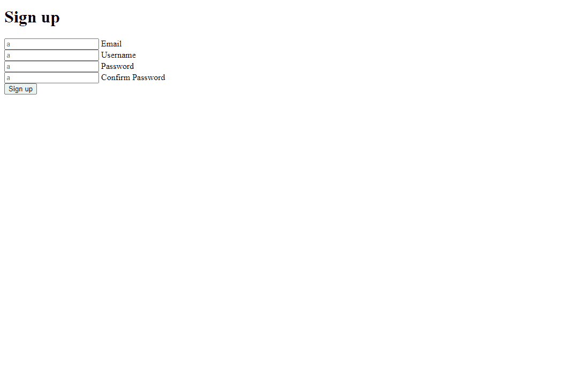
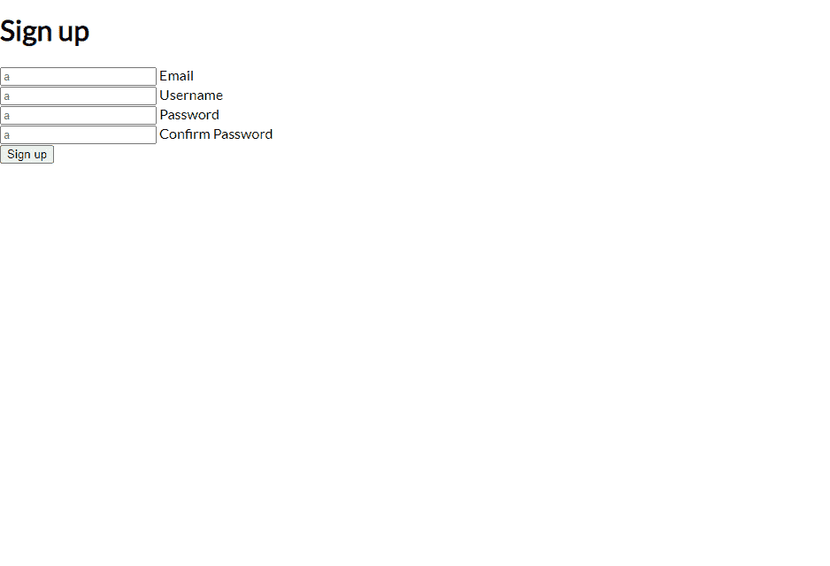
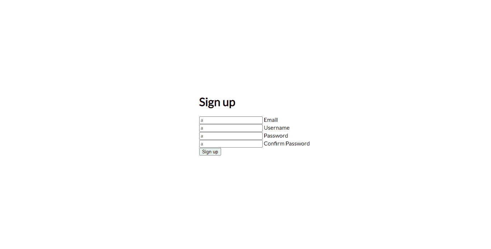
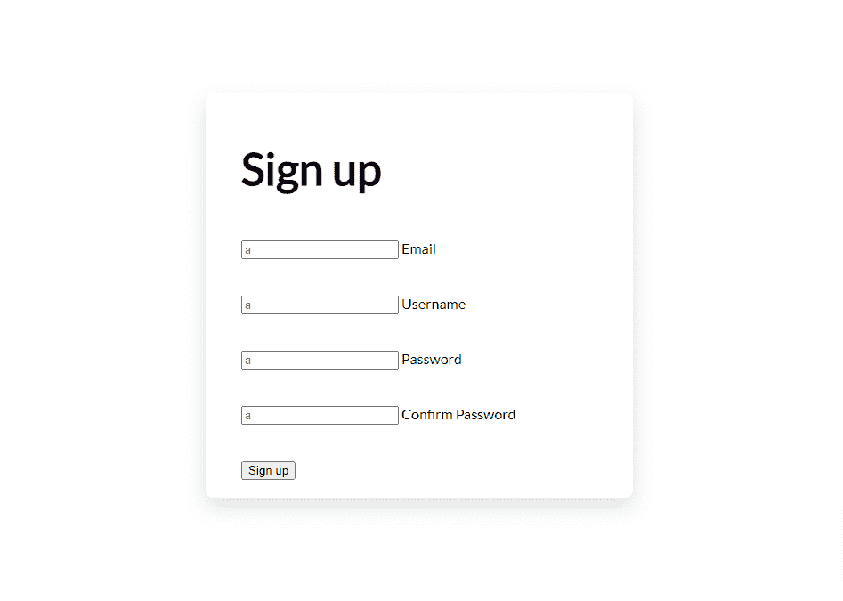
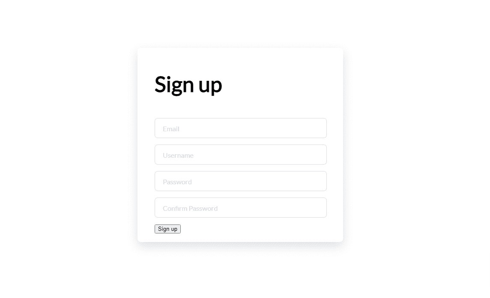
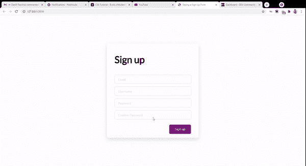
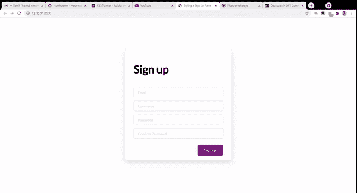
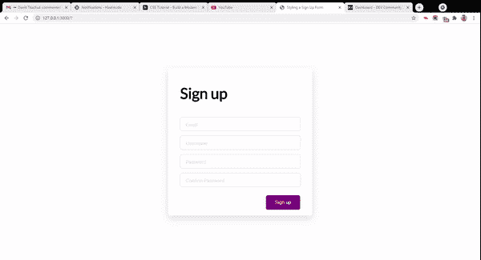

# 如何使用普通的 HTML 和 CSS 构建一个带有浮动标签和过渡的注册表单

> 原文：<https://www.freecodecamp.org/news/how-to-build-sign-up-form-with-html-and-css/>

在本教程中，我们将使用普通的 HTML 和 CSS 构建一个带有浮动标签和平滑过渡的现代注册表单。


A view

正如您在上面的图像中看到的，当表单中的输入获得焦点时，它的标签浮动到顶部，并且在输入周围出现半粗的边框。如果文本输入到输入中，并且输入失去焦点，标签仍然在顶部。否则，标签会回落到输入中。

许多现代形式都应用了某种过渡。这些转换不仅使表单更加动态，而且有助于指导用户输入的状态(即它是否有焦点)以及每个输入应该处理哪种数据。

在本教程中，你将会学到一些很酷的 CSS 特性，比如过渡，像`:placeholder_focus`这样的选择器，以及许多你应该知道的 CSS 属性。

让我们开始吧！

## HTML 标记

我们将为我们的注册表单定义标记。但在此之前，我们必须设置 HTML 样板文件，并从`head`标签正确链接到样式表。你可以用 [Emmet 插件](https://emmet.io/)在你的 IDE/代码编辑器中输入`!`然后点击 tab 键来轻松做到这一点。

您也可以复制这个样板文件，并将其粘贴到您的`index.html`文件中:

```
<!DOCTYPE html>
<html lang="en">
<head>
  <meta charset="UTF-8">
  <meta name="viewport" content="width=device-width, initial-scale=1.0">
  <meta http-equiv="X-UA-Compatible" content="ie=edge">
  <title>Document</title>
  <link rel="stylesheet" href="styles.css">
</head>
<body>

</body>
</html> 
```

在 body 标记中，我们定义了注册表单的标记:

```
<div class="signupFrm">
    <form action="" class="form">
      <h1 class="title">Sign up</h1>

      <div class="inputContainer">
        <input type="text" class="input" placeholder="a">
        <label for="" class="label">Email</label>
      </div>

      <div class="inputContainer">
        <input type="text" class="input" placeholder="a">
        <label for="" class="label">Username</label>
      </div>

      <div class="inputContainer">
        <input type="text" class="input" placeholder="a">
        <label for="" class="label">Password</label>
      </div>

      <div class="inputContainer">
        <input type="text" class="input" placeholder="a">
        <label for="" class="label">Confirm Password</label>
      </div>

      <input type="submit" class="submitBtn" value="Sign up">
    </form>
  </div>
```

我们创建一个容器`div`来保存表单元素。表单的每个输入及其文本标签都包装在一个容器 div 中。标签的作用是通知用户每个输入应该接收什么信息。

我们的页面将如下所示:



HTML Form of four inputs and four labels

您可能会注意到，我们分配给所有输入的占位符值是“a”。这将有助于我们在教程的后面开始应用一些动态逻辑。

## 如何设计表单的样式

我们的表单非常简单，所以让我们添加一些样式使它看起来更好。

首先，我们需要执行一些重置并设置背景颜色:

```
@import url('https://fonts.googleapis.com/css2?family=Lato&display=swap');

/* Get rid of all default margins/paddings. Set typeface */
body {
  box-sizing: border-box;
  margin: 0;
  padding: 0;
  background-color: white;
  font-family: "lato", sans-serif;
}
```

Setting base styling

以下是我们的页面外观:



Without any styling yet

设置好`body`后，我们将内容的显示模式设置为`flex`。这确保了默认情况下容器元素`div`中的所有直接子元素并排显示。

在我们的例子中，容器`signupFrm`中只有一个孩子。我们在这里使用`display: flex`的唯一原因是使用`align-items`和`justify-content`属性来帮助将所有东西垂直和水平居中:

```
/* Puts the form in the center both horizontally and vertically. Sets its height to 100% of the viewport's height */

.signupFrm {
  display: flex;
  justify-content: center;
  align-items: center;
  height: 100vh;
}
```

Styling the form container

代表视区高度的属性确保窗体占据浏览器窗口 100%的高度，而不管屏幕大小或方向如何。这将使它反应更灵敏。



Our form is now aligned to the center

现在我们将对表单进行一些样式化处理:

```
.form {
  background-color: white;
  width: 400px;
  border-radius: 8px;
  padding: 20px 40px;
  box-shadow: 0 10px 25px rgba(92, 99, 105, .2);
}

.title {
  font-size: 50px;
  margin-bottom: 50px;
}
```

在表单上的第一个样式中，我们将背景设置为白色，宽度为 400 像素，在表单周围添加一些曲线，最后在框周围设置一个阴影。我们还设置了标题的字体大小和元素下方的一些空间。

结果应该是这样的:


The form is now inside a card, with a box shadow

接下来，我们将设计包含表单输入和表单标签的`div`的样式。

```
.inputContainer {
  position: relative;
  height: 45px;
  width: 90%;
  margin-bottom: 17px;
}
```

我们将输入容器`div`的位置属性设置为 relative。这将使我们能够按照我们想要的方式放置孩子`input`和`label`。我们还将宽度设置为占整个容器宽度的 90%。

这就是我们的表单在 web 浏览器中的呈现方式。



Looks better

现在我们需要设计我们的输入。

我们首先将`position`设置为`absolute`。这将允许我们将它们移动到相对定位的容器父容器的左上方。

我们还需要隐藏任意的占位符文本(前面提到的“a”字符)，这样它们就不会与每个标签中的文本重叠。当我们实现过渡时，将需要占位符文本:

```
/* Style the inputs */

.input {
  position: absolute;
  top: 0px;
  left: 0px;
  height: 100%;
  width: 100%;
  border: 1px solid #DADCE0;
  border-radius: 7px;
  font-size: 16px;
  padding: 0 20px;
  outline: none;
  background: none;
  z-index: 1;
}

/* Hide the placeholder texts (a) */

::placeholder {
  color: transparent;
} 
```

应用样式后，我们的表单现在应该如下所示:


The placeholder "a" is no longer visible

接下来，我们设置文本标签的样式:

```
/* Styling text labels */

.label {
  position: absolute;
  top: 15px;
  left: 15px;
  padding: 0 4px;
  background-color: white;
  color: #DADCE0;
  font-size: 16px;
  transition: 0.5s;
  z-index: 0;
}
```

标签显示文本，告诉输入中需要哪些信息。我们首先将它的位置设置为绝对。通过设置`top`和`left`属性，我们可以相对于它的容器向上移动文本。

接下来，我们设置一个 0.5 秒的过渡。这是悬停时文本向上移动所需的时间。

最后，我们还将 z 索引设置为 0。低 z 索引可确保标签位于其他“较高位置”的元素之后(如果它们重叠的话)。

以下是页面上呈现的内容:



The result

现在我们将重点放在按钮上。

我们将使用 CSS `transform`属性添加一些平滑的动画，它将按钮向上移动一点，并在鼠标悬停时改变颜色:

```
.submitBtn {
  display: block;
  margin-left: auto;
  padding: 15px 30px;
  border: none;
  background-color: purple;
  color: white;
  border-radius: 6px;
  cursor: pointer;
  font-size: 16px;
  margin-top: 30px;
}

.submitBtn:hover {
  background-color: #9867C5;
  transform: translateY(-2px);
}
```

结果如下:


The button scales up and changes color when hovered over

接下来，我们需要执行一些状态更改。

当输入获得焦点时，我们希望将它的标签放在容器顶部之外(-7px)，左边 3 个像素，将字体大小减小到 14，并将颜色改为紫色:

```
.input:focus + .label {
  top: -7px;
  left: 3px;
  z-index: 10;
  font-size: 14px;
  font-weight: 600;
  color: purple;
}
```

结果如下:



Labels go up when input gains focus

当输入获得焦点时，我们还需要在输入周围添加一个紫色边框。

```
.input:focus {
  border: 2px solid purple;
}
```



Purple border added

最后，我们必须做一件非常重要的事情。

目前，当您在表单中键入一些文本并将焦点(鼠标)从表单上移开时，标签文本和输入中的文本会发生冲突:



Collision between label and input value

使用下面的 CSS，我们将指定，当我们在输入中键入一个值并改变焦点时，我们希望标签保持浮动。此外，我们还要指定我们希望标签文本失去紫色:

```
.input:not(:placeholder-shown)+ .label {
  top: -7px;
  left: 3px;
  z-index: 10;
  font-size: 14px;
  font-weight: 600;
}
```

至此，这是我们注册页面的最终外观。


Final look

## 包扎

我希望你从这篇教程中学到了一些关于 CSS 的新东西。CSS 过渡给你的网站带来了活力，在本指南中，我们用它们使我们的表单更加生动。

你可以从这个 [GitHub 库](https://github.com/KingsleyUbah/Sign-Up-CSS)获得本教程的所有代码。

我最近创建了一份时事通讯，提供学习 web 开发的实用技巧和资源。订阅我的[时事通讯](https://www.getrevue.co/profile/ubahthebuilder)，在你的收件箱里获得提示。

感谢跟随。