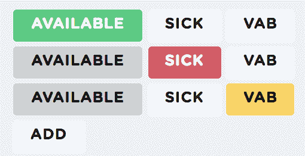
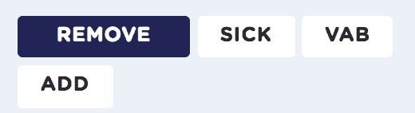

# 如何使用 React 构建智能按钮

> 原文：<https://www.freecodecamp.org/news/how-to-build-smart-button-using-react-1a7628341b4a/>

作者安柏·威尔基

# 如何使用 React 构建智能按钮

这是一个关于三个按钮的故事，讲述了一个偏离设计的 web 开发人员如何实现她的前端梦想。

你应该提前知道这里的大部分样式是样板[引导](https://getbootstrap.com/)。它看起来很好，而且是面向内部的产品，所以我们不会修复没有损坏的东西。

我们的任务是创建一个易于理解的界面来处理记录。我们的记录有一个三部分组成的`state`——`available`、`sick`或`vab`。一次交流的状态不多，但是我们需要在一页上有五周的时间。

旁注:“VAB”是一个瑞典词，指的是呆在家里陪你生病的孩子。这样做和你自己在这里生病是有区别的，无论是工资还是休假时间！

### 检查现有记录

第一步是显示用户是否有当天的记录。正如我所知道的每个 React 项目一样，我们从一个 API(我们自己的)中获取一个列表，并对其进行迭代。由于 API 将返回现有记录的列表并忽略没有记录的日期，我们需要设置自己的日期数组。

以下是我们获得五周天数的代码:

```
export const dateArray = (numberOfDays, startDate) => {  const day = moment(startDate);  const days = [];  while (days.length < numberOfDays) {    if (day.day() === 6 || day.day() === 0) {      day.add(1, 'days');    } else {      days.push(day.format('YYYY-MM-DD'));    }    day.add(1, 'days');  }  return days;};
```

我以前写过关于 [Moment.js](https://momentjs.com/) 的文章。如果你还没有使用它，那就赶快跟上潮流吧！它使得处理日期变得简单而愚蠢，比如在这里我们可以调用`day.add(1, 'days')`或者用`moment(startDate).day()`得到一周中的某一天。

力矩对象是可变的！所以一般来说要小心，但是这里很好，因为我们需要更新我们的`day`,我们可以用很少的代码来完成。

附注:美国人自然会把周六作为一周的最后一天——6——而把周日作为第一天——0。但不是瑞典人，也不是世界上的其他人。对几乎所有非美国人来说，一周从周一开始。编程可能非常奇怪地以美国为中心。

在这里，你可以看到我们正在收集一个日期列表，从`startDate`开始，一直到`numberOfDays`，跳过周末。我们将使用这个数组来构建我们的记录列表，这样我们就可以在上面放置一些美味的按钮。

#### 映射我们的天数数组以反映实际记录

现在我们已经有了需要显示的所有日期(下面我们调用`dateArray`)，我们将不得不从 API 中遍历我们的数据集，以确定我们是否应该显示一条记录。因为我们希望看到没有记录的日期，所以我们必须设置一个数组，其中包含一些已填充的记录和一些空记录:

```
const userRecords = dateArray(50, startDay).map(date => {  const recordToReturn = data.find(record =>    record.date === date  );  return { date, record: recordToReturn };});
```

现在我们有了一组日期，一些有完整的记录，另一些有`record: undefined`。

### 可用按钮逻辑

现在我们可以看到那天是否有记录，我们可以将按钮设置为显示绿色并说“可用”或白色并说“添加”同样，我使用 Reactstrap 进行基本的样式设计。组件带有一些漂亮的间距和圆角等等，加上方便的“颜色”参数，我可以设置为“信息”和“成功”之类的东西

```
<Button color={setColor(record)} >  {this.state.buttonText}</Button>
```

#### 设置按钮文本

为了设置`buttonText`，我将检查是否有记录:

```
const buttonText = () =>   isEmpty(this.props.data.record) ? 'Add' : 'Available'
```

请记住，我正在将`{date: 'some date', record: {some: 'record'}}`传递给我的每个按钮组件。如果我的`userRecords`没有找到那天的记录，我们在`data.record`中将没有任何东西，我们可以说“添加”`isEmpty`来自优秀的 Javascript 库 [lodash](https://lodash.com) 。再一次，跟上潮流。Lodash 让 Javascript 变得更加简洁和易于使用。

#### 设置按钮颜色

我们的`setColor`函数也将检查记录是否存在，但是它将进一步查看记录的`state`,看我们需要显示什么颜色。

```
const setColor = () => {  if (existingRecord && record.status === 'available') {    return 'success';  } else if (existingRecord)) {    return 'gray';  } else {    return 'secondary';  }};
```

自举默认愉快。我们用自己的颜色覆盖了这些默认单词，但是开箱即用的选项也很不错。这里我们检查记录是否是`available`。如果不可用但仍有记录，则必须是`sick`或`vab`，但无论哪种情况，用户在那一天都不再是`available`，所以我们必须将按钮变灰。



Colored buttons demonstrate four statuses.

### 另外两个按钮

当没有记录时，我可以使用 React 超级方便的条件显示来隐藏“生病”和“vab”按钮。下面是其余两个按钮的代码:

```
{existingRecord && (  <div>    <Button      color={setSecondaryColor(record, 'sick')}      style={{ marginRight: '5px' }}    >      Sick    </Button>    <Button      color={setSecondaryColor(record, 'vab')}      style={{ marginRight: '5px' }}    >      VAB    </Button>  </div>)}
```

为了确保我们的按钮得到正确的颜色，我们将分别检查`record`是否有`status`“sick”或“vab”。如果记录的状态与按钮的状态不匹配，我们将确保它没有颜色(我们的“第二”按钮颜色是白色)。

```
const setSecondaryColor = (record, status) => {  if (record.status !== status) { return 'secondary'}  if (status === 'sick') { return 'danger'}  if (status === 'vab') { return 'yellow'}}
```

### 越来越喜欢翻车

此时，按钮完成了我需要它们做的一切(加上我在这篇文章中省略的所有 API 请求逻辑——我们正在用这些按钮创建和更新记录)。

但是如果没有翻转效果，一个女孩怎么能对她的按钮满意呢？我们需要能够以某种方式删除一天的记录。与其画一个 X 并让我们的用户点击它，如果他们可以点击一个现有的按钮来删除记录不是更好吗？我想是的。

我在我的“可用”/“添加”按钮中添加了一个`onMouseOver`和`onMouseOut`事件:

```
const mouseOver = () => {  if (existingRecord) {    this.setState({ buttonText: 'Remove' });  }};const mouseOut = () => this.setState({ buttonText: buttonText() });
```

现在，当您将鼠标放在按钮上时，如果记录存在(否则保持不变)，它将变为“删除”。当你鼠标离开时，它会返回到“可用”如此漂亮，如此实用！



Mouseover demonstration of button functionality

我很惊讶，在相对简单的事情上要花多少心思和精力。让按钮拥有正确的颜色、正确的文本并做正确的事情比看起来要复杂得多。事实上，我已经向像我丈夫这样的人展示了这些按钮，他们只是耸耸肩。生活就是这样:没有人会像你一样喜欢你的纽扣。