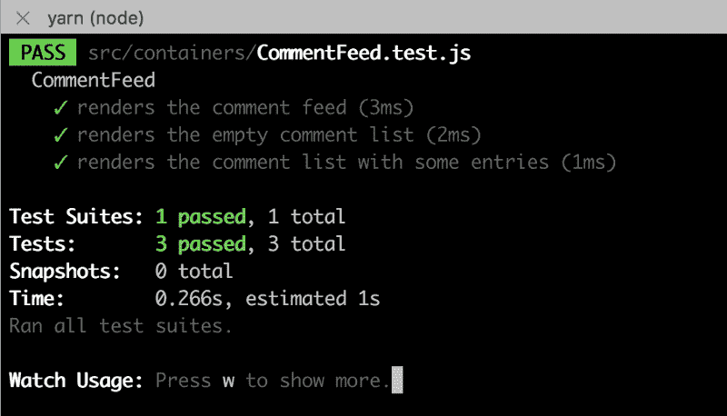
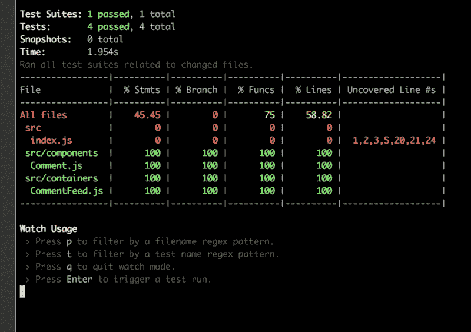

# 如何用 TDD 和 React 测试库构建健壮的 React 应用

> 原文：<https://www.freecodecamp.org/news/how-to-build-sturdy-react-apps-with-tdd-and-the-react-testing-library-47ad3c5c8e47/>

当我开始学习 React 时，有一件事让我很纠结，那就是用一种既有用又直观的方式测试我的 web 应用。每当我想测试一个组件时，我就用[酶](http://airbnb.io/enzyme/docs/api/)和[玩笑](https://facebook.github.io/jest/)来浅层渲染它。

当然，我完全滥用了快照测试特性。

好吧，至少我写了个测试，对吧？

你可能在某个地方听说过，编写单元和集成测试会提高你编写的软件的质量。另一方面，糟糕的测试会滋生虚假的自信。

最近，我通过 [workshop.me](https://workshop.me/) 和 [Kent C. Dodds](https://www.freecodecamp.org/news/how-to-build-sturdy-react-apps-with-tdd-and-the-react-testing-library-47ad3c5c8e47/undefined) 参加了一个研讨会，在那里他教我们如何为 React 应用编写更好的集成测试。

他还欺骗我们使用他的[新测试库](https://github.com/kentcdodds/react-testing-library)，支持它强调以用户会遇到的同样方式测试应用程序。

在本文中，我们将学习运用 TDD，通过创建评论提要来构建可靠的 React 应用程序。当然，这个过程适用于几乎所有的软件开发，而不仅仅是 React 或 JavaScript 应用。

### **入门**

我们将从运行`create-react-app`并安装依赖项开始。我的假设是，如果您正在阅读一篇关于测试应用程序的文章，您可能已经熟悉了安装和启动 JavaScript 项目。这里我将使用`yarn`而不是`npm`。

```
create-react-app comment-feed
```

```
cd comment-feed
```

```
yarn
```

按照现在的情况，我们可以删除除 index.js 之外的所有文件。然后，在`src`文件夹中，创建一个名为`components`的新文件夹和另一个名为`containers`的文件夹。

对于测试工具，我将使用 Kent 的 [React 测试库](https://github.com/kentcdodds/react-testing-library)来构建这个应用程序。这是一个轻量级的测试工具，它鼓励开发人员用使用它的相同方式测试他们的应用程序。

像 Enzyme 一样，它导出一个渲染函数，但是这个渲染函数总是对你的组件进行完全挂载。它导出帮助器方法，允许您通过标签或文本甚至测试 id 来定位元素。Enzyme 通过它的`mount` API 也做到了这一点，但是它创建的抽象实际上提供了更多的选项，其中许多选项允许您不用测试实现细节。

我们不想再测试实现细节了。我们希望呈现一个组件，并查看当我们单击或更改 UI 上的某些内容时，是否会发生正确的事情。就是这样！不再直接检查道具或状态或职业名称。

让我们安装它们并开始工作。

```
yarn add react-testing-library
```

### **使用 TDD 构建评论提要**

让我们以 TDD 方式完成第一个组件。启动您的测试跑步者。

```
yarn test --watch
```

在`containers`文件夹中，我们将添加一个名为 CommentFeed.js 的文件。在它旁边，添加一个名为 CommentFeed.test.js 的文件。对于第一个测试，让我们验证用户可以创建评论。太快了？好的，因为我们还没有任何代码，我们将从一个较小的测试开始。让我们检查一下是否可以呈现提要。

#### **关于反应测试库的一些注释**

首先，让我们注意这里的渲染函数。这类似于`react-dom`在 DOM 上呈现组件的方式，但是它返回一个对象，我们可以通过析构该对象来获得一些简洁的测试助手。在这种情况下，我们得到了`queryByText`，给定一些我们期望在 DOM 上看到的文本，它将返回那个 HTML 元素。

[React 测试库文档](https://github.com/kentcdodds/react-testing-library#faq)有一个层次结构，可以帮助您决定使用哪个查询或 get 方法。通常，顺序是这样的:

*   `getByLabelText`(表格输入)
*   `getByPlaceholderText`(仅当您的输入没有标签时——不易访问！)
*   `getByText`(按钮和标题)
*   `getByAltText`(图片)
*   `getByTestId`(用于动态文本或你想测试的其他奇怪元素)

每一个都有一个相关的`queryByFoo`来做同样的事情，除了当它没有找到一个元素时不会让你的测试失败。如果你只是在测试一个元素的**存在性**，就使用这些。

如果这些都没有得到您想要的结果，`render`方法还返回映射到`container`属性的 DOM 元素，因此您可以像`container.querySelector(‘body #root’)`一样使用它。

### **第一个实现代码**

现在，实现看起来相当简单。我们只需要确保“评论提要”在组件中。

情况可能会更糟——我是说，我正要在设计组件时写完整篇文章。幸运的是，测试不太关心样式，所以我们可以专注于我们的应用程序逻辑。

下一个测试将验证我们是否可以呈现注释。但是我们甚至没有任何注释，所以让我们也加入那个组件。不过在测试之后。

我还将创建一个 props 对象来存储我们可能在这些测试中重用的数据。

在这种情况下，我检查评论的数量是否等于传入 CommentFeed 的条目数量。这很琐碎，但是测试的失败给了我们创建 Comment.js 文件的机会。

这个绿灯点亮了我们的测试套件，所以我们可以放心地继续进行。向 TDD 致敬，我们的救世主。当然，当我们给它一个空数组时，它就工作了。但是如果我们给它一些实物呢？

我们必须更新我们的实现来真正渲染东西。简单到知道我们要去哪里，对吧？

看啊，我们的测试又一次通过了。这是它美丽的一张清晰的照片。



注意到我从来没有说过我们应该用`yarn start`启动我们的程序吗？我们将暂时保持这种状态。关键是，你必须用意念去感受代码。

风格只是外在的——重要的是内在的。

不过，如果你想启动这个应用程序，请将 index.js 更新为以下内容:

### **添加意见表**

这是事情开始变得更有趣的地方。这就是我们从昏昏欲睡地检查 DOM 节点的存在，到实际使用它并验证行为的地方。所有其他的东西都是热身。

让我们从描述我想从这个表单中得到什么开始。它应该:

*   包含作者的文本输入
*   包含注释本身的文本输入
*   有一个提交按钮
*   最终调用 API 或任何处理创建和存储注释的服务。

我们可以在一次集成测试中完成这个列表。对于之前的测试案例，我们进行得相当慢，但是现在我们将加快速度，尝试一下子就搞定它。

注意我们的测试套件是如何开发的？我们从在他们自己的测试用例中硬编码道具到为他们创建工厂。

#### 安排、行动、断言

下面的集成测试可以分为三个部分:安排、操作和断言。

*   **安排:**为测试用例创建道具和其他设备
*   **Act:** 模拟元素的变化，比如文本输入或按钮点击
*   **断言:**断言期望的函数被调用了正确的次数，并且使用了正确的参数

关于代码有一些假设，比如我们标签的命名或者我们将有一个`createComment`道具的事实。

在寻找输入时，我们希望通过它们的标签找到它们。当我们构建应用程序时，这优先考虑可访问性。获取表单最简单的方法是使用`container.querySelector`。

接下来，我们必须给输入分配新的值，并模拟变化以更新它们的状态。这一步可能感觉有点奇怪，因为通常我们一次输入一个字符，为每个新字符更新组件的状态。

这个测试的行为更像是复制/粘贴，从空字符串到“Socrates”。目前没有重大问题，但我们可能希望记下这一点，以防以后出现。

提交表单后，我们可以断言调用了哪些道具，使用了哪些参数。我们还可以利用这个时机来验证表单输入是否被清除。

很吓人吗？别害怕，我的孩子，走这边。首先将表单添加到呈现函数中。

我可以将这个表单分解成它自己的独立组件，但是现在我不会这样做。相反，我会把它添加到我放在办公桌旁的“重构愿望清单”中。

这就是 TDD 的方式。当某些东西看起来可以重构时，记下它并继续前进。只有当一个抽象的存在对你有益，并且你觉得没有必要时，才进行重构。

还记得我们通过创建`createProps`工厂来重构测试套件吗？就这样。我们也可以重构测试。

现在，让我们添加`handleChange`和`handleSubmit`类方法。当我们更改输入或提交表单时，这些就会被触发。我还会初始化我们的状态。

这就做到了。我们的测试通过了，我们有了一个类似真实应用的东西。我们的报道怎么样？



还不错。如果我们忽略 index.js 中的所有设置，我们就有了一个关于执行行的完整的 web 应用程序。

当然，可能还有其他我们想要测试的情况，以便验证应用程序是否如我们预期的那样工作。当你的老板和其他同事谈话时，这个覆盖率只是他们可以吹嘘的东西。

### **喜欢评论**

不如我们看看我们能不能喜欢评论？这可能是在我们的应用程序中建立一些身份验证概念的好时机。但是我们还不会跳得太远。让我们首先更新我们的道具工厂，为我们生成的评论添加一个带有 id 的`auth`字段。

被“认证”的用户将通过应用程序传递他们的`auth`属性。任何与他们是否通过身份验证相关的操作都会被记录下来。

在许多应用程序中，该属性可能包含向服务器发出请求时发送的某种访问令牌或 cookie。

在客户端，此属性的存在让应用程序知道他们可以让用户查看他们的配置文件或其他受保护的路由。

然而，在这个测试示例中，我们不会过多地摆弄身份验证。想象这样一个场景:当你进入一个聊天室，你给出你的网名。从那时起，你将负责使用该用户名的所有评论，不管还有谁使用该用户名登录。

虽然这不是一个很好的解决方案，即使在这个虚构的例子中，我们也只关心测试 CommentFeed 组件的行为是否正常。我们不关心用户如何登录。

换句话说，我们可能有一个完全不同的登录组件来处理特定用户的身份验证，从而让他们经历火与怒的考验，以便获得全能的`auth`属性，让他们在我们的应用程序中肆虐。

来“赞”一个评论吧。添加下一个测试用例，然后更新道具工厂以包含`likeComment`。

现在为了实现，我们将首先更新 Comment 组件，使其具有 like 按钮和`data-testid`属性，这样我们就可以找到它。

我将测试 ID 直接放在按钮上，这样我们就可以立即模拟点击，而不必嵌套查询选择器。我还为按钮附加了一个`onClick`处理程序，以便它调用传递给它的`onLike`函数。

现在我们只是将这个类方法添加到我们的 CommentFeed 中:

您可能想知道为什么我们不直接将`likeComment`属性传递给注释组件。为什么我们要把它作为一个阶级的财产？

在这种情况下，因为它相当简单，所以我们不必构建这个抽象。将来，我们可能会决定添加其他`onClick`处理程序，例如，处理分析事件或发起订阅帖子的未来评论。

能够在这个容器组件的`handleLike` 方法中捆绑多个不同的函数调用有其优势。如果我们愿意的话，我们也可以在一个成功的“赞”之后使用这个方法来更新组件的状态。

### **不喜欢的评论**

此时，我们已经对呈现、创建和喜欢评论进行了工作测试。当然，我们还没有实现真正做到这一点的逻辑——我们没有更新存储或写入数据库。

您可能还注意到，我们测试的逻辑很脆弱，不太适用于真实世界的评论提要。例如，如果我们试图喜欢一个我们已经喜欢的评论会怎么样？它会无限增加喜欢数，还是不喜欢它？我可以喜欢自己的评论吗？

我将把扩展组件的功能留给您的想象，但是编写一个新的测试用例将是一个良好的开端。这里有一个建立在假设之上的例子，我们想要实现不喜欢一个我们已经喜欢的评论:

请注意，我们正在构建的评论提要允许我喜欢自己的评论。谁会这么做？

我用一些逻辑更新了评论组件，以确定当前用户是否喜欢这个评论。

我做了一点小手脚:之前我们将`author`传递给`onLike`函数，我改成了`currentUser`，这是传递给评论组件的`auth`属性。

毕竟，当其他人喜欢他们的评论时，评论的作者出现是没有意义的。

我意识到了这一点，因为我正在精力充沛地编写测试。如果我只是碰巧编写了代码，这可能会从我身边溜走，直到我的一个同事斥责我的无知！

但是这里没有无知，只有测试和随后的代码。确保更新 CommentFeed，以便它能够传递`auth`属性。对于`onClick`处理程序，我们可以省略传递`auth`属性，因为我们可以从父类的`handleLike`和`handleDislike`方法中的`auth`属性中派生出来。

### **结束**

希望你的测试套件看起来像一棵没有点亮的圣诞树。

我们可以选择这么多不同的路线，这可能会有点让人不知所措。每当你有了一个想法，就把它写下来，写在纸上或新的测试块上。

例如，假设您实际上想在一个类方法中实现`handleLike`和`handleDislike`，但是您现在有其他优先事项。您可以通过在测试用例中记录如下内容来做到这一点:

这并不意味着您需要编写一个全新的测试。您还可以更新前两个案例。但是重点是，您可以将您的测试运行程序作为您的应用程序的一个更迫切的“待办事项”列表。

#### **有用链接**

有一些很棒的内容是关于测试的。这里有一些启发了我写这篇文章和我自己的实践。

*   [由](https://blog.kentcdodds.com/introducing-the-react-testing-library-e3a274307e65)[肯特·c·多兹](https://www.freecodecamp.org/news/how-to-build-sturdy-react-apps-with-tdd-and-the-react-testing-library-47ad3c5c8e47/undefined)介绍 React 测试库。理解这个测试库背后的哲学是一个好主意。
*   Kostis Kapelonis 的“[软件测试反模式](http://blog.codepipes.com/testing/software-testing-antipatterns.html)”。一篇非常深入的文章，讨论了单元和集成测试。也不怎么去做。
*   Kent Beck 的“通过示例进行测试驱动的开发”。这是一本讨论 TDD 模式的实体书。它不太长，而且是用会话的方式写的，很容易理解。

我希望那能帮你度过一段时间。

好奇更多帖子或者妙语连珠？如果你喜欢这篇文章，请给我一些掌声，并在[媒体](http://Medium](https://medium.com/@iwilsonq)、 [Github](https://github.com/iwilsonq) 和[推特](https://twitter.com/iwilsonq)上关注我！