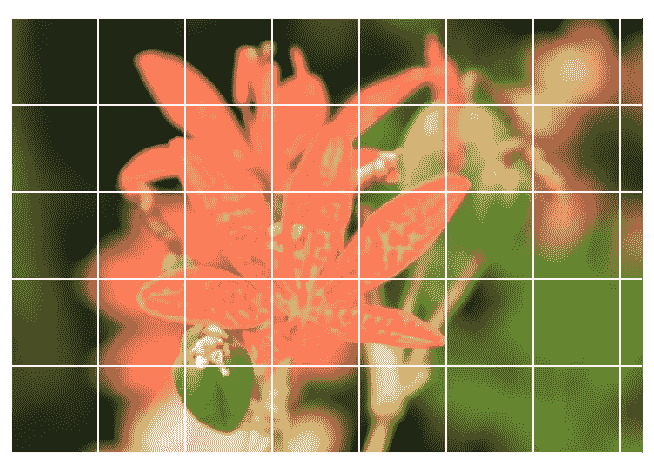
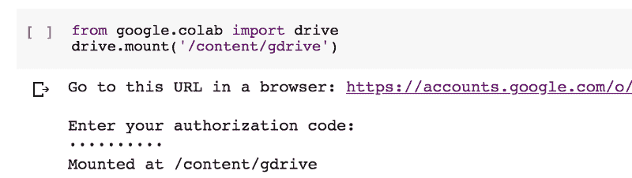
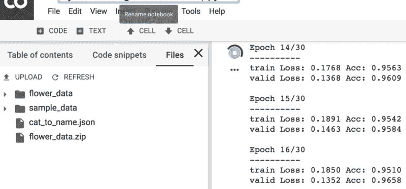
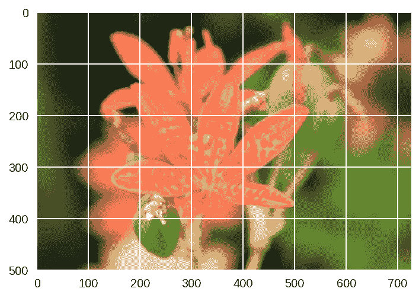
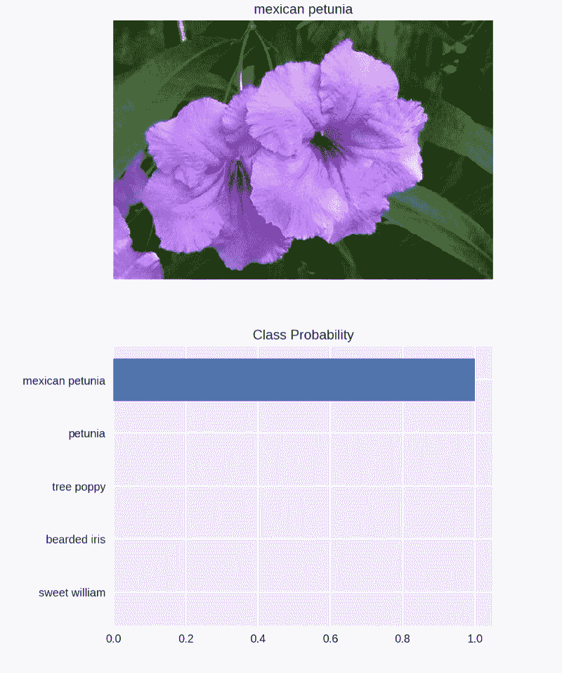

# 如何构建准确率高于 97%的图像分类器

> 原文：<https://www.freecodecamp.org/news/how-to-build-the-best-image-classifier-3c72010b3d55/>

安妮·班纳

# 如何构建准确率高于 97%的图像分类器

#### 清晰完整的成功蓝图



你如何教计算机看一张图像，并正确识别它是一朵花？你如何教计算机看到一种花的图像，然后准确地告诉你它是哪种花，而你甚至连 T2 都不知道它是哪种花？

让我给你看看！

本文将带您了解使用 PyTorch 创建图像分类器的基础知识。你可以想象在手机应用程序中使用这样的东西，它会告诉你你的相机正在看的花的名字。如果愿意，您可以训练这个分类器，然后将其导出用于您自己的应用程序。

你在这里做什么完全取决于你和你的想象力。

我把这篇文章放在一起，给那些对所有这些都是全新的，并且正在寻找一个开始的地方的人。这取决于你如何利用这些信息，对其进行改进，并使之成为你自己的信息！

如果你想查看笔记本，你可以在这里找到它。

因为这个 PyTorch 图像分类器是作为 Udacity 项目的最终项目而构建的，所以代码借鉴了 Udacity 的代码，而 uda city 又借鉴了 PyTorch 的官方文档。Udacity 还为标签映射提供了一个 JSON 文件。该文件可以在 GitHub repo 中找到。

[*关于花卉数据集的信息可以在这里找到。*](http://www.robots.ox.ac.uk/~vgg/data/flowers/102/) *数据集为 102 个花卉类中的每一个都包括一个单独的文件夹。每一朵花都被标记为一个数字，每个编号的目录都包含多个。jpg 文件。*

### 我们开始吧！


Photo by [Annie Spratt](https://unsplash.com/@anniespratt?utm_source=medium&utm_medium=referral) on [Unsplash](https://unsplash.com?utm_source=medium&utm_medium=referral)

因为这是一个使用更大数据集的神经网络，超过了我的 CPU 在任何合理时间内可以处理的数量，所以我继续在 [Google Colab](https://colab.research.google.com/) 中设置我的图像分类器。Colab 真的很棒，因为它提供了**免费的 GPU** 。(如果你是 Colab 的新手，[看看这篇关于开始使用 Google Colab 的文章](https://towardsdatascience.com/getting-started-with-google-colab-f2fff97f594c)！)

因为我使用的是 Colab，所以我需要从导入 PyTorch 开始。如果您不使用 Colab，就不需要这样做。

*****更新！(01/29)*** Colab 现在支持原生 PyTorch！！！你不需要运行下面的代码，但是我把它留在这里，以防有人有任何问题！**

```
# Import PyTorch if using Google Colab# http://pytorch.org/from os.path import existsfrom wheel.pep425tags import get_abbr_impl, get_impl_ver, get_abi_tagplatform = '{}{}-{}'.format(get_abbr_impl(), get_impl_ver(), get_abi_tag())cuda_output = !ldconfig -p|grep cudart.so|sed -e 's/.*\.\([0-9]*\)\.\([0-9]*\)$/cu\1\2/'accelerator = cuda_output[0] if exists('/dev/nvidia0') else 'cpu'
```

```
!pip install -q http://download.pytorch.org/whl/{accelerator}/torch-0.4.1-{platform}-linux_x86_64.whl torchvisionimport torch
```

然后，在枕头出了点问题之后(在 Colab 是 buggy！)，我只是继续运行这个:

```
import PILprint(PIL.PILLOW_VERSION)
```

如果您得到低于 5.3.0 的任何内容，请使用“运行时”下的下拉菜单“重新启动运行时”并再次运行此单元。你应该可以走了！

您将希望在这个项目中使用 GPU，这在 Colab 上设置起来非常简单。您只需进入“运行时”下拉菜单，选择“更改运行时类型”，然后在硬件加速器下拉菜单中选择“GPU”！


然后我喜欢跑步

```
train_on_gpu = torch.cuda.is_available()
```

```
if not train_on_gpu:    print('Bummer!  Training on CPU ...')else:    print('You are good to go!  Training on GPU ...')
```

只是为了确保它的工作。那就跑

```
device = torch.device("cuda:0" if torch.cuda.is_available() else "cpu")
```

来定义设备。

之后，导入文件。有很多方法可以做到这一点，包括安装你的 Google Drive，如果你已经在那里存储了你的数据集，这实际上非常简单。即使我最终没有发现这是最有用的解决方案，我还是把它包括在下面，只是因为它非常简单和有用。

```
from google.colab import drivedrive.mount('/content/gdrive')
```

然后你会看到一个链接，点击它，允许访问，复制弹出的代码，粘贴到框中，点击回车，你就可以开始了！如果你没有在左边的边框中看到你的驱动器，只需点击“刷新”,它就会显示出来。

(运行单元，单击链接，复制页面上的代码，将其粘贴到框中，按 enter 键，当您成功安装驱动器时，您会看到这一点):



其实超级简单！

但是，如果您更愿意下载一个共享的 zip 文件链接(对于这个项目来说，这样会更容易、更快)，您可以使用:

```
!wget !unzip
```

例如:

```
!wget -cq https://s3.amazonaws.com/content.udacity-data.com/courses/nd188/flower_data.zip!unzip -qq flower_data.zip
```

这将在几秒钟内为您提供 Udacity 的花卉数据集！

(如果你上传的是小文件，你可以用一些简单的代码直接上传。然而，如果你愿意，如果你不想运行一些简单的代码来获取一个本地文件，你也可以只去屏幕的左侧，并点击“上传文件”。)



加载数据后，我导入了我想要使用的库:

```
%matplotlib inline%config InlineBackend.figure_format = 'retina'
```

```
import timeimport jsonimport copy
```

```
import matplotlib.pyplot as pltimport seaborn as snsimport numpy as npimport PIL
```

```
from PIL import Imagefrom collections import OrderedDict
```

```
import torchfrom torch import nn, optimfrom torch.optim import lr_schedulerfrom torch.autograd import Variableimport torchvisionfrom torchvision import datasets, models, transformsfrom torch.utils.data.sampler import SubsetRandomSamplerimport torch.nn as nnimport torch.nn.functional as F
```

接下来是数据转换！为了帮助程序尽可能多地学习，您需要确保在训练集上使用几种不同类型的变换。通过对翻转、旋转和裁剪的图像进行训练，可以创建更健壮的模型。

这意味着在将图像值传递到我们的网络之前，提供标准偏差来归一化图像值，但是也可以通过查看图像张量的不同维度的平均值和标准偏差值来找到它们。官方文档在这里非常有用！

对于我的图像分类器，我保持简单:

```
data_transforms = {    'train': transforms.Compose([        transforms.RandomRotation(30),        transforms.RandomResizedCrop(224),        transforms.RandomHorizontalFlip(),        transforms.ToTensor(),        transforms.Normalize([0.485, 0.456, 0.406],                              [0.229, 0.224, 0.225])    ]),    'valid': transforms.Compose([        transforms.Resize(256),        transforms.CenterCrop(224),        transforms.ToTensor(),        transforms.Normalize([0.485, 0.456, 0.406],                              [0.229, 0.224, 0.225])    ])}
```

```
# Load the datasets with ImageFolderimage_datasets = {x: datasets.ImageFolder(os.path.join(data_dir, x),                                          data_transforms[x])                  for x in ['train', 'valid']}
```

```
# Using the image datasets and the trainforms, define the dataloadersbatch_size = 64dataloaders = {x: torch.utils.data.DataLoader(image_datasets[x], batch_size=batch_size,                                             shuffle=True, num_workers=4)              for x in ['train', 'valid']}
```

```
class_names = image_datasets['train'].classes
```

```
dataset_sizes = {x: len(image_datasets[x]) for x in ['train', 'valid']}class_names = image_datasets['train'].classes
```

正如您在上面看到的，我还在上面的代码中定义了批处理大小、数据加载器和类名。

为了快速查看数据并检查我的设备，我运行了:

```
print(dataset_sizes)print(device)
```

```
{'train': 6552, 'valid': 818}cuda:0
```

接下来，我们需要从标签号和实际的花名进行一些映射。Udacity 提供了一个 JSON 文件来简单地完成这个映射。

```
with open('cat_to_name.json', 'r') as f:    cat_to_name = json.load(f)
```

要测试数据加载器，请运行:

```
images, labels = next(iter(dataloaders['train']))rand_idx = np.random.randint(len(images))# Print(rand_idx)print("label: {}, class: {}, name: {}".format(labels[rand_idx].item(),                                               class_names[labels[rand_idx].item()],                                               cat_to_name[class_names[labels[rand_idx].item()]]))
```

现在它开始变得更加令人兴奋！在过去的几年中，一些比我们大多数人更有资格在计算机视觉问题中重用的人已经创建了许多模型。 [PyTorch 使得加载预训练模型并在其上构建变得容易](https://pytorch.org/docs/stable/torchvision/models.html)，这正是我们在这个项目中要做的。型号的选择完全由你决定！

一些最受欢迎的预训练模型，如 ResNet，AlexNet 和 VGG，来自 ImageNet 挑战赛。这些预先训练的模型允许其他人快速获得计算机视觉的前沿结果，而不需要如此大量的计算机能力、耐心和时间。我实际上用 DenseNet 取得了很好的结果，并决定使用 DenseNet161，它相对较快地给了我非常好的结果。

您可以通过运行以下命令来快速设置

```
model = models.densenet161(pretrained=True)
```

但是让您自己选择模型、优化器和调度器可能更有趣。为了在体系结构中建立一个选择，运行

```
model_name = 'densenet' #vggif model_name == 'densenet':    model = models.densenet161(pretrained=True)    num_in_features = 2208    print(model)elif model_name == 'vgg':    model = models.vgg19(pretrained=True)    num_in_features = 25088    print(model.classifier)else:    print("Unknown model, please choose 'densenet' or 'vgg'")
```

这允许您快速建立替代模型。

之后，您可以开始构建您的分类器，使用最适合您的参数。我继续建造

```
for param in model.parameters():    param.requires_grad = False
```

```
def build_classifier(num_in_features, hidden_layers, num_out_features):       classifier = nn.Sequential()    if hidden_layers == None:        classifier.add_module('fc0', nn.Linear(num_in_features, 102))    else:        layer_sizes = zip(hidden_layers[:-1], hidden_layers[1:])        classifier.add_module('fc0', nn.Linear(num_in_features, hidden_layers[0]))        classifier.add_module('relu0', nn.ReLU())        classifier.add_module('drop0', nn.Dropout(.6))        classifier.add_module('relu1', nn.ReLU())        classifier.add_module('drop1', nn.Dropout(.5))        for i, (h1, h2) in enumerate(layer_sizes):            classifier.add_module('fc'+str(i+1), nn.Linear(h1, h2))            classifier.add_module('relu'+str(i+1), nn.ReLU())            classifier.add_module('drop'+str(i+1), nn.Dropout(.5))        classifier.add_module('output', nn.Linear(hidden_layers[-1], num_out_features))            return classifier
```

这允许一个简单的方法来改变我正在使用的隐藏层的数量，以及快速调整辍学率。您可以决定添加额外的 ReLU 和 dropout 层，以便更好地完善您的模型。

接下来，训练你的分类器参数。我决定确保在冻结特征参数的同时，只在这里训练分类器参数。使用优化器、标准和调度器，您可以随心所欲地发挥创造力。标准是用于评估模型拟合的方法，优化器是用于更新权重的优化方法，调度器提供不同的方法来调整优化期间使用的学习速率和步长。

尝试尽可能多的选项和组合，看看什么能给你最好的结果。你可以在这里看到所有的官方文件。我建议看一看，自己决定要用什么。你在这里并没有无限多的选择，但是一旦你开始尝试，就一定会有这种感觉！

```
hidden_layers = None
```

```
classifier = build_classifier(num_in_features, hidden_layers, 102)print(classifier)
```

```
# Only train the classifier parameters, feature parameters are frozenif model_name == 'densenet':    model.classifier = classifier    criterion = nn.CrossEntropyLoss()    optimizer = optim.Adadelta(model.parameters())    sched = optim.lr_scheduler.StepLR(optimizer, step_size=4)elif model_name == 'vgg':    model.classifier = classifier    criterion = nn.NLLLoss()    optimizer = optim.Adam(model.classifier.parameters(), lr=0.0001)    sched = lr_scheduler.StepLR(optimizer, step_size=4, gamma=0.1)else:    pass
```

现在是时候训练你的模型了。

```
# Adapted from https://pytorch.org/tutorials/beginner/transfer_learning_tutorial.html
```

```
def train_model(model, criterion, optimizer, sched, num_epochs=5):    since = time.time()
```

```
best_model_wts = copy.deepcopy(model.state_dict())    best_acc = 0.0
```

```
for epoch in range(num_epochs):        print('Epoch {}/{}'.format(epoch+1, num_epochs))        print('-' * 10)
```

```
# Each epoch has a training and validation phase        for phase in ['train', 'valid']:            if phase == 'train':                model.train()  # Set model to training mode            else:                model.eval()   # Set model to evaluate mode
```

```
running_loss = 0.0            running_corrects = 0
```

```
# Iterate over data.            for inputs, labels in dataloaders[phase]:                inputs = inputs.to(device)                labels = labels.to(device)
```

```
# Zero the parameter gradients                optimizer.zero_grad()
```

```
# Forward                # track history if only in train                with torch.set_grad_enabled(phase == 'train'):                    outputs = model(inputs)                    _, preds = torch.max(outputs, 1)                    loss = criterion(outputs, labels)
```

```
# Backward + optimize only if in training phase                    if phase == 'train':                        #sched.step()                        loss.backward()                                                optimizer.step()
```

```
# Statistics                running_loss += loss.item() * inputs.size(0)                running_corrects += torch.sum(preds == labels.data)
```

```
epoch_loss = running_loss / dataset_sizes[phase]            epoch_acc = running_corrects.double() / dataset_sizes[phase]
```

```
print('{} Loss: {:.4f} Acc: {:.4f}'.format(                phase, epoch_loss, epoch_acc))
```

```
# Deep copy the model            if phase == 'valid' and epoch_acc > best_acc:                best_acc = epoch_acc                best_model_wts = copy.deepcopy(model.state_dict())
```

```
print()
```

```
time_elapsed = time.time() - since    print('Training complete in {:.0f}m {:.0f}s'.format(        time_elapsed // 60, time_elapsed % 60))    print('Best val Acc: {:4f}'.format(best_acc))
```

```
# Load best model weights    model.load_state_dict(best_model_wts)        return model
```

```
epochs = 30model.to(device)model = train_model(model, criterion, optimizer, sched, epochs)
```

我希望能够轻松地监控我的纪元，并在我的模型运行时跟踪经过的时间。上面的代码包含了这两者，而且效果相当不错！您可以看到，该模型正在快速学习，到 epoch 7 时，验证集的准确性很快达到了 95%以上！

```
Epoch 1/30----------train Loss: 2.4793 Acc: 0.4791valid Loss: 0.9688 Acc: 0.8191Epoch 2/30----------train Loss: 0.8288 Acc: 0.8378valid Loss: 0.4714 Acc: 0.9010Epoch 3/30----------train Loss: 0.5191 Acc: 0.8890valid Loss: 0.3197 Acc: 0.9181Epoch 4/30----------train Loss: 0.4064 Acc: 0.9095valid Loss: 0.2975 Acc: 0.9169Epoch 5/30----------train Loss: 0.3401 Acc: 0.9214valid Loss: 0.2486 Acc: 0.9401Epoch 6/30----------train Loss: 0.3111 Acc: 0.9303valid Loss: 0.2153 Acc: 0.9487Epoch 7/30----------train Loss: 0.2987 Acc: 0.9298valid Loss: 0.1969 Acc: 0.9584
```

```
...
```

```
Training complete in 67m 43sBest val Acc: 0.973105
```

你可以看到，用 GPU 在 Google Colab 上运行这段代码只花了一个多小时。

现在是评估的时候了

```
model.eval()
```

```
accuracy = 0
```

```
for inputs, labels in dataloaders['valid']:    inputs, labels = inputs.to(device), labels.to(device)    outputs = model(inputs)        # Class with the highest probability is our predicted class    equality = (labels.data == outputs.max(1)[1])
```

```
# Accuracy = number of correct predictions divided by all predictions    accuracy += equality.type_as(torch.FloatTensor()).mean()    print("Test accuracy: {:.3f}".format(accuracy/len(dataloaders['valid'])))
```

```
Test accuracy: 0.973
```

保存你的关卡很重要

```
model.class_to_idx = image_datasets['train'].class_to_idx
```

```
checkpoint = {'input_size': 2208,              'output_size': 102,              'epochs': epochs,              'batch_size': 64,              'model': models.densenet161(pretrained=True),              'classifier': classifier,              'scheduler': sched,              'optimizer': optimizer.state_dict(),              'state_dict': model.state_dict(),              'class_to_idx': model.class_to_idx             }   torch.save(checkpoint, 'checkpoint.pth')
```

您不必保存所有的参数，但是我在这里将它们作为一个例子。这个检查点专门保存具有预训练的 densenet161 架构的模型，但是如果您想要保存具有二选一选项的检查点，您完全可以这样做。只需调整输入大小和型号。

现在您可以加载您的检查点了。如果您将项目提交到 Udacity 工作区，事情会变得有点棘手。[这里有一些关于检查点负载故障排除的帮助](https://towardsdatascience.com/load-that-checkpoint-51142d44fb5d)。

您可以通过运行以下命令来检查您的密钥

```
ckpt = torch.load('checkpoint.pth')ckpt.keys()
```

然后加载并重建您的模型！

```
def load_checkpoint(filepath):    checkpoint = torch.load(filepath)    model = checkpoint['model']    model.classifier = checkpoint['classifier']    model.load_state_dict(checkpoint['state_dict'])    model.class_to_idx = checkpoint['class_to_idx']    optimizer = checkpoint['optimizer']    epochs = checkpoint['epochs']        for param in model.parameters():        param.requires_grad = False            return model, checkpoint['class_to_idx']
```

```
model, class_to_idx = load_checkpoint('checkpoint.pth')
```

想继续吗？为分类做一些图像预处理和推断是个好主意。继续定义您的图像路径并打开一个图像:

```
image_path = 'flower_data/valid/102/image_08006.jpg'img = Image.open(image_path)
```

处理您的图像并查看处理后的图像:

```
def process_image(image):    ''' Scales, crops, and normalizes a PIL image for a PyTorch model,        returns an Numpy array    '''    # Process a PIL image for use in a PyTorch model    # tensor.numpy().transpose(1, 2, 0)    preprocess = transforms.Compose([        transforms.Resize(256),        transforms.CenterCrop(224),        transforms.ToTensor(),        transforms.Normalize(mean=[0.485, 0.456, 0.406],                              std=[0.229, 0.224, 0.225])    ])    image = preprocess(image)    return image
```

```
def imshow(image, ax=None, title=None):    """Imshow for Tensor."""    if ax is None:        fig, ax = plt.subplots()        # PyTorch tensors assume the color channel is the first dimension    # but matplotlib assumes is the third dimension    image = image.numpy().transpose((1, 2, 0))        # Undo preprocessing    mean = np.array([0.485, 0.456, 0.406])    std = np.array([0.229, 0.224, 0.225])    image = std * image + mean        # Image needs to be clipped between 0 and 1 or it looks like noise when displayed    image = np.clip(image, 0, 1)        ax.imshow(image)        return ax
```

```
with Image.open('flower_data/valid/102/image_08006.jpg') as image:    plt.imshow(image)
```

```
model.class_to_idx = image_datasets['train'].class_to_idx
```



创建预测函数:

```
def predict2(image_path, model, topk=5):    ''' Predict the class (or classes) of an image using a trained deep learning model.    '''        # Implement the code to predict the class from an image file    img = Image.open(image_path)    img = process_image(img)        # Convert 2D image to 1D vector    img = np.expand_dims(img, 0)            img = torch.from_numpy(img)        model.eval()    inputs = Variable(img).to(device)    logits = model.forward(inputs)        ps = F.softmax(logits,dim=1)    topk = ps.cpu().topk(topk)        return (e.data.numpy().squeeze().tolist() for e in topk)
```

一旦图像格式正确，您就可以编写一个函数来使用您的模型进行预测。一种常见的做法是预测前 5 个左右(通常称为前 KK)最有可能的类。您需要计算类概率，然后找到 KK 最大值。

要获得张量中的顶部 KK 最大值，请使用 k.topk()。该方法返回最高的 k 个概率和对应于这些类的那些概率的指数。您需要使用 class_to_idx 将这些索引转换为实际的类标签，您可以将它添加到模型中，或者从用于加载数据的 Image 文件夹中进行转换。请确保反转字典，这样您也可以获得从索引到类的映射。

这个方法应该采用一个到图像和模型检查点的路径，然后返回概率和类。

```
img_path = 'flower_data/valid/18/image_04252.jpg'probs, classes = predict2(img_path, model.to(device))print(probs)print(classes)flower_names = [cat_to_name[class_names[e]] for e in classes]print(flower_names)
```

我对我的模特的表现非常满意！

```
[0.9999195337295532, 1.4087702766119037e-05, 1.3897360986447893e-05, 1.1400215043977369e-05, 6.098791800468462e-06][12, 86, 7, 88, 40]['peruvian lily', 'desert-rose', 'king protea', 'magnolia', 'sword lily']
```

基本上，我指定的图像几乎 100%可能是秘鲁百合。想看看吗？尝试使用 matplotlib 在条形图中绘制前五类的概率以及输入图像:

```
def view_classify(img_path, prob, classes, mapping):    ''' Function for viewing an image and it's predicted classes.    '''    image = Image.open(img_path)
```

```
fig, (ax1, ax2) = plt.subplots(figsize=(6,10), ncols=1, nrows=2)    flower_name = mapping[img_path.split('/')[-2]]    ax1.set_title(flower_name)    ax1.imshow(image)    ax1.axis('off')        y_pos = np.arange(len(prob))    ax2.barh(y_pos, prob, align='center')    ax2.set_yticks(y_pos)    ax2.set_yticklabels(flower_names)    ax2.invert_yaxis()  # labels read top-to-bottom    ax2.set_title('Class Probability')
```

```
view_classify(img_path, probs, classes, cat_to_name)
```

您应该会看到类似这样的内容:


我不得不说，我对此很满意！我建议测试一些其他的图像，看看你对各种图像的预测有多接近。



现在是时候做一个你自己的模型了，在下面的回复中让我知道效果如何！


Photo by [Pez González](https://unsplash.com/@pezgonzalez?utm_source=medium&utm_medium=referral) on [Unsplash](https://unsplash.com?utm_source=medium&utm_medium=referral)

你是否已经完成了你的深度学习或者机器学习模型，但是不知道下一步该怎么做？为什么不把它部署到互联网上？

把你的模型拿出来，让每个人都能看到！

[查看这篇文章，了解如何使用 Flask](https://heartbeat.fritz.ai/brilliant-beginners-guide-to-model-deployment-133e158f6717) 部署您的机器学习模型！