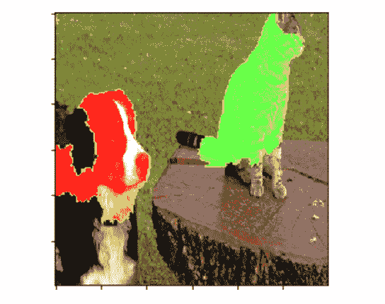
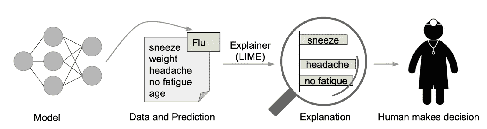
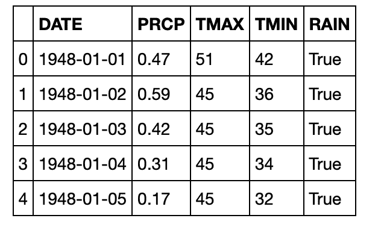
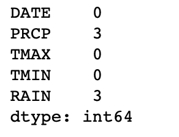
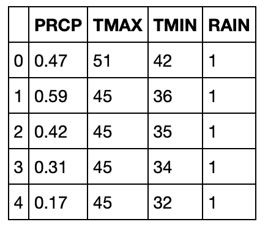
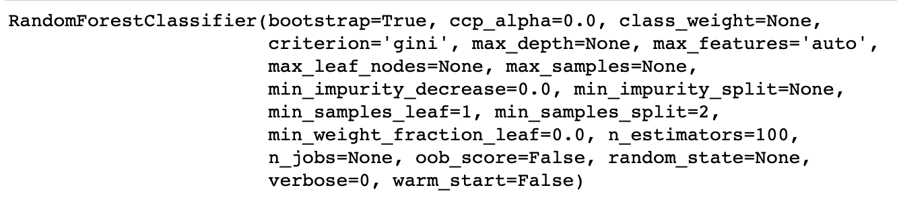
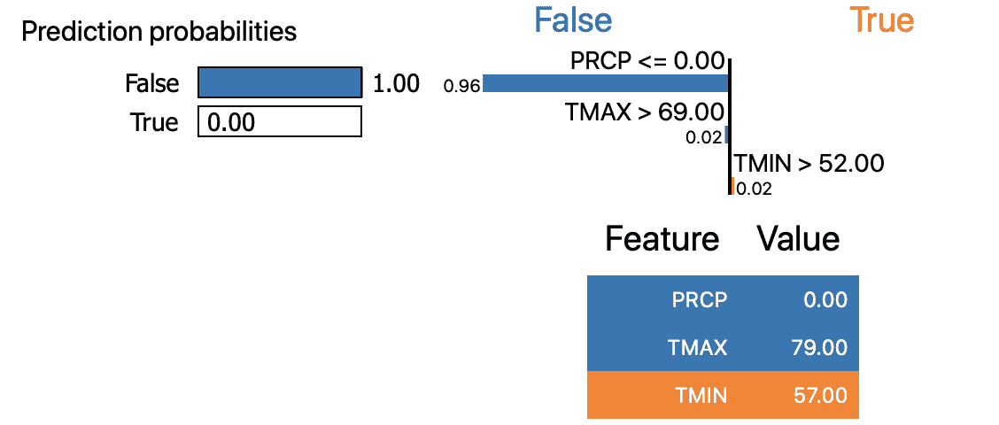
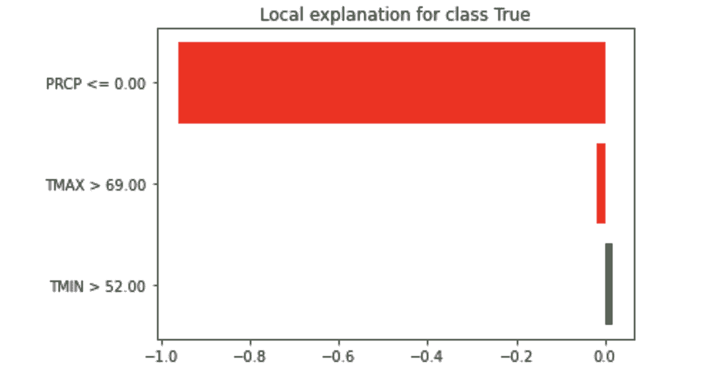

# 如何用石灰建立对机器学习模型预测的信任

> 原文：<https://www.freecodecamp.org/news/how-to-build-trust-in-models-prediction-with-code/>

本文是一个循序渐进的指南，将帮助您使用 LIME 解释您的机器学习模型的预测。即使你的模型达到了接近 100%的准确率，你的脑海中总会有一个问题:我们应该相信它吗？

考虑一下医生办公室的情况——如果电脑只是显示诊断结果，而没有给出任何合理的理由，医生会相信它吗？

任何不能解释其输出背后原因的模型都被认为是黑箱。相信这样的模型不是正确的方法。

假设我们有一个预测动物是狗还是猫的模型，并且有 100%的准确率。但是如果它根据图像的背景做出预测呢？你会相信那个模型吗？



正如您在上图中看到的，绿色表示将图像识别为猫所需的特征，红色表示将图像识别为狗所需的特征。

如果我们的模型为其预测提供了这样一个有效的理由，它就建立了我们对该模型的信任。类似地，对于医生的情况，如果模型可以告诉其预测中哪些特征是重要的，以及它对哪些症状给予了更多的权重，那么医生就更容易信任该模型。

但解读任何模型就那么简单？幸运的是是的。马尔科·图利奥·里贝罗、萨姆尔·辛格和卡洛斯·盖斯特林发表了一篇名为《我为什么要相信你》的论文:解释 2016 年任何分类器的预测。

在书中，他们提出了他们的技术石灰。这种技术的基本方法是通过围绕其预测局部学习来容易地解释任何模型。

他们写这篇论文是为了理解任何模型预测背后的解释。所以无论何时你需要选择一个模型，你都可以使用 LIME 的见解。



Explaining individual predictions using LIME [source](https://arxiv.org/pdf/1602.04938.pdf)

在上图中，模型预测患者患有流感，而 LIME 突出显示了患者历史中导致预测的症状。

打喷嚏和头痛有助于“流感”预测，而“不疲劳”是反对它的证据。有了这些信息，医生就可以做出是否信任模型预测的明智决定。

### 那么，石灰到底是什么？

> LIME 是模型不可知的，这意味着它可以应用于任何机器学习模型。LIME 的目标是在本地忠实于分类器的可解释表示上识别可解释模型。
> 
> *-* 定义来自公文纸([链接](https://arxiv.org/pdf/1602.04938.pdf))

为了理解这一点，我们需要理解首字母缩写词 LIME 的含义。

**局部:**指我们如何得到这些解释。LIME 在预测的邻域内局部逼近黑盒模型。

**可解释:**LIME 提供的解释足够简单，人类可以理解。

与模型无关: LIME 将模型视为黑盒，因此它适用于任何模型。

**解释**:模型执行动作的理由。

LIME 提供了本地模型的可解释性。它通过调整特征值并观察对输出的影响来修改单个数据样本。

有了 LIME，我们可以解释为什么`RandomForestClassifier`在给出预测之前会想到它要做什么。

## 让我们来看一些代码

我们将首先使用`RandomForestClassifier`模型来处理“西雅图下雨了吗”数据集。数据可在[这里](https://github.com/Sid11/Lime)获得。

首先，我们将导入我们的基本库:

```
import numpy as np
import pandas as pd
import matplotlib.pyplot as plt
%matplotlib inline
```

为了避免在我们的代码中出现警告，我们将在脚本的开头将此添加到代码中:

```
import warnings
warnings.filterwarnings('ignore')
```

然后，我们导入几个 sklearn 库来分割数据集和定义指标。`RandomForestClassifier`也将从同一个库中导入。

```
from sklearn.model_selection import train_test_split
from sklearn.metrics import accuracy_score
from sklearn.ensemble import RandomForestClassifier
```

因为我们有了所有需要的库，我们将读取我们的数据:

```
df = pd.read_csv('seattleWeather_1948-2017.csv')
df.head()
```



因此，数据由 4 个特征列和一个目标列组成，即 RAIN。我们的任务是预测西雅图是否会下雨。

```
df.shape
```

(25551, 5)

我们的数据包含 25，551 行，这足够我们的模型进行训练。

我们将检查丢失的值，如果有的话:

```
df.isnull().sum()
```



因为我们的主要焦点是解释模型的预测，所以我们将直接丢弃丢失的值行。为了简单起见，我们也将删除日期列。

```
df.dropna(inplace=True)
df.pop('DATE')
```

我们现在将对目标列进行编码:

```
df.RAIN.replace({True:1,False:0},inplace=True)
df.head()
```



这是我们的数据最终的样子。

```
target = df.pop('RAIN')
x_train , x_test , y_train , y_test = train_test_split(df, target, train_size=0.75)
```

我们现在已经将数据分成训练集和测试集，训练集等于原始数据的 75%。

我们现在将使用默认参数创建我们的模型:

```
rfc = RandomForestClassifier()
```

并将模型拟合到训练样本:

```
rfc.fit(x_train,y_train)
```



```
accuracy_score(y_test,rfc.predict(x_test))
```

One

模型达到了 100%的准确率。但是现在让我们来解释这个模型，这样我们就可以信任它了。

## 石灰

首先，在继续之前，我们需要讨论一些理论。

LIME 创建新数据，包括置换样本及其各自的预测。

在此基础上，LIME 训练了一个局部模型，该模型通过样本实例的接近度来加权。该模型可以是任何基本模型，即决策树。

该模型必须具有与现有模型相似的局部预测。这种精确度称为局部保真度。

```
import lime
from lime import lime_tabular
```

既然我们已经导入了所需的包，我们需要执行我们的解释。

以下是训练本地代理模特的方法:

1.  选择要获取其预测说明的模型
2.  训练此模型并获得其对测试值的预测
3.  对于石灰，我们根据其与模型的接近程度对新样本进行加权
4.  在数据集上创建本地模型
5.  最后，我们通过解释局部模型来解释这个预测

定义一个`LimeTableExplainer`模型。该模型的参数是训练样本、特征名和类名:

```
explainer = lime_tabular.LimeTabularExplainer(x_train.values,feature_names=['PRCP','TMAX','TMIN'],class_names=['False','True'],discretize_continuous=True)
```

我们需要传递训练样本、训练列名和预期的目标类名。

然后我们调用我们创建的解释器的`explain_instance()`函数。

我们将使用此函数的以下参数-测试样本、模型的预测函数、功能数量以及要考虑的顶部标签:

```
i = np.random.randint(0,x_test.shape[0])
exp = explainer.explain_instance(x_test.iloc[i],rfc.predict_proba,num_features=x_train.shape[1],top_labels=None)
```

为了在笔记本中显示解释，需要以下代码。

```
exp.show_in_notebook()
```



让我们解密输出。

左上图显示了预测的概率输出。

模型的输出是**假**的概率为 100%。

右上方的图表显示了每个类别所需满足的条件及其权重。

因为用于预测目标为假的 PRCP 变量的条件是 PRCP ≤0.00 并且它具有 0.96 的权重。

右下角的图表显示了我们的测试值。由于 PRCP 值满足**假**条件，您可以看到蓝色作为背景。

要将解释显示为图:

```
fig = exp.as_pyplot_figure()
```



在这里，您可以看到每个要素及其预测类的权重(用颜色表示)。它们表示分配给每个要素的局部权重。红色代表**假**目标，而绿色代表**真**目标。

现在，通过查看赋予每个特征的权重以及属于特定类别的每个测试值的条件，可以很容易地解释该模型。

`PRCP`和`TMAX`的值表示预测目标应该是**假**，而`TMIN`的值表示**真**目标。

LIME 不仅用于表格数据的二值分类，还用于多类案例、图像和文本。

代码可以在我的 GitHub 资源库中找到:[https://github.com/Sid11/Lime](https://github.com/Sid11/Lime)

这里有一个 LIME 官方 GitHub 库的链接:[https://github.com/marcotcr/lime](https://github.com/marcotcr/lime)

如果你有任何问题，请联系我。希望你喜欢这篇文章！