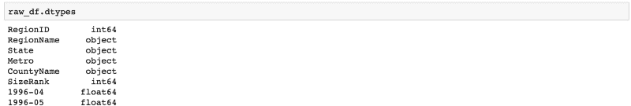
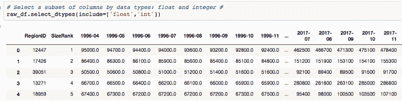
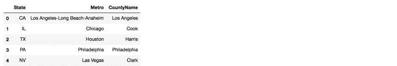
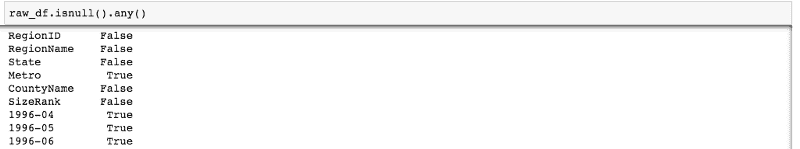
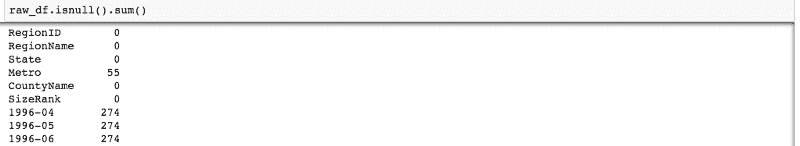
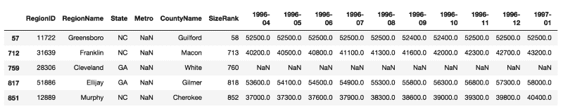
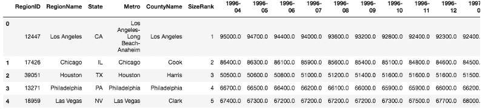
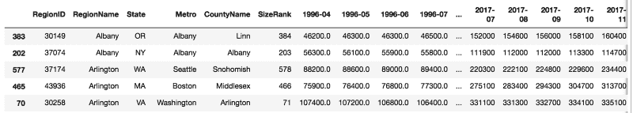

# 如何用 Python 构建数据科学的肌肉记忆

> 原文：<https://www.freecodecamp.org/news/how-to-build-up-your-muscle-memory-for-data-science-with-python-5960df1c930e/>

作者:刘臻

#### 首先:数据预处理

在搜索语法时，您是否因为中断了数据分析流程而感到沮丧？为什么查了第三遍还是不记得？？是因为你还没有练够，还没有为它建立肌肉记忆。

现在，想象一下，当你编码时，Python 语法和函数会随着你的分析思路从你的指尖飞出。多棒啊！本教程将帮助您实现这一目标。

我建议每天早上练习这个脚本 10 分钟，并重复一周。这就像每天做一些小仰卧起坐——不是为了锻炼你的腹肌，而是为了锻炼你的数据科学肌肉。渐渐地，你会注意到在这种重复训练之后，数据分析编程效率的提高。

从我的“数据科学测试”开始，在本教程中，我们将练习最常见的数据预处理语法作为热身；)

```
Contents:
```

```
0 . Read, View and Save data1 . Table’s Dimension and Data Types2 . Basic Column Manipulation3 . Null Values: View, Delete and Impute4 . Data Deduplication
```

### 0.读取、查看和保存数据

首先，为我们的练习加载库:

现在我们将从我的 GitHub 存储库中读取数据。我从 [Zillow](https://www.zillow.com/research/data/#other-metrics) 下载了数据。

结果看起来像这样:


保存文件是 dataframe.to_csv()。如果不想保存索引号，请使用 dataframe.to_csv( index = False)。

### 1 .表的维度和数据类型

#### 1.1 尺寸

这个数据有多少行和多少列？

#### 1.2 数据类型

数据的数据类型是什么，有多少列是数值型的？

前几列数据类型的输出:



如果您想要更具体地描述您的数据，请使用 select_dtypes()来包含或排除数据类型。问题:如果我只想查看 2018 年的数据，我该如何获取？

### 2.基本列操作

#### 2.1 按列的子集数据

按数据类型选择列:

例如，如果您只需要浮点和整数列:



按名称选择和删除列:



#### 2.2 重命名列

如果我不喜欢这些列，我该如何重命名它们？比如把‘State’改成‘State _ ’;“城市”到“城市 _ ”:

### 3.空值:查看、删除和估算

#### 3.1 有多少行和列有空值？

isnull.any()与 isnull.sum()的输出:



isnull.any()



isnull.sum()

选择一列中不为空的数据，例如，“Metro”不为空。



Rows with N/A ‘Metro’ values

#### 3.2 对于一组固定的列，选择不为空的行

选择 2000 年后不为空的数据子集:

如果要选择 7 月的数据，需要找到包含'-07 '的列。要查看一个字符串是否包含子串，可以在 string 中使用 substring，它将输出 true 或 false。



#### 3.3 按空值划分的子集行

选择我们希望至少有 50 个非 NA 值的行，但不需要指定具体的列:

#### 3.4 删除和估算缺失值

填充 NA 或估算 NA:

使用 where 函数使用您自己的条件进行填充:

### 4.重复数据删除

在聚合数据或连接数据之前，我们需要确保没有重复的行。

我们想看看是否有重复的城市/地区。我们需要决定在分析中使用什么唯一的 ID(城市，地区)。



Set keep=False to see all the duplicated rows by ‘RegionName’

#### 删除重复的值。

“CountyName”和“SizeRank”组合已经是唯一的。所以我们只是使用列来演示 drop_duplicated 的语法。

这是我的用 Python 构建数据科学的肌肉记忆系列的第一部分。*完整的剧本可以在[这里](https://gist.github.com/zhendata/5d73068e5b31b616938af51bedf65382)找到。*

敬请期待！我的下一篇教程将向您展示如何“卷曲数据科学肌肉”来分割数据。

如果你觉得这有帮助，请跟我来，给我几下掌声:)

当您正在研究 Python 时，也许您会对我以前的文章感兴趣:

[**15 分钟学会大数据分析的火花！**](https://towardsdatascience.com/learn-spark-essentials-in-15-mins-cf1495882ae0)
[*我向你保证，这个简短的教程将为你节省大量阅读长篇文档的时间。准备……*towardsdatascience.com](https://towardsdatascience.com/learn-spark-essentials-in-15-mins-cf1495882ae0)