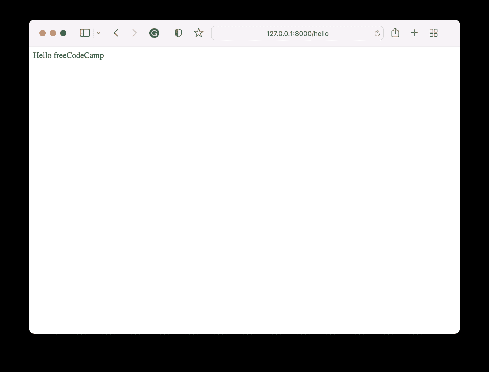
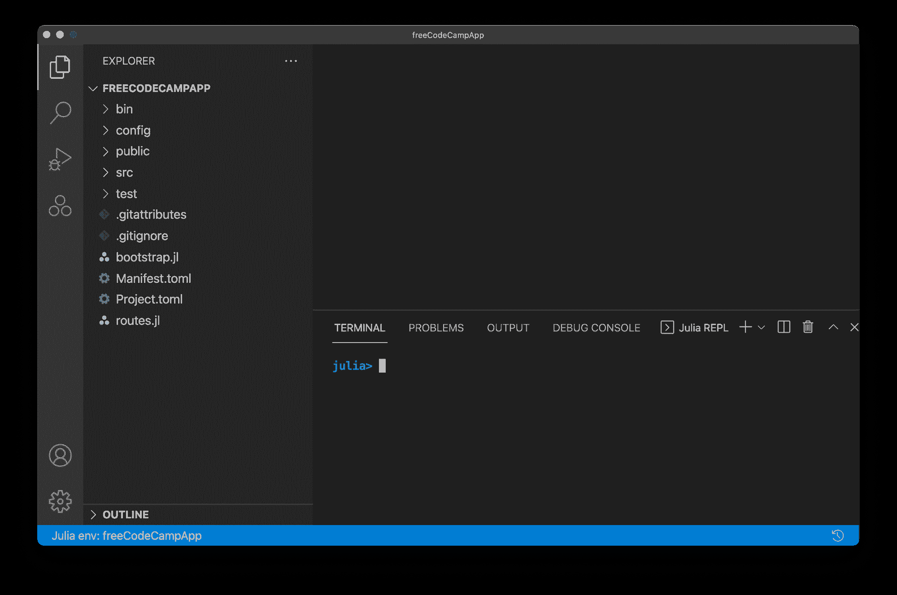
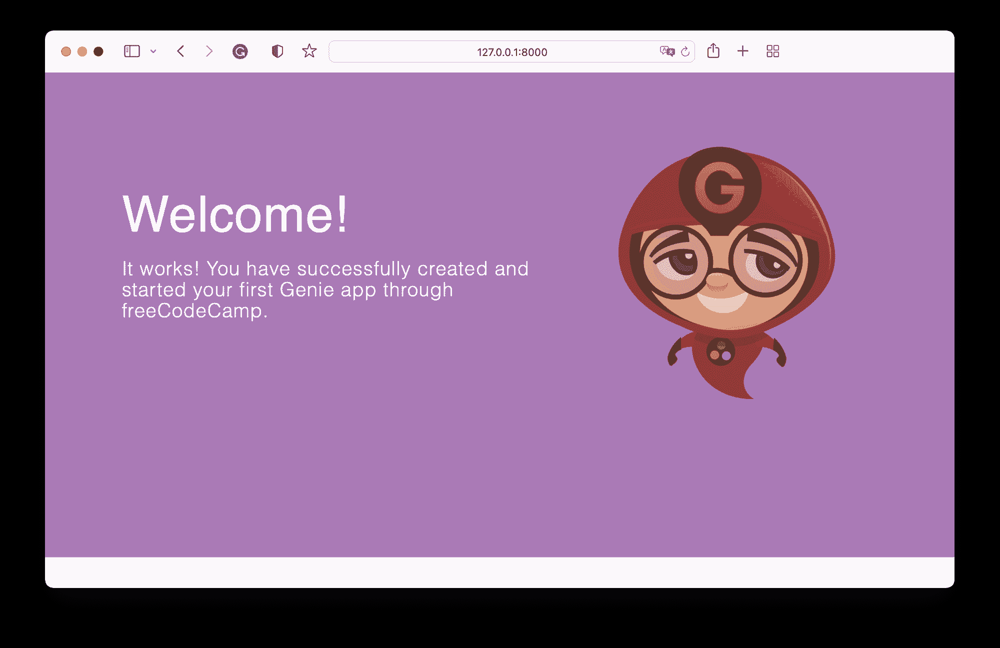
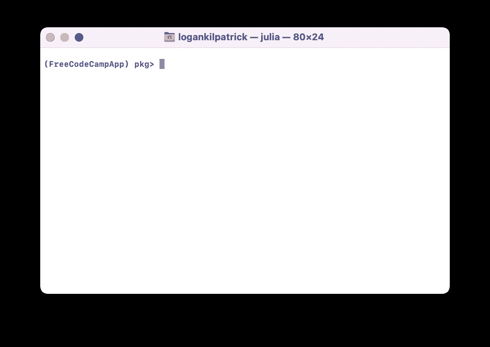
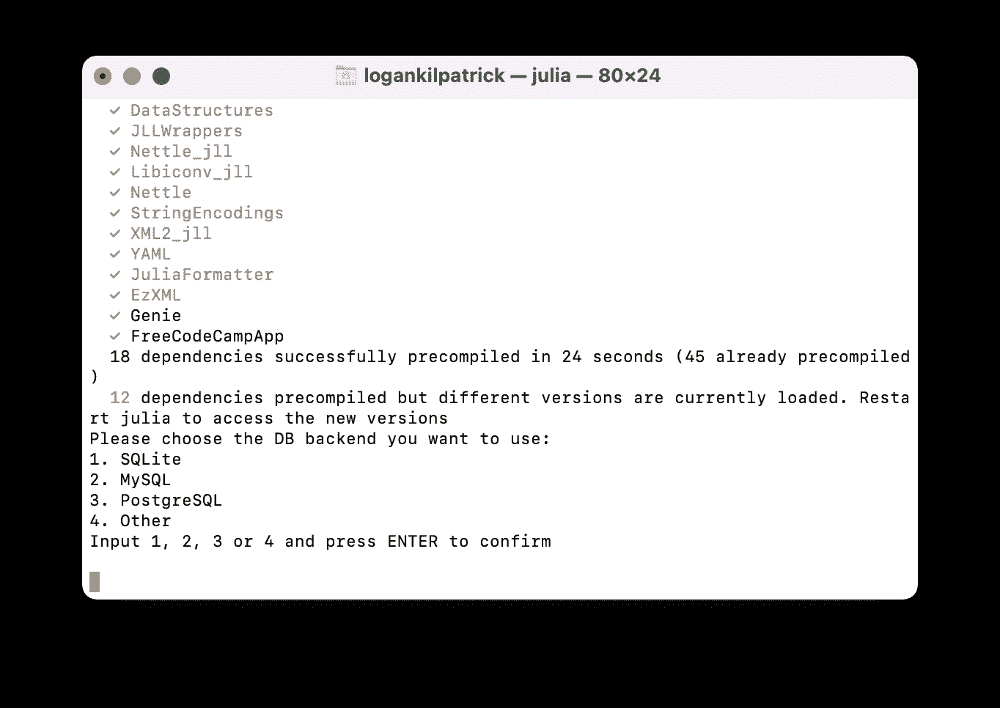
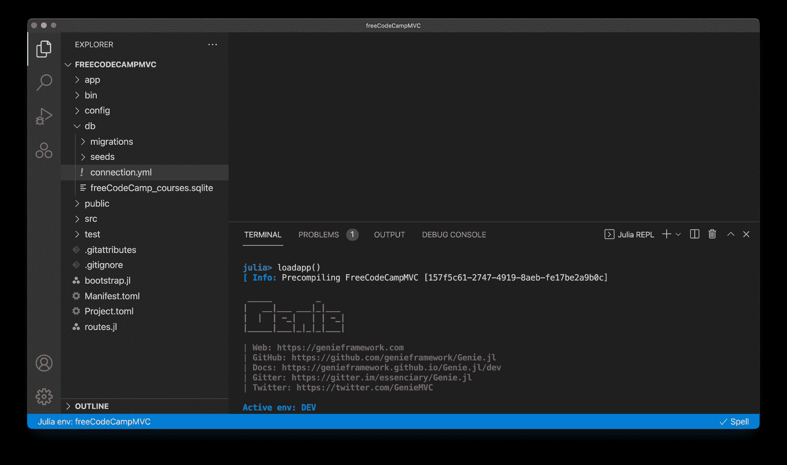
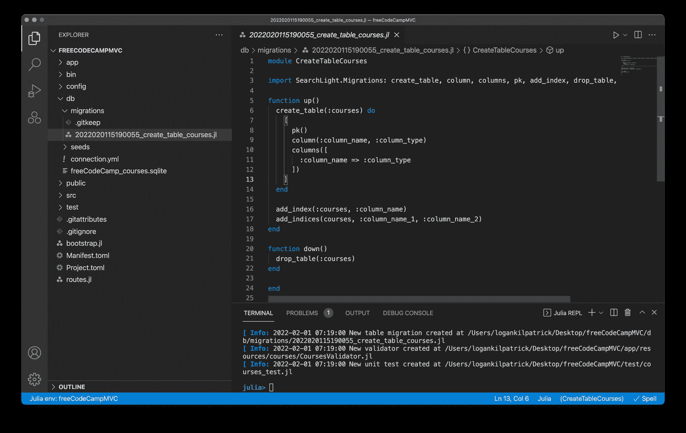
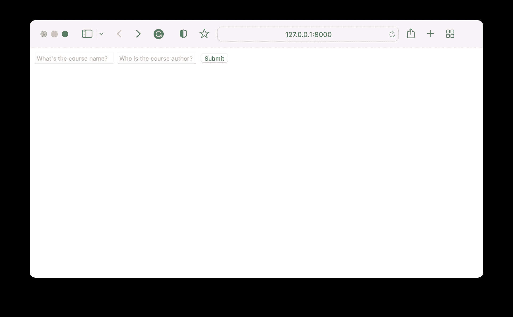

# 如何使用 Genie.jl 🧞‍♂️在 Julia 中构建您的第一个 Web 应用程序

> 原文：<https://www.freecodecamp.org/news/how-to-build-web-apps-in-julia/>

Julia 是一种高级的、动态的、开源的编程语言。它旨在像 Python 一样易于使用，同时保持 C 或 C++一样的性能。

Julia 的许多早期用例是在科学领域，在这些领域中，过去和现在都需要大量的计算处理。但是随着语言的不断发展，越来越多的用例获得了动力(提示:web 开发)。

如果你对 Julia 完全陌生，并且想在开始创建你的第一个 web 应用程序之前掌握一下语法，[看看 freeCodeCamp 上的这篇文章](https://www.freecodecamp.org/news/learn-julia-programming-language/)。

它讲述了基础知识，如何安装 Julia，安装包的步骤，等等！

本教程将重点介绍在 Julia 中从头构建第一个 web 应用程序的所有必要步骤。因此，让我们从查看 Genie 网站开始:[https://genieframework.com](https://genieframework.com)。

## Genie.jl 是什么？🧐

Genie 是一个用 Julia 编写的现代高效的 web 框架。用项目自己的话说:

> Genie 是一个全栈 web 框架，它为开发现代 web 应用程序提供了一个简化且高效的工作流。它建立在 Julia 的优势之上(高级、高性能、动态、JIT 编译)，为高效的 web 开发提供了丰富的 API 和强大的工具集。

Genie 与 Django 项目非常相似，因为 Genie 不仅仅是一个框架。相反，它是一个完整的生态系统，有扩展之类的东西。

但是我们为什么需要精灵呢？简单的答案是，随着 Julia 越来越受欢迎，越来越多的开发人员希望在他们的整个堆栈中利用 Julia。Genie 提供了在服务器端运行 Julia 代码来部署网站的能力，因此您可以将部署机器学习模型作为 Genie 应用程序的一部分。

在我们开始使用 Genie 之前，你可能想看看一个实时部署的 Genie 应用程序，感受一下什么是可能的:[https://pkgs.genieframework.com](https://pkgs.genieframework.com)。

这个项目是一个社区资源，您可以在其中查询特定时间段内特定包的下载次数。键入“genie”查看每日下载次数。

您可能也有兴趣学习更多关于 Julia 中其他 GUI 和 web 开发框架的知识。要更广泛地了解这个生态系统，[请查看这篇文章]( https://towardsdatascience.com/6-julia-frameworks-to-create-desktop-guis-and-web-apps-9ae1a941f115)。

## 如何安装精灵⤵️

要安装 Genie，我们需要做的就是打开朱莉娅·REPL 并键入`] add Genie`。这会满足你的一切需求。如果一切正常，您应该能够:

```
julia> using Genie 
```

没有任何问题。现在，您可以开始试用 Genie 了。

## 如何将 URL 映射到 Julia 函数🗺

Genie 框架的核心部分是路由器的概念。路由器接受用户访问特定 URL 的操作，并将其与被调用的 Julia 函数相关联。

让我们看一个简单的例子。在 REPL 中，键入以下内容:

```
julia> using Genie, Genie.Router

julia> route("/hello") do
           "Hello freeCodeCamp"
       end
[GET] /hello => #5 | :get_hello
```

在这个例子中，我们定义了“/Hello”URL 来返回文本“Hello freeCodeCamp”。我们可以通过启动服务器来验证这一点:

```
julia> up() # start server
┌ Info: 
└ Web Server starting at http://127.0.0.1:8000 
Genie.AppServer.ServersCollection(Task (runnable) @0x000000011c5c5bb0, nothing)
```

现在服务器已经启动并运行，我们可以在浏览器中访问 [`http://127.0.0.1:8000`](http://127.0.0.1:8000) 。您会注意到我们得到了一个 404 页面，这是意料之中的，因为我们定义的唯一路由是“/hello”。因此，让我们将它添加到 URL 中，看看我们会得到什么:



我们走吧！我们构建一个全功能 web 应用程序的第一步已经完成。我们还可以通过检查显示以下内容的 REPL 来确认页面是否正确加载:

```
julia> ┌ Error: GET / 404
└ @ Genie.Router ~/.julia/packages/Genie/UxbVJ/src/Router.jl:163
┌ Error: GET /favicon.ico 404
└ @ Genie.Router ~/.julia/packages/Genie/UxbVJ/src/Router.jl:163
[ Info: GET /hello 200
```

我们看到第一次尝试的结果是 404，第二次尝试成功地获得了响应(200 消息表示一切正常)。

现在我们有了一个基本的工作示例，让我们试着在此基础上更深入地构建。

为此，我们将创建一个新文件。我将使用 VS 代码，但是欢迎你使用任何你认为有用的 IDE。在我们查看下一段代码之前，我们需要确保通过在 REPL 中键入`down()`关闭了服务器。

好了，接下来的例子:

```
using Genie, Genie.Router
using Genie.Renderer, Genie.Renderer.Html, Genie.Renderer.Json

route("/") do
    html("Hey freeCodeCamp")
end

route("/hello.html") do
  html("Hello freeCodeCamp (in html)")
end

route("/hello.json") do
  json("Hi freeCodeCamp (in json)")
end

route("/hello.txt") do
   respond("Hiya freeCodeCamp (in txt format)", :text)
end

# Launch the server on a specific port, 8002
# Run the task asynchronously
up(8002, async = true)
```

这个例子中发生了很多事情，所以让我们来看一下发生了什么。

我们从装入我们想要的包开始。然后，我们定义 4 条不同的路线。第一条是索引路线。所以当用户访问 [`http://127.0.0.1:8002`](http://127.0.0.1:8002) 时，他们会看到“嘿 freeCodeCamp”。索引后的路线突出显示每条路线可以给出一个自定义输出。在某些情况下，它可以是 HTML，在其他情况下，它可以是 JSON 或纯文本。

这个例子的最后一行展示了服务器启动代码。如注释所述，我们可以设置特定的端口号，并选择是否希望路由异步运行。我们现在已经成功地创建了我们的第一个[精灵脚本](https://genieframework.com/docs/tutorials/Getting-Started.html#developingasimplegeniescript)！

## 如何创建一个基本的 Web 服务🕸

既然我们已经掌握了基础知识，现在我们将开始构建一个成熟的 web 应用程序。

在我们开始之前，我们将迈出第一步，创建一个基本的 web 服务。为此，我们将进入 REPL，将当前目录切换到一个易于访问的目录。在本教程中，我将使用我的桌面:

```
shell> cd Desktop
/Users/logankilpatrick/Desktop
```

要进入上面显示的 shell 模式，只需键入“；”进入 REPL。在我的例子中，现在我们已经将活动目录设置为桌面，我们将使用方便的生成器函数来创建服务:

```
julia> Genie.newapp_webservice("freeCodeCampApp")

[ Info: Done! New app created at /Users/logankilpatrick/Desktop/freeCodeCampApp
[ Info: Changing active directory to /Users/logankilpatrick/Desktop/freeCodeCampApp
    /var/folders/tc/519vfm453fj_x5bmd8pwx9480000gn/T/jl_bO1R8h/FreeCodeCampApp/Project.toml
[ Info: Project.toml has been generated
[ Info: Installing app dependencies
...
```

`newapp_webservice`是一个非常有用的函数，它自动创建我们第一个 web 服务所需的所有片段。现在我们已经创建了一个项目，我们需要在 IDE 中打开它(在我的例子中，是 VS 代码)。如果打开正确的文件夹，您应该会看到以下内容:



有很多文件是自动为我们创建的。我们要看的主要一个是`routes.jl`，它用于创建路线，就像我们在上一节所做的那样。

我们调用的生成这些文件夹的函数会自动启动服务器，所以让我们通过访问 [http://127.0.0.1:8000](http://127.0.0.1:8000) 来快速浏览一下现有的登录页面:



正如你可能注意到的，我的页面看起来与你的略有不同，因为我进入并编辑了公共文件夹中的`welcome.html`页面。

正如您在`routes.jl`中看到的，当用户访问主 URL `/`时，我们会将他们路由到欢迎页面。我们可以添加额外的路由，就像我们在上一节所做的那样，并扩展它。欢迎你在这里停下来玩。我们已经有一个相当强大的网站设置。

如果你看一下其他一些文件夹，比如`config/env`，你会看到关于设置端口、主机 URL 和其他相关参数的细节。同样，你可以随意在那里玩，但我们不会在本教程中深入这些文件的所有细节。

在我们进入下一个主题之前，让我们再看几个为我们的基本 web 服务生成的文件:

*   公共文件夹包含所有的前端文件(HTML 和 CSS)
*   `src`文件夹有 web 服务的入口点(在我的例子中是`freeCodeCampApp.jl`)
*   bin 包含一些额外的依赖项，我们将再次忽略
*   Manifest.toml 和 Project.toml 是关键的 Julia 文件，允许我们维护我们的 Julia 依赖关系。当您创建 web 服务时，脚本自动激活您当前的项目环境(这是我们刚刚创建的应用程序)。您可以通过在 REPL 中键入“]”来验证这一点，它将以蓝色显示活动空间:



这仅仅意味着，如果我们试图添加一个包，它将把它添加到项目和这个项目的清单文件中，而不是全局共享的。

## 如何用数据库创建一个全功能的 Web 应用程序💽

既然我们已经探索了基础知识，我们将进入一个完整的 web 应用程序。同样，Genie 提供了一些很好的函数来帮助我们开始。在创建它之前，我们需要导航回桌面:

```
shell> pwd
/Users/logankilpatrick/Desktop/freeCodeCampApp

shell> cd ..
/Users/logankilpatrick/Desktop

shell> 
```

请记住，您可以键入`;`进入 shell 模式，并按 backspace 退出 shell 模式。现在，让我们创建应用程序:

```
julia> Genie.newapp_mvc(Genie.newapp_mvc("freeCodeCampMVC"))
   Resolving package versions...
   ...
```

系统将提示您选择一个数据库后端。对于本例，我们将使用 SQLite:



如果您想使用不同的数据库后端，也可以这样做。但是请注意，您需要自动创建数据库文件。Genie 只为你创建一个 SQLite 文件。

我们现在已经创建了一个 MVC 应用程序。但是你可能会问自己，什么是 MVC？

模型-视图-控制器范式在应用程序开发中非常普遍。为了不陷入其中，我将[向你推荐这篇文章](https://www.freecodecamp.org/news/mvc-architecture-what-is-a-model-view-controller-framework/)，在那里你可以读到细节。从我们作为开发者的角度来看，影响不大。

就像我们创建上一个项目时所做的一样，我们需要在 IDE 中再次打开它:



同样，我们将会看到很多和以前一样的东西，新增加的`app`文件夹将会包含很多关键代码。通过键入以下命令，我们可以看到新项目的样子:

```
julia> loadapp()

julia> up()
```

然后导航也: [http://127.0.0.1:8000](http://127.0.0.1:8000) 。

接下来，我们需要将数据库连接到我们创建的 web 应用程序。为此，转至`db/connection.yml`并编辑以下部分:

```
env: ENV["GENIE_ENV"]

dev:
  adapter: SQLite
  database: db/freeCodeCamp_courses.sqlite
```

您可以暂时将其余字段留空。然后，我们需要运行:

```
julia> include(joinpath("config", "initializers", "searchlight.jl"))
```

这将加载数据库配置。接下来，我们将继续配置数据库，以便我们可以将应用程序中的数据保存到永久存储中。

我们从创建一个新资源开始这个过程:

```
julia> Genie.newresource("course")
```

一旦我们定义了资源，下一步就是去编辑数据库迁移表，在我的例子中，这个表可以在`db/migrations/2022020115190055_create_table_courses.jl`找到。

默认情况下，该表已经根据我们运行的最后几个命令填充了一些占位符文本。它应该是这样的:



我们将编辑文件以匹配我们想要的特定方案。这将完全取决于应用程序本身。由于我正在本网站上制作课程，我将输入所有课程的详细信息如下:

```
module CreateTableCourses

import SearchLight.Migrations: create_table, column, columns, pk, add_index, drop_table, add_indices

function up()
  create_table(:courses) do
    [
      pk()
      column(:title, :string, limit = 200)
      column(:authors, :string, limit = 250)
      column(:year, :integer, limit = 4)
      column(:rating, :string, limit = 10)
      column(:categories, :string, limit = 100)
      column(:description, :string, limit = 1_000)
      column(:cost, :float, limit = 1000)
    ]
  end

  add_index(:courses, :title)
  add_index(:courses, :authors)
  add_index(:courses, :categories)
  add_index(:courses, :description)

end

function down()
  drop_table(:courses)
end

end
```

同样，这些是任意的，可以是你想要的任何东西。

值得注意的是，添加索引是可选的。之所以要添加它，是因为它可以加快查询速度，但是还有其他的权衡，而且您实际上不能将所有的列都作为索引来加载。你可以在这里和这里阅读更多关于这些权衡的内容。

现在我们已经更新了数据库表，我们需要传播这些更新。为此，我们将使用`SearchLight.jl`作为我们应用的迁移系统:

```
julia> using SearchLight

julia> SearchLight.Migration.create_migrations_table()
┌ Info: 2022-02-01 07:37:11 CREATE TABLE `schema_migrations` (
│       `version` varchar(30) NOT NULL DEFAULT '',
│       PRIMARY KEY (`version`)
└     )
[ Info: 2022-02-01 07:37:11 Created table schema_migrations

julia> SearchLight.Migration.status()
[ Info: 2022-02-01 07:37:20 SELECT version FROM schema_migrations ORDER BY version DESC
|   | Module name & status                     |
|   | File name                                |
|---|------------------------------------------|
|   |                 CreateTableCourses: DOWN |
| 1 | 2022020115190055_create_table_courses.jl |

julia> SearchLight.Migration.last_up()
[ Info: 2022-02-01 07:37:29 SELECT version FROM schema_migrations ORDER BY version DESC
[ Info: 2022-02-01 07:37:29 CREATE TABLE courses (id INTEGER PRIMARY KEY , title TEXT  , authors TEXT  , year INTEGER (4) , rating TEXT  , categories TEXT  , description TEXT  , cost FLOAT (1000) )
[ Info: 2022-02-01 07:37:29 CREATE  INDEX courses__idx_title ON courses (title)
[ Info: 2022-02-01 07:37:29 CREATE  INDEX courses__idx_authors ON courses (authors)
[ Info: 2022-02-01 07:37:29 CREATE  INDEX courses__idx_categories ON courses (categories)
[ Info: 2022-02-01 07:37:29 CREATE  INDEX courses__idx_description ON courses (description)
[ Info: 2022-02-01 07:37:29 INSERT INTO schema_migrations VALUES ('2022020115190055')
[ Info: 2022-02-01 07:37:29 Executed migration CreateTableCourses up
```

我们现在已经成功完成了迁移。如果要对模式进行更改，您需要重新运行上面的命令，以使这些数据库更改生效。

这个过程的最后一步是定义我们的模型。这将允许我们用 Julia 代码创建对象，然后将它们保存到我们刚刚定义的数据库中。我们需要导航到`app/resources/courses/Courses.jl`或等效路径来进行这些最终更新:

```
module Courses

import SearchLight: AbstractModel, DbId
import Base: @kwdef

export Course

@kwdef mutable struct Course <: AbstractModel
  id::DbId = DbId()
  title::String = ""
  authors::String = ""
  year::Int = 0
  rating::String = ""
  categories::String = ""
  description::String = ""
  cost::Float64 = 0.0
end

end
```

同样，这应该与您之前定义的内容相同。为了确保这一点，我们可以:

```
julia> using Courses
[ Info: 2022-02-01 07:43:51 Precompiling Courses [top-level]
```

然后尝试通过以下方式创建课程:

```
 julia> c = Course(title = "Web dev with Genie.jl", authors="Logan Kilpatrick")
Course
| KEY                 | VALUE                 |
|---------------------|-----------------------|
| authors::String     | Logan Kilpatrick      |
| categories::String  |                       |
| cost::Float64       | 0.0                   |
| description::String |                       |
| id::DbId            | NULL                  |
| rating::String      |                       |
| title::String       | Web dev with Genie.jl |
| year::Int64         | 0                     |
```

我们已经成功创建了我们的第一个对象！但是它不会立即保存到数据库中。我们可以通过以下方式验证这一点:

```
julia> ispersisted(c)
false
```

所以我们需要运行:

```
julia> save(c)
[ Info: 2022-02-01 07:47:04 INSERT  INTO courses ("title", "authors", "year", "rating", "categories", "description", "cost") VALUES ('Web dev with Genie.jl', 'Logan Kilpatrick', 0, '', '', '', 0.0) 
[ Info: 2022-02-01 07:47:04 ; SELECT CASE WHEN last_insert_rowid() = 0 THEN -1 ELSE last_insert_rowid() END AS LAST_INSERT_ID
true 
```

现在课程有救了！但要真正测试这一点，我们需要用户能够创建一个课程。让我们回到`routes.jl`并启用它:

```
using Genie, Genie.Router, Genie.Renderer.Html, Genie.Requests
using Courses

form = """
<form action="/" method="POST" enctype="multipart/form-data">
  <input type="text" name="name" value="" placeholder="What's the course name?" />
  <input type="text" name="author" value="" placeholder="Who is the course author?" />

  <input type="submit" value="Submit" />
</form>
"""

route("/") do
  html(form)
end

route("/", method = POST) do
  c = Course(title=postpayload(:name, "Placeholder"), authors=postpayload(:author, "Placeholder"))
  save(c)
  "Course titled $(c.title) created successfully!"
end
```

我们从定义一个简单的 HTML 表单开始(这里没有什么新的或令人兴奋的)，然后，我们让默认的 route `/`呈现 HTML 表单。最后，我们为`/` URL 创建另一个路由，但是专门针对 POST 方法。在这条路线中，我们通过`postpayload`从有效载荷的表单中提取我们想要的信息，从而创建一条新的路线。

您可以通过导航回: [http://127.0.0.1:8000](http://127.0.0.1:8000) 来尝试



您可以尝试输入一些详细信息，然后按提交。要确保提交有效，您可以:

```
julia> all(Course)
[ Info: 2022-02-01 08:10:19 SELECT "courses"."id" AS "courses_id", "courses"."title" AS "courses_title", "courses"."authors" AS "courses_authors", "courses"."year" AS "courses_year", "courses"."rating" AS "courses_rating", "courses"."categories" AS "courses_categories", "courses"."description" AS "courses_description", "courses"."cost" AS "courses_cost" FROM "courses" ORDER BY courses.id ASC
┌ Warning: 2022-02-01 08:10:19 Unsupported SQLite declared type INTEGER (4), falling back to Int64 type
└ @ SQLite ~/.julia/packages/SQLite/aDggE/src/SQLite.jl:416
┌ Warning: 2022-02-01 08:10:19 Unsupported SQLite declared type FLOAT (1000), falling back to Float64 type
└ @ SQLite ~/.julia/packages/SQLite/aDggE/src/SQLite.jl:416
3-element Vector{Course}:
 Course
| KEY                 | VALUE                 |
|---------------------|-----------------------|
| authors::String     | Logan Kilpatrick      |
| categories::String  |                       |
| cost::Float64       | 0.0                   |
| description::String |                       |
| id::DbId            | 1                     |
| rating::String      |                       |
| title::String       | Web dev with Genie.jl |
| year::Int64         | 0                     |

 Course
| KEY                 | VALUE       |
|---------------------|-------------|
| authors::String     | Logan K     |
| categories::String  |             |
| cost::Float64       | 0.0         |
| description::String |             |
| id::DbId            | 2           |
| rating::String      |             |
| title::String       | Test course |
| year::Int64         | 0           |
```

这应该显示条目已保存在数据库中。

## 包扎🎁

哇，太多了。我们在这个教程中涉及了大量的内容。

也就是说，关于 Genie 还有更多需要学习。我强烈建议在这里查看的[文档，其中有更多关于 REST API、认证等主题的教程。](https://genieframework.com/docs/tutorials/Overview.html)

## 获得关于 Genie.jl 的帮助🚨

如果你在本教程或使用 Genie 时遇到问题，请用`genie.jl`和`julia`标签或在 [Julia Discourse](https://discourse.julialang.org) 上提出问题。之后，你可以把问题的链接发到推特上，我会尽力帮助你:【https://twitter.com/OfficialLoganK。