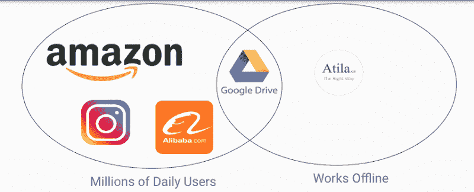
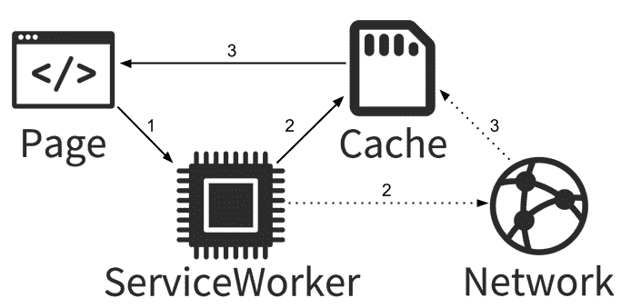
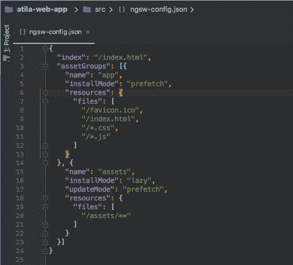
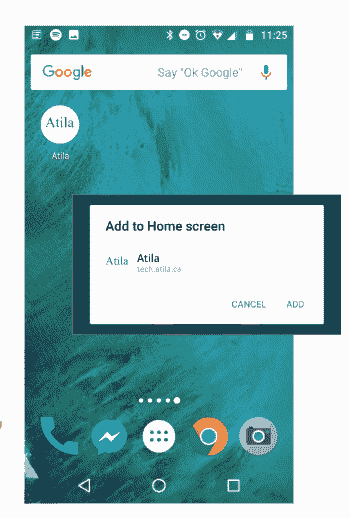
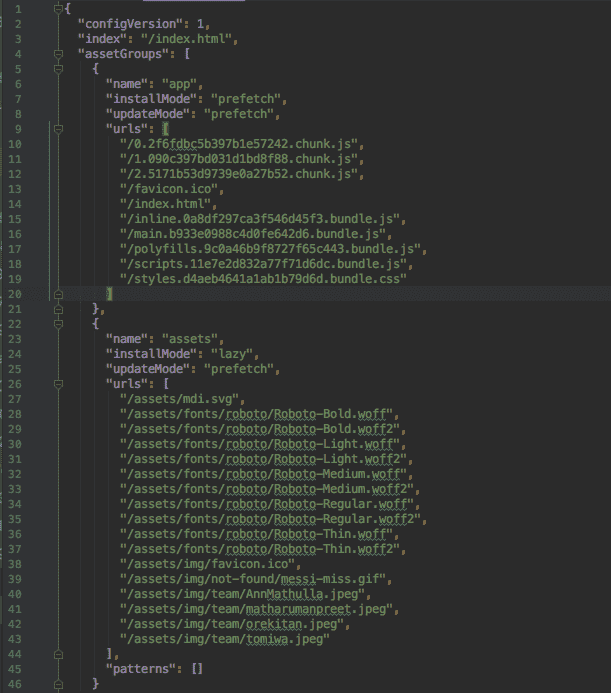
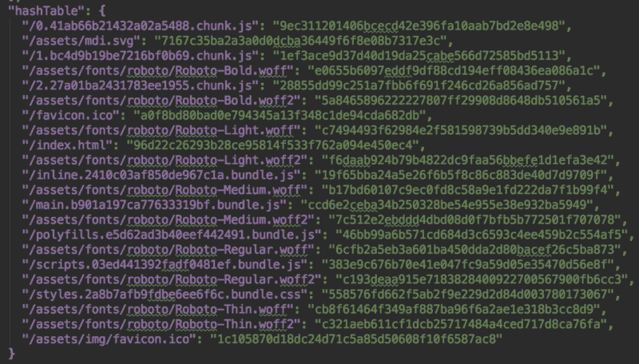
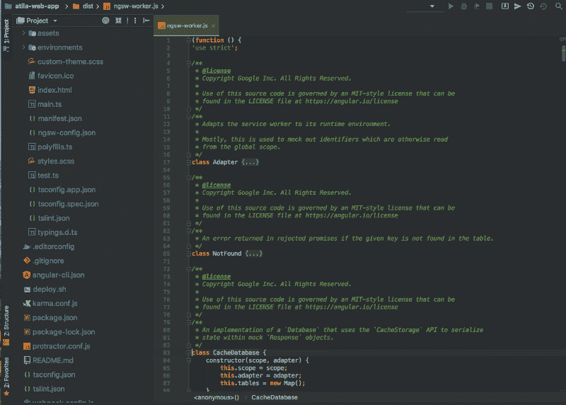
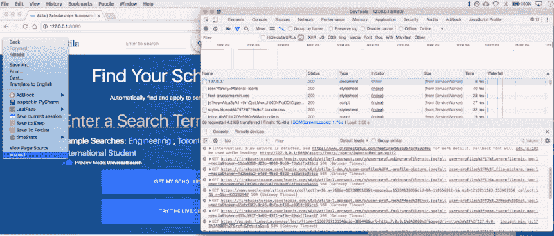
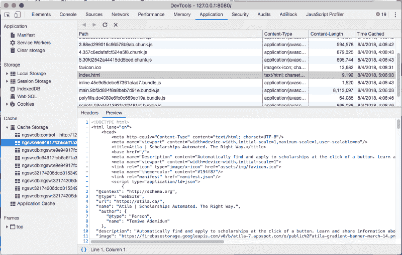
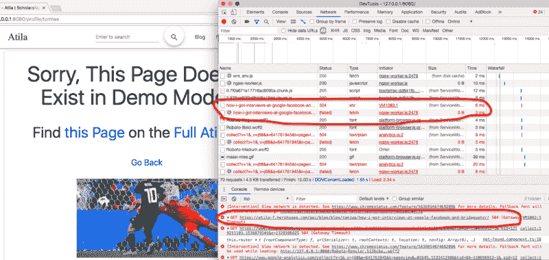

# 如何使用 Angular & service workers 建立没有互联网的网站

> 原文：<https://www.freecodecamp.org/news/how-to-build-websites-that-work-without-internet-using-angular-and-service-workers-lets-keep-in-42e846afa455/>

作者 Tomiwa

# 如何使用 Angular & service workers 建立没有互联网的网站


### 介绍

在这篇文章中，你将学习服务人员如何工作的理论。我提供了一个简短的教程来应用这个理论制作一个没有互联网也能运行的网站。最后，我将讨论这对你和互联网的未来意味着什么。

当谈到服务人员时，我很兴奋。我将对这个解决的问题以及为什么它如此棒进行一个快速的咆哮。然后，我深入研究了服务人员如何工作的理论，以及为什么这很棒。如果你想直接跳到理论或者教程，去以标题**理论**和**应用**开始的章节看代码。

这篇博文也可以通过以下方式获得:

*   [Youtube 视频](http://bit.ly/pwa-tutorial-video)
*   [滑梯](http://bit.ly/pwa-tutorial-slides)
*   [播客](https://anchor.fm/tomiwa1a/episodes/How-to-Build-Websites-that-work-without-Internet-Using-Angular--Service-Workers-and-Firebase-e2ccp2)

### 目录

*   网站很奇怪
*   理论:服务人员如何工作
*   应用:如何建立离线网站的教程
*   先决条件
*   安装维修工人
*   第 1a 部分:构建服务工作者
*   服务人员输出
*   第 1b 部分:测试服务人员(#2001441)
*   创建小型服务器
*   检查服务器请求
*   文件保存在哪里？
*   第 2 部分:保存外部数据(第 1 部分 Git 标签:pwa-tutorial-0.1)
*   保存外部 API 调用:#8593ada
*   第 3 部分:通知用户新的更新(第 2 部分 Git 标签:pwa-tutorial-0.2)
*   第 4 部分:部署(第 3 部分 Git 标签:pwa-tutorial-0.3)
*   结论
*   谁需要移动应用
*   网站的未来
*   进一步阅读

### 网站很奇怪

我最近意识到一些事情，让我真正意识到服务人员可以有多强大。当我有网络时，我感觉有无限多的东西在争夺我的注意力。

但是当我在飞机上，没有互联网连接时，对我注意力的竞争就不那么激烈了。我通常会做的三件事是浏览我的照片、观看下载的电影或阅读电子书。

有了服务人员，如果你能为用户提供离线网络体验，你就能在竞争最不激烈的时候吸引他们的注意力。

让我们从一个简单的图表开始。维恩图中的两个圆圈代表什么？


让我给你一个提示。亚马逊、阿里巴巴和脸书是世界上最大的网站，每天为数百万用户提供服务。以下是一些统计数据，可以让你了解事情的来龙去脉:

*   阿里巴巴单日销售额达到 250 亿美元(光棍节)
*   40%的云计算客户使用亚马逊网络服务，包括 T2、苹果、网飞和中情局
*   每月有 22 亿人使用脸书，Instagram 上有 7 亿人

这一切都很好，但只有一个小问题。没有 wifi，他们的整个网站完全无法使用。即使你只是想做一些简单的事情，比如查看已经放在你购物车里的商品的评论，你也什么都做不了。

现在把它与像谷歌驱动或 T2 这样的网站进行比较。 [Atila.ca](http://atila.ca/) 没有一百万用户，但是即使你没有互联网连接，你仍然可以使用这个网站。Google Drive 是另一个在这方面做得很好的网站。即使没有互联网，你也可以使用 Google Drive。比如你如何使用微软 Word 这样的桌面应用程序。每天学点新东西，对吗？



过去，没有互联网，网站就无法运行，这似乎是不言而喻的。一旦你意识到服务人员的潜力，你就完全改变了你对网站的看法。你开始想象在我们最喜欢的网站上，用户体验的显著改善。

想象一下，如果你在上班的地铁上没有互联网。你甚至没有任何手机服务。但是你仍然可以查看亚马逊购物车中商品的产品评论。或者你正在长途飞行。当你的手机处于飞行模式时，你可以阅读《纽约时报》上最受欢迎的文章。或者列表中您喜欢的文章，您选择保存以备后用。

你可以看到潜力很大，很容易开始做白日梦。让我们回到现实，深入研究这一切是如何可能的理论。

### 理论:服务人员如何工作

服务人员是您的浏览器和互联网之间的代理或信使。当你的网络应用程序需要资源(图片、html 文件、json API 等)时。)服务人员帮你搞定，不需要问网上。从字面上看，它是一个 Javascript 文件，与应用程序的其余部分一起提供。这个文件有代码告诉你的应用程序如何拦截网络请求，并从你的网络缓存获取它。

通常，当网站首次加载时，web 浏览器会向网络发出一系列请求，以获取网站运行所需的资源。通常包括:

*   用于内容显示的 html 文件
*   用于样式的 CSS 文件
*   应用程序逻辑的 Js 文件
*   图像和其他资产

当您的互联网不工作时，浏览器无法联系网络来检索显示网站所需的文件。因此，它失败了，你在谷歌浏览器上得到臭名昭著的“跳跃恐龙”。

和服务人员一起。当你第一次访问一个网站时，除了通常的 index.html、styles.css、main.js 等。文件，浏览器还会从您的网站请求一个服务人员 javascript 文件。然后，该文件被下载并保存到浏览器缓存中。然后，serviceworker 文件下载、版本化和缓存应用程序中的所有文件，以供以后使用。



这有两个非常重要的好处。正如标题中所提到的，这意味着即使你的互联网连接中断了，网站仍然可以工作。它实际上从来不需要向互联网请求任何东西。服务人员有你需要的所有文件。

反过来，这也意味着，即使你有互联网，应用程序也将运行得更快。在将来的网站加载中，而不是在网络上进行一次完整的往返以获取应用程序文件。它只是从浏览器缓存中检索文件并提供给用户。

### 应用:如何建立离线网站

#### 先决条件

开始之前，请确保您安装了以下软件

*   [Node.js 和 npm](https://nodejs.org/en/download/)
*   确保您有节点 8。x 或更高版本(node -v)和 npm 5.x 或更高版本(npm -v)
*   全局安装[角度指示器](https://github.com/angular/angular-cli):
*   `npm install -g @angular/cli`
*   谷歌 Chrome 浏览器(可选，但推荐)
*   Google 帐户(可选，仅当您想要部署到 Firebase 时)

#### 启动项目

*   前往[https://github.com/atilatech/atila-web-app](https://github.com/atilatech/atila-web-app)
*   从 Github 克隆[demo . atila . ca](https://demo.atila.ca/)web app:[atila-web-app](https://github.com/atilatech/atila-web-app)
*   查看 pwa-tutorial 分支:`git checkout pwa-tutorial`
*   查看教程开始提交:`git checkout pwa-tutorial-0.0`
*   安装 npm 模块:`npm install`
*   启动应用程序！:`ng serve -o`

如果你得到一个`No NgModule`错误，转到任意。ts 文件并放一个空格。这是一个非常奇怪的错误，但是你可以阅读这个 [Github 问题](https://github.com/angular/angular-cli/issues/9292#issuecomment-360178485)来获得更多信息。

#### 安装维修工人

为了安装服务人员并访问我们应用程序中的各种服务人员对象，我们需要执行以下操作。

1.  安装@angular/serviceworker 模块:NPM install @ angular/service worker
2.  这将安装一个 npm 包，其中包含我们将在后续步骤中使用的各种服务工作者 Javascript 对象
3.  告诉 angular-cli 使用 service worker 构建项目:ng set apps.0.serviceWorker=true
4.  告诉 angular CLI 自动生成一个 Javascript 文件，其中包含在下一步中解释的构建项目时为服务人员提供的代码。
5.  在 ngsw-config.json 中配置您的服务人员
6.  这将告诉您的服务人员，应该保存哪些文件以及应该如何保存它们
7.  assetGroups:作为应用程序的一部分包含的文件
8.  当应用程序更新时，这些资源也会更新
9.  数据组:未使用应用程序进行版本控制的外部资源
10.  安装模式:第一次看到这个文件时使用什么缓存策略
11.  UpdateMode:在我们已经安装了文件之后，更新文件时使用什么缓存策略
12.  缓存策略
13.  预取:在我们要求之前保存这些文件
14.  懒惰:仅在这些文件被请求至少一次后才保存它们
15.  添加一个 manifest.json 文件，并在 index.html 中引用它

#### 服务人员配置



*   这将告诉您的服务人员应该保存哪些文件以及应该如何保存这些文件:
*   assetGroups:包含在应用程序中的文件
*   当应用程序更新时，这些资源也会更新
*   数据组:未使用应用程序进行版本控制的外部资源
*   安装模式:第一次看到这个文件时使用什么缓存策略
*   UpdateMode:在我们已经安装了文件之后，更新文件时使用什么缓存策略
*   缓存策略
*   预取:在我们要求之前保存这些文件
*   懒惰:仅在这些文件被请求至少一次后才保存它们
*   您可以查看关于服务器工人配置的[官方角度文档了解更多详细信息](https://angular.io/guide/service-worker-config)

#### Manifest.json

```
{"name": "Atila","short_name": "Atila","start_url": "index.html","display": "standalone","icons": [{"src": "assets/img/favicon-bg.png","sizes": "512x512","type": "image/png"}],"background_color": "#194f87","theme_color": "#194f87"}
```

这就是把你的应用从一个网络应用变成一个进步的网络应用的原因。它允许你的网络应用程序类似于本地手机。它允许用户将您的应用程序安装到他们的主屏幕上。



#### 登记服务人员( [#d2b186f](https://github.com/atilatech/atila-web-app/commit/d2b186f1ecc3a0862fcb3bd863643f1d28eac970) )

现在我们需要告诉我们的应用程序一个服务人员的存在。所以我们在 app 模块中注册了服务工作者模块。

```
// src/app.module.ts
```

```
import {ServiceWorkerModule} from '@angular/service-worker';
```

```
…
```

```
Imports: [
```

```
…,
```

```
ServiceWorkerModule.register('/ngsw-worker.js', {enabled: environment.production}),]
```

然后，如果我们的[浏览器支持服务人员](https://jakearchibald.github.io/isserviceworkerready/)并且我们处于生产模式，我们就注册服务人员文件。

```
// src/main.ts
```

```
if ('serviceWorker'  in  navigator  && environment.production) {
```

```
console.log("Service Worker in main.ts");
```

```
window.addEventListener('load', () =>; {
```

```
console.log("on page Load Service Worker in main.ts");
```

```
navigator.serviceWorker.register('/ngsw-worker.js', {
```

```
scope: '/',
```

```
})
```

```
.then(registration  =>; {
```

```
console.log("Service Worker registration completed main.ts", registration);
```

```
});
```

```
});
```

### 第 1a 部分:构建服务工作者

#### 服务人员输出

接下来，我们将构建项目:`ng build --prod`

让我们看看 dist/文件夹，看看用 service worker 构建一个应用程序是什么样子的。


#### 服务工作器输出:ngsw.json

回想一下，在上一步中，我们创建了一个名为 ngsw-config.json 的文件。该文件指定了我们希望我们的服务人员缓存什么类型的文件以及我们希望如何缓存它。当项目构建完成后，ngsw-config.json 中的规则被扩展，以包含我们将要缓存的文件。ngsw.json 文件还包括一个散列表，用于索引和检索缓存的文件。哈希表还允许我们对文件进行版本控制。我们可以跟踪我们的文件正在运行的版本，以及我们是否应该得到一个新的版本。



#### 服务工作者输出:ngsw-worker.js

这个文件实际上是服务人员。我们之前在 main.ts 文件中注册了它。这是一个普通的 javascript 文件。它包含服务人员如何向数据库注册和缓存数据的代码和逻辑。如果你准备接受挑战，试着浏览代码，看看你是否能理解发生了什么。



### 第 1b 部分:测试服务人员( [#2001441](https://github.com/atilatech/atila-web-app/commit/2001441a948f8fc0768c43634020cd927763f812) )

#### 创建小型服务器

*   服务工作者在离线环境中使用。我们需要一台可以模拟离线环境的服务器
*   安装 [npm http 服务器](https://www.npmjs.com/package/http-server)
*   `Npm install http-server@0.11.1 --save-dev`
*   构建并运行服务器:
*   `ng build --prod` (optional)
*   `http-server -p 8080 -c-1 dist`

#### 检查服务器请求

*   访问开发工具中的 Chrome 网络标签
*   在转到本地主机之前完成此操作！
*   打开一个新标签
*   右键单击屏幕上的空白区域
*   检查>转到网络选项卡
*   打开 [http://localhost:8080/](http://localhost:8080/)



注意右上方没有 wi-fi。检查 devtools 控制台:外部网络资源失败，返回 504，但我们的文件是成功的(200)。

#### 文件保存在哪里？

在 Devtools 中打开 application 选项卡，您会看到 local cache 部分。这是服务人员保存文件的“数据库”。有两张桌子。其中包含我们的应用程序需要的实际资源。另一个散列表，带有指向每个文件名的散列键，正如我们在 ngsw.json 文件中看到的。就是这样！你现在有了一个简单但实用的离线第一个 web 应用程序。继续阅读第 2 部分，添加更酷的特性。



### 第 2 部分:保存外部数据(第 1 部分 Git 标签: [pwa-tutorial-0.1](https://github.com/atilatech/atila-web-app/releases/tag/pwa-tutorial-0.1) )

#### 为什么我的 API 都不工作？

当您尝试导航点击一个链接，你会注意到一个服务器错误。您的服务人员在您的数据库中没有这些 API，但是我们可以添加。突击测验！如果我们想告诉我们的服务人员缓存一个新类型的文件，那么我们应该将代码放在哪里呢？

1.  Manifest.json
2.  Ngsw-config.json
3.  应用程序模块



您可以在开发工具的网络选项卡中看到网络请求失败。

#### 保存外部 API 调用:配置( [Github Diff](https://github.com/atilatech/atila-web-app/commit/fe3f6aa30a01766d8d487711afd9aded4a0a3f13#diff-4553821adec55b6f464162aab4323c7a) )

现在我们将配置 ngsw-config.json 来缓存外部 API URLs。两个缓存选项:

1.  新鲜度:先去网络，如果不见了，就去
2.  性能:先访问高速缓存，然后访问网络

#### 保存外部 API 调用: [#8593ada](https://github.com/atilatech/atila-web-app/commit/8f93ada504dd5b0dc210a64a73caee5ffd14927d)

您可能需要使用一个单独的 URL 来允许您的应用程序通过 CORS 访问它。我们将使用一个特殊的 JSON 服务来模拟(“mock”)我们的博客 API。我们没有使用官方 Atila API 的许可

*   更改 scholarshipservice . getpaginatedscholarships:
*   转到`src/app/_service/scholarship.service.ts#L47`
*   将:`this.http.post(${this.scholarshipsPreviewUrl}?page=${page}/, form_data)`改为:this.http.get( `https://api.myjson.com/bins/dx1dc`)
*   更改 BlogPostService.getBySlug:
*   请访问 src/app/_ service/blog-post . service . ts # L25
*   将 this.http.get( `${this.blogUrl}blog/${username}/${slug}/`)更改为:this.http.get( `https://api.myjson.com/bins/v5ow0`)

### 第 3 部分:通知用户新的更新(第 2 部分 Git 标签: [pwa-tutorial-0.2](https://github.com/atilatech/atila-web-app/releases/tag/pwa-tutorial-0.2) ))

当网络上有新版本时，服务人员仍然在缓存中提供旧版本以节省时间

*   将您的个人资料添加到团队页面:src/app/team/team.component.ts
*   在团队数据数组中添加您的图像和一些信息
*   如果您重新构建项目并重新启动服务器，您会注意到您的概要文件还没有出现。
*   我们可以添加一个 snackbar 来通知用户新的更新
*   npm 安装@angular/material@5.1.1 —保存(您可能已经有了)
*   然后，我们创建 swUpdate 来监听来自 SW 的更新，并在有新版本可用时进行更新。 [Github 差异](https://github.com/atilatech/atila-web-app/commit/1c89769)

```
// src/app/app.component.ts    import {SwUpdate} from  "@angular/service-worker";...    Constructor (..., public swUpdate SWUpdate,)...ngOnInit() {
```

```
if (true) {
```

```
// check service worker to see if new version of app is available
```

```
if (this.swUpdate.isEnabled) {
```

```
this.swUpdate.available.subscribe(() =>; {
```

```
const snackBarRef = this.snackBar.open('New version available', 'Load New Version');snackBarRef.onAction().subscribe(
```

```
() =>; {
```

```
location.reload();});			});		}	}}
```

重新构建并保留您的应用程序

### 第 4 部分:部署(第 3 部分 Git 标签: [pwa-tutorial-0.3](https://github.com/atilatech/atila-web-app/releases/tag/pwa-tutorial-0.3) )

#### 部署到 Firebase 主机

要看到服务工作者的效果，我们应该将它部署到一个真实的网站上。我喜欢 Firebase 托管。只需几个简单的步骤，您就可以在不到 5 分钟的时间内将 web 应用程序从您的本地主机下载到一个实时网站。我已经这样做了将近 2 年，我仍然对这个过程的简单性印象深刻。最近，我也一直在玩 AWS S3 静态网站托管。这是你可以考虑的另一个不错的选择:

#### 部署先决条件:

1.  [创建一个谷歌账户](https://accounts.google.com/SignUp?hl=en)
2.  [创建一个 firebase 帐户](https://firebase.google.com/)和一个 firebase 项目
3.  全球安装 firebase 工具:`npm install -g firebase-tools@4.2.0`
4.  登录 firebase: `firebase login`
5.  初始化 Firebase Repo: `firebase init`
6.  选择以下设置:
7.  选择“托管”作为项目类型
8.  将公用文件夹更改为 dist/
9.  配置为单页应用程序
10.  覆盖 idnex.html？不
11.  部署！`Firebase deploy`
12.  访问命令行输出中的 URL 以查看您的应用程序

就是这样！恭喜你，你现在有了一个没有互联网也能工作的网站。

### 结论

#### 谁需要移动应用

我曾经[写过](https://atila.ca/blog/tomiwa/why-we-chose-angular-over-react-and-django-over-ruby-on-rails-for-atila-the-essential-software-startup-techstack)关于为什么我坚信创业公司和公司应该把他们的技术产品设计成进步的网络应用而不是移动应用。我的核心论点是:

1.  不得不维护 2 个独立的 Android 和 IOS 代码库是一件痛苦的事情:2 组用户，2 组开发人员，2 组问题。(像 [Flutter](https://flutter.io/) 和 [Ionic](https://ionicframework.com/) 这样的东西很酷，但我不相信它们解决了两个独立代码库的根本问题。)
2.  大多数人每天只使用相同的 5 个应用程序，因此说服他们下载另一个应用程序将非常困难。
3.  通过苹果应用商店和谷歌 Play 商店看门人的批准和分发并不好玩。

反对 web 应用程序的一些核心论点包括:

1.  离线访问
2.  由于推送通知，用户参与度更高
3.  访问本机硬件功能，如摄像头

通过像服务人员这样的功能，我刚刚展示了我们如何让网站离线工作。[渐进式网络应用也支持推送通知](https://developers.google.com/web/fundamentals/codelabs/push-notifications/)。

原生硬件功能仍然是移动应用的一个优势，尽管这个[正在改变](https://developers.google.com/web/fundamentals/media/capturing-images/)。除非你的应用程序具有这些原生功能是至关重要的，否则我强烈鼓励初创公司和公司考虑让他们的下一个应用程序成为渐进式网络应用程序。

我认为，互联网的未来将会看到更多的应用通过浏览器和 URL 分发，而不是本地应用和应用商店。具有讽刺意味的是，历史在重演，这实际上是对 90 年代互联网出现的一种倒退，当时像网景公司和各种各样的公司。com 初创公司“在通过网络发布软件方面做得非常好。

#### 网站的未来

如果其他网站也应用同样的理念，那不是很棒吗？想象一下，如果你像我一样，每天花一个多小时通勤上班。忘了 wifi 吧，他们地铁上连蜂窝服务都没有。

现在假设我想买蓝牙耳机，我想看一些亚马逊的评论，然后再做决定。如果我可以缓存购物车中商品的详细信息，并在上班的路上阅读评论，这不是很棒吗？然后到我上班的时候，我就可以买我想要的东西了。

或者想象一下，你正在从多伦多飞往渥太华的飞机上。你打开《纽约时报》来了解早间新闻，但是网站给出了著名的“谷歌恐龙”。在一个理想的世界里，纽约时报应该缓存 5 篇最受欢迎的文章。这允许用户离线阅读文章并发表评论。当评论重新连接到互联网时，可以对其进行同步。

谷歌文档在这方面做得最好。谷歌文档是微软的 Word、Powerpoint 和 Excel，但更好，是为 Chrome 开发的。使用微软 Word 不需要互联网。因为谷歌文档是在网络浏览器中运行的，所以你应该能够使用谷歌文档来访问和编辑你最近的条目。这正是谷歌文档做得好的地方。

我为伟大的亚马逊和纽约时报网站需要互联网来运行而感到自豪。我很谦虚，小 Atila.ca 在有网络和没有网络的情况下都运行良好。；)当互联网关闭时，你仍然可以看到特色奖学金、博客帖子和其他内容。

好吧，这些大多是#第一世界的问题。但是另一件让我对这项技术感到兴奋的事情是为下一个十亿用户建立互联网。对于互联网连接速度非常慢或不稳定的人。

比如 [HospitalRun](http://hospitalrun.io/) 就是一个离线第一应用。它管理发展中国家的医院。在这些地方，断断续续的连接是生活中的现实。它允许记录被带到偏远的诊所，那里可能没有互联网。然后，当有记录时，它会同步这些记录。(h/t【jonbellah.com 

在 Atila，我们的一个项目是增加发展中国家学生获得奖学金的机会。因此，如果他们能够无缝地阅读论文样本并处理他们的奖学金申请，即使他们住在网络连接很差的地方，那也是非常棒的。

我个人认为服务人员和离线优先的 web 应用程序的想法非常吸引人。能够从根本上改变数十亿人日常习惯的简单技术是我选择学习软件工程的原因，也是我热爱这个领域的原因。我真的很兴奋，不仅能看到互联网的未来将如何展现，还能帮助构建互联网的未来以及我们将如何与之互动。未来已经在这里了，伙计们。感谢阅读。

### 进一步阅读

*   [棱角分明的官方服务人员文档](https://angular.io/guide/service-worker-intro)
*   [棱角大学:棱角服务工作者](https://blog.angular-university.io/angular-service-worker/)
*   [向现有的 Angular 应用程序添加服务人员](https://medium.com/@cdeniz/transforming-an-existing-angular-application-into-a-progressive-web-app-d48869ba391f)
*   [Angular Firebase —将 Angular App 部署到 Firebase](https://angularfirebase.com/lessons/deploying-an-angular-app-to-firebase/)