# 如何建立你的数据科学肌肉记忆:为机器学习切片和映射数据…

> 原文：<https://www.freecodecamp.org/news/how-to-build-your-data-science-muscle-memory-slicing-and-mapping-data-for-machine-learning-d38e65986c69/>

作者:刘臻

# 如何构建您的数据科学肌肉记忆:为机器学习切片和映射数据


当使用 Python 中的 Pandas 库处理数据时，当谈到 loc 和 iloc，或 map，apply 和 applymap 时，您是否总是感到困惑？想要在创建您的机器学习模型之前快速选择您需要的子集并创建一些新功能吗？每天早上用这个教程练习 10 分钟，重复一周。

这就像每天做一些小仰卧起坐——不是为了锻炼你的腹肌，而是为了锻炼你的数据科学肌肉。渐渐地，你会注意到变化。

继我之前关于数据预处理的[“数据科学测验”](https://medium.freecodecamp.org/how-to-build-up-your-muscle-memory-for-data-science-with-python-5960df1c930e)之后，在本教程中，我们将重点关注 1)子集化数据和 2)创建新功能。

```
content:1) slicing and dicing data to create your feature matrix (loc, iloc and etc)
```

```
2)assign, map and transform data to the ideal scale or label for modeling(map, apply, applymap and more)
```

首先，为我们的练习加载库和 Zillow 数据:

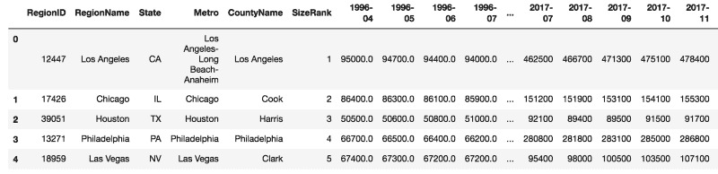

### 1.切片和切块数据

#### 1.1 切片列

**什么是 loc 和 iloc？**

在 pandas 中，loc 和 iloc 是通过标签或布尔数组选择行和列的两种方式。

`.loc[]`:使用行的**索引**(可以是整数也可以是字符串。取决于索引是什么(例如索引可以是名字，也可以是数字)，以及用于索引的列名(不能用整数来索引列的位置)。

`.iloc[]`:只能用整数做**位置-** 基索引。

示例:使用`.loc[]`按名称选择列:

上面的两个表达式给你的结果和下面的一样。

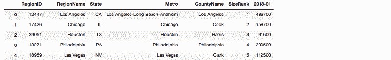

如果我想选择前 5 列怎么办？

现在我们使用`.iloc[]`:它根据位置分割列或行。

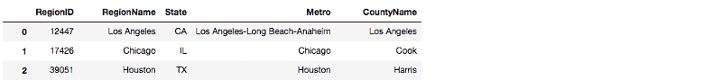

已经和 loc()混淆了？别担心，我会给你看更多的例子！但是要记住，`.loc[] -> index ba` sed `vs .iloc[] -> position`基础。

#### 1.2 切片行

使用 index by `.loc[]`选择行(数据帧中的当前索引是自动分配的行号，从 1 开始)。

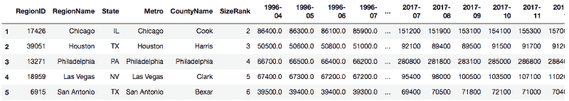

通过`.iloc[]`使用位置选择行:

如果您按顺序选择第 2、第 3 和第 5 行(记住 Python 在 location 工作时从 0 开始计数，所以是[1，2，4])

#### 1.3 选择列和行

通过使用行索引和列名，可以使用 loc 实现使用 iloc 获取 1–5 行和前 6 列(按位置)。请记住，Python 不包括结束索引，所以`.iloc[1:6, …]`只按位置选择第 1–5 行，而`.loc[1:5, …]`:

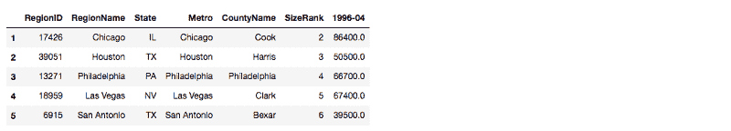

#### iloc 和 loc 有什么区别？

为了更好地展示差异，我们将索引从默认顺序更改为“SizeRank”列，这是区域大小的排名。

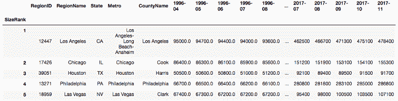

按索引[1，2，4]选择:它给出索引(大小等级)为 1，2，4 的行。

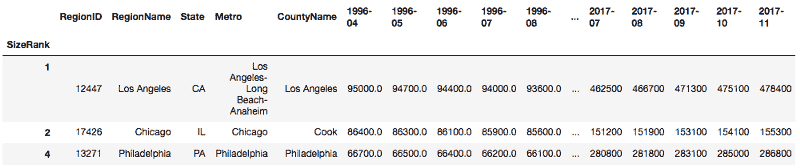

使用位置[1，2，4]选择:

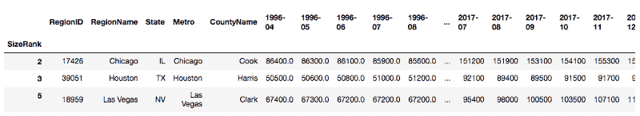

#### 1.4 按位置获取一个特定单元格

#### 1.5 机器学习过程中的示例:对特征矩阵(X)和响应向量(y)的数据进行切片

如果你想看看月租是否可以作为训练数据来识别是哪个状态，那么你的 X 就是月租，Y 就是状态*(只是举一个对特征和响应变量进行数据切片的例子，你可以试试看这个预测是否行得通)。*

`dataframe.values`给你一个数组的形式，可以直接在 sklearn 中使用(像第 16–17 行新增的 X 和 y)。


#### 1.6 基于条件的子集

如果我们想选出 10 个最大的地区:

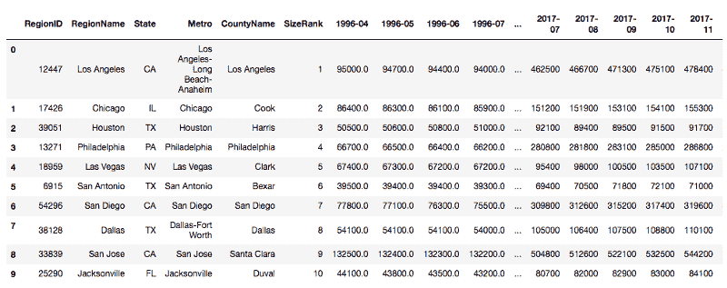

其他变化:

如果我们对整个数据帧应用规则，会发生什么？它不会过滤掉行或列，但会对不符合要求的单元格显示 NA:

如果我们使用列值的变化进行过滤:

#### 什么是 lambda 函数？

任何需要**函数**对象的地方都可以使用**λ函数**。它是匿名的，但是你可以给它分配一个变量，例如:

可以设置 f = lambda x: max(x)- min(x)。这里，当 SizeRank 是偶数时，我们过滤区域。

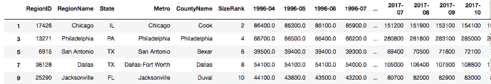

使用 lambda 对多个列应用规则:

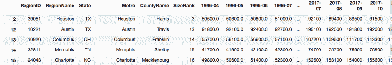

#### 过滤列和行的示例

如果我们运行 raw_df[raw_df.loc[0]>450000]，它会给出一个错误，因为存在像 state 或 city 这样的非数字列。利用我在上一篇文章中学到的知识，我们只选择数字列。

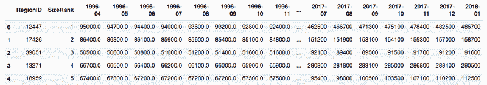

如果我们希望选择大小排名前 5 的数据，并且只保留租金大于 450，000 的月份作为第一行[index==0]

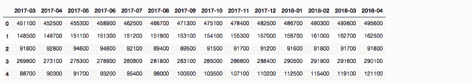

现在我们回到对所有列使用 raw_df，并选择大小排名前 5 的数据，这次只保留字符串列。

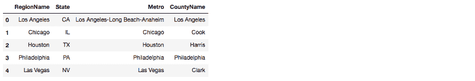

为了使这种类型的过滤工作，[]中的两个元素必须各自产生一系列布尔结果(真、假)。不然不行。

例如:

```
num_df.loc[num_df['SizeRank']<=5, num_df.loc[0:3]>450000.0]
```

会失败，因为 num _ df . loc[**0:3**】>450000.0 没有给**一串**布尔，是**一串**布尔。

格式类似 df.loc[df。A>0，df.loc['index']>0]将起作用，因为它只处理一行和一列，所以它是通过 2 个系列的布尔进行选择的。

#### 注意语法！

它给出了一个错误，因为这种格式将假设它的行，但该命令实际上是选择列。如果条件是关于列，则`.loc[]`需要在左侧有一个`:`。

如果条件是关于行的，可以忽略右边的`:`。

### 2.将数据分配、映射和转换到理想的比例

#### 2.1.分配值

使用。copy()如果您希望复制数据进行某种转换，同时仍然保持原始数据不变。

我们将使用这个复制的数据帧来练习赋值。

*   **给行赋值使用** `.loc[]` **或** `.iloc[]`

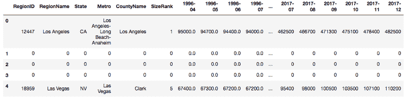

*   **给列赋值**

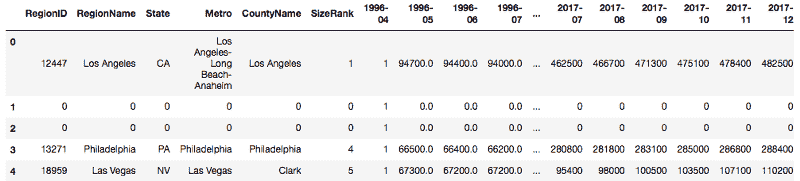

*   **根据条件**赋值创建新列

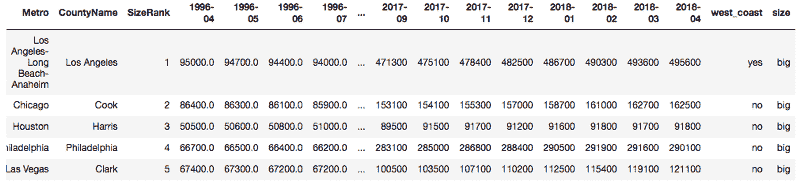

**使用现有列创建新列:映射或应用**

*   映射:如果太多，管理列需要通过创建字典来改变值

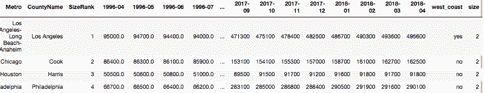

**2.2 Map** :遍历一个序列的每个元素，但只遍历一个序列。我们可以使用 map 来更改一列中的值。

举个例子:当我们这样索引一个列时:raw _ df[' 2018–04 ']，它是一个数列；因此，我们可以使用 map 将 2018–04 年的值的单位更改为“千”，方法是在此系列中乘以 0.001:

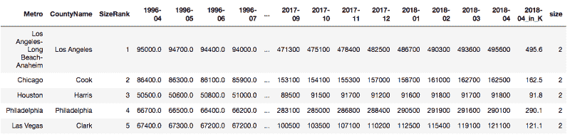

如果我们想将一个以上的列更改为千列，请使用 applymap。

**2.3 ApplyMap** :这有助于将函数应用于数据帧的每个元素。

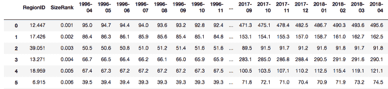

**2.4 申请:**如果我们需要更具体地申请一个或多个栏目，请使用。

顾名思义，它沿着数据帧的任意轴应用函数。

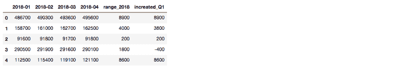

#### **回顾:地图、appymap、apply 有什么区别？**

`map`:对一个序列中的每个元素或一个 df 中的一列的操作

`applymap`:df 中的每个元素(所有列和行中的元素操作相同)

`apply`:从 df 中取出多列的操作

**特殊形式的 apply:**
`df[['col1','col2']].apply(sum)`:返回 column1 和 column2 的所有值之和。

*   在 pandas 中应用特殊形式以获得合计值:

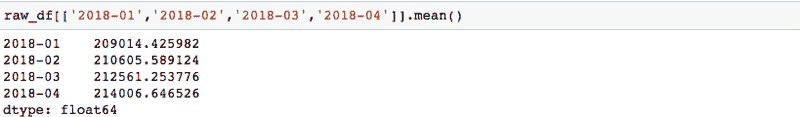

或者使用`agg`获得更多类型的描述性统计数据:

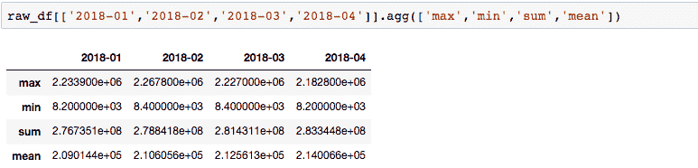

**2.4 使用 apply 重新调整机器学习的数据:**

在 Python 中规范化和标准化数据(可以使用 sklearn 的[标准 scaler](https://scikit-learn.org/stable/modules/generated/sklearn.preprocessing.StandardScaler.html) ，但这是概念)。

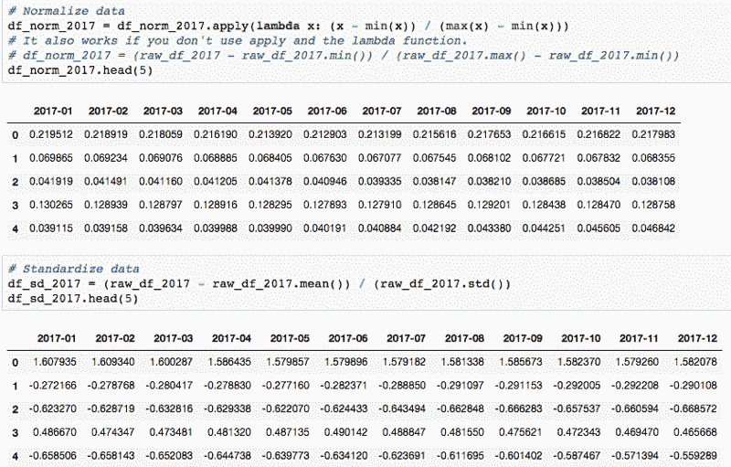

这是我关于用 Python 构建数据科学的肌肉记忆系列的第二部分。第一部分在结尾链接。

敬请期待！我的下一篇教程将向您展示如何“弯曲数据科学肌肉”来连接和旋转数据。

如果你觉得这有帮助，请跟我来，给我几下掌声:)

您可能也会对我对租赁季节性的分析感兴趣:

[**如何分析租金季节性和趋势以节省您的租赁费用**](https://medium.freecodecamp.org/how-to-analyze-seasonality-and-trends-to-save-money-on-your-apartment-lease-714d1d82771a)
[*当我在寻找一套新公寓出租时，我开始怀疑:有季节性的影响吗？还有一个月……*medium.freecodecamp.org](https://medium.freecodecamp.org/how-to-analyze-seasonality-and-trends-to-save-money-on-your-apartment-lease-714d1d82771a)