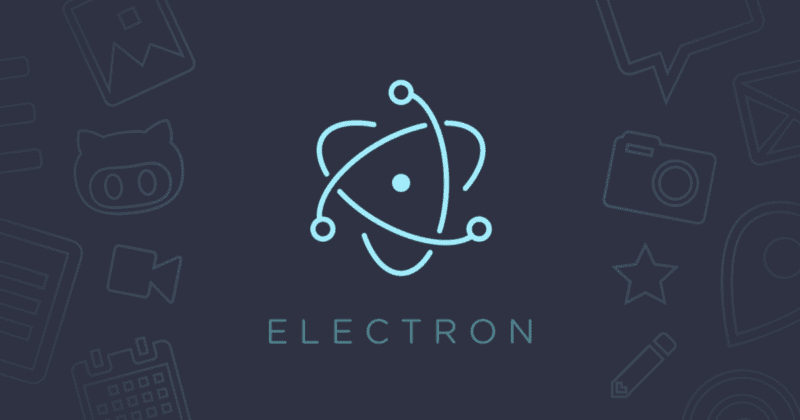
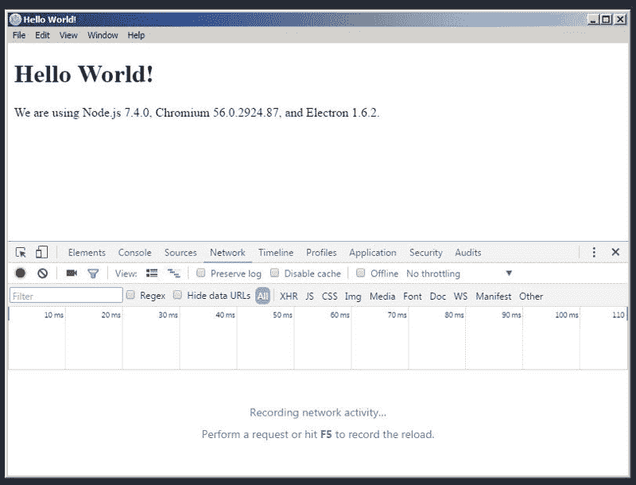
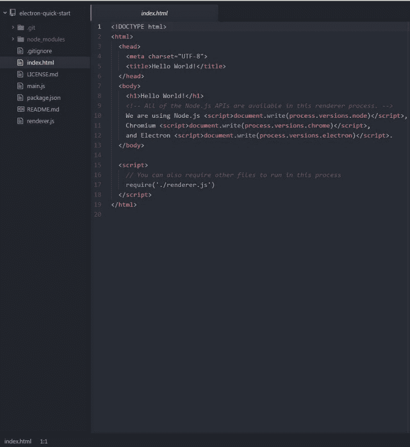
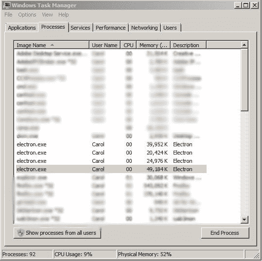
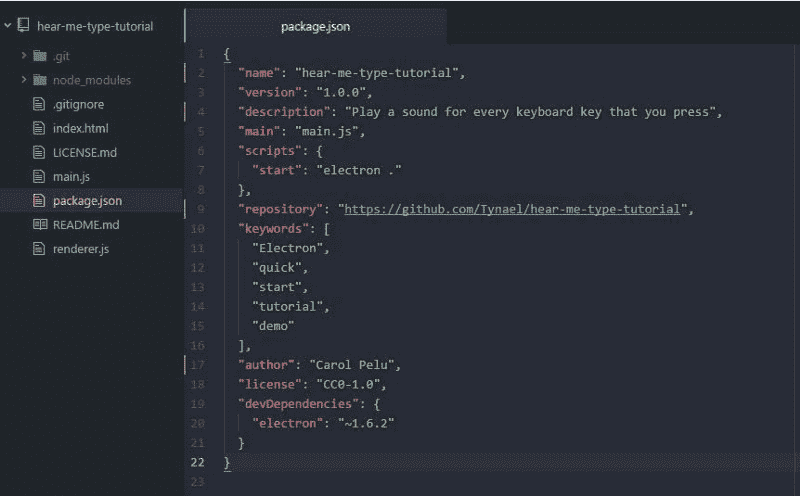
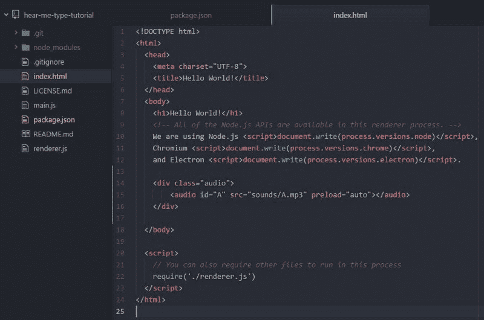
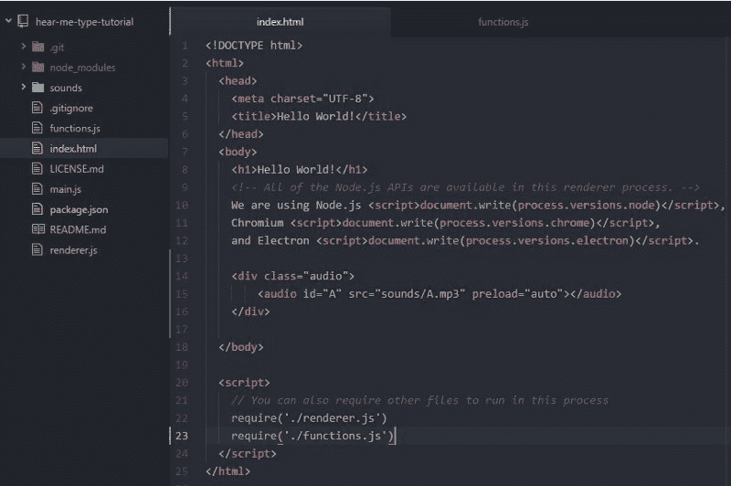
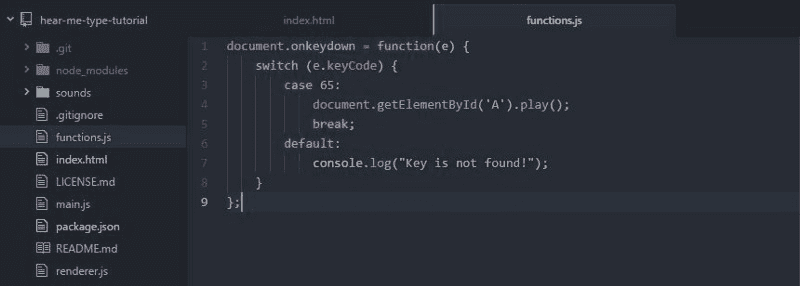
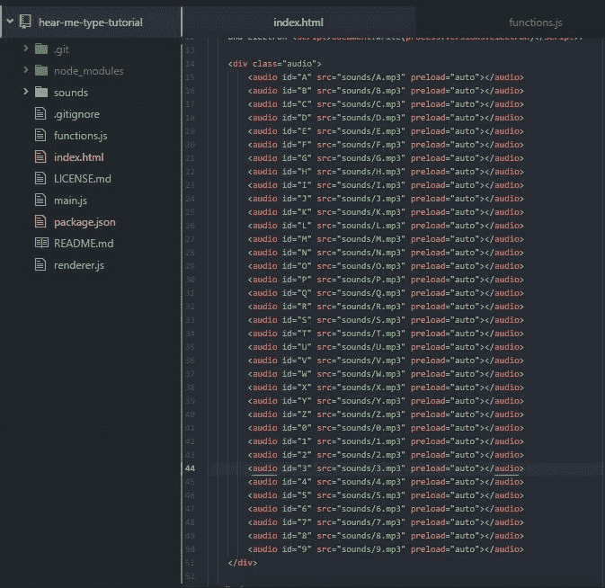

# 如何使用电子版用 JavaScript 构建你的第一个桌面应用

> 原文：<https://www.freecodecamp.org/news/how-to-build-your-first-app-with-electron-41ebdb796930/>

卡罗尔·西奥多·佩卢

# 如何使用电子版用 JavaScript 构建你的第一个桌面应用



你有没有想过能否用 HTML、CSS 和 JavaScript 构建跨平台的桌面应用？

用电子是可能的。

这篇文章将帮助你理解电子的一些核心概念。

在这篇文章结束时，你将知道用电子、HTML 和 CSS 创建跨平台桌面应用程序的过程。

在我们开始之前，您可以提前查看我们将在本教程中构建的应用程序。

*听我说类型*将有一个简单而直接的功能。键盘上的每个按键都会发出特定的声音。因此，如果我按下“A”按钮，应用程序将播放字母 A 的特定声音。

有两个版本可供下载。本教程的[源代码，以及该应用的](https://github.com/Tynael/Hear-Me-Type-Tutorial)[高级版本](https://github.com/Tynael/Hear-Me-Type)，推荐给更有经验的电子用户。

代码将会改变，因为我正在添加新的功能和增强。一定要回来看看有什么新的。

事不宜迟，让我们了解更多关于电子的知识，并创建我们的第一个应用程序！

### 什么是电子？

Electron 是一个使用 Chromium 和 Node.js 的跨平台桌面应用程序框架。

使用 HTML、CSS 和 JavaScript 很容易构建跨平台应用程序。您的应用程序开箱即可兼容 Mac、Windows 和 Linux 操作系统。

其他内置特性包括:

*   **自动更新** —支持应用程序自动更新自身
*   **本地菜单和通知** —创建本地应用菜单和上下文菜单
*   **应用崩溃报告** —您可以向远程服务器提交崩溃报告
*   **调试和剖析** — Chromium 的内容模块发现性能瓶颈和运行缓慢。你也可以在你的应用中使用你最喜欢的 Chrome 开发者工具。
*   **Windows installer** —你可以创建安装包。快速简单。

如果您对 Electron 提供的内容满意，让我们更深入地研究并创建一个简单的电子应用程序。

在我们动手之前，您需要安装 [Node.js](https://nodejs.org/en/download/) 。你还应该有一个 [GitHub](https://github.com/join?source=header) 账户来存储和更新你的应用。虽然帐户不是必需的，但强烈推荐。GitHub 是一个行业标准，知道如何使用它很重要。

我们将在本教程中使用 GitHub。

### 入门指南

设置完成后，打开操作系统的终端窗口。

按照下面的说明[将](https://git-scm.com/book/en/v2/Git-Basics-Getting-a-Git-Repository)电子快速入门 Git 库克隆到您的计算机上。

我们将在电子快速启动的基础上构建我们的软件。

```
# Clone the Quick Start repositorygit clone https://github.com/electron/electron-quick-start# Go into the repositorycd electron-quick-start# Install the dependencies and runnpm install && npm start
```

当上面列出的步骤完成后，您应该会看到应用程序在一个看起来像浏览器的窗口中打开。而且确实是浏览器窗口！

窗口样式因操作系统而异。我选择使用 Windows 的经典外观。太棒了。



The main window of our Quick-Start Electron app.

就像我之前说的，你可以在你的应用中使用 Chrome 的开发者工具。你可以用浏览器的开发者工具做的事情，你也可以在应用内部完成。杰出！

### 电子应用架构

让我们看看源代码和我们的应用程序的文件结构。在您喜欢的文本编辑器或 IDE 中打开项目。我将使用[原子](https://atom.io/)，它建立在……你猜对了……电子上！



Folder and files structure of our newly created app.

我们有一个基本的文件结构:

`electron-quick-start`

`- index.html`
`- main.js`
`- package.json`

文件结构类似于我们创建网页时使用的结构。

我们有:

*   这是一个服务于一个大目的的 HTML5 网页:我们的画布
*   创建窗口并处理系统事件
*   `package.json`是我们应用的启动脚本。它将在主进程中运行，并包含有关我们的应用程序的信息
*   `render.js`处理应用程序的渲染过程

你可能有一些关于主进程和渲染进程的问题。他们到底是什么，我该怎么和他们相处？

很高兴你问了。抓紧你的帽子，因为如果你来自浏览器 JavaScript 领域，这可能是一个新的领域！

### 什么是过程？

当你看到“进程”时，想想操作系统级别的进程。它是在系统中运行的计算机程序的实例。

如果我启动我的电子应用程序，并检查 Windows 任务管理器或 macOS 的活动监视器，我可以看到与我的应用程序相关的进程。



这些过程都是并行运行的。但是为每个进程分配的内存和资源是相互隔离的。

假设我想创建一个`for loop`来增加渲染过程中的一些东西。

```
var a = 1;
```

```
for ( a = 1; a < 10; a ++) { console.log('This is a for loop');}
```

增量仅在渲染过程中可用。完全不影响主进程。`This is a for loop`消息只会出现在渲染模块上。

### 主流程

主进程控制着应用程序的生命周期。它内置了完整的 Node.js API，可以打开对话框，创建渲染过程。它还处理其他操作系统交互，启动和退出应用程序。

按照惯例，这个过程在一个名为`main.js`的文件中。但是它可以有你喜欢的任何名字。

您也可以通过在`package.json`文件中修改来改变主工艺文件。

出于测试目的，打开`package.json`并更改:

`“main”: “main.js”,`

到

`“main”: “mainTest.js”,`

启动你的应用程序，看看它是否仍然有效。

请记住，只能有一个主进程。

### 渲染过程

渲染过程是应用程序中的一个浏览器窗口。与主进程不同，可以有许多渲染进程，每个进程都是独立的。

因为每个渲染过程都是独立的，一个过程崩溃不会影响另一个过程。这要归功于 Chromium 的多进程架构。

这些浏览器窗口也可以隐藏和定制，因为它们就像 HTML 文件。但是在 Electron 中我们也有完整的 Node.js API。这意味着我们可以打开对话框和其他操作系统交互。

这样想吧:


[Source: Kristian [Poslek](https://medium.com/developers-writing/building-a-desktop-application-with-electron-204203eeb658)]

还有一个问题。它们有什么联系吗？

这些过程同时独立运行。但是他们仍然需要以某种方式交流。尤其是因为他们负责不同的任务。

为此，有一个进程间通信系统或 IPC。您可以使用 IPC 在主进程和渲染进程之间传递消息。关于这个系统更深入的解释，请阅读 Christian Engvall 的文章。

这些是开发电子应用程序的基本流程。

现在让我们回到我们的代码！

### 让它私人化

让我们给我们的应用程序的文件夹起一个合适的名字。

将文件夹名称从`electron-quick-start`更改为`hear-me-type-tutorial`。

用您喜欢的文本编辑器或 IDE 重新打开文件夹。让我们通过打开`package.json`文件来进一步定制我们的应用程序的身份。

`package.json`包含关于我们应用的重要信息。这是你定义名字、版本、主文件、作者、许可证等等的地方。

让我们来点自豪感，让你成为应用程序的作者。

找到“author”参数，并将值改为您的名字。它应该是这样的:

`“author”: “Carol Pelu”,`

我们还需要改变其余的参数。找到下面的`name`和`description`，在 package.json 文件中修改它们:



厉害！现在我们的应用程序有了一个新名字和一个简短但直截了当的描述。

记住，你可以在你的终端中运行`npm start`来执行应用程序，并看到你所做的改变。

让我们继续前进，添加我们的应用程序的预期功能。我们希望为我们按下的每个键盘键播放特定的声音。

### 哦，有趣的人！

没有趣味性的 app 是什么？没什么…

现在，我们必须照顾好它，给我们的应用程序提供它想要的功能。

为了让应用程序对我们的输入做出反应，我们必须首先定义一个元素来挂钩，然后触发所需的操作。

为此，我们将为我们想要的键盘按键创建带有特定`id`的`audio`元素。然后我们将创建一个`switch`语句来找出哪个键盘按键被按下了。然后我们将播放分配给该键的特定声音。

如果这对你来说有点复杂，不要害怕。我会指导你每一步。

下载这个[档案](https://neutrondev.com/wp-content/uploads/2017/05/sounds.zip?x77671)，其中包含了我们将要使用的所有声音文件。我们很快就会利用它们！

打开`index.html`文件，让我们创建`<aud` io >元素，将声音内容嵌入到我们的应用中。

在`<bo` dy >元素中，cre `ate`是一个带有`audio`类标签的 div 元素。

在创建的`div`元素内部，创建一个`<aud` io >元素，其`th`id 为“A”`, the` 源标签为“sounds/A.mp3”，w `ith a p`重载属性为“auto”。

我们将使用`preload=”auto”`来告诉应用程序，当页面加载时，它应该加载整个音频文件。`index.html`是 app 的主文件，我们所有的声音文件都会在 app 执行的时候加载。

代码应该如下所示:

```
<div class="audio">
```

```
<audio id="A" src="sounds/A.mp3" preload="auto"></audio>
```

```
</div>
```



Your index.html file should look like this.

现在`<aud` io >指向一个未知的源文件。让我们创建一个文件夹 c `alled` sounds 并解压文件夹中的所有声音文件。

太好了！现在唯一缺少的重要东西是 JavaScript 代码。

创建一个名为`functions.js`的新文件。让我们在`index.html`文件中要求它，以便 JS 代码在应用程序运行时可以使用。

以`require(./renderer.js')`为例，在它的正下方添加这行代码:

`require('./functions.js')`

您的项目应该如下所示:



杰出！现在我们已经把一切都缝合好了，是时候到了关键时刻了。

打开`functions.js`文件，将下面的 JavaScript 代码添加到文件中。我马上会解释它是如何工作的。

```
document.onkeydown = function(e) {    switch (e.keyCode) {        case 65:            document.getElementById('A').play();            break;        default:            console.log("Key is not found!");    }};
```

代码应该如下所示:



打开 bash 或终端窗口。确保你在你的项目的文件夹中，并键入`npm start`来运行应用程序。

调高扬声器的音量，并按下键盘上的 **A** 按钮。

#神魂颠倒


JS 代码非常简单明了。

我们使用`document`对象上的`onkeydown`事件来找出哪个 HTML 元素正在被访问。记住，`document`对象是我们应用程序的主窗口。

在匿名函数中，我们使用了一个`switch`语句。其目的是识别所按键盘键的 Unicode 值。

如果按下的键盘键的 Unicode 值正确，则播放声音。否则将抛出“未找到”错误。在控制台中查找消息。

多好的旅程啊！

你可能已经注意到我们有声音文件来覆盖 A-Z 和 0-9 键。让我们也利用他们，让他们感受不到孤独的苦涩。

转到`index.html`，为我们有声音文件的每个键创建一个`<aud` io >元素。

代码应该如下所示:



是的，你当然可以复制粘贴:

```
<audio id="B" src="sounds/B.mp3" preload="auto"></audio><audio id="C" src="sounds/C.mp3" preload="auto"></audio><audio id="D" src="sounds/D.mp3" preload="auto"></audio><audio id="E" src="sounds/E.mp3" preload="auto"></audio><audio id="F" src="sounds/F.mp3" preload="auto"></audio><audio id="G" src="sounds/G.mp3" preload="auto"></audio><audio id="H" src="sounds/H.mp3" preload="auto"></audio><audio id="I" src="sounds/I.mp3" preload="auto"></audio><audio id="J" src="sounds/J.mp3" preload="auto"></audio><audio id="K" src="sounds/K.mp3" preload="auto"></audio><audio id="L" src="sounds/L.mp3" preload="auto"></audio><audio id="M" src="sounds/M.mp3" preload="auto"></audio><audio id="N" src="sounds/N.mp3" preload="auto"></audio><audio id="O" src="sounds/O.mp3" preload="auto"></audio><audio id="P" src="sounds/P.mp3" preload="auto"></audio><audio id="Q" src="sounds/Q.mp3" preload="auto"></audio><audio id="R" src="sounds/R.mp3" preload="auto"></audio><audio id="S" src="sounds/S.mp3" preload="auto"></audio><audio id="T" src="sounds/T.mp3" preload="auto"></audio><audio id="U" src="sounds/U.mp3" preload="auto"></audio><audio id="V" src="sounds/V.mp3" preload="auto"></audio><audio id="W" src="sounds/W.mp3" preload="auto"></audio><audio id="X" src="sounds/X.mp3" preload="auto"></audio><audio id="Y" src="sounds/Y.mp3" preload="auto"></audio><audio id="Z" src="sounds/Z.mp3" preload="auto"></audio><audio id="0" src="sounds/0.mp3" preload="auto"></audio><audio id="1" src="sounds/1.mp3" preload="auto"></audio><audio id="2" src="sounds/2.mp3" preload="auto"></audio><audio id="3" src="sounds/3.mp3" preload="auto"></audio><audio id="4" src="sounds/4.mp3" preload="auto"></audio><audio id="5" src="sounds/5.mp3" preload="auto"></audio><audio id="6" src="sounds/6.mp3" preload="auto"></audio><audio id="7" src="sounds/7.mp3" preload="auto"></audio><audio id="8" src="sounds/8.mp3" preload="auto"></audio><audio id="9" src="sounds/9.mp3" preload="auto"></audio>
```

厉害！现在让我们对`functions.js`中的 JS 代码做同样的事情。

你可以在这个[网站](https://www.cambiaresearch.com/articles/15/javascript-char-codes-key-codes)上找到 char 码(键码)。

但是，你也可以复制粘贴这个:

```
document.onkeydown = function(e) {    switch (e.keyCode) {        case 48:            document.getElementById('0').play();            break;        case 49:            document.getElementById('1').play();            break;        case 50:            document.getElementById('2').play();            break;        case 51:            document.getElementById('3').play();            break;        case 52:            document.getElementById('4').play();            break;        case 53:            document.getElementById('5').play();            break;        case 54:            document.getElementById('6').play();            break;        case 55:            document.getElementById('7').play();            break;        case 56:            document.getElementById('8').play();            break;        case 57:            document.getElementById('9').play();            break;        case 65:            document.getElementById('A').play();            break;        case 66:            document.getElementById('B').play();            break;        case 67:            document.getElementById('C').play();            break;        case 68:            document.getElementById('D').play();            break;        case 69:            document.getElementById('E').play();            break;        case 70:            document.getElementById('F').play();            break;        case 71:            document.getElementById('G').play();            break;        case 72:            document.getElementById('H').play();            break;        case 73:            document.getElementById('I').play();            break;        case 74:            document.getElementById('J').play();            break;        case 75:            document.getElementById('K').play();            break;        case 76:            document.getElementById('L').play();            break;        case 77:            document.getElementById('M').play();            break;        case 78:            document.getElementById('N').play();            break;        case 79:            document.getElementById('O').play();            break;        case 80:            document.getElementById('P').play();            break;        case 81:            document.getElementById('Q').play();            break;        case 82:            document.getElementById('R').play();            break;        case 83:            document.getElementById('S').play();            break;        case 84:            document.getElementById('T').play();            break;        case 85:            document.getElementById('U').play();            break;        case 86:            document.getElementById('V').play();            break;        case 87:            document.getElementById('W').play();            break;        case 88:            document.getElementById('X').play();            break;        case 89:            document.getElementById('Y').play();            break;        case 90:            document.getElementById('Z').play();            break;        default:            console.log("Key is not found!");        }};
```

我们的应用程序现在已经完成了！恭喜你。


app 的主要功能完成了，但是还有工作要做！

### 波兰耶！(舔我！(请注意)

尽管这款应用很实用，但它仍然缺少一些东西。

例如，在`index.html`文件中，您可以更改应用程序的标题和主窗口的内容。

此外，该应用程序没有设计，没有漂亮的颜色，也没有猫或狗的图片。

释放你的想象力，找到改进应用程序设计的方法。

代码也不完美。我们有很多相同的代码，可以优化和改进。这将导致更少的代码行，对眼睛的痛苦也更少。

重复代码是不好的做法！

### 测试一下！测试一下吧！

好的软件必须经过彻底的测试。

我建议你从按下每一个键盘键开始，看看发生了什么。

最好的情况是，您将听到代码中指定的每个键盘按键的音频。但是当你以最快的速度连续按下许多键时会发生什么呢？像 Home 键和 NumLock 键这样不应该被按下的键呢？

如果你把应用最小化，试着按一个键会怎么样？你听到声音了吗？当你没有选择应用程序窗口而按下键盘按键时会发生什么，你还能听到任何声音吗？

很不幸，答案是否定的。

这种行为是因为电子的结构。它允许你像在 C#语言中一样获得全局键，但是你不能注册单独的击键。这超出了电子应用程序的正常用例范围。

逐行运行代码并尝试破解它。看看发生了什么，电子抛出了什么样的错误。这个练习将帮助你更好地调试。如果你知道你的应用程序的缺陷，你就知道如何修复它们，让应用程序变得更好。

在`functions.js`文件中，我有意使用了一个不推荐使用的 JavaScript 事件。你能发现它吗？

一旦你找到它，我希望你考虑一下如何在不改变应用程序功能的情况下替换它。

使用不推荐使用的代码是不好的做法，可能会导致您甚至不知道存在的严重错误。保持对该语言文档的了解，看看有什么变化。始终保持最新状态。

### 结论

我想感谢和祝贺你达到这一点！

您现在已经掌握了创建一个简单的跨平台电子应用程序的知识。

如果你想更深入地了解电子，看看我在做什么，请查看 GitHub 上的[听我输入](https://github.com/Tynael/Hear-Me-Type)和[我的简介](https://github.com/Tynael)。

请随意克隆，叉，明星和贡献给我的任何公共项目。

请不时回来再读一遍这篇文章。我会修改它，以保持与电子更新的电流。

非常感谢您抽出时间阅读我的文章。

这篇文章最初发表在[NeutronDev.com](https://www.NeutronDev.com)上。

如果您喜欢更多关于电子的详细文章/教程，请单击？下面。欢迎发表评论。