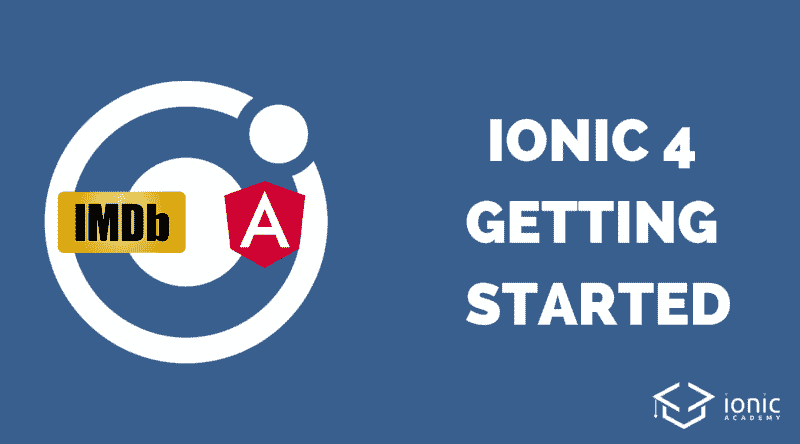
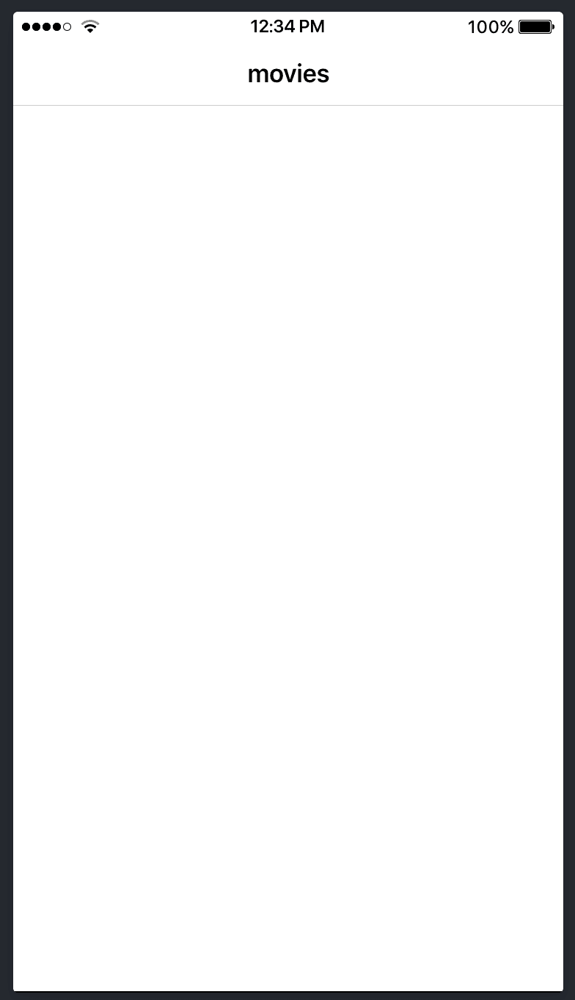
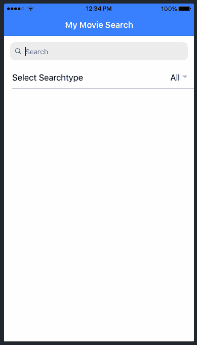
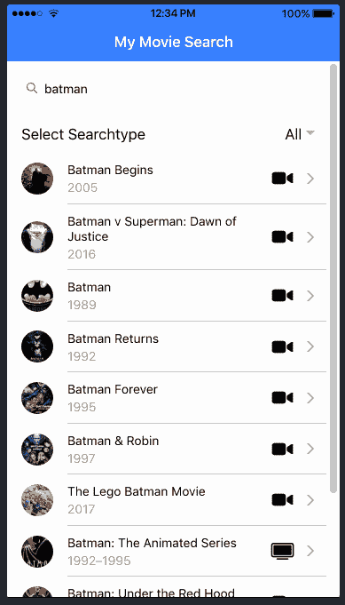

# 如何使用 API 调用构建您的第一个 Ionic 4 应用程序

> 原文：<https://www.freecodecamp.org/news/how-to-build-your-first-ionic-4-app-with-api-calls-f6ea747dc17a/>

西蒙·格林

# 如何使用 API 调用构建您的第一个 Ionic 4 应用程序



所以你刚刚注意到 Ionic 4 发布了，你终于想开始跨平台的应用程序开发了？今天是你的大日子！我们将通过对[开放电影数据库](http://www.omdbapi.com/)的 HTTP 调用来构建您的第一个 Ionic 4 应用程序！

无论你是刚刚接触 Ionic，还是使用过以前的版本，我们都会介绍所有的基础知识。我们将介绍如何设置**一个新的应用程序**、**路由**，甚至 **API 调用来在我们的应用程序中显示异步数据**。

如果你想更快地学习 Ionic，你还可以[看看我的 Ionic Academy](https://ionicacademy.com/) ，它是为像你一样的开发人员设计的！

*准备好了*？**出发**！

### 设置我们的 Ionic 4 应用程序

如果你是 Ionic 的新手，你需要确保你已经安装了[节点包管理器](https://www.npmjs.com/get-npm)。如果你曾经使用过其他的网络技术，那么你已经得到了你所需要的一切。

如果你以前也没有使用过 Ionic，你需要通过 npm 安装它。一旦安装完毕，你就可以开始创建你的 Ionic 4 项目了！

要建立一个空白项目，您可以使用 **Ionic CLI** ，这样我们最终会有一个带角度支持的全新 Ionic 4 项目(*您也可以使用 React 或 Vue，今年晚些时候会有更好的支持*)。

一旦项目被创建，我们就将 cd 放入文件夹。我们使用命令行界面，它使用 [Angular CLI](https://cli.angular.io/) 为我们的应用程序创建我们想要显示的新页面。

```
# Install Ionic if you haven't before
npm install -g ionic

# Create a blank new Ionic 4 app with Angular support
ionic start movieApp blank --type=angular
cd movieApp

# Use the CLI to generate some pages and a service
ionic g page pages/movies
ionic g page pages/movieDetails
ionic g service services/movie
```

现在，您可以通过在项目中运行以下命令来直接启动您的应用程序:

```
ionic serve
```

这将打开浏览器，预览你的应用程序，一旦你在你的项目中做了任何改变，它将自动重新加载。

说到这个项目，我们这里有一堆文件和文件夹，让我们看看这意味着什么。我们将专注于我们应用程序的 **src** 文件夹，因为我们现在不必担心其余部分。


Your Ionic 4 Project

### 应用

这是一个文件夹，我们将在这个文件夹中进行本教程后面的所有代码更改。它已经包含了一个 **home** 文件夹，基本上就是我们之前创建的页面。我喜欢让所有页面都在自己的**页面**文件夹中，这样你现在也可以删除主文件夹了。

**pages** 文件夹包含我们应用程序的实际视图/页面，这意味着我们将在屏幕上看到的元素。现在，我们已经有了 2 个页面，您使用 CLI 创建的每个页面都带有 4 个文件:

*   *.module.ts:页面的**角度模块**。每个页面基本上都是它们自己的模块(与角度架构相关),带有导入和样式
*   *.page.html:页面的 **HTML** 标记
*   *.page.scss:特定页面的**样式**(稍后将详细介绍全局样式)
*   *.page.spec.ts:为您的页面自动添加的**测试**文件。如果你想建立自动化的单元测试，这很好
*   *.page.ts:包含管理功能的 Javascript 代码的页面的**控制器**

**服务**文件夹包含我们之前创建的服务，这是关于根据最佳实践构建您的应用程序，并在应用程序的视图和实际数据之间分离关注点。该服务将负责处理 API 调用，并在以后简单地将数据返回给我们的视图！

### 资产

这个文件夹包含了所有的图片、字体或者任何你以后应用需要的资源。

### 环境

有时，您的项目可能会有一个开发、暂存和生产环境，其中包含您的应用程序所针对的不同服务器。环境文件夹有助于为不同的环境设置信息。我们可以稍后用一个**命令行标志**构建我们的 Ionic 应用程序，它会自动获取正确的值。非常得心应手！

### 主题

该文件夹仅包含 **variables.scss** ，其中包含来自 Ionic 的预定义颜色信息。我们可以随时改变这个文件，甚至使用像[离子颜色发生器](https://beta.ionicframework.com/docs/theming/color-generator)这样的工具来创建我们自己的这个文件的版本！

在这个文件夹之外，我们还有 **global.scss.** 在这里我们可以写一些 scss，它们将被全局应用到我们的应用程序中。我们也可以在他们自己的样式文件中为一个页面定义它。

### 其他文件

其他文件中最相关的可能是**index.html**，因为就像所有其他网站一样，这个文件标志着我们应用程序的入口点！现在，虽然我们不需要改变这里的任何东西，让我们现在开始进入实际的代码。

### 先决条件路由和 HTTP 调用

有了 Ionic 4，我们从专有的路由概念发展到标准的[角度路由器](https://angular.io/guide/router)。开始时，标记可能看起来有点困难，但它实际上完全有意义。

对于应用程序中的所有连接，您可以预先设置**路由信息**——就像在网站上导航一样！

在我们的应用程序中，我们需要两条路线:

*   **/movies** —导航至我们的第一页，该页将显示电影列表
*   **/movies/:id** —我们希望能够显示一部电影的细节，因此我们向可以动态解析的路线添加了一个参数 **:id**

我们还需要将相应的页面(*更具体的是*:页面的模块)连接到路由，以便 Angular 知道如何解析特定的路由。我们使用 **loadChildren** 提供这个信息，它实际上只获得一个**字符串到模块路径**。

这意味着我们并没有真正在这里导入另一个模块，因此，页面使用了**延迟加载。**这意味着只有我们导航到那里，它们才会被加载！

要设置我们的路线信息，请打开我们的**app/app-routing . module . ts**并将其更改为:

```
import { NgModule } from '@angular/core';
import { Routes, RouterModule } from '@angular/router';

const routes: Routes = [
  { path: '', redirectTo: 'movies', pathMatch: 'full' },
  { path: 'movies', loadChildren: './pages/movies/movies.module#MoviesPageModule' },
  { path: 'movies/:id', loadChildren: './pages/movie-details/movie-details.module#MovieDetailsPageModule' }
];

@NgModule({
  imports: [RouterModule.forRoot(routes)],
  exports: [RouterModule]
})
export class AppRoutingModule { }
```

app-routing.module.ts

通过进行这一更改，我们也断开了最初在项目中的主页(此时您可能已经删除了它)。

现在应用程序将加载我们的电影页面作为第一页，太好了！您还应该注意到正在运行的`ionic serve`实例中的这一变化。



**提示:**如果你想更好地感受你的应用在真实设备上的外观，你也可以运行`ionic lab`而不是 serve，但你必须预先安装软件包:

```
# Install the Lab Package

npm i @ionic/lab

# Run your app with device preview and platform styles

ionic lab
```

这个软件包以前与每个新应用程序捆绑在一起，但现在需要为 Ionic 4 安装。

**/尖端末端**

我们还需要对我们的应用程序进行另一项更改，因为我们想要进行 **HTTP 调用。**因此，我们需要导入另一个角度模块来发出这些请求。

这样做的方法与 Ionic 3 相同。我们只需要将`HttpClientModule`添加到我们的主模块文件中，并将其添加到导入的**数组中，就像我们的 **app/app.module.ts** 中这样:**

```
import { NgModule } from '@angular/core';
import { BrowserModule } from '@angular/platform-browser';
import { RouteReuseStrategy } from '@angular/router';

import { IonicModule, IonicRouteStrategy } from '@ionic/angular';
import { SplashScreen } from '@ionic-native/splash-screen/ngx';
import { StatusBar } from '@ionic-native/status-bar/ngx';

import { AppComponent } from './app.component';
import { AppRoutingModule } from './app-routing.module';

import { HttpClientModule } from '@angular/common/http';

@NgModule({
  declarations: [AppComponent],
  entryComponents: [],
  imports: [BrowserModule, IonicModule.forRoot(), AppRoutingModule, HttpClientModule],
  providers: [
    StatusBar,
    SplashScreen,
    { provide: RouteReuseStrategy, useClass: IonicRouteStrategy }
  ],
  bootstrap: [AppComponent]
})
export class AppModule {}
```

app.module.ts

在我们深入到更多的 Ionic 4 代码之前，我们首先必须设置支持我们的应用程序并处理我们稍后想要调用的所有 HTTP 请求的服务。

### 发出 HTTP 请求

服务与以前版本中的提供者相同，可以注入到我们的控制器中以调用其功能。

为了使用开放电影数据库，你需要[请求一个 API 密钥](http://www.omdbapi.com/apikey.aspx)并将其插入到我们的服务中——这个过程是免费的，所以现在就开始吧。

有了 API，我们现在可以搜索字符串，并以电影、剧集甚至游戏的形式获得结果。此外，我们可以获得这些结果中一个特定对象的详细信息，因此这是我们第一个 Ionic 4 应用程序的完美用例！

我们的服务只需要 2 个功能:

*   `searchData()`:这个函数搜索特定标题和搜索类型的结果——我们在前面定义了一个枚举来表示我们可以使用 TypeScript 传递给 API 的类型！
*   `getDetails()`:该函数返回一个特定元素的详细信息，将在我们的详细信息页面上使用

这两个函数都将返回一个`Observable`,这就像服用了类固醇的承诺。不严重，这就像是我们可以**订阅**的一系列事件。解释这个概念需要另一篇文章。现在，让我们使用它，并记住我们的两个函数都是**异步**——它们不会立即返回 API 数据。

现在，将您的**services/movie . service . ts**更改为:

```
import { Injectable } from '@angular/core';
import { HttpClient } from '@angular/common/http';
import { Observable } from 'rxjs';
import { map } from 'rxjs/operators';

// Typescript custom enum for search types (optional)
export enum SearchType {
  all = '',
  movie = 'movie',
  series = 'series',
  episode = 'episode'
}

@Injectable({
  providedIn: 'root'
})
export class MovieService {
  url = 'http://www.omdbapi.com/';
  apiKey = ''; // <-- Enter your own key here!

  /**
   * Constructor of the Service with Dependency Injection
   * @param http The standard Angular HttpClient to make requests
   */
  constructor(private http: HttpClient) { }

  /**
  * Get data from the OmdbApi 
  * map the result to return only the results that we need
  * 
  * @param {string} title Search Term
  * @param {SearchType} type movie, series, episode or empty
  * @returns Observable with the search results
  */
  searchData(title: string, type: SearchType): Observable<any> {
    return this.http.get(`${this.url}?s=${encodeURI(title)}&type=${type}&apikey=${this.apiKey}`).pipe(
      map(results => results['Search'])
    );
  }

  /**
  * Get the detailed information for an ID using the "i" parameter
  * 
  * @param {string} id imdbID to retrieve information
  * @returns Observable with detailed information
  */
  getDetails(id) {
    return this.http.get(`${this.url}?i=${id}&plot=full&apikey=${this.apiKey}`);
  }
}
```

movie.service.ts

我还为函数添加了一些文档— [使用像 Compodoc](https://ionicacademy.com/ionic-code-documentation/) 这样的工具，您现在可以创建漂亮的文档了！

好了，现在我们终于准备好更多的离子 4 代码！

### 搜索电影

我们从后台发生的事情开始我们的应用程序功能，然后在此基础上构建视图。

所以现在我们需要实现向我们的服务提交搜索词和类型并接收结果的逻辑。因此，我们**通过我们的构造函数注入**服务，因此它对类可用。

在另一个我们称为`searchChanged()`的函数中，我们现在将简单地调用我们服务的相应函数，并将结果设置为局部变量 b > results。我们的视图稍后将处理来自 API 的数据，并使用这个变量显示它。

我们还为传递给服务的类中的 searchTerm 和 type 保留了另外两个变量。我们也将从视图上与他们连接，这样我们就可以改变他们。

现在继续编写**pages/movies/movies . page . ts**中的控制器代码:

```
import { MovieService, SearchType } from './../../services/movie.service';
import { Component, OnInit } from '@angular/core';
import { Observable } from 'rxjs';

@Component({
  selector: 'app-movies',
  templateUrl: './movies.page.html',
  styleUrls: ['./movies.page.scss'],
})
export class MoviesPage implements OnInit {

  results: Observable<any>;
  searchTerm: string = '';
  type: SearchType = SearchType.all;

  /**
   * Constructor of our first page
   * @param movieService The movie Service to get data
   */
  constructor(private movieService: MovieService) { }

  ngOnInit() { }

  searchChanged() {
    // Call our service function which returns an Observable
    this.results = this.movieService.searchData(this.searchTerm, this.type);
  }
}
```

movies.page.ts

现在这个视图看起来很像 Ionic 3 代码，只是一些元素改变了它们的名称和属性。对于所有初次接触爱奥尼亚的人:**欢迎使用您的第一个爱奥尼亚组件**！

一个页面可以分为三个部分:页眉，内容，页脚。在我们的例子中，我们不需要页脚，所以我们只定义带有标题的标题区域和带有实际搜索元素的内容。

影响搜索的第一个元素是`ion-searchbar`,这是一个简单的输入，你以前在许多应用程序中见过，用来搜索一个术语。

当类型或搜索词改变时，我们总是希望调用我们的搜索功能。我们可以通过捕捉一些元素的(ionChange)事件来做到这一点。

下面我们得到了一个选择下拉列表，其中包含了选项和不同类型的相应值，我们可以将它们传递回 API。

您应该还注意到了[(ngModel)]语法，这两个元素通过该语法连接到我们的控制器属性。如果一方发生变化，另一方也会自动获得新值(也称为*双向数据绑定*)。

因此，我们已经进行了搜索，现在添加另一个列表，在前面的组件下添加元素。

对于这个列表，我们在结果变量上使用一个迭代。因为这个变量是可观察的(记住我们服务中的实现),我们需要给它添加一个角度管道“| async”。视图订阅可观察对象，并相应地处理变化。

我们还通过使用 **[routerLink】将路由直接添加到这个元素中。**我们构建了当我们点击元素时想要打开的路径。我们使用项目的 **imdbID** 属性，这样我们可以稍后在我们的详细信息页面上解析信息。

除此之外，我们使用**海报**为一个项目创建标记，它是一个图像、标题、年份，最后还有一个基于项目类型的酷图标。是的，那些很酷的图标已经和你的应用捆绑在一起，叫做 [Ionicons](https://ionicons.com/) ！

记住所有这些，将您的**pages/movies/movies . page . html**更改为:

```
<ion-header>
  <ion-toolbar color="primary">
    <ion-title>My Movie Search</ion-title>
  </ion-toolbar>
</ion-header>

<ion-content>

  <ion-searchbar [(ngModel)]="searchTerm" (ionChange)="searchChanged($event)"></ion-searchbar>

  <ion-item>
    <ion-label>Select Searchtype</ion-label>
    <ion-select [(ngModel)]="type" (ionChange)="searchChanged($event)">
      <ion-select-option value="">All</ion-select-option>
      <ion-select-option value="movie">Movie</ion-select-option>
      <ion-select-option value="series">Series</ion-select-option>
      <ion-select-option value="episode">Episode</ion-select-option>
    </ion-select>
  </ion-item>

  <ion-list>

    <ion-item button *ngFor="let item of (results | async)" [routerLink]="['/', 'movies', item.imdbID]">
      <ion-avatar slot="start">
        
      </ion-avatar>

      <ion-label text-wrap>
        <h3>{{ item.Title }}</h3>
        {{ item.Year }}
      </ion-label>

      <ion-icon slot="end" *ngIf="item.Type == 'movie'" name="videocam"></ion-icon>
      <ion-icon slot="end" *ngIf="item.Type == 'series'" name="tv"></ion-icon>
      <ion-icon slot="end" *ngIf="item.Type == 'game'" name="logo-game-controller-b"></ion-icon>

    </ion-item>

  </ion-list>

</ion-content>
```

movies.page.html

现在，你应该能够在你的应用程序中搜索一个特定的术语，并得到一个结果列表— **这已经是一个巨大的胜利**！



Searching for movie title works!

如果你来自 Ionic 3，你可能也注意到了另一个叫做 **slot** 的新属性，所以这里有一些关于它的信息:

Ionic 4 组件是使用[模板](https://stenciljs.com/)构建的(是的，他们实际上也创建了那个工具！)所以它们是标准的**网络组件**——你可以在网上的任何地方导入它们！这些组件也使用[影子 DOM API](https://blog.ionicframework.com/shadow-dom-in-ionic-and-why-its-awesome/) ，并且基本上位于常规 DOM 元素的范围之外。

**这也意味着标准样式有时不会像以前版本那样影响这些组件**！

为了将信息放入这些组件，我们可以将 HTML 的某些部分注入到这些元素上定义的**槽**中。在我们这里使用的 ion-item 的例子中，你可以[看到他们的实现看起来像](https://github.com/ionic-team/ionic/blob/caa2c1e980f3e17a9e62911a330fca785ffbc9c9/core/src/components/item/item.tsx#L160-L165)。

### 展示详细信息

好了，足够的背景信息，让我们把更多的工作放入我们的应用程序的详细信息页面。我们已经实现了一个路由，我们还创建了一个按钮，通过该路由的 ID，所以详细信息页面将会打开，但我们需要访问 ID！

在以前的 Ionic 版本中，我们可以轻松地将整个对象传递到新页面，现在这不再是最佳实践了。相反，我们**只传递带有 URL 的小块信息**(比如一个 ID)。否则，URL 中会出现一个巨大的 JSON 字符串化术语。这不是我们想要的东西。

为了访问这个 ID 字段(我们已经在开始时在路由中定义了它),我们可以使用`ActivatedRoute`及其属性。

因此，在我们从参数中提取 ID 之后，我们可以再次调用我们的服务(我们再次通过构造函数注入它),并获取我们所获得的任何 ID 的详细信息。

没什么新东西，所以让我们把下面的代码添加到我们的**页面/movie-details/movie-details . page . ts**:

```
import { MovieService } from './../../services/movie.service';
import { Component, OnInit } from '@angular/core';
import { ActivatedRoute } from '@angular/router';

@Component({
  selector: 'app-movie-details',
  templateUrl: './movie-details.page.html',
  styleUrls: ['./movie-details.page.scss'],
})
export class MovieDetailsPage implements OnInit {

  information = null;

  /**
   * Constructor of our details page
   * @param activatedRoute Information about the route we are on
   * @param movieService The movie Service to get data
   */
  constructor(private activatedRoute: ActivatedRoute, private movieService: MovieService) { }

  ngOnInit() {
    // Get the ID that was passed with the URL
    let id = this.activatedRoute.snapshot.paramMap.get('id');

    // Get the information from the API
    this.movieService.getDetails(id).subscribe(result => {
      this.information = result;
    });
  }

  openWebsite() {
    window.open(this.information.Website, '_blank');
  }
}
```

movie-details.page.ts

我们还添加了另一个函数，使用 window 对象和存储在本地`information`变量中的 API 数据信息来打开一个网站。

现在我们只需要根据 API 的 JSON 信息创建一个视图。将你得到的信息记录下来总是有帮助的，这样你就可以看到可以用来显示一些值的键。

在我们的例子中，我们使用[离子卡组件](https://beta.ionicframework.com/docs/api/card)并添加图像和一些带有信息和更多图标的项目(*我说过我真的喜欢离子卡吗？*)。

我们还在卡片下面添加了一个按钮，如果结果信息包含网站密钥，就会显示这个按钮。我们只需要将我们的函数添加到按钮的`(click)`事件中，就可以把所有的事情都联系起来！

另一方面，我们还必须在该页面的标题上添加一个`ion-back-button`,以便获得一个漂亮的返回箭头，指向我们之前的电影列表页面。这在 v3 中是自动完成的，但在 v4 中需要手动实现！

现在，通过将您的**页面/movie-details/movie-details . page . html**更改为:

```
<ion-header>
  <ion-toolbar color="primary">
    <ion-buttons slot="start">
      <ion-back-button defaultHref="/"></ion-back-button>
    </ion-buttons>
    <ion-title>{{ information?.Genre }}</ion-title>
  </ion-toolbar>
</ion-header>

<ion-content padding>

  <ion-card *ngIf="information">
    <ion-card-header>
      <ion-card-title>
        {{ information.Title }}
      </ion-card-title>
      <ion-card-subtitle>
        {{ information.Year }}
      </ion-card-subtitle>
    </ion-card-header>
    <ion-card-content text-center>
      
      {{ information.Plot }}

      <ion-item lines="none">
        <ion-icon name="star-half" slot="start"></ion-icon>
        <ion-label>{{ information.imdbRating }}</ion-label>
      </ion-item>

      <ion-item lines="none">
        <ion-icon name="clipboard" slot="start"></ion-icon>
        <ion-label text-wrap>{{ information.Director }}</ion-label>
      </ion-item>

      <ion-item lines="none">
        <ion-icon name="contacts" slot="start"></ion-icon>
        <ion-label text-wrap>{{ information.Actors }}</ion-label>
      </ion-item>

      <ion-button expand="full" (click)="openWebsite()" *ngIf="information.Website && information.Website != 'N/A'">
        <ion-icon name="open" slot="start"></ion-icon>
        Open Website
      </ion-button>
    </ion-card-content>
  </ion-card>

</ion-content>
```

movie-details.page.html

如果你现在看看你的浏览器，你可能会注意到图像看起来太大了，因为它占据了所有可用的空间。让我们通过一些好的旧 CSS 来改变这一点，因此打开您的**pages/movie-details/movie-details . page . scss**并插入:

```
.info-img {
    max-height: 30vh;
    object-fit: contain;
    padding: 10px;
}
```

movie-details.page.scss

现在我们的结果看起来更有吸引力了。



Our finished Ionic 4 App

我们可以搜索，选择电影类型，进入搜索结果，并有一个 HTTP 呼叫完成的全功能 Ionic 4 应用程序！

### 结论

虽然构建我们的第一个 Ionic 4 应用程序是一种直接的体验，但有太多的事情我们还没有充分讨论。

UI 模式，如标签和侧菜单，CSS 变量，响应式布局和 PWA，这只是 Ionic 和 Angular 的一部分。

我们甚至还没有接触到科尔多瓦的东西，实际上把这个应用程序建成一个真正的本地移动应用程序！

如果你想学习如何尽快开发 Ionic 4 应用程序，你可以今天就加入 Ionic 学院，享受专家截屏、速赢库和支持你的社区！

当然，我(西蒙)也一直在里面回答你的所有问题

你也可以在下面找到这个指南的视频版本！

[https://www.youtube.com/embed/3QPbBJgNF94](https://www.youtube.com/embed/3QPbBJgNF94)

*最初发布于 2019 年 1 月 24 日[ionicacademy.com](https://ionicacademy.com/ionic-4-app-api-calls/)。*