# SaaS 手册——如何逐步构建您的第一个软件即服务产品

> 原文：<https://www.freecodecamp.org/news/how-to-build-your-first-saas/>

在这篇内容丰富的文章中，我将介绍我推出的第一款 SaaS 的所有主要部件是如何组装在一起的。

从实现 favicon 到部署到云平台，我将分享我所学到的一切。我还将分享大量的代码片段、最佳实践、经验、指南和关键资源。

希望这里的东西对你有用。感谢阅读。❤️

## 目录

*   [简介](#introduction)
*   [寻找想法](#findingideas)
*   [堆栈](#thestack)
*   [回购](#repo)
    *   [在本地开始全栈开发](#startfullstackdevelopmentlocally)
*   [客户端](#client)
    *   [Npm 脚本](#npmscriptclient)
    *   [环境变量](#environmentvariables)
    *   [网络包&巴别塔](#webpackbabel)
    *   [网页性能](#webperformance)
    *   [差别服务](#differentialserving)
    *   [Fonts](#fonts)
    *   [图标](#icons)
    *   [收藏夹图标](#favicon)
    *   [API 调用](#apicalls)
    *   [在本地测试生产版本](#testproductionbuildlocally)
    *   [安全](#security)
*   [设计](#design)
    *   [模块秤](#modularscale)
    *   [颜色](#colors)
    *   [CSS 复位](#cssreset)
    *   [一次造型练习](#astylingpractice)
    *   [布局](#layout)
*   [服务器](#server)
    *   [文件结构](#filestructure)
    *   [Npm 脚本](#npmscriptserver)
    *   [数据库](#database)
    *   [创建表模式](#creatingtableschemas)
    *   [删除数据库](#droppingadatabase)
    *   [制作 SQL 查询](#craftingsqlqueries)
    *   [再说一遍](#redis)
    *   [错误处理&日志](#errorhandlinglogging)
    *   [用于 URL 共享的永久链接](#permalinkforurlsharing)
*   [用户认证系统](#userauthenticationsystem)
*   [电子邮件](#email)
    *   [实施](#implementation)
    *   [电子邮件模板](#emailtemplates)
    *   [如何得到一个`**hi@example.com**`](#howtogetoneofthosehiexamplecom)
*   [租赁权](#tenancy)
*   [域名](#domainname)
    *   [如何得到一个`**app.example.com**`](#howtogetoneofthoseappexamplecom)
*   [部署](#deployment)
    *   [部署节点 j](#deploynodejs)
    *   [部署 Postgresql](#deploypostgresql)
    *   [在生产数据库中设置模式](#setupschemasinproductiondatabase)
    *   [部署累西腓](#deployredis)
    *   [文件存储](#filestorage)
    *   [在后端部署新的变更](#deploynewchangesinbackend)
*   [举办您的水疗](#hostingyourspa)
    *   [在前端部署新的变更](#deploynewchangesinfrontend)
*   [富文本编辑器](#richtexteditor)
*   [CORS](#cors)
*   [付款&认购](#paymentsubscription)
*   [登陆页面](#landingpage)
*   [条款和条件](#termsandconditions)
*   [营销](#marketing)
*   [幸福](#wellbeing)

## 介绍

2013 年，我转行从事网络开发。我这样做有两个原因。

首先，我注意到在构建面向客户的产品时，我可能会迷失在所有的颜色和无限的交互可能性中。因此，当我想起那句老话“*找一份你喜欢做的工作，你这辈子就不用工作一天了”*时，我想“*为什么不把它变成一份工作呢？*

第二，我想让自己有所作为，我的青少年时代受到了 Web 2.0 的启发(大约 2005 年 Digg.com 为我打开了世界！).计划是在研究前者的同时研究后者。

然而，事实证明，工作和“JavaScript 疲劳”接踵而至，完全占据了我。在受到“硅谷”言论的影响后，我不顾后果地追求自己的抱负，这也于事无补。我看了保罗·格拉厄姆的*黑客&画师*和彼得·泰尔的*零比一*。我想，我完全被点燃了！我在努力。我也能做到！

但是不，我不能。至少不是一个人。下班后我总是很累。我找不到一个和我有共同梦想和价值观的团队。

因此，与此同时，我在空闲时间冲洗和重复不到半生不熟的项目。我长期焦虑和抑郁。随着岁月的流逝，我变得成熟了。直到 2019 年 9 月，我开始培养与我的个性和生活环境更相符的个人创业和技术哲学。

前方道路上的雾终于消散了。我变得非常擅长这个工作——工作变得不那么费力，我也控制住了我的“Javascript 疲劳”。在很长一段时间里，我有足够的精力、时间和心态去完成一个兼职项目。那一次，我从小做起。我相信我有这个！

我错了。

由于我的整个职业生涯都是前端开发人员，我只能说出我想象中需要的东西——一个“服务器”、“数据库”、“认证”系统、“主机”、“域名”,但是*如何使用*...*哪里*...还有*什么*...*我..我不知道..我甚至不*...？

现在，我知道如果我决定使用像“创建-反应-应用程序”、“firebase SDK”、“ORM”和“一键部署”服务这样的抽象工具，我的生活会更容易。*颂“不要多此一举”。快速迭代*’。

但是我希望我的决定符合几个条件:

*   没有供应商限制——这排除了在我的代码库中使用 Firebase SDK 的可能性。这包括“create-react-app ”,因为删除它迫使我继承和维护其庞大的工具基础设施。
*   简单和极简——减少学习新的固执己见的语法和模式。这排除了 1)输出复杂架构和样板代码层的项目生成器，2)使用第三方库，如“knex.js”或“sequel ize”ORM。
*   按需付费—我希望我的运营成本与使用水平成比例。这就排除了“一键部署”之类的服务。

公平地说，我有以下优势:

*   我在建造一个简单的 SaaS。
*   我并不急于扩张、控制、颠覆等等。
*   我还在做白天的工作。
*   我已经接受了失败的可能性。？

还要记住的是:

*   这是一场独角戏——设计、开发、维护、营销等等。
*   我不是 10x rockstar 全栈程序员。

**最重要的是**，我想坚持一个指导原则:负责任地建造东西[](https://alistapart.com/article/responsible-javascript-part-1/)*。虽然，不出所料，这样做对我的开发速度产生了重大影响，并迫使我澄清我的动机:*

 **   如果我不得不尽快发货，除非是生死攸关的事情，那么我可能不是在解决一个独特而困难的问题。在这种情况下——假设我还在上班，没有债务——为什么这么着急？
*   从伦理的角度反思:这是一个需要解决的问题吗？如果我解决了会有什么二阶后果？我的良好意愿可以更好地用于其他地方吗？

因此，本文接下来的内容是我在开发第一个名为 **Sametable** 的项目时学到的一切，这个项目帮助[管理你在电子表格](https://www.sametable.app)中的工作。

我们开始吧。

## 寻找创意

嗯，首先，你要知道你要造什么。我过去常常为此失眠，思考和混合各种想法，希望有灵光一现的时刻，直到我开始向内看:

*   做一些能解决你经常遇到的让你生气的问题的东西。
*   解决所谓的‘痛点’或‘摩擦’。到外面去，不要停止听人说话，向人学习。
*   成为你领域的专家。感受它的痛苦。也许能解决其中一个。在我看来，许多创始人创建了与他们的领域相关的公司，并在此基础上建立了他们的职业生涯和社交网络。

## 堆栈

你的堆栈看起来如何将取决于你想如何呈现你的应用程序。这里有一个关于这个问题的[综合](https://developers.google.com/web/updates/2019/02/rendering-on-the-web#wrapup)讨论，但简单来说:

*   客户端渲染(CSR)；SPAJSON API——
    这可能是最流行的方法。它非常适合构建交互式 web 应用程序。但是[要意识到](https://macwright.org/2020/05/10/spa-fatigue.html)它的缺点和减轻它们的步骤。这是我采用的方法，所以我们会详细讨论它。

*   **混合动力 CSR 客户端和服务器端渲染(SSR)** —
    使用这种方法，您仍然可以构建您的 SPA。但是当用户请求你的应用程序时，比如主页，你在你的服务器中把主页的组件转换成静态 HTML **并提供给用户。然后在用户的浏览器上，[水合作用](https://reactjs.org/docs/react-dom.html#hydrate)将会发生，所以整个事情变成了预期的水疗。**

这种方法的主要好处是，你可以获得良好的 SEO，用户可以更快地看到你的东西(更快的“第一次有意义的绘画”)。

但是也有不利的一面。除了额外的维护成本，我们将不得不下载相同的负载两次——第一次是 HTML，第二次是它的 Javascript 对应物“水合作用”,这将对浏览器的主线程产生重大影响。这延长了“第一次互动”，因此减少了从更快的“第一次有意义的绘画”中获得的好处。

这种方法采用的技术有 [NextJs](https://nextjs.org/) 、 [NuxtJs](https://nuxtjs.org/) 和 [GatsbyJs](https://www.gatsbyjs.org/) 。

*   **服务器端渲染和“用 Javascript 点缀✨it”**
    ——这是老式的网络构建方式！—使用 PHP 用服务器中的数据构建模板，然后在浏览器中用 jQuery 将事件处理程序绑定到 DOM。这种方法可能不适合构建企业在网络上要求的越来越复杂的应用程序，但一些技术已经出现，值得重新考虑:

    *   [https://stimulusjs.org/](https://stimulusjs.org/)
    *   [https://github.com/turbolinks/turbolinks](https://github.com/turbolinks/turbolinks)
    *   [https://github.com/phoenixframework/phoenix_live_view](https://github.com/phoenixframework/phoenix_live_view)
    *   更多信息，请查看这个 [twitter 帖子](https://mobile.twitter.com/nateberkopec/status/1260602209475198976)

说实话，如果我对自己多点耐心，我早就走上这条路了。鉴于现代网络上 Javascript 的过剩，这种方法正在卷土重来。

底线是:选择任何你已经精通的方法。但是要注意相关的缺点，并在交付给用户之前尽量减轻它们。

就这样，下面是无聊的 Sametable 堆栈:

### 前端

*   网络包，巴贝尔
*   **预先行动**

### 后端

*   **节点** —带有 ExpressJS 的 API 服务器
*   **Postgresql** —数据库
*   **Redis** —存储用户的会话数据，缓存查询结果。

### 主办；主持

*   **Google 云平台** —托管 Nodejs 的 GAE，托管 Redis 的 GCE。
*   **fire base**——招待我的 SPA。

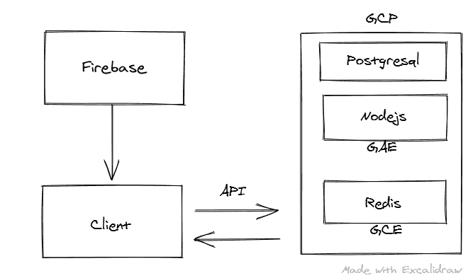

## 被卖方收回的汽车

[https://github . com/kilgarinen/boilero om](https://github.com/kilgarenone/boileroom)

这个回购包含了我用来开发我的 SaaS 的结构。我有一个文件夹放**客户端**的东西，另一个放**服务器**的东西:

```
- client
    - src
      - components
      - index.html
      - index.js
    - package.json
    - webpack.config.js
    -.env
    -.env.development
- server
    - server.js
    - package.json
    - .env
- package.json
- .gitignore
- .eslintrc.js
- .prettierrc.js
- .stylelintrc.js 
```

文件结构总是旨在尽可能的扁平、内聚和线性导航。每个“组件”都自包含在一个文件夹中，包含其所有组成文件(html|css|js)。例如，在“登录”路由文件夹中:

```
- client
   - src
     - routes
       - Login
         - Login.js
         - Login.scss
         - Login.redux.js 
```

这是我从《Angular2 风格指南》中学到的，里面有很多你可以带走的好东西。强烈推荐。

### 在本地开始全栈开发

根目录下的`package.json`有一个 **npm 脚本**，我将运行它来引导**我的客户端和服务器开始我的本地开发:**

```
"scripts": {
    "client": "cd client && npm run dev",
    "server": "cd server && npm run dev",
    "dev": "npm-run-all --parallel server client"
} 
```

在项目根目录下的终端中运行以下命令:

```
npm run dev 
```

## 客户

```
- client
    - src
      - components
      - index.html
      - index.js
    - package.json
    - webpack.config.js
    -.env
    -.env.development 
```

“客户端”的文件结构很像“创建-反应-应用程序”的文件结构。您的应用程序代码的主体在`src`文件夹中，其中有一个`components`文件夹用于存放您的功能性 React 组件；`index.html`是您[自定义模板](https://github.com/kilgarenone/boileroom/blob/master/client/config/webpack.development.js#L41-L43)提供给 [`html-webpack-plugin`](https://github.com/jantimon/html-webpack-plugin#options) 的； [`index.js`](https://github.com/kilgarenone/boileroom/blob/master/client/src/index.js) 是一个作为[入口点的文件](https://github.com/kilgarenone/boileroom/blob/master/client/config/webpack.common.js#L12-L15)到 Webpack。

### Npm 脚本(客户端)

客户的`package.json`文件有两个最重要的 npm 脚本:1) `dev`开始开发，2) `build`捆绑生产。

```
"scripts": {
    "dev": "cross-env NODE_ENV=development webpack-dev-server",
    "build": "cross-env NODE_ENV=production node_modules/.bin/webpack"
} 
```

### 环境变量

拥有一个`.env`文件是一个很好的实践，在这里您可以定义您的敏感值，比如 API 键和数据库凭证:

```
SQL_PASSWORD=admin
STRIPE_API_KEY=1234567890 
```

名为 [dotenv](https://www.npmjs.com/package/dotenv) 的库通常用于将这些变量加载到我们的应用程序代码中以供使用。然而，在 Webpack 的上下文中，我们将使用 [dotenv_webpack](https://www.npmjs.com/package/dotenv-webpack) 在编译和编译时间[完成这项工作，如此处](https://github.com/kilgarenone/boileroom/blob/master/config/webpack.common.js#L33-L37)所示。然后可以在代码库中的`process.env`对象中访问这些变量:

```
// payment.jsx

if (process.env.STRIPE_API_KEY) {
  // do stuff
} 
```

### 网络包和巴别塔

Webpack 用于将我的所有 UI 组件及其依赖项(npm 库、图像、字体、SVG 等文件)合并到适当的文件中，如`.js`、`.css`、`.png`文件。在捆绑过程中，Webpack 将运行我的 [babel config](https://github.com/kilgarenone/boileroom/blob/master/client/config/webpack.production.js#L19-L57) ，如果有必要的话，将我写的 Javascript 转换到一个旧版本(例如 es5)来支持我的[目标浏览器](https://github.com/kilgarenone/boileroom/blob/master/client/package.json#L13-L27)。

当 Webpack 完成它的工作时，它将生成一个(或[几个](https://webpack.js.org/concepts/entry-points/#multi-page-application) ) `.js`和`.css`文件。然后通过[使用](https://github.com/kilgarenone/boileroom/blob/master/client/config/webpack.production.js#L189-L202)一个名为[‘html-webpack-plugin’](https://github.com/jantimon/html-webpack-plugin)的 web pack 插件，对那些 JS 和 CSS 文件的引用被自动(默认行为)分别作为`<script>`和`<link`注入到你的`index.html`中。然后，当用户在浏览器中请求您的应用程序时，就会获取并解析“index.html”。当它看到`<script>`和`<link>`时，它会获取并执行被引用的资产，最后你的 app 被[渲染](https://preactjs.com/guide/v10/api-reference/#render)(即客户端渲染)到用户面前。

如果你是 Webpack/Babel 的新手，我建议从它们的基本原理开始学习，慢慢地构建你的配置，而不是从网上复制/粘贴。这没什么不对，但是我发现一旦我有了事物如何工作的心理模型，这样做就更有意义了。

我在这里写了一些基本的东西:

*   **[Webpack](https://medium.com/@kilgarenone/minimal-webpack-setup-a5f32c5f8960)**

一旦我理解了基础知识，我就开始[参考这个资源](https://github.com/nystudio107/annotated-webpack-4-config)进行更高级的配置。

*   **[巴别塔](https://medium.com/@kilgarenone/minimal-babel-setup-b12b563ee2ca)**

### Web 性能

简单来说，一个表现好的 web app 对你的[用户和业务](https://developers.google.com/web/fundamentals/performance/why-performance-matters)都有好处。

虽然 web perf 是一个很大的主题，已经有很多文献记载，但我想谈谈我为 web perf 所做的几件最有影响力的事情(除了优化图像的 T2 之外，T3 占到了页面权重的 50%以上)。

#### 关键渲染路径

优化页面中“关键呈现路径”的目标是让它尽可能快地呈现出来并与用户交互。就这么办吧。

我们之前提到过‘html-webpack-plugin’会自动在我们的`index.html`中为我们注入所有 web pack 生成的`.js`和`.css`文件的引用。但是我们现在不想这样做来完全控制它们的位置和应用[资源提示](https://developer.mozilla.org/en-US/docs/Web/HTML/Preloading_content)，正如本文中记录的[，这两者都是浏览器如何高效地发现和下载它们的一个因素。](https://timkadlec.com/remembers/2020-02-13-when-css-blocks/)

现在，有 Webpack [插件](https://github.com/jantimon/html-webpack-plugin#plugins)似乎在这方面帮助了我们，但是:

*   没有直观的方法来控制我的`<script`的排序。嗯，有[这个方法](https://github.com/jantimon/html-webpack-plugin/issues/140#issuecomment-376316414)，但是在我的`<link>`中点菜怎么样？
*   正如我们将在后面看到的，没有一个插件能按照我想要的方式运行我的 CSS。嗯，还有[这个](https://github.com/GoogleChrome/preload-webpack-plugin)(对属性没有控制)[这个](https://github.com/jantimon/resource-hints-webpack-plugin)(相同)，还有[这个](https://github.com/numical/style-ext-html-webpack-plugin)(对 MiniCssExtractPlugin 没有明确支持)。

即使我能以某种方式将它们全部破解，如果我知道我能以一种直观和可控的方式做到这一点，我也会毫不犹豫地决定反对它。我做到了。

因此，继续禁用自动注射:

```
// webpack.production.js
plugins: [
  new HtmlWebpackPlugin({
    template: settings.templatePath,
    filename: "index.html",
    inject: false, // we will inject ourselves
    mode: process.env.NODE_ENV,
  }),
]; 
```

并且知道我们可以从我们的`index.html`中的 [`htmlWebpackPlugin.files`](https://github.com/jantimon/html-webpack-plugin#writing-your-own-templates) 对象获取 Webpack 生成的资产:

```
// example of what you would see if you
// console.log(htmlWebpackPlugin.files)

{
  "publicPath": "/",
  "js": [
    "/js/runtime.a201e1a.js",
    "/vendors~app.d8e8c.js",
    "/app.f8fb511.js",
    "/components.3811eb.js"
  ],
  "css": ["/app.5597.css", "/components.b49d382.css"]
} 
```

我们自己将资产注入`index.html`:

```
<% if (htmlWebpackPlugin.options.mode === 'production') { %>

<script
  defer
  src="<%= htmlWebpackPlugin.files.js.filter(e => /^\/vendors/.test(e))[0] %>"
></script>
<script
  defer
  src="<%= htmlWebpackPlugin.files.js.filter(e => /^\/app/.test(e))[0] %>"
></script>
<link
  rel="stylesheet"
  href="<%= htmlWebpackPlugin.files.css.filter(e => /app/.test(e))[0] %>"
/>

<% } %> 
```

注意:

*   我们只有在为生产而构建时才这样做；我们让`webpack-dev-server`在本地开发期间为我们注入资金。

*   我们在我们的`<script>`上应用了`defer`属性，这样当解析我们的 HTML 时，浏览器将获取它们*，并且只在 HTML 被解析后执行 JS。*

    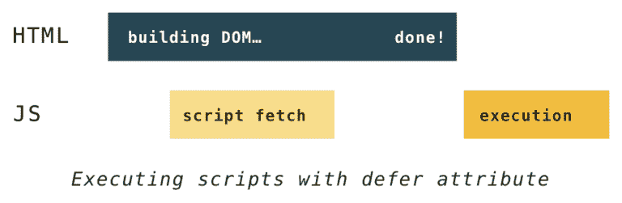

    [source](https://hacks.mozilla.org/2017/09/building-the-dom-faster-speculative-parsing-async-defer-and-preload/)

#### 内联 CSS 和 JS

如果你[设法](https://web.dev/extract-critical-css/#overview-of-tools)分离了你的*关键* CSS 或者你有一个很小的 JS 脚本，你可能想考虑在`<style>`和`<script>`中内联它们。

“内联”意味着在 HTML 中放置相应的原始内容。这节省了网络行程，尽管不能缓存它们是一个值得考虑的问题。

让我们按照建议的[在这里](https://developers.google.com/web/fundamentals/performance/webpack/use-long-term-caching#inline_webpack_runtime_to_save_an_extra_http_request)内联 Webpack 生成的`runtime.js`。回到上面的`index.html`，添加以下代码片段:

```
<!-- more <link> and <script> -->

<script>
  <%= compilation.assets[htmlWebpackPlugin.files.js.filter(e => /runtime/.test(e))[0].substr(htmlWebpackPlugin.files.publicPath.length)].source() %>
</script> 
```

关键是`compilation.assets[<ASSET_FILE_NAME>].source()`:

> *   Compile: WebPack [compiles object](https://webpack.js.org/api/compilation-object/) . For example, this can be used to obtain the contents of processed assets and directly inline them into the page through `compilation.assets[...].source()` (see [Inline Template Example](https://github.com/jantimon/html-webpack-plugin/blob/master/examples/inline/template.pug) ). ( [Source](https://github.com/jantimon/html-webpack-plugin#writing-your-own-templates) )

您也可以使用这种方法来内联您的关键 CSS:

```
<style>
  <%= compilation.assets[htmlwebpackplugin.files.css.filter(e => /app/.test(e)) [0].substr(htmlWebpackPlugin.files.publicPath.length) ].source() %>
</style> 
```

对于非关键的 CSS，您可以考虑“预加载”它们。

#### 预加载非关键 CSS

简而言之:

```
<link
  rel="stylesheet"
  href="/path/to/my.css"
  media="print"
  onload="this.media='all'"
/> 
```

[来源](https://timkadlec.com/remembers/2020-02-13-when-css-blocks/)

但是让我们看看如何使用 Webpack 来实现这一点。

因此，我将我的非关键 CSS 包含在一个 CSS 文件中，我将其指定为 Webpack 中自己的入口点:

```
// webpack.config.js
module.exports = {
  entry: {
    app: "index.js",
    components: path.resolve(__dirname, "../src/css/components.scss"),
  },
}; 
```

最后，我将它注入到我的关键 CSS 之上:

```
<!-- Preloading non-critical CSS -->
<link
  rel="stylesheet"
  href="<%= htmlWebpackPlugin.files.css.filter(e => /components/.test(e))[0] %>"
  media="print"
  onload="this.media='all'"
/>

<!-- Inlined critical CSS -->
<style>
  <%= compilation.assets[htmlwebpackplugin.files.css.filter(e => /app/.test(e)) [0].substr(htmlWebpackPlugin.files.publicPath.length) ].source() %>
</style> 
```

让我们**来衡量一下**在经历了这一切之后，我们是否真的做了什么好事。测量同桌的[注册页面](https://web.sametable.app/signup):

前**后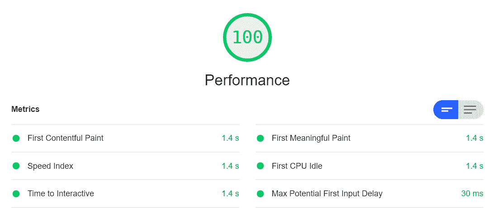**

后 **后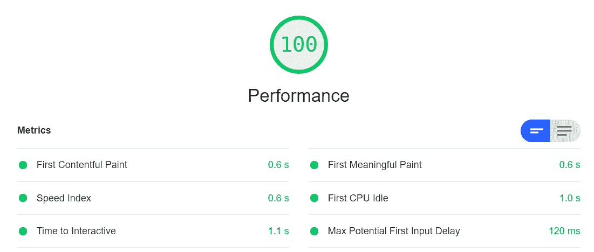**

看起来我们已经改进了几乎所有重要的以用户为中心的指标(不确定第一次输入延迟..)!？

这里有一个关于在 Chrome Dev 工具中测量 web 性能的[好视频教程](https://www.youtube.com/watch?v=j9LW94EN7n4)。

#### 代码拆分

不要把你的应用程序的所有组件、路径和第三方库都放在一个单独的`.js`文件中，你应该根据用户在运行时的动作按需拆分和加载它们。

这将**极大地**减少 SPA 的包大小，并降低最初的 Javascript 处理成本。这提高了“第一次互动时间”和“第一次有意义的绘画”等指标。

代码拆分通过[‘动态导入’](https://webpack.js.org/guides/code-splitting/#dynamic-imports)完成:

```
// Editor.jsx

// LAZY-LOAD A GIGANTIC THIRD-PARTY LIBRARY
componentDidMount() {
  const { default: MarkdownIt } = await import(
    /* webpackChunkName: "markdown-it" */
    "markdown-it"
  );
  new MarkdownIt({ html: true }).render(/* stuff */);
}

// OR LAZY-LOAD A COMPONENT BASED ON USER ACTION
checkout = () => {
  const { default: CheckoutModal } = await import(
    /* webpackChunkName: "checkoutModal" */
    "../routes/CheckoutModal"
  );
} 
```

代码分割的另一个用例是**在不支持 Web API 的浏览器中有条件地加载 polyfill** 。这使其他支持它的人免于支付 polyfill 的费用。

例如，如果`IntersectionObserver`不被支持，我们将用[‘交集-观察者’](https://www.npmjs.com/package/intersection-observer)库填充它:

```
// InfiniteScroll.jsx

componentDidMount() {
  (window.IntersectionObserver ? Promise.resolve() : import("intersection-observer")).then(() => {
    this.io = new window.IntersectionObserver((entries) => {
      entries.forEach((entry) => {
        // do stuff
      });
    }, { threshold: 0.5 });

    this.io.observe(/* DOM element */);
  });
} 
```

##### 向导

*   [https://medium . com/@ kilgare none/practical-code-splitting-with-preact-and-web pack-a 3d 1b 19 f 86 a 3](https://medium.com/@kilgarenone/pragmatic-code-splitting-with-preact-and-webpack-a3d3b19f86a3)

### 差别服务

您可能已经配置了 Webpack 来构建针对 IE11 等现代和传统浏览器的应用程序，同时为每个用户提供相同的有效负载。这迫使那些使用现代浏览器的用户支付(解析/编译/执行)不必要的 polyfills 和无关的转换代码的成本，这些代码是为了支持使用传统浏览器的用户。

一方面,“差别服务”将为现代浏览器上的用户提供更精简的代码。另一方面，它将提供适当填充和转换的代码，以支持 IE11 等传统浏览器上的用户。

尽管这种方法使得构建更加复杂，并且有一些限制，但是获得的好处(你可以在下面的参考资料中找到)肯定*超过成本*。除非你的大部分用户都在 IE11 上。在这种情况下，你可以跳过这一步。但即便如此，这种方法也是面向未来的，因为传统浏览器正在被淘汰。

#### 被卖方收回的汽车

[https://github.com/kilgarenone/differential-serving](https://github.com/kilgarenone/differential-serving)

#### 资源

*   [https://Jason format . com/modern-script-loading/# option 1 load dynamically](https://jasonformat.com/modern-script-loading/#option1loaddynamically)—很好地概述了不同的差异化服务方法。Sametable 位于“选项-1”中。
*   [https://github . com/first tris/html-webpack-multi-build-plugin](https://github.com/firsttris/html-webpack-multi-build-plugin)—这个 web pack 插件将您的现代&遗留脚本的清单(即资产‘引用’)传递到‘html-web pack-plugin ’,因此您可以在您的‘index . html’中访问它们。
*   [https://calendar . perf planet . com/2018/doing-differential-serving-in-2019/](https://calendar.perfplanet.com/2018/doing-differential-serving-in-2019/)—我在这里了解了如何用其“babel.config.js”方法构造我的 babel config。
*   [https://github.com/nystudio107/annotated-webpack-4-config](https://github.com/nystudio107/annotated-webpack-4-config)—我在这里学到了很多关于构建我的 Webpack 配置的知识。

### 字体

字体文件可能很昂贵。以我最喜欢的字体 Inter 为例:如果我使用它的 3 种字体，总大小可能会达到 300KB，加剧 FOUT 和 FOIT 的情况，特别是在低端设备中。

为了满足我项目中的字体需求，我通常只使用机器自带的“系统字体”:

```
body {
  font-family: -apple-system, BlinkMacSystemFont, "Segoe UI", Roboto,
    Oxygen-Sans, Ubuntu, Cantarell, "Helvetica Neue", sans-serif;
}

code {
  font-family: SFMono-Regular, Menlo, Monaco, Consolas, "Liberation Mono",
    "Courier New";
} 
```

但是，如果您必须使用自定义 web 字体，请考虑正确使用:

*   你应该亲自[招待](https://kevq.uk/how-to-self-host-your-web-fonts/)他们。
*   [‘字体子集化’](https://medium.com/@kilgarenone/subsetting-your-fonts-in-windows-10-using-wsl-bae4fafa35fc)大幅减小字体文件的大小。
*   浏览这张[清单](https://www.zachleat.com/web/font-checklist/)。

### 核标准情报中心

Sametable 中的图标是 SVG。有不同的方法可以做到这一点:

*   将 SVG 图标的标记复制并粘贴到任何需要的地方。不利的一面是，它会使 HTML 膨胀，并产生解析成本，特别是在移动设备上。
*   通过网络请求您的 SVG 图标:``。除非一个 SVG 很大(> 5KB)，否则对它们中的每一个都提出请求似乎有点多。
*   以 [React 组件](https://medium.com/@david.gilbertson/icons-as-react-components-de3e33cb8792)的形式制作一个可重用的图标。缺点是它不必要地引入了 Javascript 及其相关成本。

相反，我为我的图标选择的解决方案是' **SVG 精灵**，这更接近 SVG 本身的本质( [`<use>`](https://developer.mozilla.org/en-US/docs/Web/SVG/Element/use) 和 [`<symbol>`](https://developer.mozilla.org/en-US/docs/Web/SVG/Element/symbol) )。

让我们看看怎么做。

假设有许多地方会使用我们的两个 SVG 图标。在你的`index.html`:

```
<body>
  <svg  style="display: none;">
    <symbol id="pin-it" viewBox="0 0 96 96">
      <title>Give it a title</title>
      <desc>Give it a description for accessibility</desc>
      <path d="M67.7 40.3c-.3 2.7-2" />
    </symbol>
    <symbol id="unpin-it" viewBox="0 0 96 96">
      <title>Un-pin this entity</title>
      <desc>Click to un-pin this entity</desc>
      <path d="M67.7 40.3c-.3 2.7-2" />
    </symbol>
  </svg>
</body> 
```

1.  隐藏父 SVG 元素`style="display: none"`。
2.  给每个 SVG 符号一个唯一的 id `<symbol id="unique-id"`。
3.  确保定义了`viewBox`(通常已经提供了)，但是跳过了`width`和`height`。
4.  赋予其`title`和`desc`可访问性。
5.  当然还有一个图标的`path`数据。

最后，下面是如何在组件中使用它们:

```
// example.jsx

render() {
  <svg

    xmlnsXlink="http://www.w3.org/1999/xlink"
    width="24"
    height="24"
  >
    <use xlinkHref="#pin-it" />
  </svg>

} 
```

1.  根据需要定义`width`和`height`。
2.  指定`<symbol>`的`id`:`<use xlinkHref="#pin-it" />`。

#### 惰性加载 SVG 精灵

您可以将 SVG 符号放在一个仅在需要时才加载的文件中，而不是放在`index.html`中:

```
<svg >
  <symbol id="header-1" viewBox="0 0 26 24">
    <title>Header 1</title>
    <desc>Toggle a h1 header</desc>
    <text x="0" y="20" font-weight="600">H1</text>
  </symbol>
  <symbol id="header-2" viewBox="0 0 26 24">
    <title>Header 2</title>
    <desc>Toggle a h2 header</desc>
    <text x="0" y="20" font-weight="600">H2</text>
  </symbol>
</svg> 
```

将该文件放入`client/src/assets`:

```
- client
  - src
    - assets
      - svg-sprites.svg 
```

最后，使用文件中的一个符号:

```
// Editor.js

import svgSprites from "../../assets/svg-sprites.svg";

/* component stuff */

render() {
  return (
    <button type="button">
      <svg

        xmlnsXlink="http://www.w3.org/1999/xlink"
        width="24"
        height="24"
      >
        <use xlinkHref={`${svgSprites}#header-1`} />
      </svg>
    </button>
  )
} 
```

在运行时，浏览器会获取`.svg`文件，如果它还没有获取的话。

现在你知道了！再也不用到处贴那些冗长的数据了。

#### 图标的来源

*   [https://material.io/resources/icons/?style=baseline](https://material.io/resources/icons/?style=baseline)
*   [https://logomakr.com/](https://logomakr.com/)
*   [https://github.com/wmira/react-icons-kit#bundled-icon-sets](https://github.com/wmira/react-icons-kit#bundled-icon-sets)(有一份不错的资料来源清单)

#### 参考

*   [https://css-tricks.com/mega-list-svg-information/#svg-icons](https://css-tricks.com/mega-list-svg-information/#svg-icons)

### Favicon

如果我没有禁用“html-webpack-plugin”的`inject`选项，我会使用一个名为[“favicons-web pack-plugin”](https://github.com/jantimon/favicons-webpack-plugin)的插件，它会自动生成所有类型的 favicons(当心——这是很多！)，并将它们注入我的`index.html`:

```
// webpack.config.js

plugins: [
  new HtmlWebpackPlugin(), // 'inject' is true by default
  // must come after html-webpack-plugin
  new FaviconsWebpackPlugin({
    logo: path.resolve(__dirname, "../src/assets/logo.svg"),
    prefix: "icons-[hash]/",
    persistentCache: true,
    inject: true,
    favicons: {
      appName: "Sametable",
      appDescription: "Manage your tasks in spreadsheets",
      developerName: "Kheoh Yee Wei",
      developerURL: "https://kheohyeewei.com", // prevent retrieving from the nearest package.json
      theme_color: "#fcbdaa",
      // specify the vendors that you want favicon for
      icons: {
        coast: false,
        yandex: false,
      },
    },
  }),
]; 
```

但是由于我已经禁用了自动注入，下面是我如何处理我的图标:

1.  前往[https://realfavicongenerator.net/](https://realfavicongenerator.net/)

    *   以 SVG 格式提供您的徽标。
    *   选择“版本/刷新”选项，在用户浏览器中启用缓存破坏您的 favicon 资产。
    *   完成最后的说明。您可以将您的收藏夹图标存储在项目中的任何文件夹中。
2.  使用[‘copy-webpack-plugin’](https://webpack.js.org/plugins/copy-webpack-plugin/)将步骤 1 中生成的所有 favicon 资产从存储它们的文件夹(在我的例子中是`src/assets/favicon`)复制到 web pack 输出的[路径](https://github.com/kilgarenone/boileroom/blob/master/client/config/webpack.production.js#L140) ( [默认行为](https://github.com/webpack-contrib/copy-webpack-plugin#to))，这样就可以从根(即[https://example.com/favicon.ico](https://example.com/favicon.ico))访问它们。

    ```
    // webpack.config.js
    const CopyWebpackPlugin = require("copy-webpack-plugin");

    plugins: [new CopyWebpackPlugin([{ from: "src/assets/favicon" }])]; 
    ```

就是这样！

### API 调用

客户端需要与服务器通信，以执行“CRUD”操作——创建、读取、更新和删除:

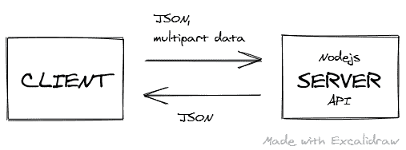

下面是我希望容易理解的`api.js`:

<details><summary>API WRAPPER</summary>

```
import { route } from "preact-router";

function checkStatus(response) {
  const responseCode = response.status;

  if (responseCode >= 200 && responseCode < 300) {
    return response;
  }

  // handle user not authorized scenario
  if (responseCode === 401) {
    response
      .json()
      .then((json) =>
        route(`/signin${json.refererUri ? `?dest=${json.refererUri}` : ""}`)
      );
    return;
  }

  // pass along error response to the 'catch' block of your await/async try & catch block
  return response.json().then((json) => {
    return Promise.reject({
      status: responseCode,
      ok: false,
      statusText: response.statusText,
      body: json,
    });
  });
}

function handleError(error) {
  error.response = {
    status: 0,
    statusText:
      "Cannot connect. Please make sure you are connected to internet.",
  };
  throw error;
}

function parseJSON(response) {
  if (response.status === 204 || response.status === 205) {
    return null;
  }
  return response.json();
}

function request(url, options) {
  return fetch(url, options)
    .catch(handleError) // handle network issues
    .then(checkStatus)
    .then(parseJSON)
    .catch((e) => {
      throw e;
    });
}

export function api(endPoint, userOptions = {}) {
  const url = process.env.API_BASE_URL + endPoint;

  // to pass along our auth cookie to server
  userOptions.credentials = "include";

  const defaultHeaders = {
    "Content-Type": "application/json",
    Accept: "application/json",
  };

  if (userOptions.body instanceof File) {
    const formData = new FormData();
    formData.append("file", userOptions.body);
    userOptions.body = formData;
    // let browser set content-type to multipart/etc.
    delete defaultHeaders["Content-Type"];
  }

  if (userOptions.body instanceof FormData) {
    // let browser set content-type to multipart
    delete defaultHeaders["Content-Type"];
  }

  const options = {
    ...userOptions,
    headers: {
      ...defaultHeaders,
      ...userOptions.headers,
    },
  };

  return request(url, options);
} 
```</details> 

如果你以前使用过原生的 [`fetch`](https://developer.mozilla.org/en-US/docs/Web/API/Fetch_API/Using_Fetch) ，那么开始使用这个 API 模块几乎没有什么新东西需要学习。

#### 使用

```
// Home.jsx
import { api } from "../lib/api";

async componentDidMount() {
  try {
    // POST-ing data
    const response = await api(
      '/projects/save/121212121',
      {
        method: 'PUT',
        body: JSON.stringify(dataObject)
      }
    )

    // or GET-ting data
    const { myWorkspaces } = await api('/users/home');

  } catch (err) {
    // handle Promise.reject passed from api.js
  }
} 
```

但是如果你更喜欢使用一个库来处理你的 HTTP 调用，我推荐使用[‘redaxios’](https://github.com/developit/redaxios)。它不仅与流行的 [axios](https://www.npmjs.com/package/axios) 共享一个 API，而且更加轻量级。

### 在本地测试生产版本

我总是在本地构建我的客户端应用程序，以便在部署到云之前在我的浏览器中进行测试和测量。

我在“client”文件夹的`package.json`中有一个 npm 脚本(`npm run test-build`)，它将在本地 web 服务器上构建和服务。这样我就可以在我的浏览器里玩了，网址是 [http://localhost:5000](http://localhost:5000) :

```
"scripts": {
    "test-build": "cross-env NODE_ENV=production TEST_RUN=true node_modules/.bin/webpack && npm run serve",
    "serve": "ws --spa index.html --directory dist --port 5000 --hostname localhost"
  } 
```

该应用程序是使用一个名为[“本地网络服务器”](https://www.npmjs.com/package/local-web-server)的工具提供的。这是目前为止我发现的唯一一个适合做水疗的。

### 安全性

考虑添加 [CSP](https://developers.google.com/web/fundamentals/security/csp/) 安全报头。

在 firebase 中添加头:[https://firebase . Google . com/docs/hosting/full-config # headers](https://firebase.google.com/docs/hosting/full-config#headers)

您的`firebase.json`中的 CSP 报头示例:

```
{
  "source": "**",
  "headers": [
    {
      "key": "Strict-Transport-Security",
      "value": "max-age=63072000; includeSubdomains; preload"
    },
    {
      "key": "Content-Security-Policy",
      "value": "default-src 'none'; img-src 'self'; script-src 'self'; style-src 'self'; object-src 'none'"
    },
    { "key": "X-Content-Type-Options", "value": "nosniff" },
    { "key": "X-Frame-Options", "value": "DENY" },
    { "key": "X-XSS-Protection", "value": "1; mode=block" },
    { "key": "Referrer-Policy", "value": "same-origin" }
  ]
} 
```

如果你使用 Stripe，确保你也添加了他们的 CSP 指令:
[https://Stripe . com/docs/security/guide # content-security-policy](https://stripe.com/docs/security/guide#content-security-policy)

最后，确保你在这里得到一个**并拍拍自己的背！**

 **## 设计

在我开始编写任何代码之前，我想在脑海中有一个卷轴，告诉我如何让新用户加入我的应用程序。然后，我会在笔记本上画出这样做可能会是什么样子，并在脑海中反复播放卷轴的同时重复这些草图。

对于我的第一次“冲刺”，我将主要建立一个“用户界面/UX 框架”,随着时间的推移，我会在这个框架上添加一些东西。然而，重要的是要记住，你在这个过程中做出的每一个决定都应该是开放式的，并且容易撤销。

这样，当你被任何过于自信和浪漫的信念冲昏头脑时，一个“小”但谨慎的决定不会带来厄运。

不确定这是否有意义，但是让我们探索一些概念，这些概念有助于我的设计在实践中保持一致。

### 模块标度

当你的设计按照“模块尺度”流动时，它对你的用户来说更有意义。该比例应指定空间或大小的比例，每个空间或大小以一定的比例递增。


*Figure: Modular scale*

创建比例的一种方法是使用 CSS[‘自定义属性’](https://developer.mozilla.org/en-US/docs/Web/CSS/Using_CSS_custom_properties)(感谢 view-source[every-layout . dev](https://every-layout.dev/)):

```
:root {
  --ratio: 1.414;
  --s-3: calc(var(--s0) / var(--ratio) / var(--ratio) / var(--ratio));
  --s-2: calc(var(--s0) / var(--ratio) / var(--ratio));
  --s-1: calc(var(--s0) / var(--ratio));
  --s0: 1rem;
  --s1: calc(var(--s0) * var(--ratio));
  --s2: calc(var(--s0) * var(--ratio) * var(--ratio));
  --s3: calc(var(--s0) * var(--ratio) * var(--ratio) * var(--ratio));
} 
```

如果你不知道用什么尺度，只需[选择一个与你的设计最接近的尺度](https://www.modularscale.com/)，然后**坚持使用**。

然后在一个名为`spacing.scss`的文件中创建一组实用程序类，每个类都与一个标尺相关联。我将使用它们在项目中分隔我的 UI 元素:

```
.mb-1 {
  margin-bottom: var(--s1);
}
.mb-2 {
  margin-bottom: var(--s2);
}
.mr-1 {
  margin-right: var(--s1);
}
.mr--1 {
  margin-right: var(--s-1);
} 
```

请注意，我试图仅在`right`和`bottom`方向定义间距，如这里的所示的[。](https://csswizardry.com/2012/06/single-direction-margin-declarations/)

根据我的经验，最好不要在 UI 组件中加入任何间距定义:

**不要**

```
// Button.scss
.btn {
  margin: 10px; // a default spacing; annoying to have in most cases
  font-style: normal;
  border: 0;
  background-color: transparent;
}

// Button.jsx
import s from './Button.scss';

export function Button({children, ...props}) {
  return (
    <button class={s.btn} {...props}>{children}</button>
  )
}

// Usage
<Button /> 
```

**做**

```
// Button.scss
.btn {
  font-style: normal;
  border: 0;
  background-color: transparent;
}

// Button.jsx
import s from './Button.scss';

export function Button({children, className, ...props}) {
  return (
    <button class={`${s.btn} ${className}`} {...props}>{children}</button>
  )
}

// Usage
// Pass your spacing utility classes when building your pages
<Button className="mr-1 pb-1">Sign Up</Button> 
```

### 颜色；色彩；色调

有许多调色板工具。但是来自 [Material](https://material.io/design/color/the-color-system.html#tools-for-picking-colors) 的那款是我经常去买颜色的那款，因为它们展现了它们所有的光彩！？

然后我将再次将它们定义为 CSS 自定义属性:

```
:root {
  --black-100: #0b0c0c;
  --black-80: #424242;
  --black-60: #555759;
  --black-50: #626a6e;

  font-size: 105%;
  color: var(--black-100);
} 
```

### CSS 重置

“CSS 重置”的目的是移除普通浏览器的默认样式。

外面有很多这样的人。请注意，有些人可能会非常固执己见，可能会给你带来更多不必要的麻烦。这里有一个流行的:[https://meyerweb.com/eric/tools/css/reset/reset.css](https://meyerweb.com/eric/tools/css/reset/reset.css)

这是我的:

```
*,
*::before,
*::after {
  box-sizing: border-box;
  overflow-wrap: break-word;
  margin: 0;
  padding: 0;
  border: 0 solid;
  font-family: inherit;
  color: inherit;
}

/* Set core body defaults */
body {
  scroll-behavior: smooth;
  text-rendering: optimizeLegibility;
}

/* Make images easier to work with */
img {
  max-width: 100%;
}

/* Inherit fonts for inputs and buttons */
button,
input,
textarea,
select {
  color: inherit;
  font: inherit;
} 
```

你也可以考虑使用 [postcss-normalize](https://github.com/csstools/postcss-normalize) 来根据你的目标浏览器生成一个。

### 造型练习

如果有必要，我总是在引出大枪之前先尝试在**标签**级别进行样式化，在我的例子中，是[【CSS 模块】](https://github.com/css-modules/css-modules)，用于封装每个组件的样式:

```
- src
  - routes
    - SignIn
      - SignIn.js
      - SignIn.scss 
```

`SignIn.scss`包含只属于`<SignIn />`组件的 CSS。

此外，我不使用 React 生态系统中流行的 CSS 库，如“样式组件”和“情感”。我尽可能使用纯 HTML 和 CSS，只让 Preact 为我处理 DOM 和状态更新。

例如，对于`<input/>`元素:

```
// index.scss

label {
  display: block;
  color: var(--black-100);
  font-weight: 600;
}

input {
  width: 100%;
  font-weight: 400;
  font-style: normal;
  border: 2px solid var(--black-100);
  box-shadow: none;
  outline: none;
  appearance: none;
}

input:focus {
  box-shadow: inset 0 0 0 2px;
  outline: 3px solid #fd0;
  outline-offset: 0;
} 
```

然后在 JSX 文件中使用它的 vanilla 标签:

```
// SignIn.js

render() {
  return (
    <div class="form-control">
      <label htmlFor="email">
        Email&nbsp;
        <strong>
          <abbr title="This field is required">*</abbr>
        </strong>
      </label>
      <input
        required
        value={this.email}
        type="email"
        id="email"
        name="email"
        placeholder="e.g. sara@widgetco.com"
      />
    </div>
  )
} 
```

### 布局

我使用 **CSS Flexbox** 在 Sametable 中进行布局工作。我不需要任何 CSS 框架。学习 CSS Flexbox 的基本原则，用更少的代码做更多的事情。此外，在许多情况下，由于布局算法，结果已经是响应性的，节省了那些`@media`查询。

让我们看看如何用最少的 CSS 在 Flexbox 中构建一个通用布局:


见笔[侧边栏/内容布局](https://codepen.io/kilgarenone/pen/mdeLwvx)[上的](https://codepen.io)码笔。

#### 资源

*   [Flexbox froggy](https://flexboxfroggy.com/)
*   [关于 flexbox 你需要知道的一切](https://www.freecodecamp.org/news/understanding-flexbox-everything-you-need-to-know-b4013d4dc9af/)

## 计算机网络服务器

```
- server
  - server.js
  - package.json
  - .env 
```

[服务器](https://github.com/kilgarenone/boileroom/tree/master/server)运行在 NodeJS(ExpressJS 框架)上，为我所有的 **API** 端点提供服务。

```
// Example endpoint: https://example.com/api/tasks/save/12345
router.put("/save/:taskId", (req, res, next) => {}); 
```

[`server.js`](https://github.com/kilgarenone/boileroom/blob/master/server/server.js) 包含[熟悉的](https://expressjs.com/en/starter/hello-world.html)代码来启动 Nodejs 服务器。

### 文件结构

我很感激这份关于项目结构的易理解的指南，它让我能够坐下来快速构建我的 API。

### Npm 脚本(服务器)

在“server”文件夹内的`package.json`中，有一个 npm 脚本将为您启动服务器:

```
"scripts": {
  "dev": "nodemon -r dotenv/config server.js",
  "start": "node server.js"
} 
```

*   `dev`剧本[‘预装’](https://www.npmjs.com/package/dotenv#preload)dotenv 如建议[此处](https://medium.com/the-node-js-collection/making-your-node-js-work-everywhere-with-environment-variables-2da8cdf6e786#b1af)。就这样——您将可以从`process.env`对象访问在`.env`文件中定义的 env 变量。

*   `start`脚本用于在生产中启动我们的 Nodejs 服务器。在我的例子中，GCP 将运行这个脚本来启动我的节点。

### 数据库ˌ资料库

我使用 **Postgresql** 作为我的数据库。然后我使用[‘node-postgres’](https://node-postgres.com/)(又名`pg`)库将我的 Nodejs 连接到数据库。一旦完成，我就可以在我的 API 端点和数据库之间进行 CRUD 操作了。

#### 设置

对于地方发展:

1.  在这里下载[Postgresql](https://www.enterprisedb.com/downloads/postgres-postgresql-downloads)。获取最新版本。让一切保持原样。记住你设置的密码。然后，

    *   打开“pgAdmin”。这是一个浏览器应用程序。
    *   为你的 app 创建一个数据库:
        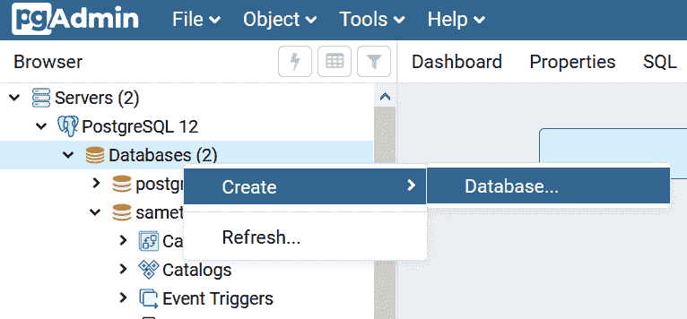
2.  在`.env`文件中定义一组环境变量:

    ```
    DB_HOST='localhost'
    DB_USER=postgres
    DB_NAME=<YOUR_CUSTOM_DATABASE_NAME_HERE>
    DB_PASSWORD=<YOUR_MASTER_PASSWORD>
    DB_PORT=5432 
    ```

3.  然后，我们将从 Nodejs 通过连接池将[新客户端](https://node-postgres.com/features/connecting)连接到我们的 Postgresql 数据库。我在`server/db/index.js`做这件事:

    [#](#db-wrapper)

    ```
    const { Pool } = require("pg");

    const pool = new Pool({
      user: process.env.DB_USER,
      host: process.env.DB_HOST,
      port: process.env.DB_PORT,
      database: process.env.DB_NAME,
      password: process.env.DB_PASSWORD,
    });

    // TRANSACTION
    // https://github.com/brianc/node-postgres/issues/1252#issuecomment-293899088
    const tx = async (callback, errCallback) => {
      const client = await pool.connect();
      try {
        await client.query("BEGIN");
        await callback(client);
        await client.query("COMMIT");
      } catch (err) {
        console.log(("DB ERROR:", err));
        await client.query("ROLLBACK");
        errCallback && errCallback(err);
      } finally {
        client.release();
      }
    };
    // the pool will emit an error on behalf of any idle clients
    // it contains if a backend error or network partition happens
    pool.on("error", (err) => {
      process.exit(-1);
    });

    pool.on("connect", () => {
      console.log("❤️ Connected to the Database ❤️");
    });

    module.exports = {
      query: (text, params, callback) => pool.query(text, params, callback),
      tx,
      pool,
    }; 
    ```

    *   如果我必须调用**许多相互依赖的**查询，我将在 API 中使用`tx`函数。
    *   如果我正在进行一个**单个**查询，我将使用`query`函数。

就是这样！现在您有了一个用于本地开发的数据库？

#### 使用

我承认:我手工制作了 Sametable 的所有查询。

在我看来，SQL 本身已经是一种不需要进一步抽象的声明性语言——易于阅读、理解和编写。如果你很好地分离了你的 API 端点，它是可维护的。

如果你知道你正在构建一个 facebook 规模的应用程序，也许使用 ORM 是明智的。但我只是一个普通的普通人，独自建造一个非常狭窄的 SaaS。

因此，我需要避免开销和复杂性，同时考虑诸如入职的容易程度、性能、重复的容易程度以及知识的潜在生命周期等因素。

这让我想起了在加入流行的前端框架之前被敦促学习普通的 JavaScript。因为你可能会意识到:这就是你想要达到第 1000 个客户所需要的。

不过，公平地说，当我决定走这条路的时候，我在编写 MySQL 方面经验不多。因此，如果您对 SQL 一无所知，并且急于发布它，那么您可能需要考虑一个类似 [knex.js](http://knexjs.org/) 的库。

##### 例子

```
// server/routes/projects.js

const express = require("express");
const asyncHandler = require("express-async-handler");
const db = require("../db");

const router = express.Router();

module.exports = router;

// [POST] api/projects/create
router.post(
  "/create",
  express.json(),
  asyncHandler(async (req, res, next) => {
    const { title, project_id } = req.body;

    db.tx(async (client) => {
      const {
        rows,
      } = await client.query(
        `INSERT INTO tasks (title) VALUES ($1) RETURNING mask_id(task_id) as masked_task_id, task_id`,
        [title]
      );

      res.json({ id: rows[0].masked_task_id });
    }, next);
  })
); 
```

*   [`express-async-handler`](https://github.com/Abazhenov/express-async-handler/blob/master/index.js) 主要用于处理我的路由处理程序中的异步错误。快递 5 滴的时候就不再需要了。

*   导入`db`模块以使用`tx`方法。传递您手工制作的 SQL 查询和[参数](https://node-postgres.com/features/queries)。

就是这样！

### 创建表模式

在开始查询数据库之前，您需要创建表。每个表都包含一个实体的信息。

但是我们并不只是将一个实体的所有信息都放在同一个表中。我们需要以提高查询性能和数据可维护性的方式组织信息。在这个练习中帮助我的是一个叫做[](https://firebase.google.com/docs/database/web/structure-data)**的概念。**

 **如前所述，我们不想在同一个表中存储一个实体的所有信息。例如，我们有一个存储了`fullname`、`password`和`email`的`users`表。到目前为止还不错。

但是，当我们将分配给特定用户的所有项目的 id 存储在同一个表的单独列中时，问题就出现了。相反，我将把它们分成不同的表格:

1.  创建`users`表。请注意，它没有存储任何与“项目”相关的数据:

    ```
    CREATE TABLE users(
      user_id BIGSERIAL PRIMARY KEY,
      fullname TEXT NOT NULL,
      pwd TEXT NOT NULL,
      email TEXT UNIQUE NOT NULL,
    ); 
    ```

2.  创建一个`projects`表来存储关于项目细节的数据:

    ```
    CREATE TABLE projects(
      project_id BIGSERIAL PRIMARY KEY,
      title TEXT,
      content TEXT,
      due_date TIMESTAMPTZ,
      status SMALLINT,
      created_on TIMESTAMPTZ NOT NULL DEFAULT now()
    ); 
    ```

3.  通过将用户的 ID 与她所拥有的项目的 ID 相关联，创建一个关于项目所有权的“桥接”表:

    ```
    CREATE TABLE project_ownerships(
      project_id BIGINT REFERENCES projects ON DELETE CASCADE,
      user_id BIGINT REFERENCES users ON DELETE CASCADE,
      PRIMARY KEY (project_id, user_id),
      CONSTRAINT project_user_unique UNIQUE (user_id, project_id)
    ); 
    ```

4.  最后，为了获得分配给特定用户的所有项目，我们将做关系数据库最擅长的事情: [`join`](https://www.postgresqltutorial.com/postgresql-joins/) 。

我将把我所有的模式放在项目根目录 [#](#schemas-file) 下的一个`.sql`文件中:

```
CREATE EXTENSION IF NOT EXISTS "uuid-ossp";

CREATE TABLE users(
  user_id BIGSERIAL PRIMARY KEY,
  fullname TEXT NOT NULL,
  pwd TEXT NOT NULL,
  email TEXT UNIQUE NOT NULL,
  created_on TIMESTAMPTZ NOT NULL DEFAULT now()
); 
```

然后，我将在 pgAdmin 中复制、粘贴并运行它们:

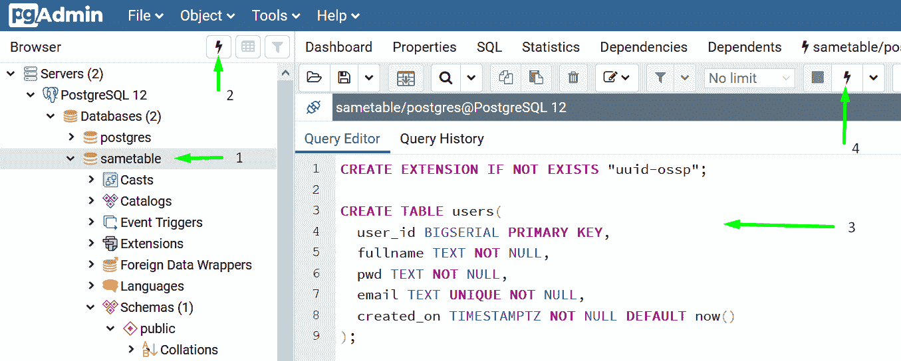

毫无疑问，有更先进的方法可以做到这一点，所以如果你想探索你喜欢的东西，这取决于你。

### 删除数据库

一开始，我不得不经常删除整个数据库，以一组新的模式开始。

诀窍是:在数据库的查询编辑器 pgAdmin 中，复制、粘贴并运行下面的命令:

```
DROP SCHEMA public CASCADE;
CREATE SCHEMA public;
GRANT ALL ON SCHEMA public TO postgres;
GRANT ALL ON SCHEMA public TO public;
COMMENT ON SCHEMA public IS 'standard public schema'; 
```

### 制作 SQL 查询

我在 **pgAdmin** 中编写我的 SQL 查询，以从 API 端点获取我想要的数据。

为了给在 pgAdmin:
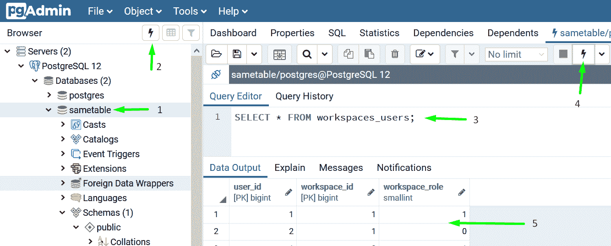中这样做提供一个方向感

#### 公共表表达式(cte)

当我在探索如何从不同的表中获得我想要的数据，并按照我的意愿组织它们，而不需要进行大量单独的数据库查询和 for 循环时，我偶然发现了一个叫做 [**CTEs**](https://www.postgresql.org/docs/9.1/queries-with.html) 的模式。

CTE 的工作方式很简单，尽管它看起来令人生畏:你写你的查询。每个查询都有一个别名(`q`、`q1`、`q3`)。下一个查询可以通过别名来访问任何先前查询的结果(`q1.workspace_id`):

```
WITH q AS (SELECT * FROM projects_tasks WHERE task_id=$1)
, q1 AS (SELECT wp.workspace_id, wp.project_id, q.task_id FROM workspaces_projects wp, q WHERE wp.project_id = q.project_id)
, q3 AS (SELECT q1.workspace_id AS workspace_id, wp.name AS workspace_title, mask_id(q1.project_id) AS project_id, p.title AS project_title, mask_id(t.task_id) AS task_id, t.title, t.content, t.due_date, t.priority, t.status)

SELECT * FROM q3; 
```

Sametable 中几乎所有的查询都是这样编写的。

### 雷迪斯

Redis 是一个在内存中存储数据的 NoSQL 数据库。在 Sametable 中，我使用 Redis 有两个目的:

1.  一旦用户登录，就从`users`表中存储用户的会话数据和基本信息——姓名、电子邮件和表明用户是否是订户的标志。
2.  缓存我的 Postgresql 的一些查询结果，以避免在缓存仍然新鲜的情况下查询数据库。

#### 装置

我在一台安装了 Windows 子系统 Linux (WSL)的 Windows 10 机器上。这是我在机器上安装 Redis 时遵循的唯一指南:

[https://redislabs . com/blog/redis-on-windows-10/](https://redislabs.com/blog/redis-on-windows-10/)

如果您还没有 WSL，请按照指南安装它。

然后我将在 WSL bash 中启动我的本地 Redis 服务器:

1.  按下`Win` + `R`。
2.  键入`bash`并回车。
3.  在终端中，运行`sudo service redis-server start`

现在安装 [`redis`](https://www.npmjs.com/package/redis) npm 包:

```
cd server

npm i redis 
```

确保将其安装在`server`的`package.json`中，因此称为`cd server`。

然后我在`server/db`下创建一个名为`redis.js`的文件:

```
// server/db/redis.js

const redis = require("redis");
const { promisify } = require("util");

const redisClient = redis.createClient(
  NODE_ENV === "production"
    ? {
        host: process.env.REDISHOST,
        no_ready_check: true,
        auth_pass: process.env.REDIS_PASSWORD,
      }
    : {}
);

redisClient.on("error", (err) => console.error("ERR:REDIS:", err));

const redisGetAsync = promisify(redisClient.get).bind(redisClient);
const redisSetExAsync = promisify(redisClient.setex).bind(redisClient);
const redisDelAsync = promisify(redisClient.del).bind(redisClient);

// 1 day expiry
const REDIS_EXPIRATION = 7 * 86400; // seconds

module.exports = {
  redisGetAsync,
  redisSetExAsync,
  redisDelAsync,
  REDIS_EXPIRATION,
  redisClient,
}; 
```

*   通过[默认](https://www.npmjs.com/package/redis#options-object-properties)，`node-redis`将在`6379`端口连接到`localhost`。但是，如果您将 Redis 托管在 VM 中，那么在生产环境中可能就不是这样了。因此，如果它处于生产模式，我提供这个对象:

    ```
    {
       host: process.env.REDISHOST,
       no_ready_check: true,
       auth_pass: process.env.REDIS_PASSWORD,
     } 
    ```

    *   TBH，我对`no_ready_check`不太确定。我是从这个官方[教程](https://docs.redislabs.com/latest/rs/references/client_references/client_nodejs/)里得到的。
    *   `auth_pass`和`host`是自定义提供的，因为我在 GCE 虚拟机中托管 Redis，并在 Redis 上设置了密码。

*   我承诺我将使用 Redis 方法使它们异步，以避免阻塞 NodeJS 的单线程。

现在您有了用于本地发展的 Redis！

### 错误处理和记录

#### 错误处理

Nodejs 中的错误处理有一个范例，我们将在 3 个不同的上下文中探讨它。

要做好准备，我们首先需要做好两件事:

1.  一个名为 [http-errors](https://www.npmjs.com/package/http-errors) 的 npm 包将为我们提供一个标准的错误数据结构，尤其是在客户端。

    ```
    npm install http-errors 
    ```

2.  我们在全局级别创建一个自定义错误处理程序，通过`next(err)`从路由或`catch`块捕获**所有**传播的错误:

    ```
    // app.js
    const express = require("express");
    const app = express();
    const createError = require("http-errors");

    // our central custom error handler
    // NOTE: DON"T REMOVE THE 'next' even though eslint complains it's not being used!!!
    app.use(function (err, req, res, next) {
      // errors wrapped by http-errors will have 'status' property defined. Otherwise, it's a generic unexpected error
      const error = err.status
        ? err
        : createError(500, "Something went wrong. Notified dev.");

      res.status(error.status).json(error);
    }); 
    ```

    正如您将看到的，Nodejs 中错误处理的一般模式围绕着“中间件”链和`next`参数:

    > 对 next()和 next(err)的调用表明当前处理程序已经完成，并且处于什么状态。next(err)将跳过链中所有剩余的处理程序，除了那些为处理错误而设置的处理程序。。。[来源](https://expressjs.com/en/guide/error-handling.html)

    注意，尽管这是 Express 中处理错误的一种常见模式，但是您可能想要考虑一种更复杂的替代方式。

##### 处理输入验证错误

在客户端和服务器端验证用户的输入是一个很好的实践。

在服务器端，我使用一个名为[‘express-validator’](https://express-validator.github.io/docs/)的库来完成这项工作。如果有任何输入无效，我会用一个 HTTP 代码和一个错误消息来处理，通知用户。

例如，当用户提供的电子邮件无效时，我们将通过使用“http-errors”库创建一个错误对象来提前退出，然后将其传递给`next`函数:

```
const { body, validationResult } = require("express-validator");

router.post(
  "/login",
  upload.none(),
  [body("email", "Invalid email format").isEmail()],
  asyncHandler(async (req, res, next) => {
    const errors = validationResult(req);
    if (!errors.isEmpty()) {
      return next(createError(422, errors.mapped()));
    }

    res.json({});
  })
); 
```

将向客户端发送以下响应:

```
{
  "message": "Unprocessable Entity",
  "email": {
    "value": "hello@mail.com232",
    "msg": "Invalid email format",
    "param": "email",
    "location": "body"
  }
} 
```

那就看你想用它做什么了。例如，您可以访问`email.msg`属性，在电子邮件输入字段下面显示错误消息。

##### 处理来自业务逻辑的错误

假设有这样一种情况，用户输入了一个数据库中不存在的电子邮件。在这种情况下，我们需要告诉用户再试一次:

```
router.post(
  "/login",
  upload.none(),
  asyncHandler(async (req, res, next) => {
    const { email, password } = req.body;

    const { rowCount } = await db.query(
      `SELECT * FROM users WHERE email=($1)`,
      [email]
    );

    if (rowCount === 0) {
      // issue an error with generic message
      return next(
        createError(422, "Please enter a correct email and password")
      );
    }

    res.json({});
  })
); 
```

记住，任何传递给' next'( `next(err)`)的错误对象都将被我们上面设置的自定义错误处理程序捕获。

##### 处理来自数据库的意外错误

我将路由处理程序的`next`传递给我的数据库的[事务](#db-wrapper)包装函数，以处理任何意外的错误。

```
router.post(
  "/invite",
  async (req, res, next) => {
    db.tx(async (client) => {
          const {
            rows,
            rowCount,
          } = await client.query(
            `SELECT mask_id(user_id) AS user_id, status FROM users WHERE users.email=$1`,
            [email]
          );
    }, next)
) 
```

#### 记录

当错误发生时，通常的做法是 1)将其记录到系统中，2)自动通知您。

这个领域有很多工具。但我最终得到了其中的两个:

*   [**哨兵**](https://sentry.io/welcome/) 用于存储我的错误的详细信息(例如堆栈跟踪)，并将其显示在他们基于 web 的仪表板上。
*   [**pino**](https://github.com/pinojs/pino) 启用登录我的节点。

**为什么放哨**？很多开发者和小型创业公司都推荐它。它提供 5000 个错误，你可以每月免费发送。从长远来看，如果你正在经营一个小的副业项目，并且小心翼翼，我会说，这将持续到你能负担得起一个更豪华的供应商或计划。

另一个值得探索的选择是 [honeybadger.io](https://www.honeybadger.io/) ，有更慷慨的自由层，但没有[皮诺运输](https://getpino.io/#/docs/transports)。

**为什么 Pino** -为什么不是哨兵提供的官方 SDK？因为 Pino 有[【低开销】](https://github.com/pinojs/pino#low-overhead)，而 Sentry SDK，虽然它给你一个更完整的错误画面，但似乎有一个复杂的[内存问题](https://github.com/getsentry/sentry-javascript/issues/1762)，我看不出自己能够规避。

至此，日志系统在 Sametable 中是如何连接的:

```
// server/lib/logger.js

// install missing packages
const pino = require("pino");
const { createWriteStream } = require("pino-sentry");
const expressPino = require("express-pino-logger");

const options = { name: "sametable", level: "error" };

// SENTRY_DSN is provided by Sentry. Store it as env var in the .env file.
const stream = createWriteStream({ dsn: process.env.SENTRY_DSN });

const logger = pino(options, stream);
const expressLogger = expressPino({ logger });

module.exports = {
  expressLogger, // use it like app.use(expressLogger) -> req.log.info('haha)
  logger,
}; 
```

我没有把记录器(`expressLogger`)作为中间件附加在链(`app.use(expressLogger)`)的顶端，而是只在我想记录错误的地方使用`logger`对象。

例如，自定义全局错误处理程序使用`logger`对象:

```
app.use(function (err, req, res, next) {
  const error = err.status
    ? err
    : createError(500, "Something went wrong. Notified dev.");

  if (isProduction) {
    // LOG THIS ERROR IN MY SENTRY DASHBOARD
    logger.error(error);
  } else {
    console.log("Custom error handler:", error);
  }

  res.status(error.status).json(error);
}); 
```

就是这样！别忘了在你的哨兵仪表盘上启用电子邮件**通知**,当你的哨兵收到错误时，它会发出警报！❤️

### URL 共享的永久链接

我们已经看到 URL 由神秘的字母数字字符串组成，比如 Youtube 上的那些:`https://youtube.com/watch?v=upyjlOLBv5o`。这个网址指向一个特定的视频，可以通过分享网址分享给某个人。URL 中代表视频的关键成分是末尾的唯一 ID:`upyjlOLBv5o`。

我们在其他网站也看到了这种 ID:`vimeo.com/259411563`和 Stripe 中的订阅 ID`sub_aH2s332nm04`。

据我所知，有三种方法可以达到这个结果:

1.  [在数据库中插入数据时生成 ID](https://stackoverflow.com/a/41988979/73323)。生成的 ID 将是您的`id`列中的 ID，而不是自动递增的 ID:

    | 身份证明（identification） | 标题 |
    | --- | --- |
    | owmCAx552Q | 怎么哭 |
    | ZIofD6l3X9 | 如何微笑 |

然后你会在面向公众的 URL 中公开这些 id:`https://example.com/task/owmCAx552Q`。给定这个到后端的 URL，您可以从数据库中检索相应的资源:

```
router.get("/task/:taskId", (req, res, next) => {
  const { taskId } = req.params;
  // SELECT * FROM tasks WHERE id=<taskId>
}); 
```

据我所知，这种方法的缺点是:

*   id 可能是像这样公开暴露的敏感信息。
*   这些 id 不利于表的索引和‘连接’性能。

2.  您可以在您的表中自动增加您的 id，但是您将通过在数据库操作期间[生成它们的字母数字副本来表示它们:](https://hashids.org/postgresql/)

    ```
     SELECT hash_encode(123, 'this is my salt', 10); -- Result: 4xpAYDx0mQ
      SELECT hash_decode('4xpAYDx0mQ', 'this is my salt', 10); -- Result: 123 
    ```

    我在 Windows 机器上集成这个库时遇到了麻烦。所以我选择了下一个选项。

3.  [类似于上述第二种选择，但方法不同](https://old.reddit.com/r/PostgreSQL/comments/6gw866/best_practice_for_id_system_that_is_obscure_for/diu8cr1/)。这将生成数字 ID: `https://example.com/task/2013732563294762`

## 用户认证系统

如果您需要支持 SSO 和第三方 OAuth 提供者之类的东西，用户认证系统可能会变得非常复杂。这就是为什么我们有第三方工具，如 Auth0、Okta 和 PassportJS 来为我们抽象出来。但是这些工具是有成本的:供应商锁定、更多的 Javascript 负载和认知开销。

我认为，如果你刚刚起步，只需要*某种* *类型的*认证系统，这样你就可以转移到应用程序的其他部分，同时，被所有处理你不使用的东西的过时教程所淹没，那么，你所需要的可能就是旧的认证方式:**会话 cookie** ，带有**电子邮件**和**密码**！我们也不是在谈论“JWT ”!都不是。

### 向导

这是我最后写的一个指南。按照它，你得到了自己的用户认证系统！

## 电子邮件

目前，在 Sametable 中，它只发送“事务”类型的电子邮件，比如当用户重置密码时发送重置密码电子邮件。

node.js 中有两种发送邮件的方式

1.  **用[节点邮件](https://nodemailer.com/about/)滚动自己的**。

    我不会走这条路，因为尽管发送一封电子邮件可能看起来是一件微不足道的任务，但“大规模”做这件事是很难的；每封邮件都必须发送成功；并且它们不能出现在用户的垃圾邮件文件夹中；以及其他我不知道的事情。

2.  从**个电子邮件服务提供商**中选择一个。

许多电子邮件服务提供免费等级计划，每月/每天免费发送有限数量的电子邮件。当我在 2019 年 10 月开始探索 Sametable 的这个领域时，Mailgun 是一个显而易见的人——它每月免费提供 10，000 封电子邮件！

但是，遗憾的是，当我为这一部分的撰写进行研究时，我发现它不再提供这种功能了。尽管如此，我仍然坚持使用 Mailgun，他们的现收现付计划:发送 1000 封邮件将花费你 80 美分。

如果你因为任何原因不愿意支付一分钱，我可以为你找到两个选择:

*   [https://www.mailjet.com/pricing/](https://www.mailjet.com/pricing/)
*   [https://www.sendinblue.com/pricing/](https://www.sendinblue.com/pricing/)

但是一定要沿着这条路走下去，同时要意识到，没有人能保证这些自由层计划会像 Mailgun 那样永远保持下去。

### 履行

#### 包装文件

```
// server/lib/email.js

// Run 'npm install mailgun-js' in your 'server' folder
const mailgun = require("mailgun-js");

const DOMAIN = "mail.sametable.app";

const mg = mailgun({
  apiKey: process.env.MAILGUN_API_KEY,
  domain: DOMAIN,
});

function send(data) {
  mg.messages().send(data, function (error) {
    if (!error) return;
    console.log("Email send error:", error);
  });
}

module.exports = {
  send,
}; 
```

#### 使用

```
const mailer = require("../lib/email");

// Simplified for only email-related stuff
router.post(
  "/resetPassword",
  upload.none(),
  (req, res, next) => {
    const { email } = req.body;
    const data = {
      from: "Sametable <feedback@sametable.app>",
      to: email,
      subject: "Reset your password",
      text: `Click this link to reset your password: https://example.com?token=1234`,
    };
    mailer.send(data);
    res.json({});
  })
); 
```

### 电子邮件模板

您发送的每种类型的电子邮件都可以有自己的电子邮件模板，其内容可以随您提供的动态值而变化。

#### 工具

[**mjml**](https://mjml.io/) 是我用来建立邮件模板的工具。当然，有许多拖放式的电子邮件构建器不会因为看到“代码”而感到害怕。但是如果你只知道基本的 React/HTML/CSS，mjml 会给你很好的可用性和最大的灵活性。

很容易[上手](https://mjml.io/getting-started/1)。像电子邮件构建器一样，您用一堆可重用的组件组成一个模板，并通过向它们的属性提供值来定制它们。

以下是我编写模板的地方:

*   此 [VSCode 扩展](https://marketplace.visualstudio.com/items?itemName=attilabuti.vscode-mjml)
*   [现场代码编辑器](https://mjml.io/try-it-live)

#### 示例模板

<details><summary>Email Template</summary>

```
<mjml>
  <mj-head>
    <mj-attributes>
      <mj-class
        name="font-family"
        font-family="-apple-system,system-ui,BlinkMacSystemFont,'Segoe UI',sans-serif"
      />
      <mj-class name="fw-600" font-weight="600" />
    </mj-attributes>
  </mj-head>
  <mj-body>
    <mj-section>
      <mj-column>
        <mj-image
          width="150px"
          src="https://www.dl.dropboxusercontent.com/s/pgtwrnfa3lqkf5r/sametable_logo_with_text.png"
        />
      </mj-column>
    </mj-section>
    <mj-section>
      <mj-column>
        <mj-text align="center" font-size="20px" mj-class="font-family"
          >{{assigner_name}} assigned a project to you</mj-text
        >
        <mj-spacer height="10px" />
        <mj-text align="center" font-size="25px" mj-class="font-family fw-600"
          >{{project_title}}</mj-text
        >
        <mj-spacer height="25px" />
        <mj-button
          font-size="16px"
          mj-class="font-family fw-600"
          background-color="#000"
          color="white"
          href="{{invite_link}}"
          >View the project</mj-button
        >
      </mj-column>
    </mj-section>
    <mj-spacer height="55px" />
    <mj-section background-color="#EEEBE7" padding="25px 40px">
      <mj-column>
        <mj-text
          align="center"
          color="#45495d"
          font-size="15px"
          line-height="14px"
        >
          Problems or questions? Feel free to reply to this email.
        </mj-text>
        <mj-text padding="30px 0 0 0" align="center" font-size="16px">
          Made with ❤️ by
          <a href="https://twitter.com/kheohyeewei">@kheohyeewei</a>
        </mj-text>
      </mj-column>
    </mj-section>
  </mj-body>
</mjml> 
```</details> 

##### 结果

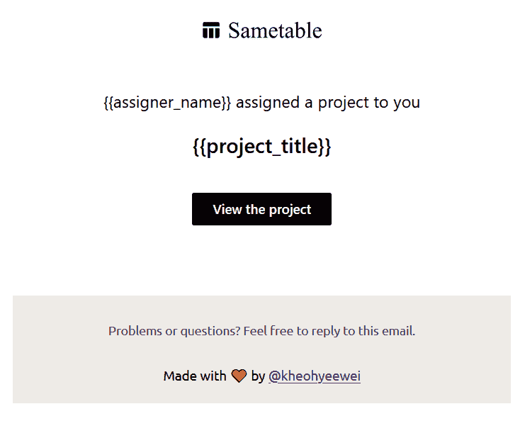

请注意双花括号中的占位符名称，如`{{project_title}}`。在发送出去之前，它们将被替换为相应的值。

#### 与 Mailgun 集成

首先，从您的 mjml 模板生成 HTML。您可以使用 VSCode 扩展或基于 web 的编辑器来实现这一点:

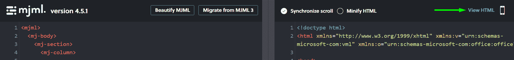

然后在你的 Mailgun 仪表板上创建一个新模板:

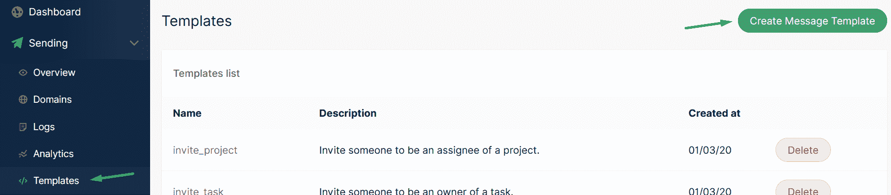

#### 用 Nodejs 中的 Mailgun 发送电子邮件

在路线内:

```
const data = {
  from: "Sametable <feedback@sametable.app>",
  to: email,
  subject: `Hello`,
  template: "invite_project", // the template's name you gave when you created it in mailgun
  "v:invite_link": inviteLink,
  "v:assigner_name": fullname,
  "v:project_title": title,
};

mailer.send(data); 
```

请注意，要将一个值与模板中的占位符名称相关联:`"v:project_title":'Project Mario'`。

### 如何得到其中的一个`hi@example.com`

这是一个电子邮件地址，人们用它来联系你关于你的 SaaS，而不是用一个`lola887@hotmail.com`。

我有三个选择:

1.  如果你在使用 Mailgun，遵循这个指南。然而，新的现收现付层级排除了使这成为可能的特性(`Inbound Email Routing`)。所以也许下一个选择。
2.  如果我在 Mailgun 被踢出我的“10，000”自由级，我会试试这个[https://forwardemail.net/en](https://forwardemail.net/en)
3.  如果其他都失败了，那就支付[‘G Suite 上的 Gmail’](https://gsuite.google.com.my/intl/en_my/products/gmail/)。

## 租用

当一个组织，比如 Acme Inc .在您的 SaaS 上注册时，它被视为一个“租户”——他们在您的服务上“占据”了一个位置。

虽然我以前听说过“多租户”这个术语与 SaaS 相关联，但我从未想过要实现它。我一直认为这将涉及一些神秘的计算机科学的操作，我不可能独自解决所有的问题。

幸运的是，有一种简单的方法可以实现“多租户”:

> 单一数据库；所有客户端共享相同的表；每个客户端都有一个`tenant_id`；由`WHERE tenant_id = $ID`根据 API 请求查询数据库。

所以不要担心——如果你知道基本的 SQL(再次表明在你做的任何事情中掌握基础的重要性！)，您应该对实现这一点所需的步骤有一个清晰的了解。

以下是我之前收藏的三个关于“多租户”的工具性资源:

*   [https://stackoverflow.com/a/47783180/73323](https://stackoverflow.com/a/47783180/73323)
*   [https://stackoverflow.com/a/44530588/73323](https://stackoverflow.com/a/44530588/73323)
*   [https://blog . checklyhq . com/building-a-multi-tenant-SaaS-data-model/](https://blog.checklyhq.com/building-a-multi-tenant-saas-data-model/)

## 域名

Sametable.app 域及其所有 DNS 记录都托管在 [**NameCheap**](https://www.namecheap.com/) 中。我之前在 [hover](https://www.hover.com/) 上(它仍然托管着我个人网站的域名)。但是当我试图输入我的 Mailgun 的 DKIM 值时，我遇到了一个限制。Namecheap 在我的体验中也有更有竞争力的价格。

在 SaaS 发展的哪个阶段，你应该申请域名？嗯，我会说，直到缺乏 DNS 注册阻碍你的发展。在我的例子中，我推迟了它，直到我必须集成 Mailgun，这需要在一个域中创建一堆 DNS 记录。

### 如何得到其中的一个`app.example.com`

你知道那些前面有一个`app`像`app.example.io`的网址吗？是的，这是一个“自定义域”,以“应用程序”作为其“子域”。这一切都是从有了域名开始的。

所以去买一个便宜的或者其他的吧。然后，在我使用 Firebase 的情况下，只需[遵循这个教程](https://firebase.google.com/docs/hosting/custom-domain)就可以了。

## 部署

呃。这是我奋斗时间最长的一个阶段？。这是一个地狱般的旅程，我发现自己在云平台上加倍努力，但最终退出了，因为我发现了它们的缺点，以优化开发人员体验、成本、配额和性能(延迟)。

旅程从我一头扎进数字海洋开始，因为我在 IndieHackers 论坛上看到很多推荐。果然，通过密切关注[教程](https://www.digitalocean.com/community/tutorials/how-to-set-up-a-node-js-application-for-production-on-ubuntu-18-04)，我设法让我的节点在 VM 中启动并运行。

然后我发现 [DO Space](https://www.digitalocean.com/products/spaces/) 不完全是 S3 的 AWS——它[不能](https://ideas.digitalocean.com/ideas/DO-I-318)主持我的 SPA。

虽然我[可以让](https://coderrocketfuel.com/article/deploy-a-create-react-app-website-to-digitalocean)在我的 droplet 中托管它，并且[在 droplet 上连接](https://www.youtube.com/watch?v=2X_Tp_G7aTs)一个像 CloudFlare 这样的第三方 CDN，但对我来说，与 S3+Cloudfront 的设置相比，这似乎是不必要的复杂。我还使用了 DO 的托管数据库(Postgresql ),因为我不想自己管理我的数据库和调整`*.config`文件。每月固定花费 15 美元。

然后我了解到 [AWS Lightsail](https://aws.amazon.com/lightsail/) 是 DO 的镜像，但令我惊讶的是，在给定的价格点上，它拥有更具竞争力的[配额](https://aws.amazon.com/lightsail/pricing/):

**虚拟机每月 5 美元**

| AWS Lightsail | 数字海洋 |
| --- | --- |
| 1 GB 内存 | 1 GB 内存 |
| 1 核处理器 | 1 核处理器 |
| **40 GB** 固态硬盘 | 25 GB 固态硬盘 |
| **2 TB** 转移 | 1 TB 传输 |

**托管数据库，每月 15 美元**

| AWS Lightsail | 数字海洋 |
| --- | --- |
| 1 GB 内存 | 1 GB 内存 |
| 1 核处理器 | 1 核处理器 |
| **40 GB** 固态硬盘 | 10 GB 固态硬盘 |

所以我开始赌光剑。但是，在某个时候，我想起了 Lightsail 中一个托管数据库每月 15 美元的费用。当我甚至不确定是否会有付费客户时，我不想支付这笔钱。

在这一点上，我认为我必须亲自动手来优化成本因素。所以我开始研究 AWS EC2、RDS 等的布线。但是有太多特定于 AWS 的东西需要我去处理，而 AWS 文档也帮不上什么忙——这是一个又一个的兔子洞，只是为了做一件事，因为我只是需要一些东西来托管我的 SPA 和 Nodejs！

然后，我在 IndieHacker 中检查了一遍，发现了 render.com。它看起来很完美！它是那些肩负使命'*的工具之一，因此你可以专注于构建你的应用程序*。教程很短，很快就能让你上手并运行。这里是“*但*”——它是[贵](https://render.com/pricing):

**light sail 和 Render 在最低价位的对比**

| AWS Lightsail(每月 3.50 美元) | 渲染(7 美元/月) |
| --- | --- |
| 512 GB 内存 | 512 MB 内存 |
| 1 核处理器 | 共用处理机 |
| 20 GB 固态硬盘 | 0.25 美元/GB/月的固态硬盘(20GB = 5 美元/月) |
| 1 TB 传输 | 100 GB/月。比这高出 0.10 美元/GB(1TB = 90 美元/月) |

这只是为了托管我的节点！

那现在怎么办？！我是否只需说 *f*** it* 并尽一切努力“发货”？

但是我坚持我的立场。我又重访了 AWS。我仍然相信 AWS 是答案，因为其他人都在唱它的歌。我一定是漏掉了什么！

这次我考虑了他们更高级的工具，比如 AWS AppSync 和 Amplify。但是我不能忽视这样一个事实，他们都强迫我完全按照他们的标准和库来工作。所以在这一点上，我已经有了 AWS，并转向另一个...平台:**谷歌云平台(GCP)** 。

Sametable 的 Nodejs、Redis 和 Postgresql 托管在 **GCP** 上。

吸引我去 GCP 的是它的文档——它更加线性；适用于您的特定语言的代码片段；关于您将为 web 应用程序执行的常见操作的分步指南。另外，它是无服务器的！这意味着您的成本与使用量成正比。

### 部署节点

GAE[‘标准环境’](https://cloud.google.com/appengine/docs/the-appengine-environments)托管我的节点。

#### 费用

与“灵活环境”不同，GAE 的标准环境有[自由配额](https://cloud.google.com/free/docs/gcp-free-tier#always-free-usage-limits)。除此之外，只有当有人使用你的 SaaS 时，你才需要付费？。

#### 向导

这是我唯一依赖的指南。那是我的北极星。它涵盖了 Nodejs、Postgresql、Redis、文件存储等等:

> [https://cloud.google.com/appengine/docs/standard/nodejs](https://cloud.google.com/appengine/docs/standard/nodejs)

从[“快速启动”](https://cloud.google.com/appengine/docs/standard/nodejs/quickstart)教程开始，因为它将为您设置`gcloud cli`，您将需要它来跟随其余的指南，在那里您将找到您可以运行来跟随的命令。

如果您不习惯 CLI 环境，指南将提供替代步骤，以在 GCP 仪表板上实现同样的功能。我喜欢它。

我注意到在浏览 GCP 文档时，我从来不需要在浏览器中打开超过 4 个标签。这与 AWS doc 完全相反——我的浏览器会被它打包。

### 部署 Postgresql

#### 向导

[https://cloud . Google . com/SQL/docs/postgres/connect-app-engine-standard](https://cloud.google.com/sql/docs/postgres/connect-app-engine-standard)

跟着做就好了。

#### 费用

云 SQL 的一个实例运行一个完整的虚拟机。一旦调配了虚拟机，它就不会自动关闭，例如，在 15 分钟内没有看到任何使用情况。因此，除非被手动停止，否则一个实例在整个月内运行的每个小时都会向您收费。

影响你成本的主要因素是[型](https://cloud.google.com/sql/pricing#2nd-gen-instance-pricing)的等级，尤其是在早期。云 SQL 的默认机器类型是`db-n1-standard-1`，您可以得到的“最便宜”的机器类型是`db-f1-micro`:

| d b-n1-标准-1 | db-f1-micro | 数字海洋管理数据库 |
| --- | --- | --- |
| 1 个 vCPU | 1 个共享 cpu | 1 个 vCPU |
| 3.75GB 内存 | 0.6GB 内存 | 1GB 内存 |
| 10GB 固态硬盘存储 | 10GB 固态硬盘存储 | 10GB 固态硬盘存储 |
| [~ 51.01 美元](https://cloud.google.com/products/calculator/#id=c0040a15-933d-4dc3-8022-1428fc210050) | [~ 9.37 美元](https://cloud.google.com/sql/pricing#2nd-gen-instance-pricing) | 【15.00 美元 |

另外两个成本因素是[存储和网络出口](https://cloud.google.com/sql/pricing#pg-storage-networking-prices)。但是他们是按月收费的，所以他们可能不会对你新生的 SaaS 的账单产生太大的影响。

如果你发现价格标签对你来说太贵了，记住它们是由*管理的*数据库。您正在为在数据库上执行 devops 所节省的所有时间和焦虑买单。对我来说，这是值得的。

### 在生产数据库中设置模式

现在我已经为生产部署了一个数据库，是时候用来自`.sql` [文件](#schemas-file)的所有模式来装扮它了。为此，我需要从 pgAdmin 连接到数据库:

1.  [https://cloud . Google . com/SQL/docs/postgres/external-connection-methods](https://cloud.google.com/sql/docs/postgres/external-connection-methods)
2.  您会发现一个表格，其中列出了从外部应用程序连接的选项。我选了第一个:**带 SSL 的公共 IP 地址**。遵循“更多信息”栏中的所有指南，您将获得在 pgAdmin 中创建服务器所需的所有信息。你会没事的。如果没有，[发邮件给我](mailto:oldjoy@protonmail.com)，我会提供帮助。

### 部署重定向器

如果你正在遵循关于 Nodejs 的主要指南，你不能错过关于在 MemoryStore 中设置 Redis 的指南。但我认为将我的 Redis 托管在谷歌计算引擎(GCE)中会更划算，与 MemoryStore 不同，谷歌计算引擎在某些方面有免费配额。([不同云平台免费额度对比见此](https://github.com/ripienaar/free-for-dev#major-cloud-providers)

#### 向导

1.  [设置](https://cloud.google.com/community/tutorials/setting-up-redis)重定向到虚拟机。

2.  [设置](https://cloud.google.com/appengine/docs/standard/python/connecting-vpc) VPC:

    > 无服务器 VPC 访问使您能够从 App Engine 应用直接连接到您的 VPC 网络，**允许访问计算引擎虚拟机实例**、内存存储实例和任何其他具有内部 IP 地址的资源。

3.  在您的`app.yaml`文件中:

    ```
    vpc_access_connector:
      name: "<YOURS_HERE>"

    env_variables:
      REDIS_PASSWORD: "<PASSWORD_YOU_SET_IN_A_GUIDE_ABOVE>"
      REDISHOST: "<INTERNAL_IP_OF_YOUR_VM>"
      REDISPORT: "6379" # default port when install redis 
    ```

    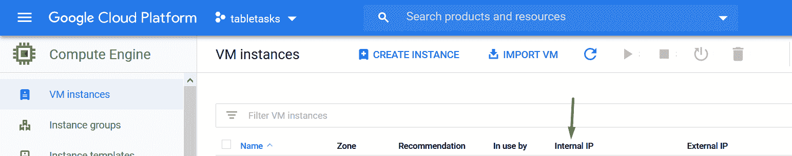

    Internal IP of a GCE

4.  最后，在`lib/redis.js`中:

    ```
    const redis = require("redis");

    const redisClient = redis.createClient(
      NODE_ENV === "production"
        ? {
            host: process.env.REDISHOST,
            port: process.env.REDISPORT, // default to 6379 if wasn't set
            no_ready_check: true,
            auth_pass: process.env.REDIS_PASSWORD,
          }
        : {} // just use the default: localhost and ports
    );

    module.exports = {
      redisClient,
    }; 
    ```

### 文件存储器

[云存储](https://cloud.google.com/storage/docs)是您的用户上传他们的文件所需的东西，例如他们需要检索并可能在以后显示的图像。

#### 费用

云存储也有一个[免费层](https://cloud.google.com/free/docs/gcp-free-tier#always-free-usage-limits)。

#### 向导

*   你会没事的:
    [https://cloud . Google . com/app engine/docs/standard/nodejs/using-cloud-storage](https://cloud.google.com/appengine/docs/standard/nodejs/using-cloud-storage)

### 在后端部署新的变更

我在 root 的`package.json`中有一个 npm 脚本，用于在我的后端向 GCP 发布新的更改:

```
"scripts": {
    "deploy-server": "gcloud app deploy ./server/app.yaml"
} 
```

然后在项目根目录下的终端中运行它:

```
npm run deploy-server 
```

## 托管您的水疗中心

当我还在 Lightsail 的时候，我的 SPA 是在 S3+Cloudfront 上托管的，因为我认为最好让它们在同一个平台下，以获得更好的延迟。然后我找到了 GCP。

作为一名从 AWS 登陆 GCP 的 beat 难民，我第一次探索了“云存储”来托管我的 SPA，结果发现它并不适合 SPA。它相当令人费解。所以你可以跳过这个。

然后我试着在 [**Firebase**](https://firebase.google.com/docs/hosting/quickstart) 主持我的 SPA。即使是我第一次去那里，也能在几分钟内轻松完成。我喜欢它。

你可以考虑的另一个选择是 [Netlify](https://netlify.com) ，它也非常容易上手。

### 在前端部署新的变更

与部署后端更改类似，我在根目录的`package.json`中有另一个 npm 脚本，用于在 Firebase 的前端发布新的更改:

```
"scripts": {
    "deploy-client": "npm run build-client && firebase deploy",
    "build-client": "npm run test && cd client && npm i && npm run build",
    "test": "npm run lint",
    "lint": "npm run lint:js && npm run lint:css",
    "lint:js": "eslint 'client/src/**/*.js' --fix",
    "lint:css": "stylelint '**/*.{scss,css}' '!client/dist/**/*'"
} 
```

等等，这些东西是从哪里来的？?"

它们是一个脚本链，每个脚本由`deploy-client`脚本触发后按顺序运行。`&&`字符是将它们粘合在一起的东西。

让我们牵着彼此的手从头到尾走一遍:

1.  首先，我们做`npm run deploy-client`，
2.  哪个先运行`build-client`，
3.  哪个先运行`test`(看，我们只是跟随脚本和它的`&&`引导我们，这就是为什么`firebase deploy`现在还不会运行)
4.  运行`lint`，
5.  这首先把我们带到了`lint:js`，接下来是`lint:css`，
6.  然后回到`cd client`，接着是`npm i`和`npm run build`，
7.  最后，轮到`firebase deploy`跑了。

**提示**:如果您所做的更改是全栈式的，那么您可以有一个同时部署“客户机”和“服务器”的脚本:

```
"scripts": {
    "deploy-all": "npm run deploy-server && npm run deploy-client",
} 
```

## 富文本编辑器

在 Sametable 中构建富文本编辑器对我来说是第二大挑战。我意识到，我可以轻松地使用 CKEditor 和 TinyMCE 等插件编辑器，但我希望能够在编辑器中打造写作体验，没有什么比 [**ProseMirror**](https://prosemirror.net/) 更好的了。当然，我也有其他选择，但我决定放弃，原因有几个:

1.  Quilljs
    *   似乎有许多未解决的问题。
    *   由特殊利益集团特别塑造。
    *   一旦你冒险脱离了标准用例集，就会有一些棘手的解决方法。
2.  [Draftjs](https://draftjs.org/)
    *   它们与 React 紧密耦合。
    *   由于虚拟 DOM 的开销，它们的性能不如 Prosemirror。
3.  [特里克斯](https://trix-editor.org/)
    *   基于 Web 组件。我在将它集成到 Preact 中时遇到了问题。
    *   构建定制的编辑体验并不灵活。

毫无疑问，Prosemirror 是一个*无可挑剔的*图书馆。但就我而言，学习它并不适合胆小的人。

即使在我读了几遍[指南](https://prosemirror.net/docs/guide/)之后，我还是没能建立起任何包含它的心智模型。我从那里取得进步的唯一方法是交叉引用现有的代码示例和[手册](https://prosemirror.net/docs/ref/)，并从那里进行试错。如果我也用尽了，那么我会在论坛上问，它总是回答。我不会为 StackOverflow 费心，除非是为了受欢迎的 Quilljs。

这些是我搜寻代码样本的地方:

*   [官方举例](https://prosemirror.net/examples/)
*   搜索[论坛](https://discuss.prosemirror.net/)
*   fork '[prosemirror-示例-设置](https://github.com/prosemirror/prosemirror-example-setup)
*   一个名为 [tiptap](https://tiptap.scrumpy.io/) 的编辑器基于 Prosemirror，但为 Vuejs 构建。代码库实际上只有很少的 Vuejs。所以你可以在那里找到很多有用的 Prosemirror 特有的片段(谢谢各位！).

本着这种学习之旅的精神，我在 CodeSandBox 中提取了 Sametable 的富文本编辑器:

[https://codesandbox.io/s/compassionate-montalcini-gcgwc](https://codesandbox.io/s/compassionate-montalcini-gcgwc)

？

(**注** : Prosemirror 是框架不可知的；CodeSandBox 演示仅使用“create-react-app”来绑定 ES6 模块。)

## 克-奥二氏分级量表

为了阻止你的浏览器抱怨 CORS 问题，[是关于](https://medium.com/@kilgarenone/deploy-your-nodejs-app-to-digital-ocean-1de40797666f#4aa4)让你的后端根据请求发送回那些`Access-Control-Allow-*`头。(为过于简单化道歉是应该的)

但是，如果我错了，请纠正我，没有办法在 GAE 配置 CORS。所以我不得不使用 [cors](https://www.npmjs.com/package/cors) npm 包:

```
const express = require("express");
const app = express();
const cors = require("cors");

const ALLOWED_ORIGINS = [
  "http://localhost:8008",
  "https://web.sametable.app", // your SPA's domain
];

app.use(
  cors({
    credentials: true, // include Access-Control-Allow-Credentials: true. remember set xhr.withCredentials = true;
    origin(origin, callback) {
      // allow requests with no origin
      // (like mobile apps or curl requests)
      if (!origin) return callback(null, true);
      if (ALLOWED_ORIGINS.indexOf(origin) === -1) {
        const msg =
          "The CORS policy for this site does not " +
          "allow access from the specified Origin.";
        return callback(new Error(msg), false);
      }
      return callback(null, true);
    },
  })
); 
```

## 支付和订阅

SaaS 通常允许用户付费和订阅，以访问您指定的付费功能。

为了在 Sametable 中实现这种可能性，我使用 **Stripe** 来处理支付和订阅流。

### 向导

有两种方法可以实现它们:

1.  非常实用的这对定制你的用户界面非常有用。
2.  [**结账**](https://stripe.com/docs/payments/checkout/set-up-a-subscription) 。实现速度最快。这就是我所做的。

### Webhook

我需要的最后一个关键组件是一个“webhook ”,它基本上只是 Nodejs 中的一个典型端点，可以由 Stripe 等第三方调用。

我创建了一个 webhook，当一笔付款被成功收取时，它将被调用，以在用户记录中表示该收款人是 Sametable 中的专业用户。

```
router.post(
  "/webhook/payment_success",
  bodyParser.raw({ type: "application/json" }),
  asyncHandler(async (req, res, next) => {
    const sig = req.headers["stripe-signature"];

    let event;

    try {
      event = stripe.webhooks.constructEvent(req.body, sig, webhookSecret);
    } catch (err) {
      return res.status(400).send(`Webhook Error: ${err.message}`);
    }

    // Handle the checkout.session.completed event
    if (event.type === "checkout.session.completed") {
      // 'session' doc: https://stripe.com/docs/api/checkout/sessions/object
      const session = event.data.object;

      // here you can query your database to, for example,
      // update a particular user/tenant's record

      // Return a res to acknowledge receipt of the event
      res.json({ received: true });
    } else {
      res.status(400);
    }
  })
); 
```

#### 参考

下面是一个 webhook 的代码片段:
[https://stripe . com/docs/web hooks/signatures # verify-official-libraries](https://stripe.com/docs/webhooks/signatures#verify-official-libraries)

#### 向导

*   [https://stripe.com/docs/webhooks](https://stripe.com/docs/webhooks)

## 登录页面

### 建筑物

我用 [**十一**](https://www.11ty.dev/) 来构建同桌的登陆页面。我[不会](https://twitter.com/devongovett/status/1222953655722110981)推荐盖茨比或者 Nextjs。他们对这份工作来说是大材小用。

我从一个[起始项目](https://www.11ty.dev/docs/starter/)开始，因为我迫不及待地想让我的页面离开地面。但我穿着它们努力工作。

虽然 Eleventy 声称是一个简单的 SSG，但如果你不熟悉静态站点生成器，实际上有很多概念需要理解。再加上初学者工具包引入的工具，事情会变得复杂。所以我决定从零开始，慢慢从头到尾阅读文档，慢慢积累。安静而轻松。

#### 指导

*   **长版**
    *   [https://tatianamac . com/posts/beginner-eleven ty-tutorial-parti/](https://tatianamac.com/posts/beginner-eleventy-tutorial-parti/)
    *   [https://www.11ty.dev/docs/](https://www.11ty.dev/docs/)
*   **短版**:【https://github.com/kilgarenone/personal-website】T2(第一个网站是我在 11ty 学习的时候建的个人网站。它有主页和博客文章。这里介绍的概念很少。你可以从这个“起步项目”开始

### 主办；主持

我用 [**Netlify**](https://www.netlify.com/) 来托管登陆页面。还有 [surge.sh](https://surge.sh/) 和 [Vercel](https://vercel.com) 。你在这里会很好的。

## 条件

T&C 让你的 SaaS 合法化。据我所知，以下是你想出它们的选择:

1.  写你自己的[https://pinboard.in/tos/](https://pinboard.in/tos/)。
2.  复制粘贴他人的。相应地改变。以我的经验来看从来都不容易。
3.  律师来了。
4.  在 [**getterms.io**](https://getterms.io/) 中生成它们。

## 营销

有很多营销帖子说“*让产品自己说话*”是个坏主意。嗯，除非你试图“黑掉增长”来赢得这场游戏。

以下是我心目中 Sametable 的生存轨迹:

1.  建造据称能解决问题的东西。
2.  做你的搜索引擎优化。写博文。任何受到你所解决的问题影响的人都会去寻找它，或者通过口耳相传了解它。
3.  如果它仍然没有起飞，那么，很可能你没有解决一个巨大的真正的问题，或者足够多的人已经解决了它。在这种情况下，只要对长期以来你所获得的任何成功心存感激。

### 资源

*   [https://stripe.com/en-my/atlas/guides/starting-sales](https://stripe.com/en-my/atlas/guides/starting-sales)
*   [https://www.coryzue.com/writing/seo-for-developers/](https://github.com/LisaDziuba/Marketing-for-Engineers)

## 幸福

我们很容易坐下来，迷失在我们的当代工作中。我们通过积累未来的债务来做到这一点。其中一笔债务是我们个人的健康。

以下是我如何努力控制我的健康债务:

*   **安装** [**Workrave**](https://workrave.org/) 。您可以设定它在间隔时间过后锁定屏幕。最重要的是，它可以显示一些你可以在电脑后面进行的练习！
*   如果你负担得起，买一个可调节的站立式办公桌。我从宜家买的。
*   做 [**打嗝**](https://www.youtube.com/watch?v=Kjhl-8yU6hI) 。伸展那些关节。保持良好的姿势。[铺板](https://www.youtube.com/watch?v=59MaNHq8UDo)帮忙。
*   冥想以保持理智。我正在使用 [Medito](https://meditofoundation.org/) 。

？？

感谢阅读。一定要看看我自己的 SaaS 工具 **Sametable** to [在电子表格中管理你的工作](https://www.sametable.app)。*****