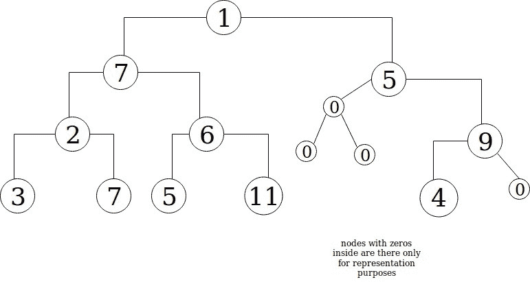

# 如何在 Ruby 中使用数组迭代计算二叉树的高度

> 原文：<https://www.freecodecamp.org/news/how-to-calculate-a-binary-trees-height-using-array-iteration-in-ruby-63551c6c65fe/>

数据结构和算法是计算机科学和软件的核心和灵魂。如果不了解数据在代码中是如何组织的以及如何操作它，就无法学习编程。

一种这样的数据结构是二叉树:


Photo by [Jeremy Bishop](https://unsplash.com/photos/EwKXn5CapA4?utm_source=unsplash&utm_medium=referral&utm_content=creditCopyText) on [Unsplash](https://unsplash.com/search/photos/tree?utm_source=unsplash&utm_medium=referral&utm_content=creditCopyText)

哦，不，不是那种树，我是说这一棵:


.Figure 1: Simple binary tree

简单地说，树是“节点”的网络。节点是一个对象，其属性包括数据本身和指向其“子节点”的指针。对于二叉树，每个节点最多可以有 2 个子节点。二叉树将有一个根节点和最多两个子节点。每个子对象只是一个指向另一个树对象的指针，或者可以为零。使用散列，这可以被形象化为:

```
tree = {
 :data        => 1,
 :left_child  => [another_tree] || nil,
 :right_child => [another_tree_again] || nil
}
```

在我们开始计算高度之前，让我们先找到二叉树的一些用途。

如果你观察你的计算机中的目录或文件结构，它遵循一个(尽管是更一般的)树形结构。每个文件夹可以包含文件(数据)和许多其他目录(它们本身不一定是数据，而只是这些子目录中包含的数据的地址)。其他文章对二叉树的其他用例进行了更好的讨论:

[**在 Quora** 中](https://www.quora.com/What-are-some-practical-applications-of-binary-search-trees)

[**栈溢出**](https://stackoverflow.com/questions/2130416/what-are-the-applications-of-binary-trees)

二叉树是一个庞大的主题，我可以写很多关于它的东西(比如搜索二叉树的不同方法——也许是以后的文章？).但是，这里我会很具体——计算一棵二叉树的高度。

首先要理解的是，我们可以用一个数组来表示一棵二叉树。但是，即使这是可能的，也有许多方法可以放下每个节点，并将它们(作为数组中的一个元素)关联到各自的左右子节点。

为了简单起见，我们将使用“广度优先”的方法来展平该树。在“广度优先”中，我们从根节点开始放置每个节点中包含的数据。然后，我们进入下一个较低的级别，从左到右放置每个节点的数据。我们通过所有的水平，直到最低的一个。

如果一个子树没有左或右子树，那么这样的子树可以表示为 0，只要该子树不在二叉树的最低层。



Figure 2: Modified binary tree from Figure 1.

```
tree = [1, 7, 5, 2, 6, 0, 9, 3, 7, 5, 11, 0, 0, 4, 0] (T0)* array representation of Figure2
```

在数字上，我们可以计算每个节点的左右子节点的位置:

```
left child of tree[i] is at index 2*i + 1 (T1)right child of tree[i] is at index 2*i + 2 (T2)
```

正如我们从图 2 中看到的，我们可以知道一棵树有多高——也就是说，我们只需要计算沿着最长的分支从根到最低的元素(包括根和最低的元素)有多少个节点。但是当它已经是数组形式的时候，我们怎么知道它有多高呢？

首先，我们必须有一个计算任何树的高度的通用公式:

```
height = 1 + max of(left_child_height, right_child_height) (T3)
```

对于多级树，我们可以得出结论，为了计算任何子树(和树本身)的高度，我们首先必须计算左右子树的高度，然后找出两者之间的较高者。在计算这两个孩子的身高时，我们需要计算他们各自孩子的身高，以此类推。

有了这些，我们现在可以开始概述计算多级二叉树高度的算法。有两种方法我们可以采用，一种是使用迭代或循环，另一种，由于步骤的重复性质(前一段)，是使用递归。在这篇文章之后，我将讨论如何使用递归来做到这一点。然而，这太容易了。所以让我们先来学习困难的方法:我们将使用迭代来做这件事。

#### 迭代法

我们将使用上面的树形数组`T0`来说明这个过程

**步骤 0:** 声明一个 heights 数组，该数组将存储每个子树的高度。

```
heights = [] (S0.1)
```

**步骤 1:** 遍历数组——因为我们需要首先计算后代的高度，所以我们从最后一个元素开始迭代。我们不会在树型数组中直接使用`each`方法，而是将它用于每个元素的索引。

```
(tree.length - 1).downto(0) do |i| (S1.1)
```

**步骤 2:** 对于每个元素，找到初始高度——如果元素是零(意味着它实际上是一个零节点),那么初始高度是 0，否则是 1。

```
initial_height = tree[i] == 0 ? 0 : 1 (S2.1)
```

**第三步:**在`heights`数组中找到左子元素的高度，如果该元素有一个左子元素，那么这个子元素的高度等于:

```
left_child_height = heights[left_child_index] (S3.1)
```

在上式中，`left_child_index`可以计算如下:

```
left_child_index = heights.length - i - 1 (S3.2)
```

通过一点点反复试验，我想出了`S3.2`。在接下来的模拟中，我会提到这一系列步骤。

总而言之，我最初打算将每个后代的高度添加到`heights`中，这样每个元素的高度将与元素本身在`trees`上的索引相同。但是正如我后面将要提到的，对于大型数组输入来说，使用 unshift 将会增加资源消耗。

所以后来我决定用`push`。然后，每个高度将按照与它们在`tree`中对应元素的顺序相反的顺序排列。这样，`tree[0]`的高度可以说最终将位于`heights[-1]`。

如果所讨论的元素没有左子元素，那么`left_child_index`应该是`nil`。为了确保我们捕捉到这个场景:

```
left_child_index = nil if tree[2*i + 1].nil? (S3.3)
```

使用三元组将`S3.2`和`S3.3`放在一起:

```
left_child_index = tree[2*i + 1].nil? ? nil : heights.length - i -1 (S3.4)
```

因此，如果 left child 为`nil`，那么 left child 的高度必须为 0。`left_child_height`的完整公式是:

```
left_child_height = left_child_index.nil? ? 0 : heights[left_child_index] (S3.5)
```

**步骤 4:** 查找右子树的高度——查找子树的右子树的高度遵循与步骤 3 相同的逻辑。因为我们从左到右填充`heights`数组(使用`push`)并且我们从右到左迭代`tree`，任何子树的右子树的高度将总是首先被推到 `heights`。因此，任何元素的左子元素都将位于`heights` 内的位置`left_child_index -1`(如果右子元素不是`tree`内的`nil`)。考虑这些因素并遵循步骤 3 的逻辑:

```
right_child_index = tree[2*i + 2].nil? nil : left_child_index - 1 (S4.1)
```

```
right_child_height = right_child_index.nil? ? 0 : heights[right_child_index] (S4.2)
```

**第五步:**找到元素的总高度——在找到所讨论的元素的左右子元素的高度(在 L `tree`中的`i`索引处)之后，我们现在可以找到该元素的总高度:

```
total_height = initial_height + [left_child_height, right_child_height].max (S5.1)
```

从数字上来说，如果元素是 0，并且它碰巧在树中有任何子元素(ren ),那么这个子元素(ren)也将是 0。因此，它的`total_height`也将是 0。上述`T0`中`i = 5`处的元素就是这种情况:

```
 left  right
                                         child child
tree = [1, 7, 5, 2, 6, 0,  9, 3, 7, 5, 11, 0,   0,   4, 0] 
                      i=5                i=11 i=12
                  element in question
(T0 here repeated)
total_height = 0 + [0,0].max = 0 (S5.2)
```

但是对于`i = 4`处的元素，高度为:

```
 left   right
                                    child  child
tree = [1, 7, 5, 2, 6, 0,  9, 3, 7,   5,    11,     0, 0, 4, 0] 
                   i=4               i=9  i=10
                  element 
                 in question
total_height = 1 + [1,1].max = 2 (S5.3)
```

在上面的`S5.3`和`S5.4`中，我们只是使用视觉检查来计算相关元素的左右子元素的高度。但这说明了我们的算法是如何工作的。现在在计算完`total_height`之后，我们简单地:

**步骤 6:** 将`total_height`推入`heights`——正如我之前提到的，使用推送方法更有效，尤其是对于大型数组。

```
heights.push(total_height) (S6.1)
```

一旦我们遍历了`tree`数组中的所有元素，我们将拥有一个由二叉树中每个子树的高度组成的数组`heights`。它应该是这样的:

```
heights(after full iteration) = [0, 1, 0, 0, 1, 1, 1, 1, 2, 0, 2, 2, 3, 3, 4] (S6.2)
```

**步骤 7:** 返回二叉树的高度——如果我们的目标只是找出母树的高度(意思是从根到最右边最低的节点),那么我们只需:

```
return heights[-1] (S7.1)
*Note if this is the last line in the method then the 'return' keyword is redundant (in Ruby at least)
```

然而，很多时候我们可能对计算任何子树的高度感兴趣。在这种情况下，我们只需返回`heights`数组本身，然后任何使用该程序的人都可以简单地包含任何索引来查找树中特定分支的高度。

完整的方法如下:

```
def binary_tree_height(tree_array)
  #0 Declare a heights array which will store the heights of each sub tree
  heights = []
  #1 Iterate through the tree_array starting from last element down to first
  (tree_array.length - 1).downto(0) do |i|

  #2 For each element, find initial height
  initial_height = tree_array[i] == 0 ? 0 : 1

  # 3 Find height of left child
  left_child_index = tree_array[2*i + 1].nil? ? nil : heights.length - i - 1 #index of left child's height in heights
  left_child_height = left_child_index.nil? ? 0 : heights[left_child_index] 

  # 4 Find height of right child
  right_child_index = tree_array[2*i + 2].nil? ? nil : left_child_index - 1 #index of right child's height in heights
  right_child_height = right_child_index.nil? ? 0 : heights[right_child_index]

  # 5 Find element's total height
  total_height = initial_height + [left_child_height,right_child_height].max

  # 6 Push total height to heights array
  heights.push(total_height)

 end
 puts heights[-1]
end 
```

让我们测试一下这个算法。

让我们假设我们运行`binary_tree_height(tree).`来计算`tree[14]`到`tree[7]`的高度是非常简单的(它们要么是 0 要么是 1，因为它们都在`tree`的最低级别)，所以我们在这里不再模拟它们。当`i`等于 6 时，我们将假设我们已经处于迭代的那一部分。因此，在这个关头:

```
i = 6 (F1)
tree[6] = 9 (F2)
heights = [0, 1, 0, 0, 1, 1, 1, 1] (heights.length at this point is 8) (F3)
```

现在，我们可以看到`tree[6]`等于 9(而不是 0)。因此:

```
initial_height = 1 (F4)
```

正如我所承诺的，我是这样得出左右儿童指数的公式的。

所以我从一个已经填充了最低元素高度的`heights`数组开始，如`F3`所示。因为我现在和`tree[6]`(9)一起工作，所以它的左右孩子是`tree[13]`和`tree[14]`；其对应的高度分别在`heights[1]`和`heights[0]`中。如果这还不够清楚，我们知道我们从`tree[14]`开始推，这将变成`heights[0]`。然后我们计算并推高`tree[13]`的高度——这将是`heights[1]`。关联指数:

```
index of left child in trees = 13
index of left child's height in heights = LEFT_INDEX =1
index of right child in trees = 14
index of right child's height in heights = RIGHT_INDEX = 0
current index of element in question = MOTHER_INDEX = 6
current length of heights array = LENGTH = 8
LEFT_INDEX = 1 = 8 - 6 - 1 = LENGTH - MOTHER_INDEX - 1
RIGHT_INDEX = 0 = 8 - 6 - 2 = LENGTH - MOTHER_INDEX - 2 
(or simply LEFT_INDEX -1 ) (F5)
```

我们现在可以将此逻辑应用于所有元素，因此在代码中，我们计算`tree[6]`的高度如下:

```
Computing for tree[6]'s left child's height:
from code at S3.4:
left_child_index = tree[2*i + 1].nil? ? nil : heights.length - i - 1
Since tree[2*6 + 1] = tree[13] = 4 is not nil then:
left_child_index = 8 - 6 - 1 = 1
from code at S3.5:
left_child_height = left_child_index.nil? ? 0 : heights[left_child_index]
So then:
left_child_height = heights[1] = 1
```

`tree[6]`右边孩子的身高如下:

```
from code at S4.1:
right_child_index = tree[2*i + 2].nil? nil : left_child_index - 1 
Since tree[2*6 + 2] = tree[14] = 4 and is not nil:
right_child_index = left_child_index -1 = 1 -1 = 0 -> !nil?
and from code at S4.2:
right_child_height = right_child_index.nil? ? 0 : heights[right_child_index]
Therefore: right_child_height = heights[0] = 0
```

现在我们可以找到`tree[6]`的总高度:

```
total_height (tree[6]) = 1 + [1,0].max = 1 + 1 = 2
```

然后我们可以将这个`total_height`推入`heights`:

```
heights.push(2), such that:
```

```
heights = [0, 1, 0, 0, 1, 1, 1, 1, 2]
```

同样的事情会继续下去，直到我们开始处理`tree[0]`，最终的`heights` 数组应该是:

```
heights = [0, 1, 0, 0, 1, 1, 1, 1, 2, 0, 2, 2, 3, 3, 4]
```

并且返回`heights[-1]`(或者`heights[heights.length -1]`，我们更喜欢哪个)，我们确定`tree`的高度是 **4** 。我们可以在上面的图 1 和图 2 中直观地验证这一点。

我们花了 7 个步骤才找到答案。使用这种大小的`tree`数组，完成操作大约需要 0.024 毫秒。使用递归完成同样的事情只需要一半的时间(只有 0.012 毫秒)。

作为如何递归地做这件事的一个预览，我们可以简单地做这样的事情:

```
def tree_height_recursive(tree_array, index = 0)
  return 0 if tree_array[index].nil? or tree_array[index] == 0
  left_child_height = recursive_tree_height(tree_array, 2*index + 1)
  right_child_height = recursive_tree_height(tree_array, 2*index +2)
  total_height = 1 + [left_child_height, right_child_height].max
end
```

我们看到递归可能只需要 4 步就可以完成同样的任务。它节省了我们一半的时间和更少的资源。

学习算法的一个秘密是努力工作和实践。如果你与他人合作，也会有所帮助。实际上，我不是一个人做的，而是和我的编码伙伴一起做的。我之前写过一篇关于这种学习方式是如何变得更加高效的文章。

这是我在不同数据结构和算法上的[储存库](https://github.com/rvvergara/data-structures),我已经研究过了。

**关注我**上 [**推特**](https://twitter.com/coachryanv) | [**Github**](https://github.com/rvvergara)