# 如何在 Excel 中计算两个数字之间的百分比差异-单元格百分比变化教程

> 原文：<https://www.freecodecamp.org/news/how-to-calculate-percentage-differences-between-two-numbers-in-excel-cell-percentage-change-tutorial/>

电子表格功能强大，令人敬畏。💪

在本教程中，我将向你展示在 Excel 中找出两个数字之间的百分比差的四种方法。我还将向您展示如何在 Google Sheets 中使用自定义函数。👍

我们将使用的四项技术(和一项奖励)是:

1.  使用公式(lvl 1️⃣简易模式)
2.  使用 LAMBDA 函数+名称管理器(lvl 2️⃣正常模式)
3.  使用 visual basic for applications(VBA)(lvl3️⃣硬模式)
4.  使用 Office JavaScript API (lvl 4️⃣超级模式)
5.  使用 Google Sheets 的自定义功能(💥奖金水平)

## Excel 中两个数字之间的百分比变化公式

在 Excel 中进行计算时，公式是大多数人首先会用到的东西。它允许我们使用单元格中的数据进行显式计算。

假设我们在单元格`B3`中有一年的销售数据，在单元格`C3`中有第二年的销售数据。通过输入下面的公式，我们可以计算第一年与第二年的百分比差异:

```
=(C3-B3)/B3
```

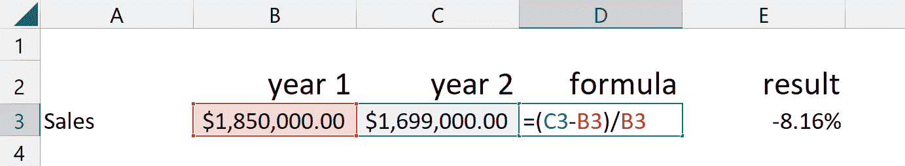

formula for percentage change between two numbers in Excel

键入自定义公式的优点是快速和简单，尤其是对于简单的计算。

此外，公式可以向下和/或跨单元格区域复制，以便快速重用。谷歌工作表和微软 Excel 中公式的使用方式完全一样。

然而，当计算变得冗长和/或复杂时，了解一些替代方法会很有帮助。

## 如何使用 LAMBDA 函数和名称管理器

在第一个例子的基础上，LAMBDA 函数允许我们进行自定义操作，并对其进行编码，以便在整个工作表中重用。

使用与之前相同的数据(这次是在单元格`B4`和`C4`中)，我们将 LAMBDA 函数写成:

```
=LAMBDA(year1,year2,(year2-year1)/year1)(B4,C4)
```

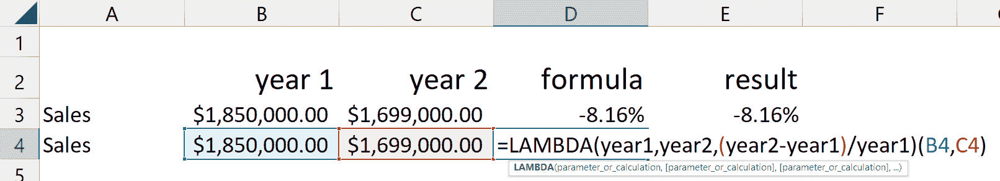

Screenshot of Excel Lambda function

乍一看，你可能想知道我们到底为什么要打出这么长的一团乱麻，但是听我说，你会发现这比简单地定义一个函数更便于重用。


Gif of woman scratching head and looking confused

事情是这样的:

我们要做的第一件事是定义函数的参数，并用逗号分隔它们。您可以根据需要定义任意多的类型(最多 253 个)🤣).我们只有两个:`year1`和`year2`。

列出参数后，我们写出希望 Excel 计算的公式。这与我们在第一个公式部分中所做的一样——只是这一次我们使用了我们的参数名，而不是显式的单元格名:`(year1-year2)/year1`。

最后，我们关闭 LAMBDA 函数的括号，然后通过编写实际使用的单元格来调用它:`B4,C4`。这告诉该函数，它需要将单元格`B4`中的值用于参数`year1`，将单元格`C4`中的值用于参数`year2`。

真是一团糟，对吧！？是的，从技术上来说，在这里写出整个 LAMBDA 函数只是一个很好的实践，以确保在我们进行下一步之前，它能正常工作...

这是最酷的部分。单击顶部功能区中的公式选项卡，然后选择名称管理器。

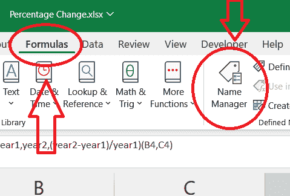

Excel Ribbon accessing Name Manager in Formula Tab

选择新建。

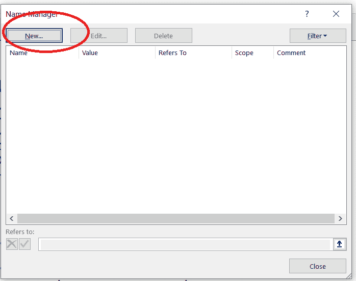

Screenshot of Name Manager in Excel

然后输入公式的名称，并在评论中写下可选的描述。在引用行中，您将复制 LAMBDA 函数。

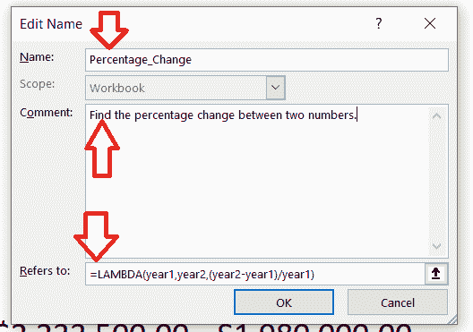

Screenshot of Named Function in Excel

您可以像使用内置函数一样使用它，只需在单元格中键入以下内容

```
=Percentage_Change(B5,C5)
```

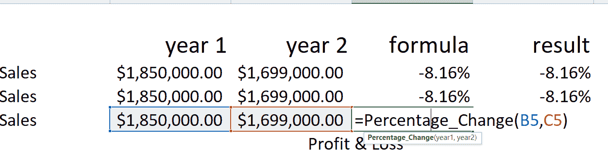

Screenshot of Excel Formula

现在，我们可以轻松地使用常规内置函数了。Google Sheets 也有类似的功能，我们将在本文末尾讨论。

## 如何使用 Visual Basic for Applications

如果您使用的是 Excel 的桌面版本，则可以访问 Visual Basic for Applications。这是微软的一种事件驱动编程语言，你可以用它来做任何你想做的事情。

如果您想使用 VBA 找出两个数字之间的百分比差异，您可以转到功能区中的“开发者”选项卡(或按下`alt + F11`)。

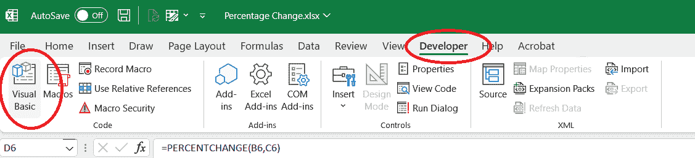

Screenshot of Developer Tab in Excel

如果您没有看到“开发人员”选项卡，您可能需要通过选择“文件”->“选项”来启用它。然后寻找自定义功能区。在这里，您可以选择“开发者”旁边的框。

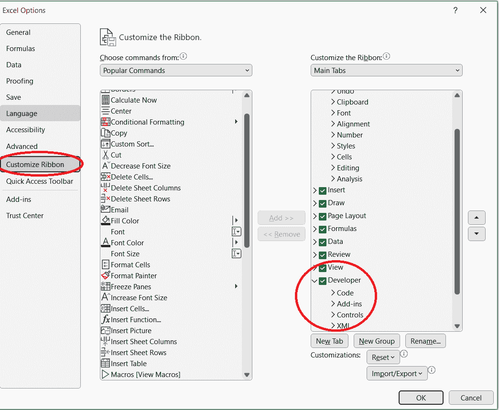

Screenshot of Excel Options

额外收获:如果`ALT + F11`不起作用，GeForce Experience 可能会干扰内置快捷键。更改设置中使用`ALT + F11`的快捷方式。对我来说，这是切换评论开/关，而广播到脸书设置。

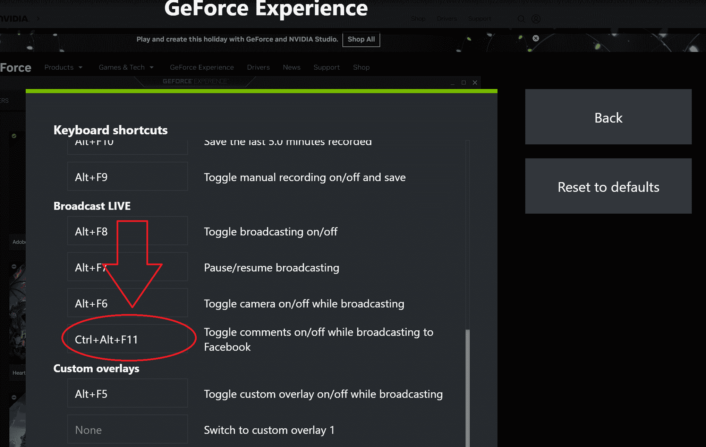

screenshot of GeForce Experience settings

打开 VBA 窗口后，从菜单中选择插入->模块。这将打开一个空白窗口，我们将在这里编写我们的程序。可以把它想象成 Excel 中的 IDE。我们将在这里编程，然后在工作表中使用该程序。

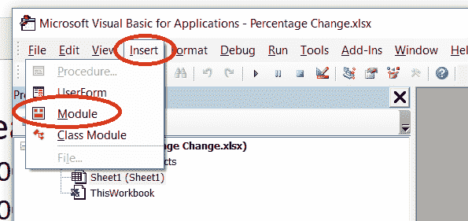

Screenshot of VBA menu

在这里，我们可以输入与上面指定的 LAMBDA 函数相同类型的命令。

```
Function PERCENTFUNCTION(year1, year2)
    PERCENTFUNCTION = (year2 - year1) / year1
End Function
```

瞧！我们现在可以在 Excel 表格中使用`PERCENTFUNCTION`，就像我们使用`Percentage_Change`命名函数一样。

VBA 对于更复杂的程序是有用的，但对于我们的例子来说就有些过头了。顺便说一下，谷歌工作表没有 VBA 功能。

## 如何使用 Office JavaScript API

现在真正的好东西！您知道可以在 Excel 中编写 JavaScript 和 TypeScript 吗？我也是。但是你可以。

Script Lab 是微软的一个插件，它允许我们探索 Office 应用程序中的 JavaScript API，并通过编写脚本来声明自定义功能。

可以在这里添加到 Excel [。点击这里](https://learn.microsoft.com/en-us/office/dev/add-ins/overview/explore-with-script-lab)了解更多[。](https://learn.microsoft.com/en-us/office/dev/add-ins/overview/explore-with-script-lab)

与 VBA 不同，这也适用于 Excel 的网页版。

安装完成后，从功能区中选择它，然后单击代码。

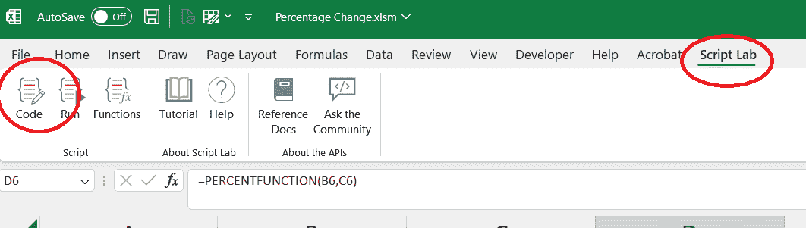

Screenshot of Script Lab in Excel Ribbon

这将在侧边栏上显示一个合法的代码编辑器。

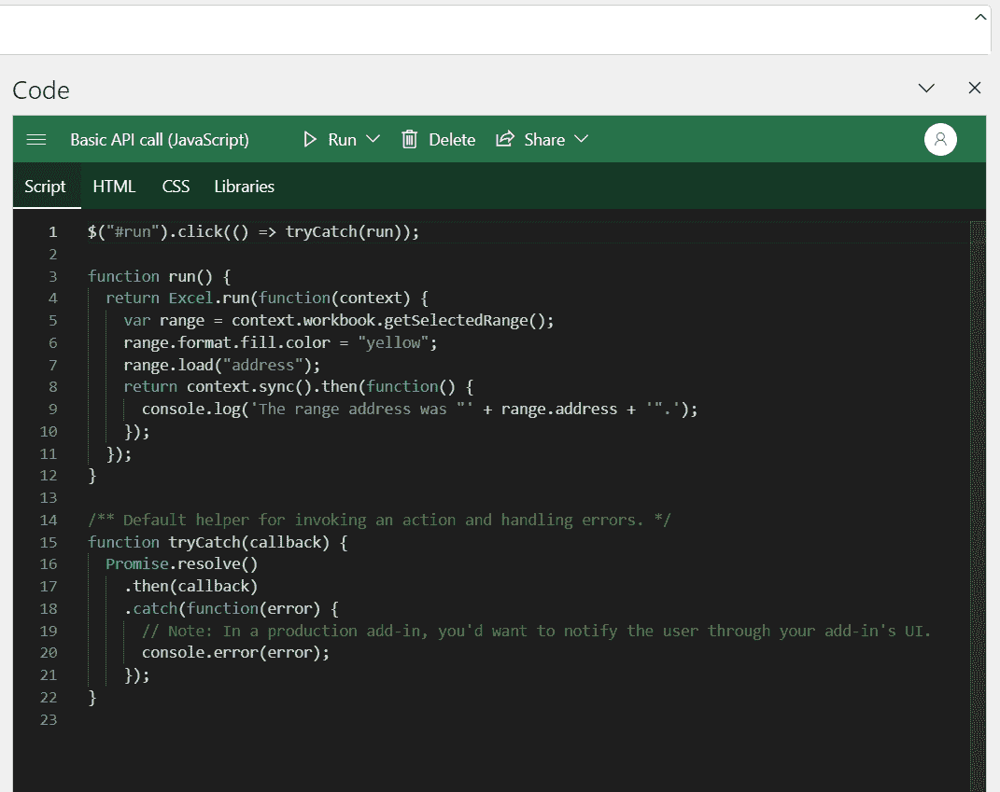

Screenshot of Script Labs Code Editor in Excel

我们可以使用 JavaScript 创建一个自定义函数，方法是从脚本实验室窗口左上角的 Hamburger 菜单中选择一个新的代码片段。

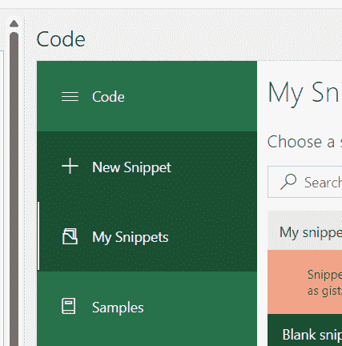

Screenshot of New Snippet menu 

通过输入下面的函数，我们可以再次定义一个百分比差函数，但是这次使用 JavaScript。

```
/** @CustomFunction */
function percent_change_javacscript(year1, year2) {
  return (year2 - year1) / year1;
} 
```

要使用此功能，请从功能区中选择脚本实验室->功能:

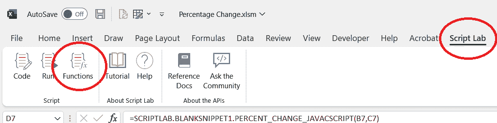

Screenshot of Script Lab Menu in Ribbon

这将打开另一个侧边栏标签，因为代码片段中的第一行:`/** @CustomFunction */`它将注册自定义函数。

在工作表中，您将能够像我们使用自定义函数一样使用它。不过，这一次，当您开始键入标题时，您会看到它在名称上注册了一个 scriptlab 前缀。选择此项，它将像其他方法一样返回百分比变化。

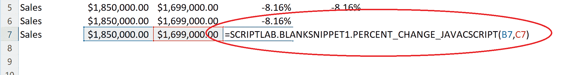

Screenshot of Script Lab Custom Function in Excel

再一次，对于一个简单的函数来说，这是大材小用，但是放在工具箱中还是很方便的！👍

## 如何在 Google Sheets 中使用自定义功能

正如承诺的那样，这里有一个如何在 Google Sheets 中创建命名函数的奖励。这非常类似于在 Excel 中使用名称管理器。

在 Google Sheets 中选择数据->命名函数。

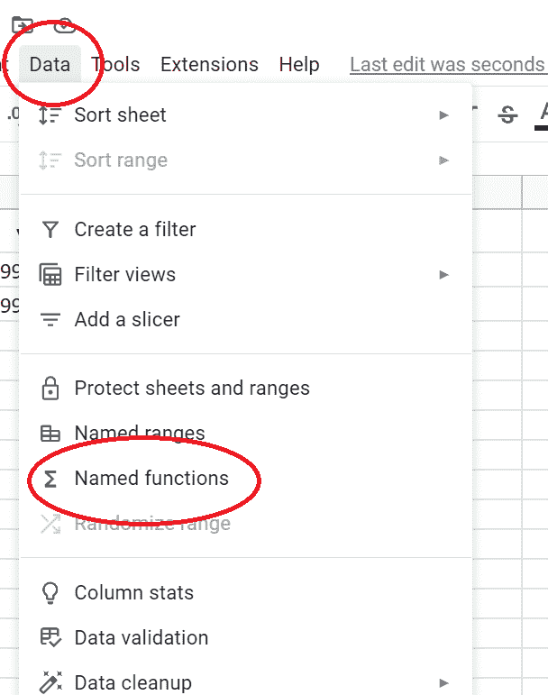

Screenshot of Google Sheets Data Menu

这将提示您命名和描述您的函数，并提供参数(如果适用)。

最后，您将定义函数的操作。

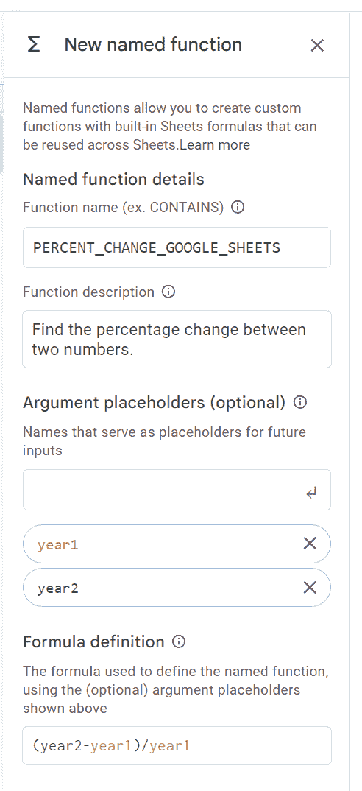

Screenshot of naming a custom function in Google Sheets

如果愿意，下一个屏幕会提示您添加参数描述和示例。这是可选的，但是当您在工作表中使用该功能时，它将包含在下拉帮助菜单中。

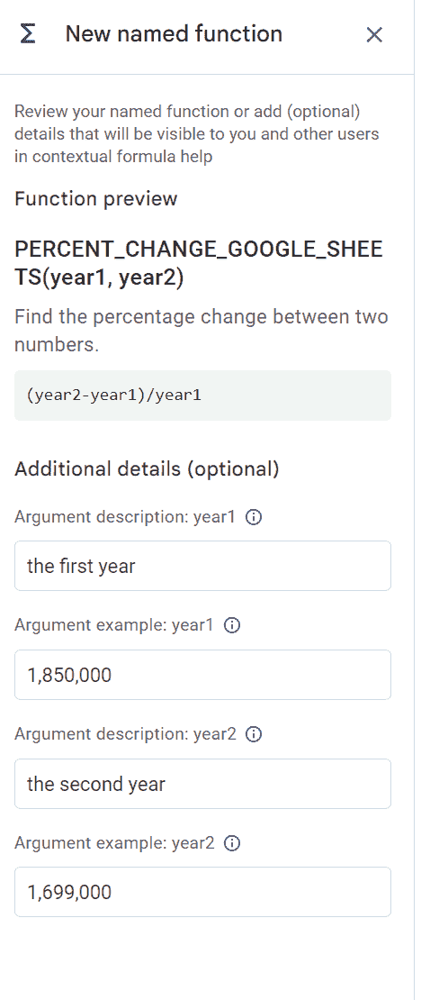

Screenshot of custom function argument descriptions in Google Sheets

然后就像输入自定义函数并选择单元格一样简单。您可以在下面看到帮助菜单是如何显示您提供的信息的。

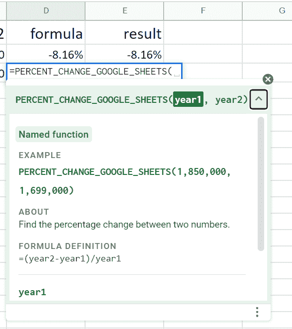

Screenshot of using a custom function in Google Sheets

## 结论

是的，为了简单起见，你通常会选择在 Excel 或 Google Sheets 中使用快速公式。但是现在你知道了其他几种方法来计算两个数字之间的百分比变化。

我希望你已经发现这是有用的，并祝你在自己的 spread-sheets 冒险好运！

你可以在 [LinkedIn](https://www.linkedin.com/in/eamonncottrell/) 上找到并关注我。我喜欢你说嗨。👋


Jimmy Fallon saying haaaaay and holding up some hay