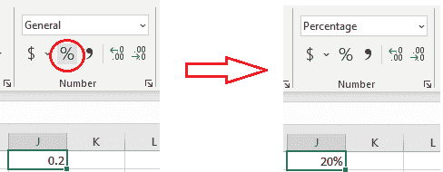
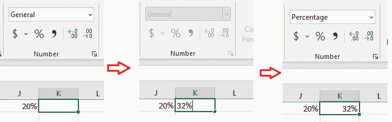
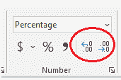
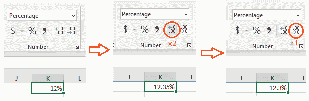
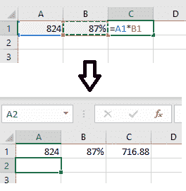
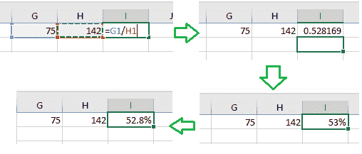
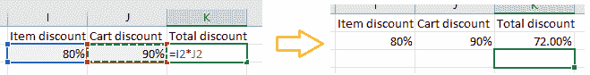

# 如何在 Excel 中计算百分比——百分比公式

> 原文：<https://www.freecodecamp.org/news/how-to-calculate-percentage-in-excel-formula-for-percentages/>

百分比是一种分数，表示超过 100 的部分是多少。在本文中，您将详细了解什么是百分比，以及如何在 Excel 中计算百分比。

首先，在深入了解它在 Excel 中是如何工作的之前，让我们先来看看数学。

如果您想直接跳到 Excel 部分，而不是数学部分，请继续阅读章节[如何在 Excel](#how-to-work-with-percentages-in-excel) 中处理百分比。

## 百分比的计算公式是什么？

从 0%到 100%的百分比相当于从 0 到 1 的十进制值。这意味着你可以将百分比转换成小数。让我们看看怎么做。

### 如何将十进制数转换成百分数

您可以通过以下方式将十进制数字转换为百分比:

*   取十进制数，\(d\)，
*   把它乘以(100)，
*   然后添加百分比\(\%\)符号，

简而言之，如果你想从一个数字\(d\)中得到一个百分比，你可以这样做:

\[ ( d \cdot 100 ) \% \]

### 如何将百分比转换成小数

如果要将百分比转换为数字，您可以:

*   取百分比\(P\%\)，
*   删除百分比符号，\(P\)
*   然后将该数字除以\(100\): \(\frac{P}{100}\)

简而言之，要将百分比\(P\%\)转换为小数:

\[\frac{P\xcancel{\%}}{100}\]

### 如何计算一个数的百分比

在三种情况下，您可能需要计算数字的百分比:

*   给数字加上一个百分比(比如计算你要付多少钱，包括增值税)
*   来得到这个数字的百分比
*   从数字中减去一个百分比(如销售)

#### 如何给一个数字加上一个百分比

我们先用一个具体的案例，再来概括一下。

你去购物，你需要支付的总额是 185 美元+增值税。假设这种情况下的增值税是 17%。

所以你必须计算 185 美元的 17%,然后把它加到 185 美元上。

\[ \$185  \cdot 17 \% + \$185 \]

如果您改为乘以\( 117 \% \)，您可以使它成为一个单一操作。

\[ \$185 \cdot ( 100\% + 17\% ) = \$185 \cdot 117\% \]

如果您有一个没有百分比运算符的简单计算器，您可以像我们上面讨论的那样将百分比转换为十进制数。这看起来是这样的:

\[ \$185 \cdot 117\% = \$185 \cdot \frac{117 \xcancel{ \% }}{ 100 } = \$185 \cdot 1.17 \]

所以，一般来说，如果你想给一个数(n)加上一个百分数(P \% \)，你可以这样做:

\[ n \cdot ( 100\% + P\%) \]

或者，如果您有十进制数字形式的百分比\( d \ ),您可以这样做:

\[ n \cdot (1 + d) \]

#### 如何计算一个数的百分比

如果你想买房子，你需要付房子的定金。假设那是房子总价值的 15%。

如果房价是 20 万美元，怎么算？

您可以将价格乘以百分比数来获得百分比。

\[ \$200,000 \cdot 15 \% = \$30,000 \]

因此，如果你想知道一个数(m)的百分数(P)或分数(d ),你可以用这个数乘以这个百分数或分数。

\[ m \cdot P\% \newline \, \\ m \cdot d \]

#### 如何从一个数中减去一个百分比

这种情况在计算打折商品的价格时很常见。例如，如果某样东西的原价是 999 美元，现在减价 20%，你可以通过计算 999 美元的 20%来计算出最终价格。嗯，它是 199.80 美元，所以你只需从 999 美元中减去这个值。

这件拍卖物品的最终价格是 799.20 美元。

如果您将原价乘以\((100\% - 20\%)\)或\(80\%\)就可以一步计算出来:

\[ \$999 \cdot (100\% - 20\%) = \$999 \cdot 80\% = \$779.20 \]

所以从一个数(b)中减去一个百分数(P)的一般公式是:

\[ b \cdot (100\% - P\%)\]

或者以十进制形式:

\[ b \cdot (1 - d)\]

### 如何计算一个数相对于另一个数的百分比

一块蛋糕重 11 磅，你吃 3 块，总共 21 盎司。你怎么知道你吃了百分之几的蛋糕？

用相同的单位进行这种计算是很重要的。所以，首先，让我们把蛋糕的重量转换成盎司。

\[11 ~ \ mathrm { lb } \ cdot \ frac { 16 ~ \ mathrm { oz } } { \ mathrm { lb } } = 176 ~ \ mathrm { oz } \]

现在可以看到你吃的蛋糕的百分比了:你需要用一部分(在这个例子中是你吃的 21 盎司蛋糕)除以整个(整个蛋糕的 176 盎司):

\[\ frac { 11 ~ \ mathrm { oz } } { 176 ~ \ mathrm { oz } } = 0.0625 \]

正如在如何将小数转换为数字的段落中所看到的，您可以使用\( 0.0625 \cdot 100 \% = 6.25\%\)将小数转换为百分比。

在这个例子中，你吃了整个蛋糕的 6.25%。

### 怎么把两个百分比结合起来？

比方说，网上商店的一些商品打八折，然后付款时你购物车里的所有商品都打九折。

如果你得到 20%的折扣，然后在此基础上再打 10%...折扣是多少？

不是 30%，因为第二次折扣与第一次折扣的适用时间不同。

八折是指你付原价的 80% (\(100\% - 20\%\))，九折是指你付原价的 90% (\(100\% - 10\%\)。合并两个折扣意味着将两个百分比相乘，如下所示:

\[ 80\% \cdot 90\% = 72\% \]

或者以十进制形式:

\[ 0.80 \cdot 0.90 = 0.72 \]

所以你付原价的 72%，或者有 28%的折扣。

## 为什么小数和百分数是等价的？

百分比来自“百分之”，或“超过一百”。百分比符号表示分母为 100 的线分数。
\[0.20 = \ frac { 20 } { 100 } = 20 \ % \]

百分比是一种简单的方式来描述一个整体的百分之几。

## 如何在 Excel 中使用百分比

现在是开始使用 Excel 的时候了。让我们从一件非常重要的事情开始。Excel 里怎么写百分比？

### 如何在 Excel 中写百分比

在 Excel 中，您可以用两种方式编写百分比:

*   您可以写一个十进制数，然后从“格式”下拉菜单或“百分比样式”按钮将单元格格式化为百分比:

In the first image the Percent Style button is circled in red, and a decimal number is written in the cell. In the second image, the cell has been formatted as a percentage, and the number is converted to a percentage.

*   您可以在单元格中写入百分比，单元格将自动采用百分比格式:

In the first image you can see that the empty cell has the "General" formatting, in the second image you can see a percentage being written in the cell, and in the third image you can see that the cell has taken the percentage formatting.

默认格式是整数百分比。您可以使用“增加小数位数”和“减少小数位数”按钮更改显示的小数位数。

The two buttons "Increase Decimal" and "Decrease Decimal" circled in red.

假设你有一个 0.12345 的小数形式。将其格式化为百分比将显示\( 12\% \)。您可以使用按钮来显示小数位数。

In the first image, the value 12% appears in the cell K1\. In the second image, after using the "Increase Decimal" button twice, the value 12.35% appears in the cell K1\. In the third image, after using the button "Decrease Decimal" once, the value 12.3% appears in the cell K1.

### 如何在 Excel 中计算一个数的百分比

在数学中，一个数的百分比是通过该数乘以百分比来计算的:\( 87\% \cdot 824 = 716.88 \)。

在 Excel 中，假设您在单元格 A1 中有数字，在单元格 B1 中有百分比。要计算结果，你可以在单元格中写 C1 `=A1*B1`:

In the first image you can see the formula to calculate the percentage of a number, and then its result in the second image.

### 如何在 Excel 中计算一个数字相对于另一个数字的百分比

在数学中，你可以计算一个数相对于另一个数的百分比，方法是取两个数的比值，然后转换成一个百分比。

如果想知道 75 相对于 142 的百分比是多少，可以做\( \frac{75}{142} = 0.528 = 52.8\% \)。

让我们在 G1 单元格中写 75，在 H1 单元格中写 142。要得到 75 相对于 142 的百分比，你可以在单元格 I1 中写`=G1/H1`。单元格将以十进制格式显示结果，但您可以使用百分比样式按钮将其格式化为百分比。然后，您可以使用增加小数位数和减少小数位数按钮来调整小数位数。

In the first image you can see the formula to do the calculation. In the second image it results in a decimal number. In the third image it has been converted to a percentage, and then in the fourth the number of digits after the decimal separator has been changed.

### 如何在 Excel 中计算多个百分比中的一个百分比

让我们以上面的例子为例。

一家网上商店有一些商品打八折的促销活动。然后还有一个付款时购物车里所有东西打九折的促销活动。

第一次折扣意味着你支付该商品原价的 80%。然后你付购物车里东西的 90%。

折扣是多少？

你将两个百分比相乘得到结果。\( 90\% \cdot 80\%\)。

在 Excel 中，如果你在 I2 中有第一个百分比，在 J2 中有第二个百分比，你可以写`=I2*J2`来计算结果。

In the first image you can see the formula to calculate the percentage from multiple percentages, and then its result in the second image.

## 结论

百分比是我们在日常生活中使用的数学工具。在本教程中，您学习了它们在数学上是如何工作的，以及如何在 Excel 中使用它们。

希望这篇文章有用。