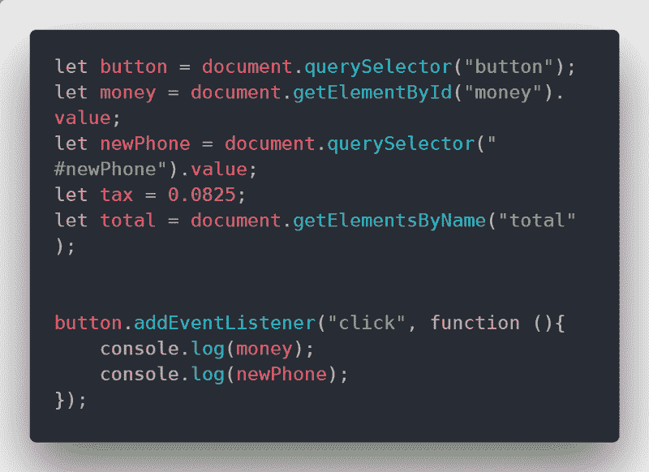
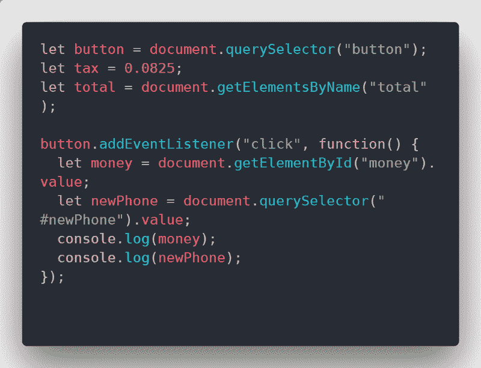

# 如何在 JavaScript 中适时捕获数据

> 原文：<https://www.freecodecamp.org/news/how-to-capture-data-at-the-right-time-in-javascript-b034145b8281/>

我总是带着这样的假设工作，如果我对任何事情投入足够的时间和努力，最终我会得到我想要的结果。如果我能在我的问题上投入足够多的努力(和咖啡:P ),我就能为它建立一个伟大的解决方案。

固执一直以来都是我最好和最差的品质之一。我了解到，在编码领域，高压手段很少奏效。有时情况需要一些微妙的手和策略来达到最佳效果。这是我学到的一课，也是这篇文章的起源。

我希望通过分享我所学到的东西(艰难的方式),这将为你节省一些时间和挫折。所以，事不宜迟，这是本周关于何时何地收集信息的课程。

### 假设

在进入这篇文章之前，我将做一些假设，但为了防止我假设太多，我提供了一些链接。如果这是你对这些话题的介绍，那么欢迎！我很乐意在核实一些信息后回答你的任何问题。我的联系信息可以在这篇文章的底部找到。

*   你知道 HTML 的基础知识
*   你知道 CSS 的基础知识
*   使用 [< li](https://developer.mozilla.org/en-US/docs/Web/HTML/Element/link) nk >标签在 [you](https://developer.mozilla.org/en-US/docs/Learn/Getting_started_with_the_web/HTML_basics) r HTML 文件中链接到一个 ext [外部样式](https://developer.mozilla.org/en-US/docs/Web/CSS)工作表
*   你知道 [JavaScript](https://developer.mozilla.org/en-US/docs/Glossary/JavaScript) 的基础——包括[声明变量](https://developer.mozilla.org/en-US/docs/Web/JavaScript/Reference/Statements/let) & [事件监听器](https://developer.mozilla.org/en-US/docs/Web/API/EventListener)
*   使用 [< li](https://developer.mozilla.org/en-US/docs/Web/HTML/Element/link) nk >标签在 [you](https://developer.mozilla.org/en-US/docs/Learn/Getting_started_with_the_web/HTML_basics) r HTML 文件中链接到一个外部[Java](https://developer.mozilla.org/en-US/docs/Glossary/JavaScript)脚本文件
*   你知道一个 [HTML](https://developer.mozilla.org/en-US/docs/Learn/Getting_started_with_the_web/HTML_basics) 文件是以线性方式从上到下加载的([渲染](https://developers.google.com/web/fundamentals/performance/critical-rendering-path/render-tree-construction)

如果你不熟悉列表上的所有内容，也不要担心。我将在整篇文章中为您提供一些链接，让我们开始吧。

### HTML 文档呈现

在整篇文章中，我将引用下面的代码。这是一个简单的 HTML 模板，带有 [< inp](https://developer.mozilla.org/en-US/docs/Web/HTML/Element/input) ut >字段，用户可以在其中提供一部新(假设)手机的价格数据。

这里你可以看到我在文档顶部的<link>标签指向了我的外部样式表。文档底部的

当这个文档被呈现时(关于浏览器呈现的详细描述，请参见上面的链接)，CSS 样式表将在 JavaScript 文件之前呈现。这是因为 JavaScript 的很大一部分被用来操作 [DOM](https://developer.mozilla.org/en-US/docs/Web/API/Document_Object_Model/Introduction) 元素。

如果

有些情况下，您希望 JavaScript 在此之前加载，因此它被放在了标签中。这超出了本文的范围—只要知道这是可能的。

### 收集值

下面是 JavaScript 文件中的代码，对应于上面 HTML 文档中的

上面，你可以看到我用不同的选择器声明了一些变量。(这是我的快速[指南](https://medium.freecodecamp.org/how-to-avoid-frustration-by-choosing-the-right-javascript-selector-73c64c3906b6)，告诉你如何根据自己的情况选择合适的 JavaScript 选择器)。我想将这些变量的值记录到控制台。

我在这里的意图是从 *money* 和 *newPhone* 字段中获取值，然后在我代码的后续迭代中操作这些值。只有一个问题——我构建代码的方式会导致空变量值。

当我的 *console.log* 语句运行时，我将剩下*未定义的*作为这些变量的值。你可能会问为什么？回想一下 HTML 是如何在浏览器中呈现的。当浏览器沿着 HTML 前进时，一切都在等待渲染。所以当我的<输入>字段被呈现时，它们是空的，因为用户没有在这些字段中提供任何信息。

然后，我选择那些输入字段，分别将它们的`let money = document.getElementById("money").value;`和`let newPhone = document.querySelector("#newPhone").value;`设置为空，因为它们还没有值。

在 HTML 加载之后，我的 JavaScript 选择器发挥了它们的魔力，用户然后改变(在字段中提供信息)数据，但是我的 JavaScript 选择器的值永远不会改变。

### 解决方案

这个问题的解决方案很简单，但是我花了更长的时间才想明白，我愿意承认这一点。我可以将这些输入字段的变量放在我的[事件监听器](https://developer.mozilla.org/en-US/docs/Web/API/EventListener)中。这将确保在单击发生之前不会收集这些字段的数据。当然，在那个时候，信息将已经被输入到字段中(在 HTML 被呈现之后),我们的 JavaScript 将不会有抓取数据的问题。

与所有编程概念一样，有许多不同的方法来完成这项任务。上面的方法正好是我解决的方式。如果你有不同的方法，并想分享它，我很乐意你与我分享。

### 包扎

当然，会出现比我在这里概述的情况更复杂的情况。我希望这能给你一个坚实的基础，告诉你什么时候从 DOM 中收集数据，你的代码是如何被这个时间影响的。

无论您决定如何用 JavaScript 解决您的特殊问题，我希望您至少从这篇文章中学到了一些东西。如果我能帮你节省哪怕五分钟的时间，那我就称之为胜利。

如果你喜欢这个帖子或者它帮助了你，请考虑捐赠一些掌声，因为它可以帮助其他人找到我的作品。我也很想收到你的来信！在 [Twitter](https://twitter.com/jj_goose) 上发表评论或对我大喊——我总是很高兴与友好的面孔和开发伙伴联系！

我也有一个[博客](https://www.jonathansexton.me/blog)，在那里我发布与前端 web 开发相关的技术文章。你可以订阅我的时事通讯，了解我所有的写作经历。一定要过来打个招呼！

一如既往，祝你有一个充满编码、爱、家庭和幸福的美好的一天！