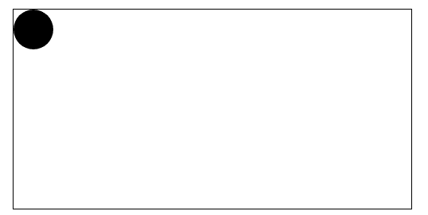
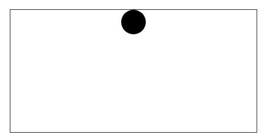
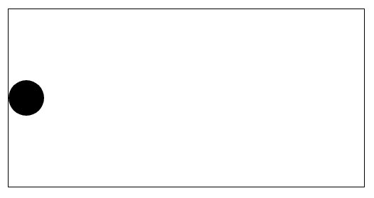
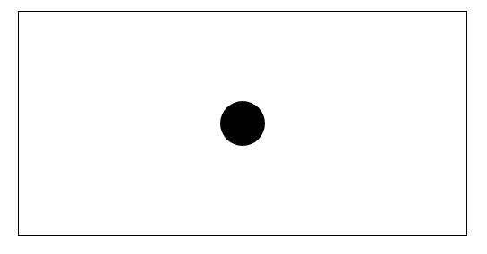
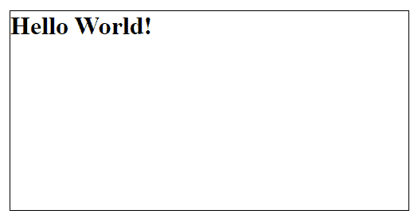
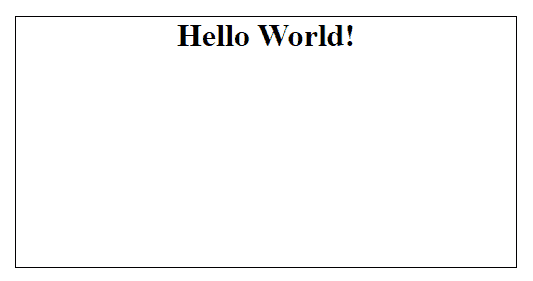

# 如何用 CSS 将 Div 居中

> 原文：<https://www.freecodecamp.org/news/how-to-center-a-div-with-css/>

当您开始实践通过构建项目所学到的内容时，可能会遇到一些常见的编码问题。

作为 web 开发人员，您将面临的一个常见问题是如何将一个元素放置在页面的中心或作为其容器的元素内。这是一个无处不在的“如何使一个 div 居中？”问题。

在本文中，我们将看到如何使用各种 CSS 属性来居中元素。我们将在每一节中看到代码示例，以及所有示例中元素的可视化表示。

## 如何使用 CSS Flexbox 属性将 Div 居中

在这一节中，我们将看到如何使用 CSS Flexbox 属性将元素水平居中、垂直居中以及在页面/容器的中心居中。

如果你喜欢的话，你可以使用一个图片，但是我们将只使用一个用 CSS 绘制的简单的圆形。代码如下:

```
<div class="container">

      <div class="circle">

      </div>

</div>
```

```
.container {
  width: 500px;
  height: 250px;
  margin: 50px;
  outline: solid 1px black;
}

.circle {
  width: 50px;
  height: 50px;
  border-radius: 50%;
  background-color: black;
}
```



使用 Flexbox 定位要求我们在父元素或容器元素的类中编写代码。

### 如何使用 Flexbox 将 Div 水平居中

现在我们将编写代码使`div`元素水平居中。我们仍然在利用我们上面创建的圆圈。

```
.container {
  width: 500px;
  height: 250px;
  margin: 50px;
  outline: solid 1px black;
  display: flex;
  justify-content: center;
}

.circle {
  width: 50px;
  height: 50px;
  border-radius: 50%;
  background-color: black;
}
```

我们添加了两行代码来水平居中这个圆。这些是我们添加的行:

```
display: flex;
justify-content: center;
```

`display: flex;`允许我们使用 Flexbox 及其属性，而`justify-content: center;`将圆水平对齐中心。

这是我们圈子的位置:



### 如何使用 Flexbox 垂直居中 Div

除了一行代码之外，我们在这一节要做的事情与上一节相似。

```
.container {
  width: 500px;
  height: 250px;
  margin: 50px;
  outline: solid 1px black;
  display: flex;
  align-items: center;
}

.circle {
  width: 50px;
  height: 50px;
  border-radius: 50%;
  background-color: black;
}
```

在这个例子中，我们使用`align-items: center;`垂直居中圆。回想一下，我们被要求在指定方向之前先写`display: flex;`。

这是我们圈子的位置:



### 如何使用 Flexbox 将 Div 定位在中心

在本节中，我们将使用 CSS Flexbox 的水平和垂直对齐属性将圆定位在页面的中心。方法如下:

```
.container {
  width: 500px;
  height: 250px;
  margin: 50px;
  outline: solid 1px black;
  display: flex;
  justify-content: center;
  align-items: center;
}

.circle {
  width: 50px;
  height: 50px;
  border-radius: 50%;
  background-color: black;
}
```

下面是我们添加到上面的容器类中的三行代码:

```
display: flex;
justify-content: center;
align-items: center;
```

正如所料，我们从`display: flex;`开始，它允许我们在 CSS 中使用 Flexbox。然后，我们使用了`justify-content`(水平对齐)和`align-items`(垂直对齐)属性将圆形定位在页面的中心。

这是我们圈子的位置:



## 如何使用 CSS `margin`属性将一个 Div 水平居中

在这一节中，我们将使用`margin`属性来水平居中我们的圆。

让我们再次创造我们的圈子。

```
<div class="container">

      <div class="circle">

      </div>

</div>
```

```
.container {
  width: 500px;
  height: 250px;
  margin: 50px;
  outline: solid 1px black;
}

.circle {
  width: 50px;
  height: 50px;
  border-radius: 50%;
  background-color: black;
}
```


这次我们将在`circle`类中编写代码。方法如下:

```
.container {
  width: 500px;
  height: 250px;
  margin: 50px;
  outline: solid 1px black;
}

.circle {
  width: 50px;
  height: 50px;
  border-radius: 50%;
  background-color: black;
  margin: 0 auto;
}
```

我们所添加的是`circle`类的`margin: 0 auto;`行代码。

让我们来看看圆圈的位置:


## 如何使用 CSS `text-align`属性将文本水平居中

在这一节中，我们将看到如何水平居中文本。

只有当我们处理元素中的文本时，这个方法才有效。

这里有一个例子:

```
<div class="container">

    <h1>Hello World!</h1>

</div>
```

在上面的例子中，我们创建了一个带有容器类的`div`和一个带有一些文本的`h1`元素。目前看起来是这样的:



让我们来写 CSS 代码。

```
.container {
  width: 500px;
  height: 250px;
  margin: 50px;
  outline: solid 1px black;
}

h1 {
  text-align: center;
}
```

在 other 中，为了将`h1`元素中的文本对齐到页面中央，我们必须使用`text-align`属性，给它一个值`center`。下面是它现在在浏览器中的样子:



## 结论

在本文中，我们看到了如何使用 Flexbox 和 CSS 中的 margin 和 text-align 属性在页面的中心水平、垂直和居中放置元素。

在每一节中，我们都看到了代码示例和代码功能的可视化表示。

编码快乐！