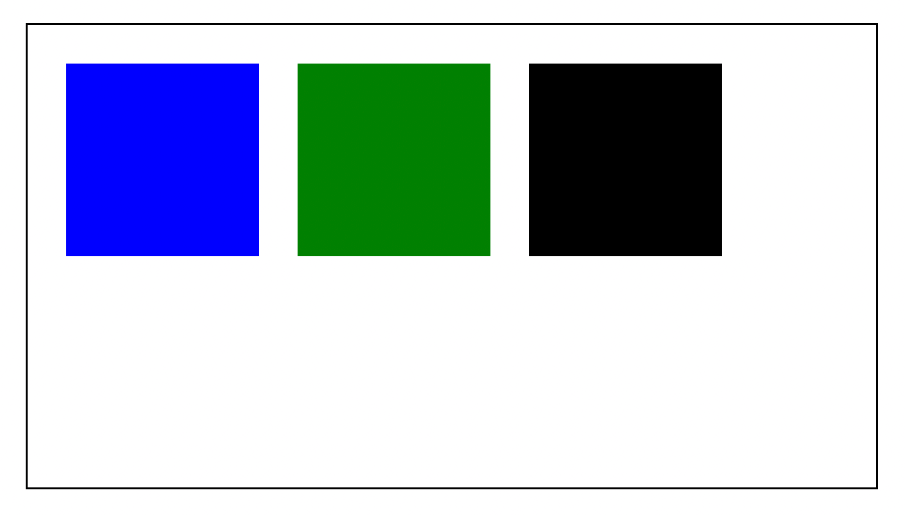
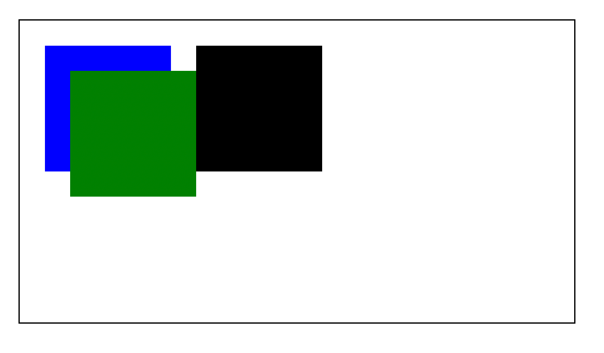
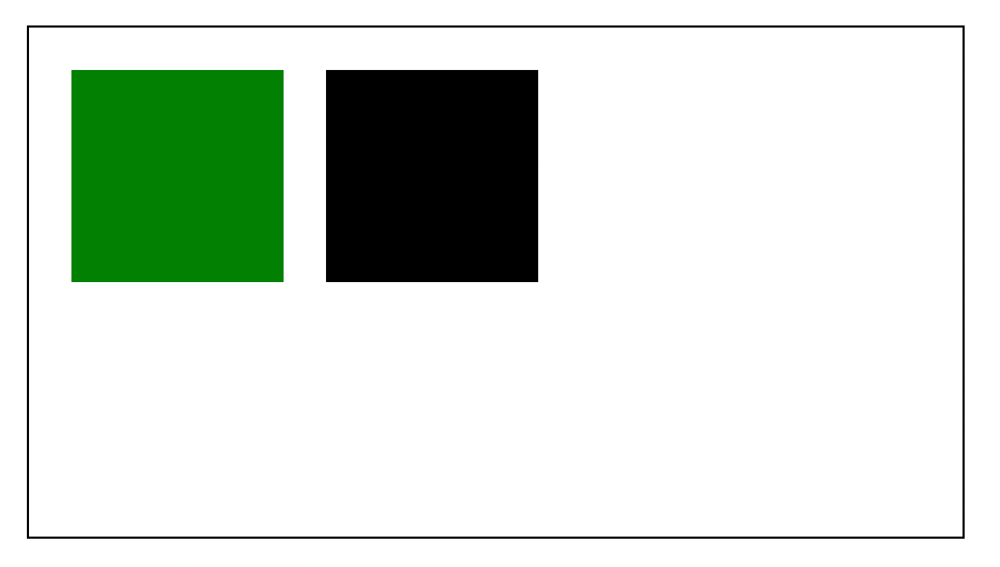
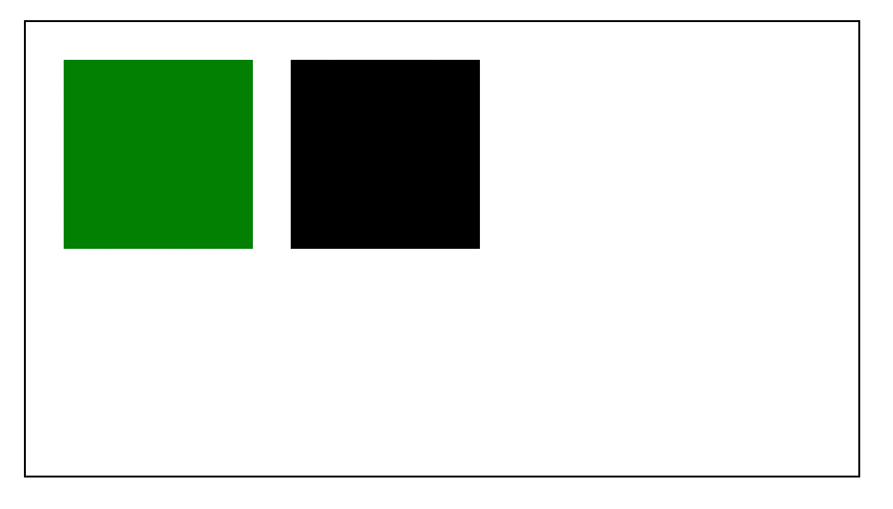
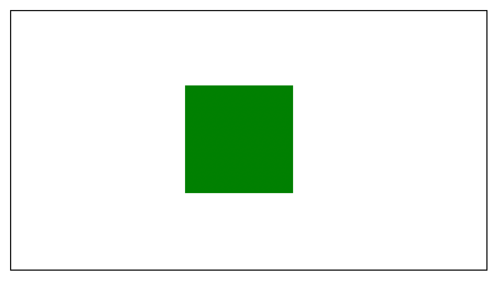
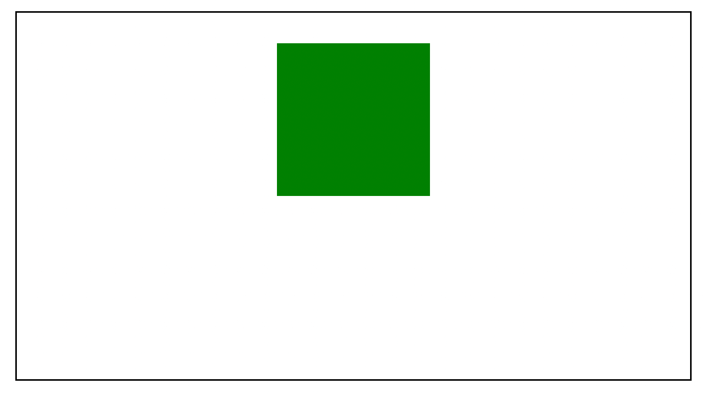
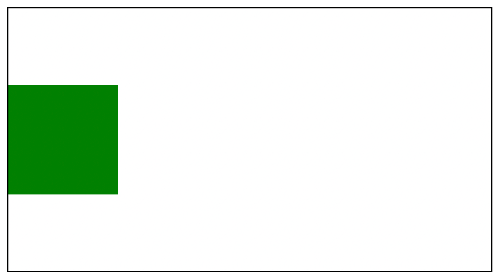
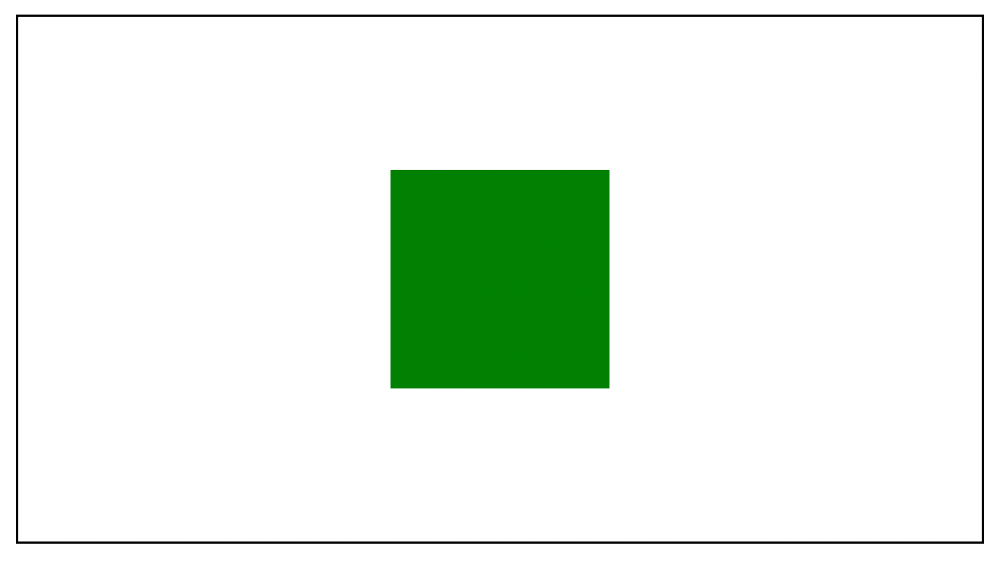

# 如何使用 CSS 将绝对定位的元素垂直和水平居中

> 原文：<https://www.freecodecamp.org/news/how-to-center-an-absolute-positioned-element/>

绝对定位元素从文档流中删除。有时，知道如何正确地将这些元素放置在页面的中央会令人困惑。

我是说，CSS 已经很混乱了。😅

在本文中，我将向您展示如何在容器中垂直或水平(或两者)居中一个绝对元素。

## 代码示例

要将榄香烯水平居中:

```
element {
  position: absolute;
  left: 0;
  right: 0;
  margin: 0 auto;
} 
```

要将元素垂直居中:

```
element {
  position: absolute;
  top: 0;
  bottom: 0;
  margin: auto 0;
} 
```

要使元素垂直和水平居中:

```
 position: absolute;
  left: 0;
  right: 0;
  top: 0;
  bottom: 0;
  margin: auto; 
```

但是如果你想了解我是如何得到这些解决方案的，请继续阅读以获得更多的解释。

## 绝对位置是如何工作的？

默认情况下，元素有一个`static`位置，除非另外指定为`absolute`、`fixed`、`relative`或`sticky`。你可以阅读[这篇关于 CSS 位置风格](https://dillionmegida.com/p/static-relative-absolute-fixed-sticky-positions/)的文章来了解其中的区别。

我将使用下面的 UI 来解释`absolute`元素是如何工作的:



下面是用户界面的代码:

```
<div class="container">
  <div class="blue-block"></div>
  <div class="green-block"></div>
  <div class="black-block"></div>
</div> 
```

```
.container {
  margin: 20px;
  display: flex;
  border: 1px solid black;
  padding: 20px;
  width: 400px;
}

.blue-block,
.green-block,
.black-block {
  width: 100px;
  height: 100px;
}

.blue-block {
  background-color: blue;
}

.green-block {
  background-color: green;
}

.black-block {
  background-color: black;
} 
```

这个容器有三个区块:分别是蓝色、绿色和黑色。所有的块当前都是`static`，所以它们在 DOM 中的排序方式是一样的，就像它们在代码中一样。

当你给绿色方块一个`absolute`位置时会发生什么:

```
.green-block {
  background-color: green;
  position: absolute;
  margin-left: 20px;
  margin-top: 20px;
} 
```



您现在可以看到绿色块已经离开了文档流。容器仅将 flex 显示应用于蓝色和黑色元素，绿色元素四处移动，不会影响其他元素。

那么，如果我们想把这个绿色的方块放在容器的中心呢？

## 如何将绝对元素放置在中心

将静态元素放置在中间通常会涉及到自动边距，所以一个`margin: auto`就足够了，对吗？

```
.green-block {
  background-color: green;
  position: absolute;
  margin: auto;
} 
```



绝对不是。作为一个`absolute`元素，它在容器中丢失了它的流。也许一个`left: auto`和`right: auto`那么:

```
.green-block {
  background-color: green;
  position: absolute;
  left: auto;
  right: auto;
} 
```



还是一无所获。此时，您可能想使用硬编码的值:

```
.blue-block, .black-block {
  display: none;
}

.green-block {
  background-color: green;
  position: absolute;
  left: 190px;
  top: 90px;
} 
```



这个结果看起来很完美(或几乎完美),但不是最佳解决方案，因为当您更改容器的大小时，您必须更改硬编码的值。

现在，让我们看看如何将绝对定位的元素居中。

第一部分是将`relative`位置应用于容器:

```
.container {
  // ...
  position: relative;
} 
```

对容器应用相对位置给绝对元素一个边界。绝对元素由相对位置最近的父元素限定。但是如果这些都不存在，它们将被视口所限制。

接下来，我们将水平居中块。应用值为 0 的`left`和`right`属性。这些属性分别指定(块的)左边缘到容器的距离和右边缘到容器的距离。

```
.green-block {
  // ...
  left: 0;
  right: 0;
} 
```


因为容器从左到右显示元素，`left`需要更多的优先级。

这种美伴随着下一种风格而来:

```
.green-block {
  // ...
  margin: 0 auto;
} 
```



你有一个水平居中的绝对元素。想象一下为块指定内部容器的`left`和`right`属性。在这个容器中，左边距和右边距可以被`auto`以使它们相等，并将元素置于中心。

要将这个块垂直居中，您可能已经猜到它是这样的:

```
.green-block {
  // ...
  top: 0;
  bottom: 0;
  margin: auto 0;
} 
```



`top`和`bottom`指定块的顶部和底部边缘之间的距离，看起来像一个内部容器。使用`auto`为`margin-top`和`margin-bottom`创建相等的边距。

将这两个概念结合在一起，您可以像这样水平和垂直居中块:

```
.green-block {
  background-color: green;
  position: absolute;
  right: 0;
  left: 0;
  top: 0;
  bottom: 0;
  margin: auto;
} 
```



使用这种方法，如果您调整容器的大小，元素会停留在中心。

## 包扎

绝对元素的行为不同于静态元素——它们离开文档流，默认情况下，不考虑声明它们的容器。

有了`relative`定位的父元素，`absolute`定位的元素就有了边界。并且使用值为 **0** (指定边缘的距离)的`left`、`right`、`top`和`bottom`属性，以及**自动**边距，绝对元素在父元素中居中。

请注意，这不是将绝对元素放置在中心的唯一方法。我也在网上看到有人用`transform: translate...`来实现这个。如果你愿意，你可以去调查一下。