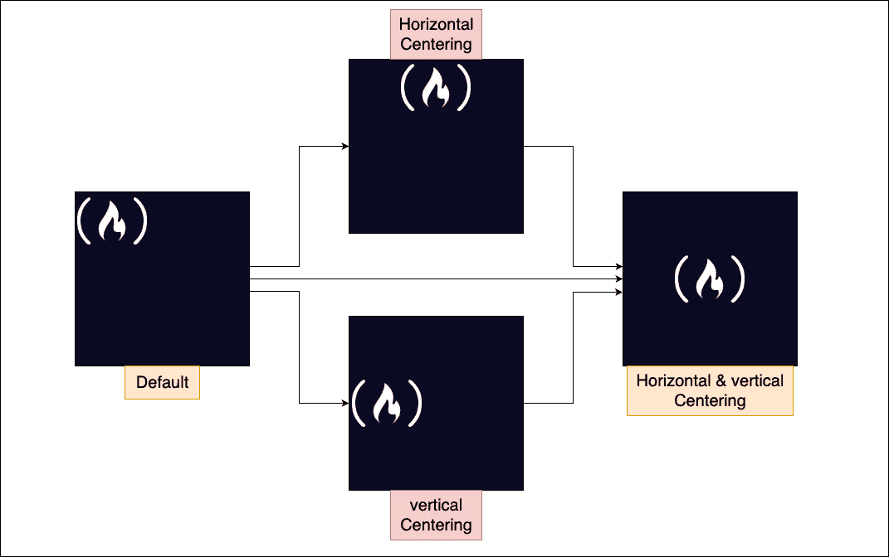
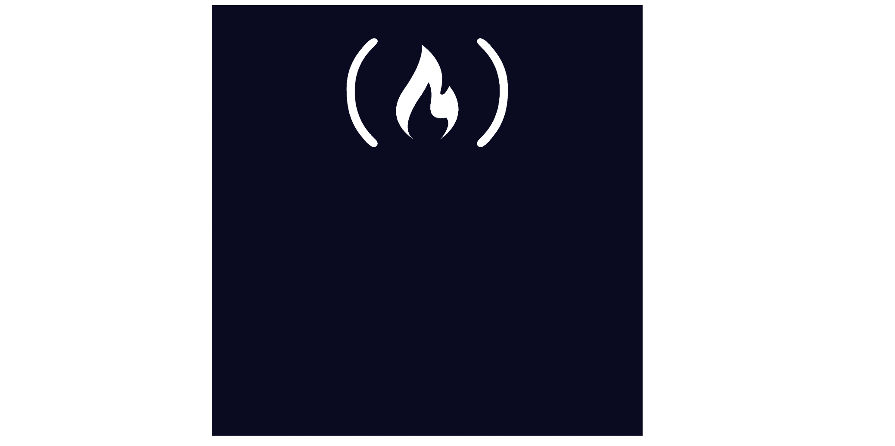

# CSS 图像居中——如何在一个 Div 中将图像居中

> 原文：<https://www.freecodecamp.org/news/how-to-center-an-image-in-a-div-css/>

当你在一个网页的前端工作时，你有时需要在一个`div`(容器)中将一个图像居中。

这有时会变得棘手。基于特定的条件，一个特定的方法可能在某个时候不起作用，让你去寻找替代方法。

在这篇文章中，你将学习如何用 CSS 将一个图片放在`div`的中心。

## 如何使用 CSS 使`div`居中

你可以通过两种方式在`div`中将图像居中:水平和垂直。当你把这两种方法放在一起，你会有一个完全居中的图像:



默认情况下，网页内容总是从屏幕的左上角开始，从`ltr`(从左到右)移动——除了某些语言，如阿拉伯语，从`rtl`(从右到左)。

让我们先来看看如何在`div`中水平居中图像。然后我们来看看如何垂直居中。最后，我们将看到如何同时做到这两点。



### 如何使用文本对齐在 Div 中将图像水平居中

假设你有一个`div`，你可以这样放置你的图像:

```
<div class="container">
    
</div> 
```

并应用基本的 CSS 样式，使您的图像可见:

```
.container {
    width: 200px;
    height: 200px;
    background-color: #0a0a23;
}
.container img {
    width: 100px;
} 
```

`text-align`方法并不是在所有情况下都有效，因为你通常用它来居中文本。但是当您将图像放在像`div`这样的块级容器中时，这种方法将会起作用:

```
.container {
    width: 200px;
    height: 200px;
    background-color: #0a0a23;
    text-align: center;
}

.container img {
    width: 100px;
} 
```

这是通过将`text-align`属性及其值`center`添加到容器而不是图像本身来实现的。

### 如何使用自动边距在 Div 中将图像水平居中

另一种可以用来在`div`(容器)中水平居中图像的方法是值为`auto`的`margin`属性。

该元素将占据指定的 `width`的**，剩余的空间将在左边距和右边距之间平分。**

您通常会将此方法应用于图像本身，而不是容器。但遗憾的是，光靠这个属性是不行的。您还需要指定图像将首先拍摄的`width`。这让 margin 知道容器的剩余宽度，这样它可以被平均分割。

其次，`img`是内联元素，`margin-auto`属性集不影响内联级元素。这意味着您必须首先将它转换成一个块级元素，并将`display`属性设置为`block`。

```
.container {
    width: 200px;
    height: 200px;
    background-color: #0a0a23;
}

.container img {
    width: 100px;
    margin: auto;
    display: block;
} 
```

### 如何使用 Position 和 Transform 属性使图像在 Div 中水平居中

另一种可以用来水平定位图像的方法是在`transform`属性旁边的`position`属性。

这种方法可能非常棘手，但很有效。您必须首先将容器的`position`设置为`relative`，然后将图像设置为`absolute`。

一旦你这样做了，你现在可以使用图像上的`left`、`top`、`bottom`或`right`属性将图像移动到你想要的任何位置。

在这种情况下，您只想将图像水平移动到中心。这意味着您可以通过`left`将图像移动到 50%或`right`移动到-50%:

```
.container {
    width: 200px;
    height: 200px;
    background-color: #0a0a23;
    position: relative;
}

.container img {
    width: 100px;
    height: 100px;
    position: absolute;
    left: 50%;
} 
```

但是当你检查你的图像时，你会注意到图像仍然没有被完美地放置在中心。这是因为它是从 50%标记开始的，这是中心位置。

在这种情况下，您需要使用`transform-translateX`属性来调整它，以获得完美的水平中心:

```
.container {
    width: 200px;
    height: 200px;
    background-color: #0a0a23;
    position: relative;
}

.container img {
    width: 100px;
    height: 100px;
    position: absolute;
    left: 50%;
    transform: translateX(-50%);
} 
```

### 如何使用 Display-Flex 在 Div 中水平居中显示图像

CSS flexbox 使您更容易设计灵活的、响应性强的布局结构，而无需使用浮动或定位。我们还可以用它来使用 display 属性，以 flex 为其值，在容器的水平中心放置一个图像。

但是光靠这个不行。你还需要定义你想要的图像的位置。这可能是`center,` `left`或者可能是`right`:

```
.container {
    width: 200px;
    height: 200px;
    background-color: #0a0a23;
    display: flex;
    justify-content: center;
}

.container img {
    width: 100px;
    height: 100px;
} 
```

**注意:**旧版本的浏览器不支持`display: flex`属性。你可以在这里阅读更多。您还会注意到，定义了图像的宽度和高度，以确保图像不会缩小。

现在让我们学习如何在`div`中垂直居中图像。稍后我们将看到如何在一个`div`中同时水平和垂直居中图像，使其成为一个完美的中心。


### 如何使用 Display-Flex 在 Div 中垂直居中图像

就像使用 display-flex 方法可以水平居中图像一样，您也可以垂直居中。

但是这一次，您不需要使用`justify-content`属性。相反，您将使用`align-items`属性:

```
.container {
    width: 200px;
    height: 200px;
    background-color: #0a0a23;
    display: flex;
    align-items: center;
}

.container img {
    width: 100px;
    height: 100px;
} 
```

为了使这个方法有效，容器必须有一个指定的`height`，您将使用它来计算高度并知道中心的位置。

### 如何使用 Position 和 Transform 属性使图像在 Div 中垂直居中

类似于您之前使用`position`和`transform`属性将图像水平放置在中心，您也可以垂直放置。

但是这一次，你不会用`left`或者`right,`。相反，你会在`translateY`旁边使用`top`或`bottom`，而不是`translateX`:

```
.container {
    width: 200px;
    height: 200px;
    background-color: #0a0a23;
    position: relative;
}

.container img {
    width: 100px;
    height: 100px;
    position: absolute;
    top: 50%;
    transform: translateY(-50%);
} 
```

您已经学习了如何使用所有可能的方法在`div`中水平和垂直居中图像。现在让我们学习如何水平和垂直居中。


### 如何使用 Display-Flex 在 Div 中水平和垂直居中图像

属性是如何垂直和水平居中图像的组合。

对于 flex 方法，这意味着您将使用设置为`center`的`justify-content`和`align-items`属性:

```
.container {
    width: 200px;
    height: 200px;
    background-color: #0a0a23;
    display: flex;
    justify-content: center;
    align-items: center;
}

.container img {
    width: 100px;
    height: 100px;
} 
```

### 如何使用 Position 和 Transform 属性使图像在 Div 中水平和垂直居中

这也非常相似，因为您所要做的就是将您能够垂直居中和水平居中的两种方式结合起来:

```
.container {
    width: 200px;
    height: 200px;
    background-color: #0a0a23;
    position: relative;
}

.container img {
    width: 100px;
    height: 100px;
    position: absolute;
    top: 50%;
    left: 50%;
    transform: translateX(-50%) translateY(-50%);
} 
```

您也可以通过使用`translate(x,y)`来组合`translateX`和`translateY`:

```
.container {
    width: 200px;
    height: 200px;
    background-color: #0a0a23;
    position: relative;
}

.container img {
    width: 100px;
    height: 100px;
    position: absolute;
    top: 50%;
    left: 50%;
    transform: translate(-50%, -50%);
} 
```

## 包扎

在本文中，您了解了如何在 div 中垂直居中、水平居中或两者都居中。

将图像移动到中间时，您会经常使用 Flexbox 方法，因为`position`方法会扭曲您的网页，并且非常棘手。

你可以在这里了解更多关于 [CSS 定位方法的信息，然后在这里了解更多关于](https://www.freecodecamp.org/news/css-position-property-explained/) [flexbox 方法的信息。](https://www.freecodecamp.org/news/css-flexbox-tutorial-with-cheatsheet/)

祝编码愉快！