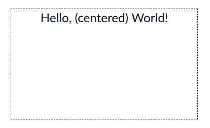
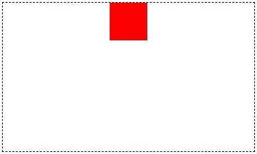
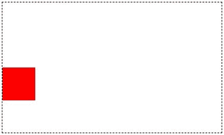
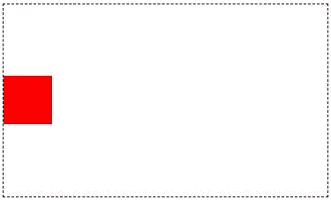
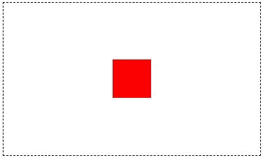

# 如何用 CSS 居中对齐一个 Div，文本等等

> 原文：<https://www.freecodecamp.org/news/how-to-center-anything-with-css-align-a-div-text-and-more/>

使事物居中是 CSS 最困难的方面之一。

这些方法本身通常不难理解。相反，这更多的是因为有太多的方法来将事情居中。

您使用的方法可能会有所不同，这取决于您尝试居中的 HTML 元素，或者是水平居中还是垂直居中。

在本教程中，我们将学习如何将不同的元素水平居中、垂直居中以及水平和垂直居中。

## 如何水平居中

水平居中元素通常比垂直居中元素更容易。这里有一些你可能想要水平居中的常见元素和不同的方法。

### 如何使用 CSS 文本居中对齐属性使文本居中

要水平居中文本或链接，只需使用值为`center`的`text-align`属性:

```
<div class="container">
  <p>Hello, (centered) World!</p>
</div> 
```

```
.container {
  font-family: arial;
  font-size: 24px;
  margin: 25px;
  width: 350px;
  height: 200px;
  outline: dashed 1px black;
}

p {
  /* Center horizontally*/
  text-align: center;
} 
```



### 如何使用 CSS 边距自动将 Div 居中

使用带有值`0 auto`的简写`margin`属性将块级元素(如`div`)水平居中:

```
<div class="container">
  <div class="child"></div>
</div>
```

```
.container {
  font-family: arial;
  font-size: 24px;
  margin: 25px;
  width: 350px;
  height: 200px;
  outline: dashed 1px black;
}

.child {
  width: 50px;
  height: 50px;
  background-color: red;
  /* Center horizontally*/
  margin: 0 auto;
} 
```


### 如何使用 Flexbox 将 Div 水平居中

Flexbox 是在页面上居中的最现代的方式，使得设计响应性布局比以前容易得多。然而，它在一些传统浏览器如 Internet Explorer 中不被完全支持。

要使用 Flexbox 水平居中元素，只需将`display: flex`和`justify-content: center`应用于父元素:

```
<div class="container">
  <div class="child"></div>
</div> 
```

```
.container {
  font-family: arial;
  font-size: 24px;
  margin: 25px;
  width: 350px;
  height: 200px;
  outline: dashed 1px black;
  /* Center child horizontally*/
  display: flex;
  justify-content: center;
}

.child {
  width: 50px;
  height: 50px;
  background-color: red;
} 
```



## 如何垂直居中

没有像 Flexbox 这样的现代方法，将元素垂直居中是一件非常麻烦的事情。在这里，我们将回顾一些旧的方法，先将东西垂直居中，然后向您展示如何使用 Flexbox 做到这一点。

### 如何使用 CSS 绝对定位和负边距将 Div 垂直居中

在很长一段时间里，这是垂直居中的常用方式。对于这种方法，您必须知道要居中的元素的高度。

首先，将父元素的`position`属性设置为`relative`。

然后对于子元素，将`position`属性设置为`absolute`并将`top`设置为`50%`:

```
<div class="container">
  <div class="child"></div>
</div> 
```

```
.container {
  font-family: arial;
  font-size: 24px;
  margin: 25px;
  width: 350px;
  height: 200px;
  outline: dashed 1px black;
  /* Setup */
  position: relative;
}

.child {
  width: 50px;
  height: 50px;
  background-color: red;
  /* Center vertically */
  position: absolute;
  top: 50%;
} 
```



但这实际上只是将子元素的顶部边缘垂直居中。

要真正使子元素居中，请将`margin-top`属性设置为`-(half the child element's height)`:

```
.container {
  font-family: arial;
  font-size: 24px;
  margin: 25px;
  width: 350px;
  height: 200px;
  outline: dashed 1px black;
  /* Setup */
  position: relative;
}

.child {
  width: 50px;
  height: 50px;
  background-color: red;
  /* Center vertically */
  position: absolute;
  top: 50%;
  margin-top: -25px; /* Half this element's height */
}
```


### 如何使用转换和平移将 Div 垂直居中

如果您不知道想要居中的元素的高度(或者即使您知道)，这种方法是一个很好的技巧。

这种方法与上面的负边距方法非常相似。将父元素的`position`属性设置为`relative`。

对于子元素，将`position`属性设置为`absolute`，将`top`设置为`50%`。现在不用负边距来真正地将子元素居中，只需使用`transform: translate(0, -50%)`:

```
<div class="container">
  <div class="child"></div>
</div> 
```

```
.container {
  font-family: arial;
  font-size: 24px;
  margin: 25px;
  width: 350px;
  height: 200px;
  outline: dashed 1px black;
  /* Setup */
  position: relative;
}

.child {
  width: 50px;
  height: 50px;
  background-color: red;
  /* Center vertically */
  position: absolute;
  top: 50%;
  transform: translate(0, -50%);
} 
```



注意，`translate(0, -50%)`是`translateX(0)`和`translateY(-50%)`的简写。您也可以编写`transform: translateY(-50%)`来垂直居中子元素。

### 如何使用 Flexbox 将 Div 垂直居中

像水平居中一样，Flexbox 使垂直居中变得非常容易。

要垂直居中元素，请将`display: flex`和`align-items: center`应用到父元素:

```
<div class="container">
  <div class="child"></div>
</div>
```

```
.container {
  font-family: arial;
  font-size: 24px;
  margin: 25px;
  width: 350px;
  height: 200px;
  outline: dashed 1px black;
  /* Center vertically */
  display: flex;
  align-items: center;
}

.child {
  width: 50px;
  height: 50px;
  background-color: red;
} 
```


## 如何垂直和水平居中

### 如何使用 CSS 绝对定位和负边距使 Div 垂直和水平居中

这与上面垂直居中元素的方法非常相似。像上次一样，您必须知道要居中的元素的宽度和高度。

将父元素的`position`属性设置为`relative`。

然后将孩子的`position`属性设置为`absolute`、`top`设置为`50%`、`left`设置为`50%`。这只是将子元素的左上角垂直和水平居中。

要使子元素真正居中，请将负上边距设置为子元素高度的一半，将负左边距设置为子元素宽度的一半:

```
<div class="container">
  <div class="child"></div>
</div> 
```

```
.container {
  font-family: arial;
  font-size: 24px;
  margin: 25px;
  width: 350px;
  height: 200px;
  outline: dashed 1px black;
  /* Setup */
  position: relative;
}

.child {
  width: 50px;
  height: 50px;
  background-color: red;
  /* Center vertically and horizontally */
  position: absolute;
  top: 50%;
  left: 50%;
  margin: -25px 0 0 -25px; /* Apply negative top and left margins to truly center the element */
} 
```



### 如何使用 Transform 和 Translate 将 Div 垂直和水平居中

如果您不知道元素的确切尺寸并且无法使用 Flexbox，请使用此方法垂直和水平居中元素。

首先，将父元素的`position`属性设置为`relative`。

接下来，将子元素的`position`属性设置为`absolute`、`top`设置为`50%`、`left`设置为`50%`。

最后，使用`transform: translate(-50%, -50%)`将子元素真正居中:

```
<div class="container">
  <div class="child"></div>
</div> 
```

```
.container {
  font-family: arial;
  font-size: 24px;
  margin: 25px;
  width: 350px;
  height: 200px;
  outline: dashed 1px black;
  /* Setup */
  position: relative;
}

.child {
  width: 50px;
  height: 50px;
  background-color: red;
  /* Center vertically and horizontally */
  position: absolute;
  top: 50%;
  left: 50%;
  transform: translate(-50%, -50%);
} 
```


### 如何使用 Flexbox 使 Div 垂直和水平居中

Flexbox 是垂直和水平居中元素的最简单的方法。

这实际上只是前面两种 Flexbox 方法的组合。要水平和垂直居中子元素，请将`justify-content: center`和`align-items: center`应用到父元素:

```
<div class="container">
  <div class="child"></div>
</div> 
```

```
.container {
  font-family: arial;
  font-size: 24px;
  margin: 25px;
  width: 350px;
  height: 200px;
  outline: dashed 1px black;
  /* Center vertically and horizontally */
  display: flex;
  justify-content: center;
  align-items: center;
}

.child {
  width: 50px;
  height: 50px;
  background-color: red;
} 
```


## 一个关于如何用 CSS 居中任何东西的视频解释

[https://scrimba.com/scrim/co4db41c6a8d6458e2d84500b?embed=freecodecamp,mini-header](https://scrimba.com/scrim/co4db41c6a8d6458e2d84500b?embed=freecodecamp,mini-header)

这就是你需要知道的一切，以他们中的佼佼者为中心。现在往前走，集中所有的东西。