# 如何使用 Flexbox 和网格✨将 CSS 中的任何内容居中

> 原文：<https://www.freecodecamp.org/news/how-to-center-objects-using-css/>

今天我将向你展示如何用 CSS 居中对齐你的内容。一路上，我们将看看各种**对准技术**。所以，让我们开始吧！🥇

## 目录->

*   如何使用 **Flexbox** 来
    *   [水平居中](#how-to-center-anything-horizontally-using-flexbox)
    *   [垂直居中](#how-to-center-anything-vertically-using-flexbox)
    *   [水平居中&垂直居中](#how-to-center-a-div-horizontally-vertically-using-flexbox)
*   如何使用**网格**来
    *   [水平居中](#how-to-center-anything-horizontally-using-css-grid)
    *   [垂直居中](#how-to-center-anything-vertically-using-css-grid)
    *   [水平居中&垂直居中](#how-to-center-a-div-horizontally-vertically-using-css-grid)
*   [变换&位置属性](#how-to-use-the-css-position-property-to-center-anything)
*   [保证金属性](#how-to-use-the-margin-property-to-center-anything)
*   [**附加资源**](#additional-resources)
*   [结论](#conclusion)

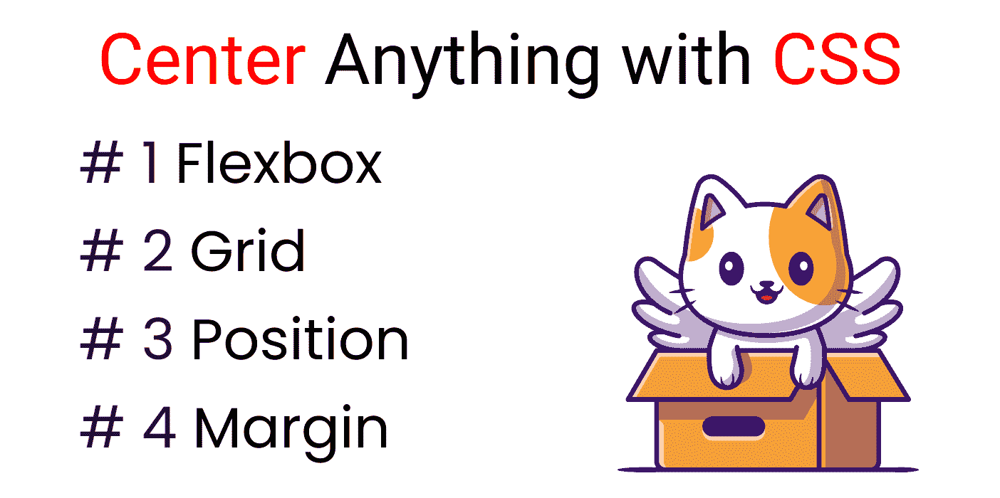

Methods

## 如果你喜欢，你也可以在 YouTube 上观看这个教程:

[https://www.youtube.com/embed/RTEzXS_CT5w?feature=oembed](https://www.youtube.com/embed/RTEzXS_CT5w?feature=oembed)

## 但是....等一下！

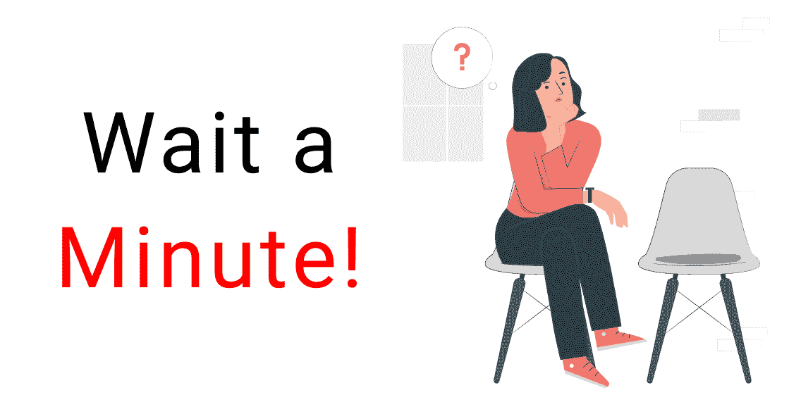

首先，我们来了解一下:

*   主茎
*   横轴

## CSS 中的主轴是什么？

您也可以将其称为:

*   **X 轴**
*   主茎
*   水平线

从**左**到**右**的直线为主轴。

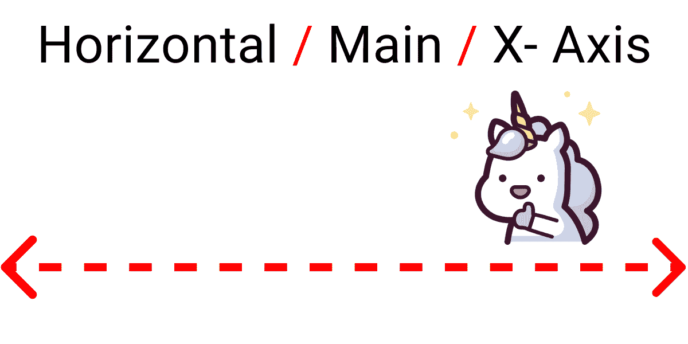

Main Axis

## CSS 中的横轴是什么？

您也可以将其称为:

*   **Y 轴**
*   横轴
*   垂直线

从**顶部**到**底部**的线是十字轴。

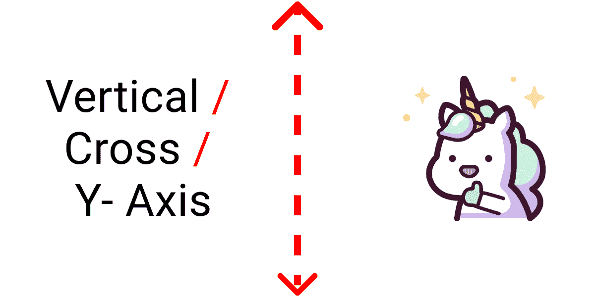

Cross Axis

# 项目设置

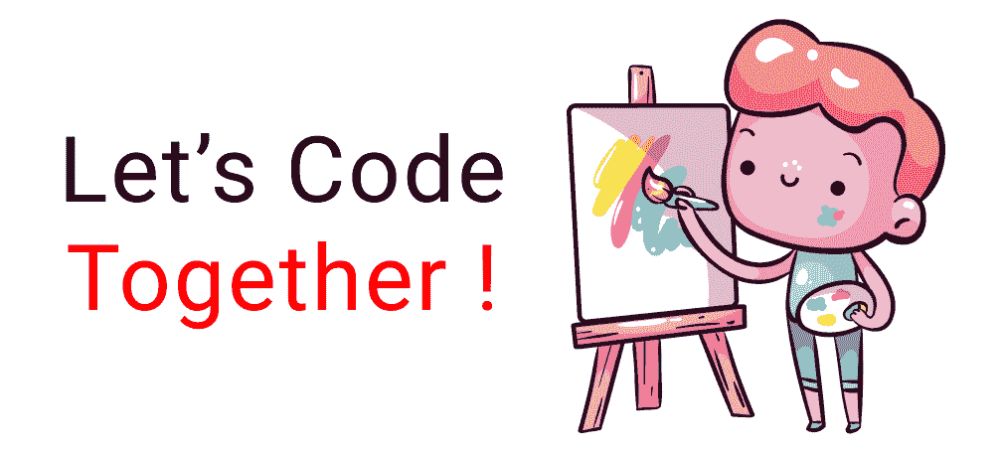

若要试验所有属性和值，请在代码编辑器中编写以下代码。

### 超文本标记语言

在 body 标记内编写以下代码:

```
<div class="container">

   <div class="box-1"> </div>

</div>
```

### 半铸钢ˌ钢性铸铁(Cast Semi-Steel)

清除**默认**浏览器样式，以便我们能够更准确地工作:

```
*{
  margin: 0px;
  padding: 0px;
  box-sizing: border-box;
}
```

选择**。容器**类，并将其设置为 100vh。否则，我们无法在**垂直轴**上看到我们的结果:

```
.container{
   height: 100vh;
}
```

样式**。box-1** 类这样:

```
.box-1{
   width: 120px;
   height: 120px;
   background-color: skyblue;
   border: 2px solid black;
}
```

我们都准备好了，现在让我们开始编码吧！


## 如何使用 Flexbox 使任何东西居中


我们可以使用 Flexbox 沿 X 轴和 Y 轴对齐我们的内容`div`。为此，我们需要在`.container`类中编写`display: flex;`属性:

```
.container{
   display: flex;

   height: 100vh;
}
```

我们将对这两个属性进行实验:

*   `justify-content`
*   `align-items`

## 如何使用 Flexbox 将任何东西水平居中

我们可以使用这些值使用 **justify-content** 属性来实现这一点👇

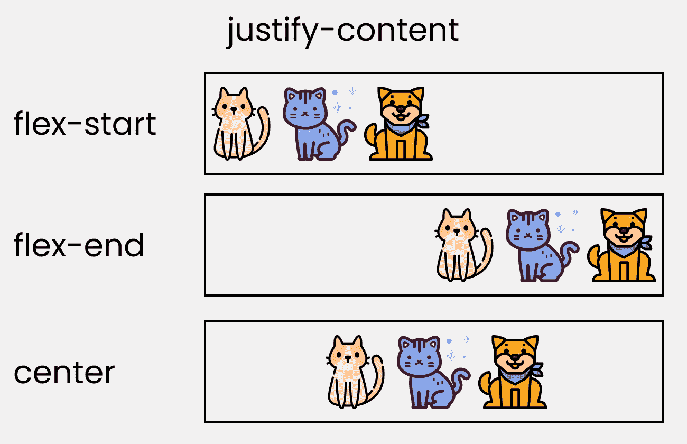

**values of flexbox justify-content property**

要试验这些值，请编写以下代码👇

```
.container{
   display: flex;
   height: 100vh;

 /* Change values to  👇 experiment*/
   justify-content: center;
}
```

结果将是这样的👇

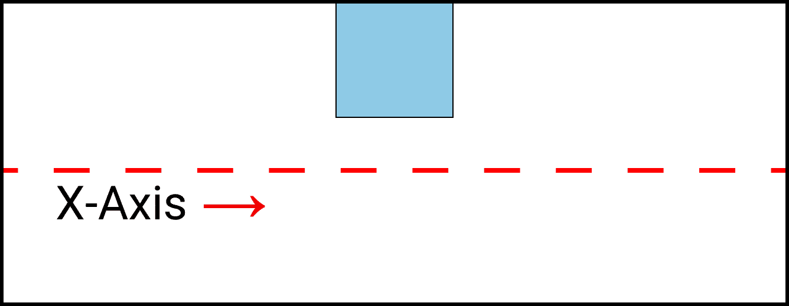

result of justify-content flexbox

## 如何使用 Flexbox 将任何东西垂直居中

我们可以使用这些值通过 **`align-items`** 属性来实现👇

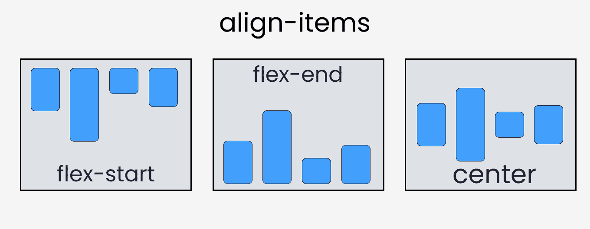

**values of Flexbox align-items property**

要试验这些值，请编写以下代码👇

```
.container{
   height: 100vh;
   display: flex;

 /* Change values 👇 to experiment*/
   align-items: center;
} 
```

结果看起来像这样👇


Result of align-items flexbox

## 如何使用 Flexbox 将 div 水平和垂直居中

这里，我们可以结合 **`justify-content`** 和 **`align-items`** 属性来水平和垂直对齐一个 div。

编写以下代码👇

```
.container{
   height: 100vh;
   display: flex;

/* Change values 👇 to experiment*/
   align-items: center;
   justify-content: center;
}
```

结果看起来像这样👇

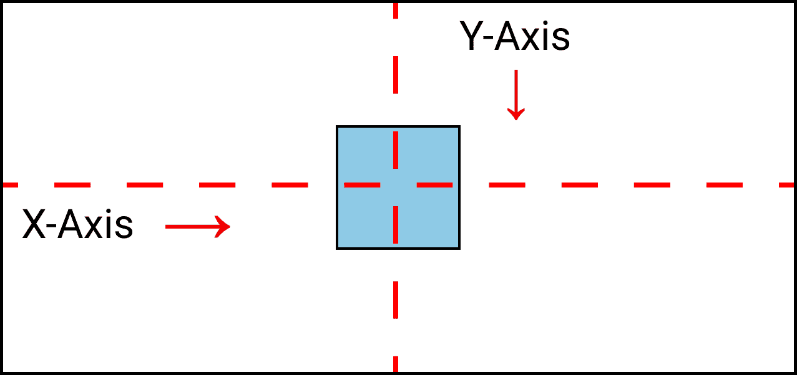

Centering a div Horizontally & vertically

您可以查看此[备忘单](https://www.freecodecamp.org/news/css-flexbox-tutorial-with-cheatsheet/)以了解更多关于 Flexbox 的各种属性。

## 如何使用 CSS 网格将任何内容居中


我们可以使用**网格**沿着 X 轴和 Y 轴对齐我们的内容`div`。为此，我们需要在`.container`类中编写`display: grid;`属性:

```
.container{
   display: grid;

   height: 100vh;
}
```

我们将对这两个属性进行实验:

*   `justify-content`
*   `align-content`

**或者**，您可以使用这两个属性:

*   `justify-items`
*   `align-items`

## 如何使用 CSS 网格水平居中

我们可以使用这些值通过 **`justify-content`** 属性来实现👇

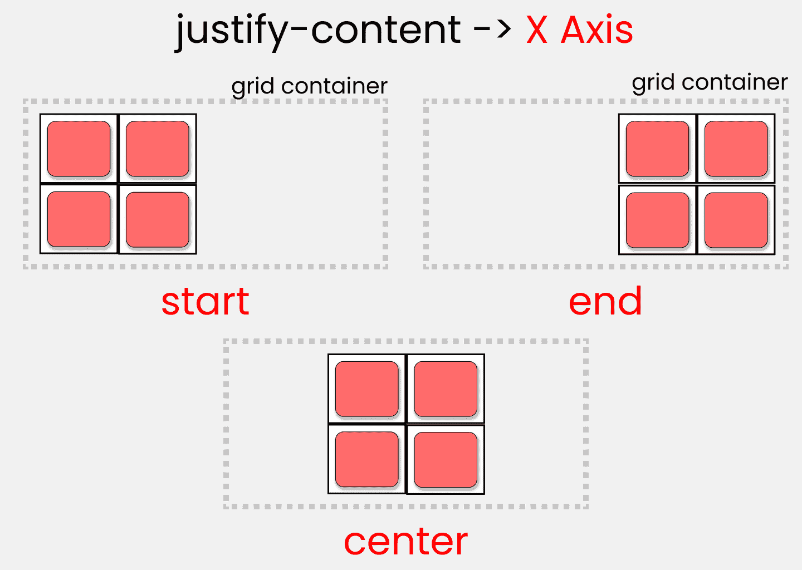

**values of Grid justify-content property**

编写以下代码👇

```
.container{
   height: 100vh;
   display: grid;

  /* Change  values   👇 to experiment*/
   justify-content: center;
}
```

结果看起来像这样👇


**result of justify-content grid**

## 如何使用 CSS 网格垂直居中

我们可以使用这些值通过 **`align-content`** 属性来实现👇

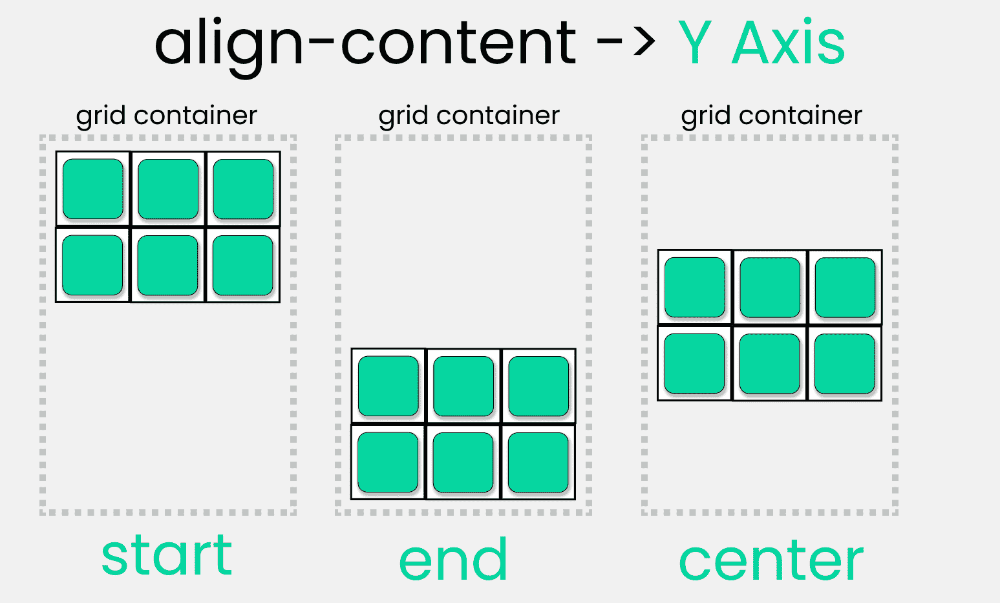

Values of CSS grid align-content property

编写以下代码👇

```
.container{
   height: 100vh;
   display: grid;

  /*  Change values 👇 to experiment*/
   align-content: center;
}
```

结果将是这样的👇

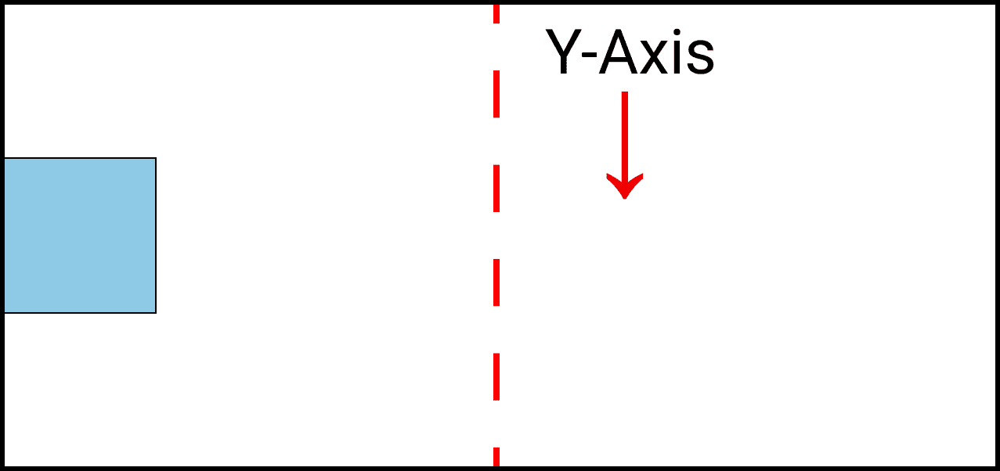

result of align-content grid

## 如何使用 CSS 网格使一个 div 水平和垂直居中

这里，我们可以结合 **`justify-content`** 和 **`align-content`** 属性来水平和垂直对齐一个 div。

编写以下代码👇

```
.container{
   height: 100vh;
   display: grid;

/* Change  values  👇 to experiment*/
   align-content: center;
   justify-content: center;
}
```

结果看起来像这样👇


Centering a div Horizontally & vertically with Grid

## 替代方式

您也可以使用 **`justify-items`** 和 **`align-items`** 属性来复制相同的结果:

```
.container{
   height: 100vh;
   display: grid;

/* Change  values  👇 to experiment*/
   align-items: center;
   justify-items: center;
}
```

## CSS 网格中的位置内容属性

这是 CSS 网格- >的两个属性的**简写**

*   `justify-content`
*   `align-content`

跟着走👇

```
.container{
   height: 100vh;
   display: grid;

   place-content: center;
}
```

我们得到同样的结果👇


Centering a div Horizontally & vertically

检查此[备忘单](https://www.freecodecamp.org/news/css-grid-tutorial-with-cheatsheet)以找出各种网格属性之间的差异。

## 休息一下！

到目前为止还不错——休息一下。


## 如何使用 CSS Position 属性将任何内容居中

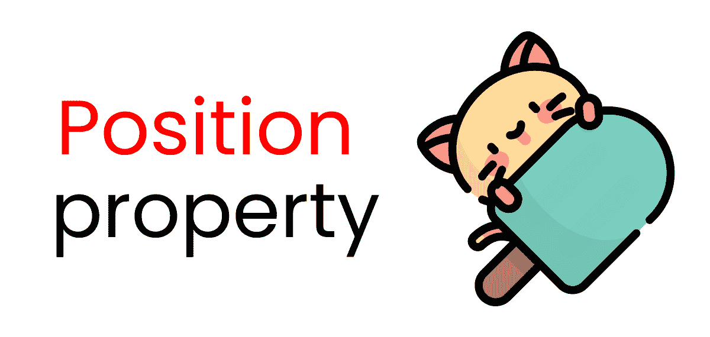

这是这些属性的组合->

*   `position`
*   `top, left`
*   `transform, translate`

编写以下代码👇

```
.container{
   height: 100vh;
   position: relative;
}
```

与此同时:

```
.box-1{
   position: absolute;

   width: 120px;
   height: 120px;
   background-color: skyblue;
   border: 2px solid black;
}
```

## 第一...了解分区的中心点

默认情况下，这是 div 的中心点👇

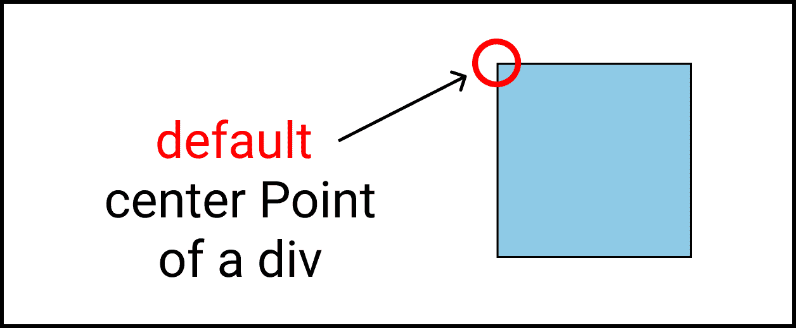

**Default Center point of a div**

这就是为什么我们会看到这种奇怪的行为👇

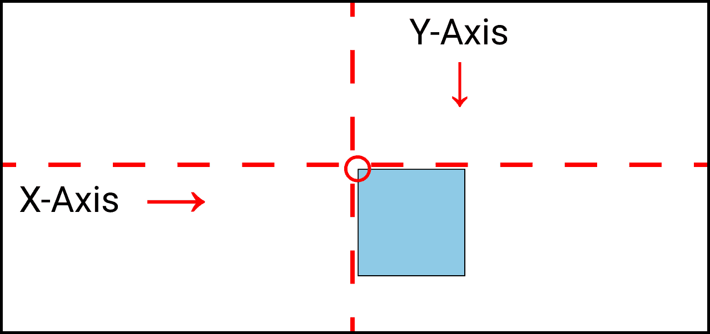

**Box is not at exact center **

请注意，盒子并不在上图中的**中心**处。👆

通过写这一行👇

```
transform: translate(-50%,-50%); 
```

我们解决问题👇

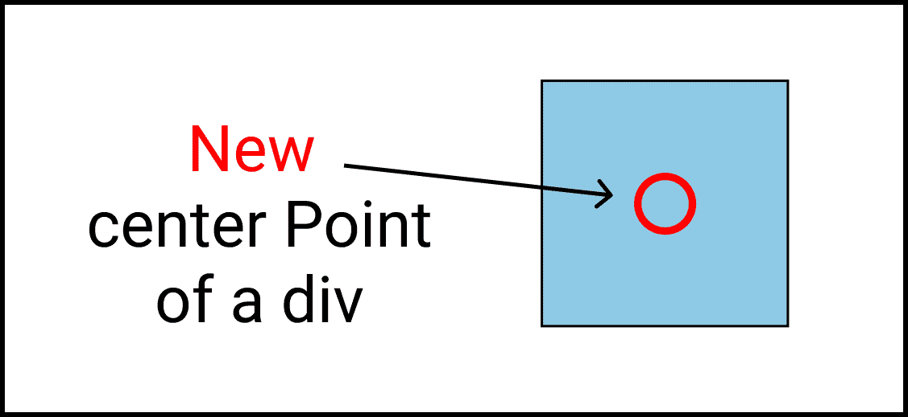

**New Center point of our div**

我们得到了这个结果👇

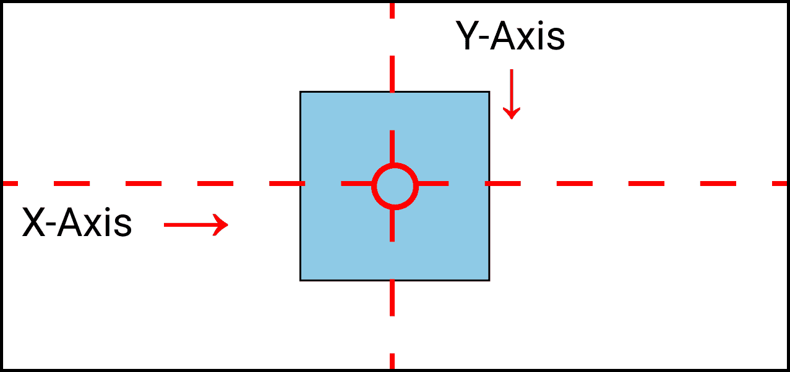

**Box is at exact center point**

## CSS 中的 Translate 属性是什么？

Translate 是 3 个属性的简写->

*   `translateX`
*   `translateY`
*   `translateZ`

## 如何使用 CSS Position 属性将 div 水平居中

我们将在``.box-`类中使用`left`属性。跟着走👇

```
.box-1{
/* other codes are here*/	

   left: 50%;
   transform: translate(-50%);
}
```

我们得到了这个结果👇


**result of left & transform property**

## 如何使用 CSS Position 属性将一个 div 垂直居中

我们将在``box-`类中使用`top`属性。跟着走👇

```
.box-1{
/* Other codes are here*/	

   top: 50%;
   transform: translate(0,-50%);
}
```

我们得到了这个结果👇


**result of top & transform property**

## 如何使用 CSS position 属性使一个 div 水平和垂直居中

为了达到这个结果，我们要将这些属性结合在一起->

*   `top, left`
*   `transform, translate`

跟着走👇

```
.box-1{
/*Other codes are here */	

   top: 50%;
   left: 50%;
   transform: translate(-50%,-50%);
}
```

我们得到了这个结果👇


result of position & transform property

## 如何使用 margin 属性将任何内容居中


margin 属性是 4 个属性的简写

*   `margin-**top**`，`margin-**bottom**`
*   `margin-**left**`，`margin-**right**`

编写以下代码来设置它👇

```
.container{
   height: 100vh;

   display: flex;
}

.box-1{
   width: 120px;
   height: 120px;
   background-color: skyblue;
   border: 2px solid black;
}
```

## 如何使用 CSS margin 属性将一个 div 水平居中

我们将在`.box-1`类中使用`margin`属性。编写以下代码👇

```
.box-1{
 //Other codes are here 

  margin: 0px auto;	
}
```

结果看起来像这样👇


****result of** CSS margin Property**

## 如何使用 CSS margin 属性将 div 垂直居中

我们将在`.box-1`类中使用`margin`属性。编写以下代码👇

```
.box-1{
 //Other codes are here 

  margin: auto 0px;	
}
```

结果看起来像这样👇


****result of** CSS margin property**

## 如何使用 CSS margin 属性使一个 div 水平和垂直居中

我们将在``.box-`类中使用`margin`属性。编写以下代码👇

```
.box-1{
 //Other codes are here 

  margin: auto auto;	
}
```

结果看起来像这样👇


**Result of CSS margin property**

## 额外资源

*   [使用备忘单完成 Flexbox 教程](https://www.freecodecamp.org/news/css-flexbox-tutorial-with-cheatsheet/)
*   [使用备忘单完成 CSS 网格教程](https://www.freecodecamp.org/news/css-grid-tutorial-with-cheatsheet/)

# 信用

*   [拔毛](https://www.flaticon.com/packs/unicorn-4)，[小猫](https://www.flaticon.com/packs/kitty-avatars-3)
*   [艺人](https://www.freepik.com/free-vector/collection-people-enjoying-their-free-time_4931926.htm#position=7)，[吉](https://www.freepik.com/free-vector/cute-cat-unicorn-play-box-cartoon-icon-illustration_12567355.htm#position=0)

# 结论

现在，你可以自信地使用 CSS 中这四种方法中的任何一种来对齐或居中你的内容。

这是你的**奖章**，奖励你一直读到最后，❤️

## 建议和批评是高度赞赏❤️


**YouTube**

**LinkedIn[/Joy Shaheb](https://www.linkedin.com/in/joyshaheb/)**

**推特[/JoyShaheb](https://twitter.com/JoyShaheb)**

**insta gram[/JoyShaheb](https://www.instagram.com/joyshaheb/)**