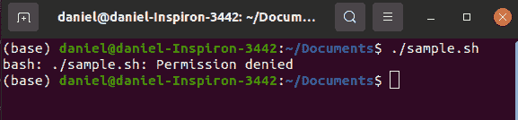
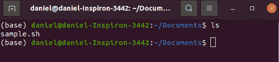
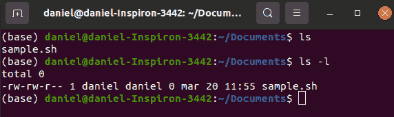
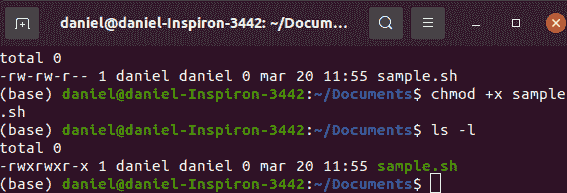
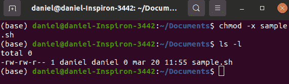
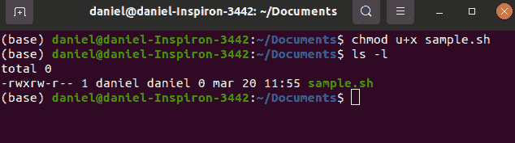
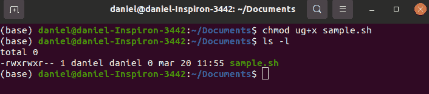

# Chmod 命令–如何在 Linux 中更改文件权限

> 原文：<https://www.freecodecamp.org/news/how-to-change-file-permissions-with-the-chmod-command-on-linux/>

我在 Linux 上学会的第一个命令是使用命令行创建文件的`touch`命令。

例如，如果你试图创建一个文本文件，你所要做的就是键入`touch filename.txt`，按回车键，这个文件就会在你所在的目录中被创建出来。然后，您可以使用自己选择的文件编辑器在其中编写任何内容。

然而，当涉及到创建脚本时，事情会变得稍微复杂一些。这是为什么呢？

让我用另一个例子来说明这一点。假设您想使用 touch 创建一个脚本。键入`touch example.sh`，按回车键，就可以了。同样，您可以使用文件编辑器在其中进行编写。

万事俱备，剩下的就是测试了。您键入`./sample.sh`并按 Enter 键来查看您的脚本的运行情况……但是这条消息告诉我什么呢？

## 为什么我们需要权限？

我是管理员！为什么我没有权限运行几秒钟前自己写的脚本？

这实际上是有原因的——老实说，大多数用户应该为此感到庆幸，因为在不知道自己在做什么的情况下无法执行脚本通常会阻止您将系统置于危险之中。

我们先简单聊一下权限。然后我们将继续探索如何改变它们。

为了获得关于您的文件的更多信息，我们将使用命令列出目录中的文件:`ls`。

在键入`ls`并按下 Enter 键后，我们在命令行中得到以下内容:

它的作用是列出你当前所在目录中所有可见的文件。通过添加标志`-l`,它为您提供了目录中文件的更多信息。这是我们键入`ls -l`并按回车键时的结果:

我们看到相同的文件，但是在它/它们前面有大量的信息。首先，我们有一个由十个破折号和字母组成的序列，乍一看可能毫无意义。这实际上是您的文件拥有的权限的映射。

第一个字符可以是破折号(`-`，对于一个公共文件)、一个`d`(对于一个目录)、或者一个`l`(对于一个软链接)。为了简单起见，我将把重点放在简单的文件上，尽管权限对所有这些类型的文件/文件夹都有效。

在第一个字符之后，其他 9 个字符可以分成三组。前三个显示了当前用户的权限。接下来显示了该组的权限。最后三个是不属于这个类别的所有用户的权限。

对于我们的解释，让我们专注于前三个权限，因为我们不打算更改组或任何类似的东西。

第一个三重奏说`rw-`。

是时候了解这些是什么了。通常对文件可以做三件事:读取、写入和执行。基本上，这就是那些字母的意思。

第一个`r`代表读取权限。然后我们有`w`用于写许可。最后，一个破折号，意思是应该有的没有。应该有一个`x`，代表可执行。

所以，谈到当前用户(我)，我对这个文件的权限是读和写权限。然而，我不能执行`sample.sh`文件。这就是为什么，当我试图执行文件时，我得到了“权限被拒绝”的消息。

那么，我该如何执行这个文件呢？这就是`chmod`命令发挥作用的地方。

## chmod 是做什么的？

嗯，从文章开始我就一直在提‘权限’。让我们稍微扩展一下这个解释，它们是“以某种*模式*访问文件的权限”。这意味着`r`表示以读模式访问文件的许可，`w`表示以写模式访问文件的许可，`x`表示以可执行模式访问文件的许可。

我为什么要告诉你这些？因为这篇文章是关于命令的。`chmod`代表“改变模式”。换句话说，当您使用此命令时，您正在将文件的模式更改为您想要使用的任何模式。

## 如何将运算符与`cmod`一起使用

有必要在 chmod 命令中使用一个*操作符*。它用于指定您想要对权限进行的更改种类。

例如，`+`是用来给文件已经拥有的权限添加权限的操作符。`-`从列表中删除权限。还有一个`=`操作符，它重置权限，以便您可以再次定义它们。

在我们的例子中，通过键入`chmod -w sample.sh`，我要求命令做的是删除写权限。因此，我必须添加可执行权限的方法是键入`chmod +x sample.sh`。

如果我现在尝试执行该文件，那么我在脚本中输入的任何内容都将被执行。

使用`ls -l`，这就是我现在拥有的。

## 谁得到许可？

另一个值得指出的是谁获得了这个许可。您将看到,“x”被分配给所有用户、文件所有者、组和其他人。如果这不是你想要的，也许用`chmod -x sample.sh`再次删除可执行权限是一件好事。

为了只为文件的所有者(本例中是我)启用权限，我们应该在“+x”前添加一个“u”，如下所示:

`chmod u+x sample.sh`

输入`ls -l`，这就是你所拥有的:

如果您想为所有者及其组授予权限，那么命令应该是`chmod ug+x sample.sh`。

太好了！我想这包括了我想给你看的东西。您可能对其他事情感兴趣，比如如何使用 chmod 和八进制或二进制值来表示权限。但是这些是我们用来获得相同结果的模式，我相信字母是获得这些结果的更容易的方法。

如果您想了解关于该命令的更多信息，您可以做的一件事是键入`chmod --help`，这将向您简要介绍该命令可以做什么。输入`man chmod`可以获得更详细的描述。

我希望这篇文章对你有帮助。更多关于 Linux 命令的文章，请查看[freecodecamp.org/news](https://www.freecodecamp.org/news)。

编码快乐！😃