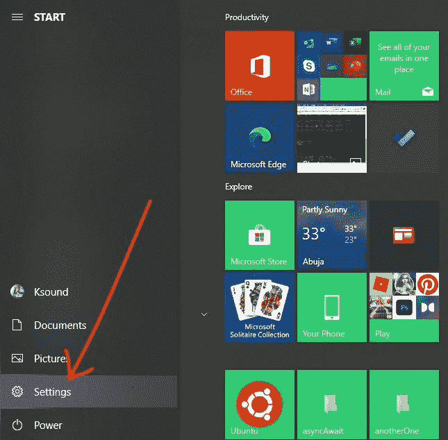
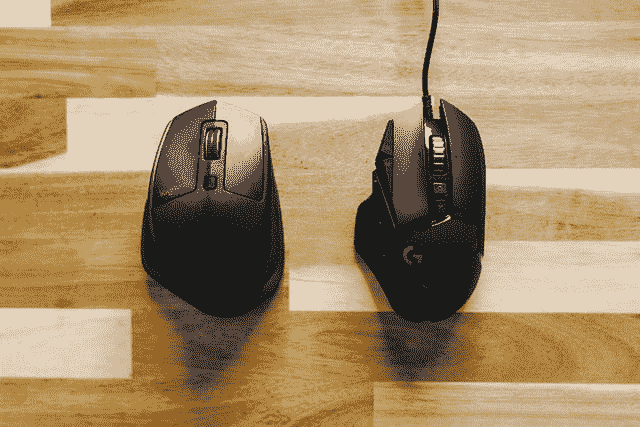

# 如何在 Windows 10 中更改鼠标 DPI 设置

> 原文：<https://www.freecodecamp.org/news/how-to-change-mouse-dpi-settings-in-windows-10/>

如果您的工作需要很高的精确度，如图形设计和游戏，那么您可能需要调整外部鼠标或键盘的速度。

在本指南中，我将向您展示如何通过改变鼠标的 DPI 来提高或降低鼠标的灵敏度。

## 什么是 DPI？

DPI 代表每英寸点数。它是衡量鼠标灵敏度和光标速度的指标。

鼠标 DPI 越高，鼠标对每英寸移动的响应速度越快，移动的距离越远。DPI 越低，鼠标对移动的反应就越慢。

## 如何在 Windows 10 上更改鼠标 DPI

您可以通过设置应用程序更改鼠标 DPI。

**第一步**:点击开始或者按键盘上的`WIN` (Windows)键，选择设置。

**第二步**:在你看到的菜单项中，选择“设备”。

**第三步**:点击设备页面上的鼠标选项卡，然后选择“相关设置”下的“其他鼠标选项”。

**第四步**:会出现一个弹出窗口。单击“指针选项”选项卡。

**步骤 5** :你会在“选择指针速度”下看到一个滑块，你可以用它来调整你的鼠标 DPI。向左移动滑块可降低 DPI，向右移动可提高 DPI。

**第六步**:点击“应用”按钮保存更改，点击“确定”关闭弹出窗口。

用于游戏的高级鼠标通常有按钮或滑块来调整它们的 DPI，因此您可以在不打开设置应用程序的情况下更改这些鼠标的 DPI。

## 最后的话

在本指南中，您学习了什么是 DPI 以及如何在 Windows 10 电脑上更改 DPI。

如果您的工作需要很高的精确度，更改 DPI 会很有用。

如果你在电脑上玩游戏，你可能需要更快的 DPI 来打破间歇。如果你是一名设计师，为了精确起见，你可能需要较慢的 DPI。

希望这篇文章对你改变鼠标 DPI 有所帮助。如果你觉得有用，请分享给你的朋友和家人。

感谢您的阅读。