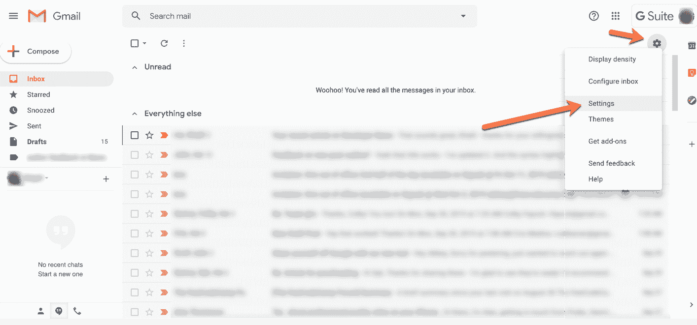
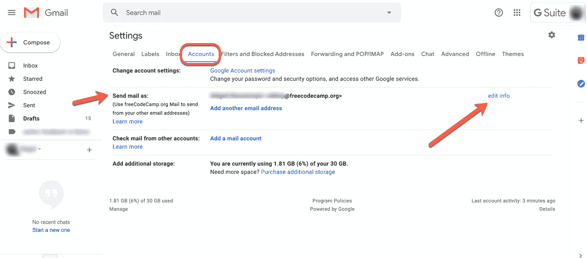
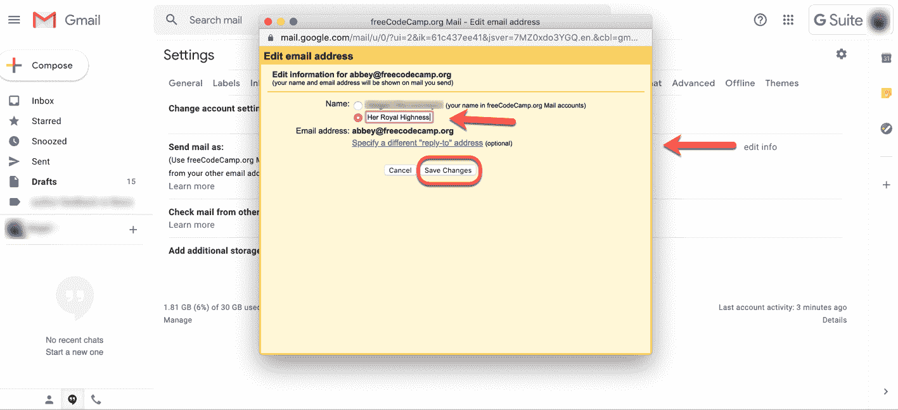

# 如何在不创建新电子邮件地址的情况下更改您的 Gmail 名称

> 原文：<https://www.freecodecamp.org/news/how-to-change-your-gmail-name-without-creating-a-new-email-address/>

你的电子邮件地址可能已经存在很多年了，所以每个人都知道。但是，假设您想要更改与该地址相关联的名称。也许你要结婚了。或者想为你的好莱坞处女作创造一个神话般的艺名。

不管是什么原因，不要担心——你可以通过几个简单的步骤做到。请记住:

*   您不能更改您的用户名或实际的电子邮件地址。您只能更改与帐户关联的名称。
*   如果人们将您保存为联系人中的其他名称，他们将会看到这个名称。你的“新名字”只会出现在你发给他们的电子邮件中。

## 第一步:打开 Gmail，进入设置

打开 Gmail，点击右上角的齿轮:

从下拉菜单中选择“设置”。

## 第 2 步:转到“帐户”选项卡

然后，在“设置”中，从顶部的菜单中选择“帐户信息”选项卡:

寻找“发送邮件为:”选项，并选择“编辑信息”选项。

## 第三步:编辑你的信息

当你点击“编辑信息”按钮时，会弹出一个黄色框。您将看到当前显示的您的姓名，在姓名下方有一个空白处，您可以在此处键入您的首选姓名。

输入你的新名字并选择选项。然后保存更改。

哒哒！当您发送电子邮件时，将显示您的新姓名。

### 注意事项

如果您无法在 Gmail 中更改姓名，可能是因为

*   您的公司已经禁用了该功能(他们可能不希望您将姓名改为，例如，殿下)，或者
*   你最近改名字改太多次了。放松点。