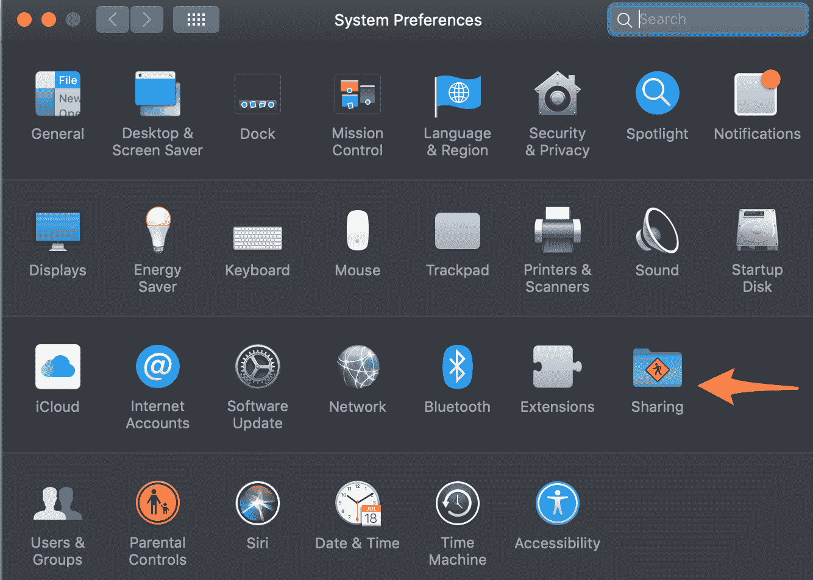

# 如何更改您的 Airdrop 名称-在 30 秒内重命名您的 Mac

> 原文：<https://www.freecodecamp.org/news/how-to-change-your-system/>

MacOS 使得在 Airdrop 中更改 Mac 的名称变得很容易。

只要遵循以下 4 个步骤，你就会成为金牌选手。

## 步骤 1:打开您的系统偏好设置

打开设置的最快方法是输入⌘ + space，然后输入“pref ”,从下拉菜单中选择“系统首选项”。

## 第二步:点击共享图标

是那个上面有黄色钻石的文件夹。为了方便你，我在下面指了一下。

## 步骤 3:编辑计算机名

您将在顶部看到您的计算机名称，并且可以单击文本字段来更新它。

一旦你把它改成你想要的名字，你只需要点击编辑。

## 步骤 4:确认您的新计算机名

现在你只需点击“确定按钮”您的设置将被保存。

## 您的隔空投送姓名现已更新。

您可以关闭系统偏好设置。

现在，当人们在隔空投送看到你时，他们会看到你的新隔空投送名字。