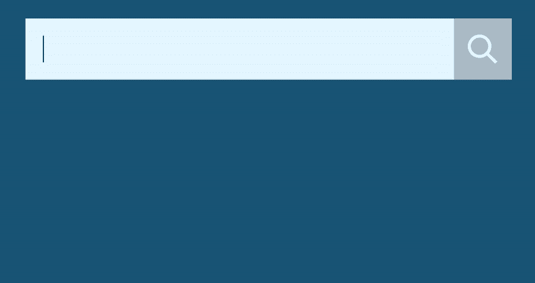
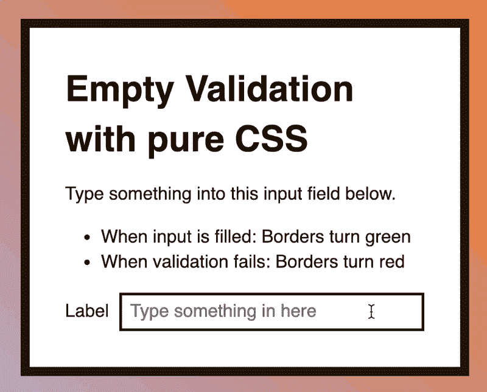
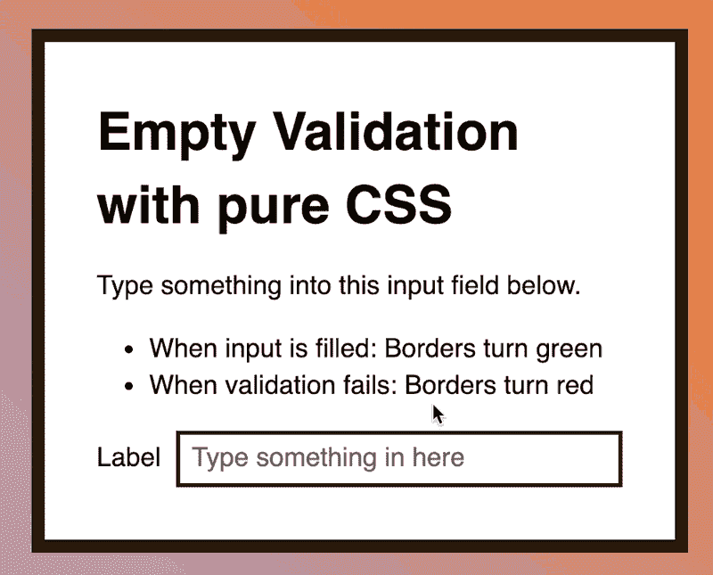
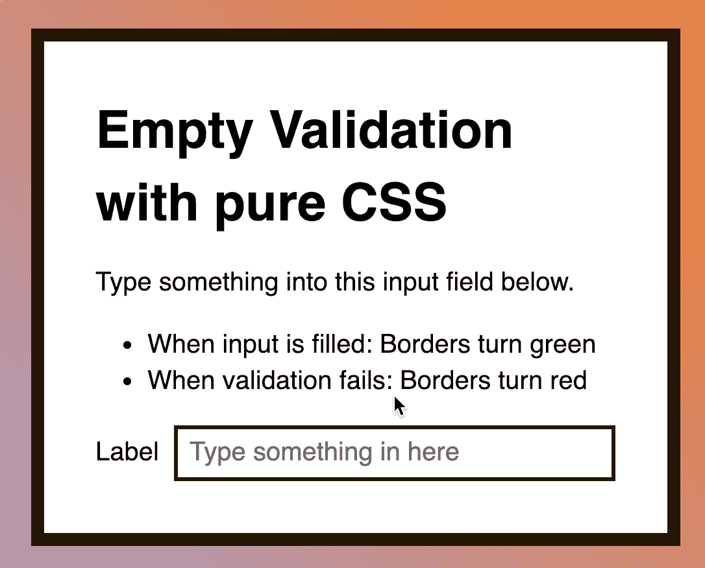
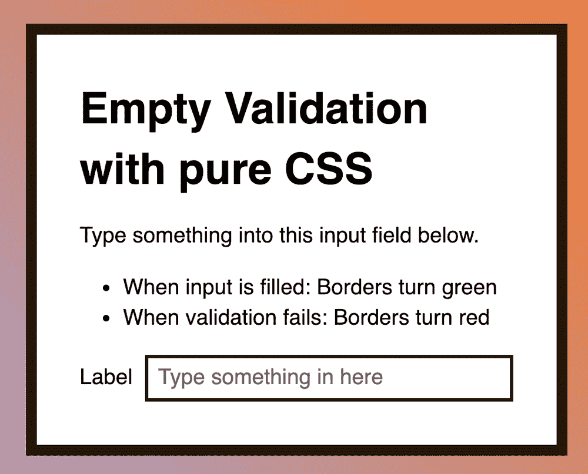

# 如何用 CSS 检查输入是否为空

> 原文：<https://www.freecodecamp.org/news/how-to-check-if-an-input-is-empty-with-css-1a83715f9f3e/>

作者 Zell Liew

# 如何用 CSS 检查输入是否为空

只有 CSS 有可能知道一个输入是否为空吗？

当我试图为学习 JavaScript 创建一个自动完成组件时，我就有这个问题。基本上，我想:

1.  如果输入为空，隐藏下拉列表
2.  如果输入已填充，则显示下拉框



我找到了做这件事的方法。它并不完美。这里面有一些细微的差别，但是我想和你分享一下。

### 表单

首先，让我们构建一个表单，这样我们就在同一页上了。我们将使用一个只有一个输入的简单表单。

```
<form>  <label for="input"> Input </label>  <input type="text" id="input" /></form>
```

当输入被填充时，我们想把它的`border-color`改成绿色。这是我们正在创造的一个例子:



### 检查输入是否为空

我依靠 HTML 表单验证来检查输入是否为空。这意味着我需要一个`required`属性。

```
<form>  <label> Input </label>  <input type="text" name="input" id="input" required /></form>
```

在这一点上，当输入被填充时，它工作得很好。边框变成了绿色。


但是有一个问题:如果用户在字段中输入空白，边框也会变成绿色。



从技术上讲，这是正确的。输入被填充，因为用户在其中输入了一些内容。

但是我不想让空白触发一个空白的下拉菜单(对于自动完成组件)。

这还不够。我需要更严格的检查。

### 进一步检查

HTML 让您能够使用带有`pattern`属性的正则表达式来验证输入。我决定测试一下。

因为我不想让空白被识别，所以我从`\S+`模式开始。这种模式意味着:一个或多个不是空格的字符。

```
<form>  <label> Input </label>  <input type="text" name="input" id="input" required pattern="\S+"/></form>
```

果然有效。如果用户在字段中输入空格，输入不会得到验证。


但是当在输入中(任何地方)输入空格时，输入就会失效。


不幸的是，这种模式在我的用例中不起作用。

在学习 JavaScript 自动完成组件时，我教学生如何完成国家列表。一些国家的名字有空格…


我必须在组合中包含空白。

我能想到的下一个最佳选择是`\S+.*`。这意味着一个或多个非空白字符，后跟零个或多个(任意)字符。

```
<form>  <label> Input </label>  <input type="text" name="input" id="input" required pattern="\S+.*"/></form>
```

这成功了！我现在可以在组合中输入空格了！



但是还有一个问题…如果你以空格开始，输入不会被验证…



这就是我无法解决的问题。稍后将详细介绍。

在撰写本文时，我遇到了另一个有趣的问题:当输入填充不正确时，是否有可能设计无效状态的样式？

### 使输入无效

我们不想使用`:invalid`,因为我们会用一个无效的状态启动输入。(当输入为空时，它已经无效)。

这就是 Chris Coyier 用“[HTML 和 CSS 中的表单验证 UX](https://css-tricks.com/form-validation-ux-html-css/)”来拯救我们的地方。

在文章中，Chris 谈到了一个`:placeholder-shown`伪类。它可用于检查是否显示了占位符。

这个想法是:

1.  您可以在输入中添加一个占位符
2.  如果输入是隐藏的，这意味着用户在字段中输入了一些内容
3.  继续验证(或无效)

下面是 CSS(简化版。完整版本请查看克里斯的文章。)

```
/* Show red borders when filled, but invalid */input:not(:placeholder-shown) {  border-color: hsl(0, 76%, 50%);}
```

因为我有验证和无效样式，所以我必须确保有效样式在无效样式之后。

```
/* Show red borders when filled, but invalid */input:not(:placeholder-shown) {  border-color: hsl(0, 76%, 50%);;}
```

```
/* Show green borders when valid */input:valid {  border-color: hsl(120, 76%, 50%);}
```

这里有一个演示供您使用:

见 [CodePen](https://codepen.io/) 上 Zell Liew ( [@zellwk](https://codepen.io/zellwk) )的笔[纯 CSS 空验证](https://codepen.io/zellwk/pen/dgEKxX/)。

注意:Edge 不支持`:placeholder-shown`，所以现在还不太可能用在生产中。没有好的方法来检测这个特性。

现在回到我无法解决的问题。

### 模式的问题

属性很棒，因为它允许您接受一个正则表达式。这个正则表达式允许您用您能想到的任何东西来验证输入。

但是… **正则表达式必须完全匹配文本**。如果文本没有完全匹配，输入就会失效。

这就产生了我上面提到的问题。(问题提醒:如果用户先输入空格，输入将无效)。

我找不到一个适用于我想到的所有用例的正则表达式。如果你想尝试创建一个我需要的正则表达式，我会非常乐意接受帮助！

以下是使用案例:

```
// Should not match''' ''  ''   '
```

```
// Should match'one-word''one-word '' one-word'' one-word ''one phrase with whitespace''one phrase with whitespace '' one phrase with whitespace'' one phrase with whitespace '
```

(话说回来，我可能想多了……？).

### 更新:问题解决！

许多读者非常慷慨地把他们的解决方案发邮件给我。我想感谢所有帮助过我的人。非常感谢！

我收到的最干净的解决方案是:[丹尼尔·奥康纳](https://www.nvinteractive.com/)。这意味着:

*   `.*`:任意字符
*   `\S`:跟随*一个*非空白字符
*   `.*`:后跟任意字符

我收到的其他正则表达式包括:

*   `.*\S+.*`由[马特·明克](https://twitter.com/matthewjmink)
*   `\s*\S.*`作者[赵松斌](https://github.com/pcr910303)
*   `^\s?(?=\S).`由[康斯坦丁](https://twitter.com/KonstantinRouda)进行前瞻

还有很多其他的！

这里有一个[代码笔](https://codepen.io/zellwk/pen/NeRaPw/)，上面有丹尼尔更新的解决方案。

### 包扎

是的，用纯 CSS 验证表单是可能的。当包含空白字符时，验证存在潜在的问题。

如果你不介意留白，那就完美了。体验这种模式的乐趣吧！(不好意思，没办法)。

感谢阅读。这篇文章对你有帮助吗？如果是的话，我希望你能考虑分享它。你可能会帮助其他人。非常感谢！

本文最初发布在 *[我的博客](https://zellwk.com/blog/check-empty-input-css)。*如果你想要更多的文章来帮助你成为更好的前端开发人员，请注册我的[时事通讯](https://zellwk.com/)。