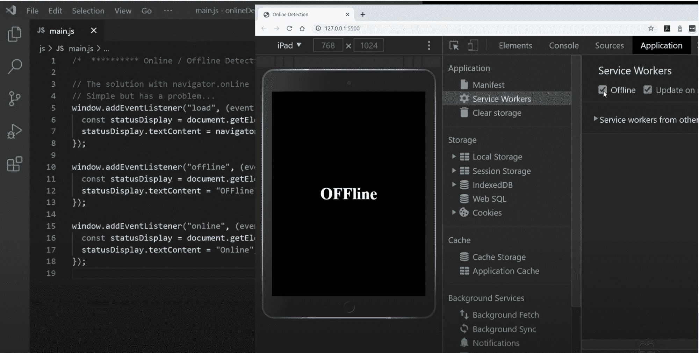
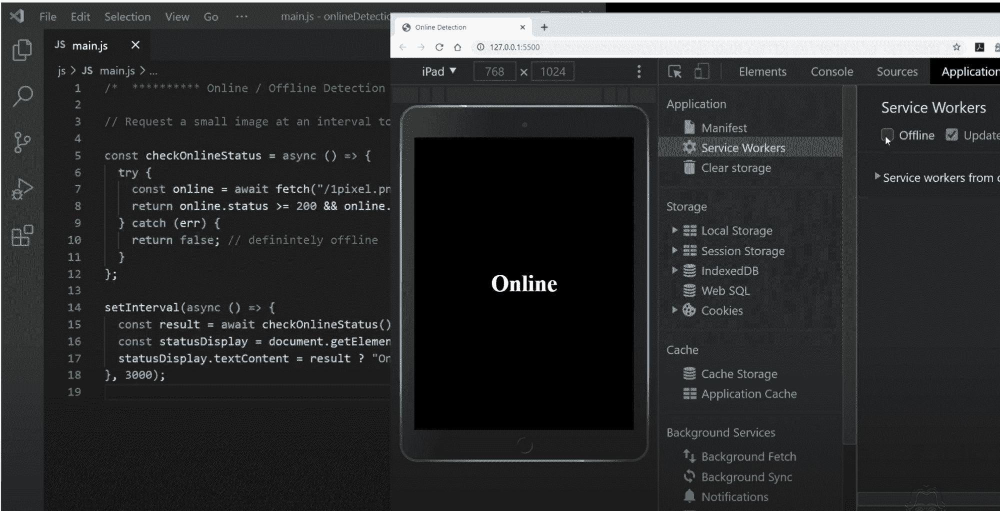

# 如何使用异步 JavaScript 检查互联网连接状态

> 原文：<https://www.freecodecamp.org/news/how-to-check-internet-connection-status-with-javascript/>

可以用 JavaScript 检查你的 app 是否联网吗？

在本文中，我将提供这个互联网连接检测问题的最新答案。(咻！快说五遍！)

该解决方案将使用 JavaScript 的 Fetch API 和带有 Async & Await 的异步代码。但是首先，让我们来看一个公认的解决方案，并讨论为什么它可能不是您的应用程序的最佳选择。

## navigator.onLine

导航器界面的 online 属性`navigator.onLine`经常用来检测浏览器的在线和离线状态。

结合在线和离线事件的监听器，它似乎为开发人员提供了一个易于实现的简单解决方案。

### 让我们看看如何实现 navigator.onLine

首先添加一个负载事件监听器。当 load 事件触发时，侦听器将检查导航器接口的 online 属性，然后显示 online 状态。

navigator 的 online 属性提供了一个布尔型(真或假)响应。为了完成侦听器的操作，我们将使用一个三元语句来设置状态显示值。

```
window.addEventListener("load", (event) => {
  const statusDisplay = document.getElementById("status");
  statusDisplay.textContent = navigator.onLine ? "Online" : "OFFline";
});
```

那么，为什么会有航海家这个词呢？这是对 90 年代网景导航浏览器的引用。

在 HTML 页面中居中放置一个 id 为“status”的 h1 元素。如果您将上面的 JavaScript 代码应用到您的页面，您应该看到它显示“在线”。

但这只在页面加载时更新 h1 元素。让我们添加离线和在线事件侦听器，以便在这些事件触发时更新状态显示。

```
window.addEventListener("offline", (event) => {
  const statusDisplay = document.getElementById("status");
  statusDisplay.textContent = "OFFline";
});

window.addEventListener("online", (event) => {
  const statusDisplay = document.getElementById("status");
  statusDisplay.textContent = "Online";
});
```

我们可以进入 Chrome Dev Tools 的 Application 选项卡，点击 ServiceWorker，将浏览器设置为好像离线一样进行响应。

勾选和取消勾选离线复选框几次。您应该看到状态显示对触发的脱机和联机事件立即做出响应。



Chrome Dev Tools > Application Tab > Service Workers > Offline Checkbox

## 让我们再深入一点

乍一看，以上似乎是一个相当简单的好解决方案。不幸的是，当我们更多地了解 navigator 的在线属性以及在线和离线事件时，我们发现了一个问题。

[在 CanIUse.com 搜索 navigator . online](https://caniuse.com/#search=navigator.onLine)显示了对该酒店提供的在线|离线状态的广泛支持。但是，查看支持表下方的注释，我们会发现

> “在线并不总是意味着连接到互联网。它也可以仅仅意味着连接到某个网络”。

嗯，这可有点麻烦了。

所以如果你真的想确定浏览器的在线状态，你应该开发额外的检查手段。

让我们也来看看 navigator.onLine 的 [MDN 文档参考。MDN web docs 备份 CanIUse.com 信息并添加附加注释。](https://developer.mozilla.org/en-US/docs/Web/API/NavigatorOnLine/onLine)

> 浏览器以不同的方式实现这个属性...你不能假设一个真值就一定意味着浏览器可以访问互联网。您可能会得到误报……”

这证实了我们对使用 navigator 的在线属性作为检测互联网连接的解决方案的担忧。这种解决方案可能会对我们的应用程序造成严重破坏，因为我们的应用程序需要知道外部数据源何时可用。

一个这样的例子是当我们试图确定一个渐进式网络应用程序是否在线。MDN 甚至建议，

> *...如果你真的想确定浏览器的在线状态，你应该开发额外的检查手段。”*

在网上快速搜索*“navigator online not work”*会发现各种论坛帖子，在这些帖子中，依赖这一特性的人遇到了问题。

## 那么解决办法是什么呢？

我们需要知道我们的应用程序何时真正连接到互联网，而不仅仅是路由器或本地网络。让我们回到 JavaScript 文件，重新开始。

其思想是发出一个请求，并在失败时用错误捕获优雅地处理它。如果请求成功，我们就在线，如果失败，我们就不在线。

我们将每隔一段时间请求一个小图像来确定在线状态。现代 JavaScript 提供了 Fetch API 和带有 Async & Await 的异步代码。我们将使用这些工具来实现我们的目标。

### checkOnlineStatus()

让我们首先创建一个名为 checkOnlineStatus 的异步箭头函数。该函数将像 navigator 的 online 属性一样返回 true 或 false。

在函数内部，我们将设置一个 try 块，在那里我们等待一个一像素图像的获取请求。确保您的服务人员没有缓存此图像。

200 到 299 之间的 HTTP 响应代码表示成功，我们将返回状态代码比较的结果。如果响应状态从 200 到 299，则为真，否则为假。

我们还必须提供一个 catch 块，在请求失败时捕获错误。如果发生这种情况，我们将在 catch 块中返回 false 来表示我们确实脱机了。

```
const checkOnlineStatus = async () => {
  try {
    const online = await fetch("/1pixel.png");
    return online.status >= 200 && online.status < 300; // either true or false
  } catch (err) {
    return false; // definitely offline
  }
};
```

接下来，我们将使用 setInterval 方法并传递给它一个匿名异步函数。异步函数将等待 checkOnlineStatus 函数的结果。然后，我们将使用一个三元语句来显示当前的在线状态。

为了测试这个例子，将间隔延迟设置为每 3 秒(3000 毫秒)。不过，这真的太频繁了。每 30 秒(30000 毫秒)检查一次，对于您的实际需求来说可能就足够了。

```
setInterval(async () => {
  const result = await checkOnlineStatus();
  const statusDisplay = document.getElementById("status");
  statusDisplay.textContent = result ? "Online" : "OFFline";
}, 3000); // probably too often, try 30000 for every 30 seconds
```

保存了新代码后，让我们重新访问 Chrome Dev Tools 中的 Application 选项卡来测试离线响应。



Chrome Dev Tools > Application Tab > Service Workers > Offline Checkbox

我差点忘了包含具有异步功能的加载事件监听器！只有当您的渐进式 Web 应用程序利用服务工作者来实现离线可用性时，负载事件检测才可能是重要的。否则，如果没有连接，您的网页或应用程序将无法加载。

下面是新的加载事件监听器:

```
window.addEventListener("load", async (event) => {
  const statusDisplay = document.getElementById("status");
  statusDisplay.textContent = (await checkOnlineStatus())
    ? "Online"
    : "OFFline";
});
```

## 最后的想法

上面的时间间隔代码有助于在您的应用程序中显示连接状态。也就是说，我不建议依赖在应用程序中发出关键数据请求前 20 或 30 秒检查的连接状态。

因此，您应该在请求之前直接调用 checkOnlineStatus 函数，并在请求数据之前评估响应。

```
const yourDataRequestFunction = async () => {
    const online = await checkOnlineStatus();
    if (online) {
    	// make data request
    }
}
```

## 结论

虽然 navigator.onLine 得到了广泛的支持，但在确定我们的应用程序是否真正连接到互联网时，它提供的结果并不可靠。利用 Fetch API 和异步 JavaScript，我们可以快速编写更可靠的解决方案。

这里有一个 GitHub 上的代码要点的链接，还有一个我整理的视频教程:

[https://www.youtube.com/embed/hIaGzJ3txqM?feature=oembed](https://www.youtube.com/embed/hIaGzJ3txqM?feature=oembed)