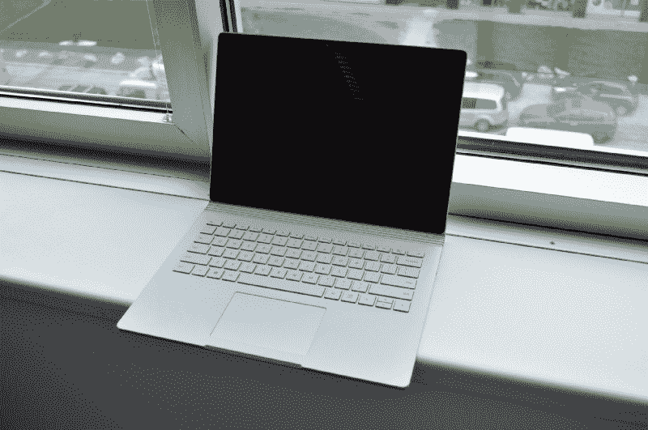
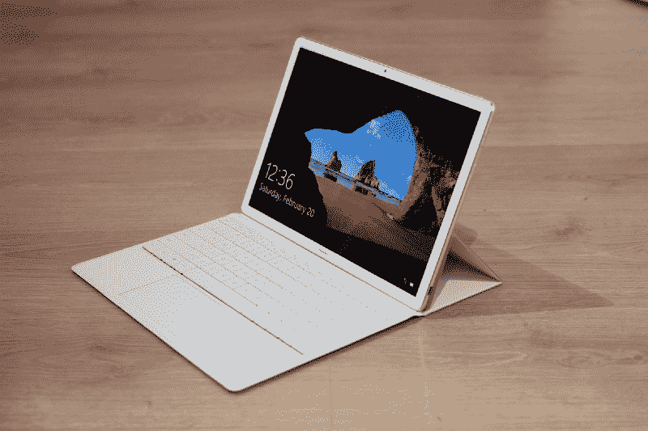

# 如何选择笔记本电脑进行编程

> 原文：<https://www.freecodecamp.org/news/how-to-choose-a-laptop-for-programming-a9e36f8b4cfe/>

作者 Ayo Isaiah

# 如何选择合适的笔记本电脑进行编程

选择合适的笔记本电脑进行编程可能是一个艰难的过程。

在研究各种选项时很容易感到困惑。市面上有许多不同的笔记本电脑型号，每种型号都有不同的优缺点。

你可以在大多数笔记本电脑上写代码。然而，如果您使用适合您执行的任务类型的机器，您的生产率将会提高。

有不同类型的开发，每个专门化都需要不同的工具。因此，购买开发机器没有一种通用的方法。

我在这篇文章中做了以下假设:

*   你是一名网络开发人员
*   您的笔记本电脑是您的主要开发机器

以下是购买下一台笔记本电脑前的一些考虑事项。

### 流动性

笔记本电脑有各种形状和大小。你需要弄清楚你希望你的笔记本电脑有多便携。

如果你不需要经常携带笔记本电脑，你可以考虑 15 英寸的笔记本电脑。这些通常会有更好的规格和更多的屏幕空间用于多任务处理。

如果您在不同的地方工作或经常出差，13 或 14 英寸的笔记本电脑可能最适合您。它们更轻，电池寿命更长。

除非你买的是 2 合 1 笔记本电脑，否则触摸屏提供的好处不足以抵消额外的成本。我建议你避开触摸屏。

### 显示

笔记本电脑的屏幕是它最重要的功能之一，尤其是对程序员来说。开发应用程序需要长时间盯着屏幕。你需要密切注意细节。

大多数经济型笔记本电脑都配有 1366 x 768 的显示屏，我认为这是最普通的。显示器没有足够的屏幕空间进行多任务处理。此外，文本不够清晰，无法让你有舒适的阅读体验。

4k 显示器对于笔记本电脑来说是多余的，尤其是当你考虑到额外的成本和你将遇到的电池消耗时。

无论你做什么，不要买低于全高清 1920 x 1080 (1080p)显示屏的笔记本电脑。如果你必须额外支付一点才能得到 1080 便士，那就这么做吧。

还要确保显示器有良好的视角；你的笔记本电脑屏幕不应该兼作镜子！

### 处理能力(CPU)

你的笔记本电脑的 CPU 对性能有很大的影响，所以你不能在这一点上吝啬。有许多不同类型的处理器，具有不同的规格。请务必考虑这些规格。其中最重要的是高速缓存大小、内核数量、频率和散热设计功率。

一般来说，一个 3GHz 或更高频率的英特尔酷睿 i5 或 i7 处理器对大多数人来说应该足够了。

### 内存(RAM)

我不认为在内存小于 4GB 的笔记本电脑上可以进行任何严肃的编程。我的最小内存建议是 8GB。随着喜欢消耗大量内存的电子应用程序的出现，即使这样也变得不够用了。如果你有多余的现金，投资 16GB 的内存。

### 存储类型和容量

获得 SSD(固态硬盘)应该是你的首要任务。与标准硬盘相比，这将显著提高性能。有了固态硬盘，每项操作都会快很多:包括启动操作系统、编译代码、启动应用程序和加载项目。

256GB 的固态硬盘应该是基准。钱多的话，512GB 或者 1TB 的 SSD 更好。如果成本是一个因素，请选择较小的 SSD，其中您的操作系统将与您的应用程序和经常访问的文档(如项目文件)共存。音乐或视频等其他内容可以存储在更大的外置硬盘中。

### 键盘

你不能在笔记本电脑的键盘质量上妥协，因为你会用它来敲一整天的代码。我倾向于选择键盘布局更紧凑的笔记本电脑。

最重要的是在购买之前彻底试用笔记本电脑的键盘。确保钥匙舒适且容易拿到，旅途愉快。如果您打算经常在弱光条件下工作，背光键盘非常有用。

### 果汁

如果你大部分时间都在电源插座附近，那么好的电池续航时间对你来说可能并不那么重要。尽管如此，拍摄至少 6 小时的电池寿命。

不要依赖制造商声明的预期电池寿命。从可靠的网站上阅读第三方评估，看看真正的用户在论坛和评论中对该产品的看法。

### 操作系统

你对操作系统的选择将在很大程度上决定买哪台笔记本电脑。Windows 用户有很多选择，但如果你更喜欢 macOS，你只能选择 Macbook 中的一款。

Linux 可以在大多数硬件上运行，但是最好购买有官方 Linux 支持的笔记本电脑。一些供应商，如戴尔和 [System 76](https://system76.com/) ，提供预装 Linux 的顶级机器。你可能想先看看这些。

否则，做你的研究，以确保你打算购买的笔记本电脑能很好地与你喜欢的 Linux 发行版兼容。

### 专用显卡还是集成显卡？

专用(也称为独立)显卡对于编码来说并不重要。使用集成显卡可以省钱。将您节省的资金投资于固态硬盘或更好的处理器，这将使资金更有价值。

我很想知道你认为对开发机器来说最重要的因素是什么，以及它如何影响你的日常工作。

如果你喜欢这篇文章，请与你的开发者朋友分享，并点击下面的绿色“❤”心，这样其他人也可以找到它。感谢阅读

