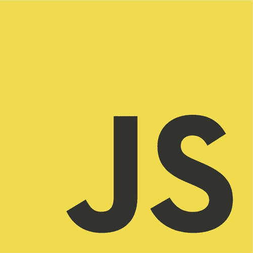
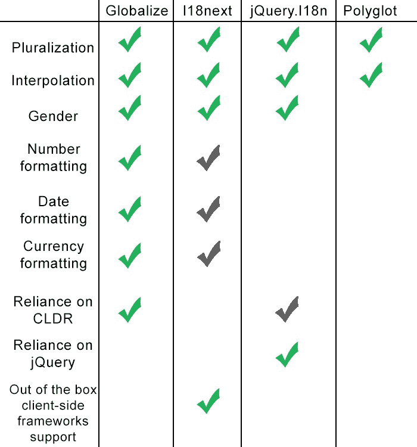

# 如何选择翻译 JavaScript 应用程序的库

> 原文：<https://www.freecodecamp.org/news/how-to-choose-a-library-for-translating-your-javascript-apps-10f68de6a1d1/>

安娜斯塔西娅

# 如何选择翻译 JavaScript 应用程序的库



在前面的文章中，我们已经看到了如何在后端执行本地化。具体来说，我们已经讨论了 [Rails](https://blog.lokalise.co/rails-i18n/) 和 [Phoenix](https://blog.lokalise.co/localization-of-phoenix-applications/) 框架。然而，今天我们将讨论用于翻译 JavaScript 应用程序的库，并简要地看一下它们的实际应用。

似乎有相当多的可用解决方案，所以你可能会问:“我应该使用哪一个？”。最显而易见(或许也是最明智)的答案是:“这要看情况”。理想情况下，您应该检查每个库，然后决定您更喜欢哪一个。

因此，在本文中，我将向您大致介绍以下解决方案:

*   全球化
*   i18 下一步
*   jQuery(即时查询)。I18n
*   Polyglot.js

请注意，我们将讨论普通 JS 应用程序的本地化，而不是一些特定的客户端框架。此外，我们不会深入研究每个库，因为文章会变得非常非常长。我只对每个工具做一个简单的介绍。然后我们将试着比较它们，得出一些一般性的结论。

我们可以开始了吗？

### 全球化

[Globalize](https://github.com/globalizejs/globalize) 是一个复杂的翻译和本地化 JS 库，最初由 jQuery 团队推出。这个库利用了 [Unicode 公共语言环境数据库](http://cldr.unicode.org/) (CLDR)，并且有很多特性，包括:

*   消息格式
*   日期/时间解析和处理相对时间的能力
*   多元化支持
*   数字解析和货币格式
*   能够使用单位(天、分钟、秒、英里/小时等)

Globalize 在 browser 和 NodeJS 中工作一致，有一个模块化的代码，并允许需要尽可能少的模块。虽然依赖于 CLDR 数据，但它并不直接托管或硬编码它。开发人员可以选择加载哪些数据。这也意味着您可以自己更新 CLDR 数据，而不必等待 Globalize 的新版本发布。你可以在这里读到更多关于 Globalize 的特性。

现在让我们看看这个库的运行情况。有一个[入门指南](https://github.com/globalizejs/globalize#getting-started)解释了如何使用包管理器在你的机器上安装所有需要的模块。然而，我们将选择一种更复杂的方式来手动加载所有内容。

#### 获取 CLDR 数据

CLDR 真的很大，所以没有理由下载它所有的内容。幸运的是，Globalize documentation [总结了在使用特定模块时必须加载的内容](https://github.com/globalizejs/globalize#2-cldr-content)。此外，还有一个[在线工具](https://johnnyreilly.github.io/globalize-so-what-cha-want/#/?currency=true&date=true&message=true&number=true&plural=true&relativeTime=true&unit=true)，你只需选择将要使用的模块，然后查看你需要加载哪些 JSON 文件。在本演示中，我将只使用“核心”、“消息”和“复数”模块，因此，我们需要以下文件:

要了解更多关于 CLDR 的组织结构，请参考这份文件。起初看起来可能很复杂，但实际上，事情很简单:您只需挑选所需的文件，下载它们并在您的项目中使用。

我已经把上面提到的文件放到了我项目的`cldr/supplemental`文件夹中，但是你当然可以用不同的方式组织它们。

下一个问题是:我们实际上如何加载这些数据？嗯，[有两种选择](https://github.com/globalizejs/globalize/blob/master/doc/cldr.md#how-do-i-load-cldr-data-into-globalize):将其嵌入到`Globalize.load`函数中，或者使用[异步`$.get()`方法](https://api.jquery.com/jQuery.get/)。第二个选项更健壮，所以让我们用以下内容创建一个新的 JS 文件:

```
// i18n.js $.when( $.get("cldr/supplemental/likelySubtags.json"), $.get("cldr/supplemental/ordinals.json"), $.get("cldr/supplemental/plurals.json"), ).then(function() { // Normalize $.get results, we only need the JSON, not the request statuses. return [].slice.apply(arguments, [0]).map(function(result) { return result[0]; }); }).then(Globalize.load).then(function() { // your Globalize code here });
```

在本例中，我们正在加载 JSON 数据，并将其提供给 Globalize。我们使用的是承诺，所以定制代码应该放在第二个`then`中，一旦成功加载，就会立即执行。不使用 jQuery 也可以随意重构这段代码。

#### 加载其他文件

加载 CLDR JSON 文件后，您需要一组其他脚本:

*   jQuery(顺便说一下，Globalize 本身并不是基于 jQuery 的)
*   [CLDR JS](https://github.com/rxaviers/cldrjs)
*   全球化 JS 核心模块
*   您希望在应用中使用的任何其他模块

jQuery 和 Cldr.js 是外部依赖项，你可以从 CDN 加载它们(例如，从[cdnjs.com](https://cdnjs.com/))。

然后从发布部分下载 Globalize。打开`dist`文件夹。选择您需要的所有文件，并将它们放在`globalize`目录下。

之后，按照正确的顺序加载所有脚本:

```
<!-- index.html --> <!DOCTYPE html> <html> <head> <meta charset="utf-8"> </head> <body> <script src="https://cdnjs.cloudflare.com/ajax/libs/jquery/3.3.1/jquery.min.js"></script> <script src="https://cdnjs.cloudflare.com/ajax/libs/cldrjs/0.5.1/cldr.min.js"></script> <script src="https://cdnjs.cloudflare.com/ajax/libs/cldrjs/0.5.1/cldr/event.min.js"></script> <script src="https://cdnjs.cloudflare.com/ajax/libs/cldrjs/0.5.1/cldr/supplemental.min.js"></script> <script src="globalize/globalize.js"></script> <script src="globalize/plural.js"></script> <script src="globalize/message.js"></script> <script src="i18n.js"></script> </body> </html>
```

总而言之，就是这样。现在，您可以参考 Globalize docs 的 [API 部分](https://github.com/globalizejs/globalize#api)，看看您可以利用哪些功能。

#### 使用它

您可以借助`[loadMessages](https://github.com/globalizejs/globalize/blob/master/doc/api/message/load-messages.md)` [功能](https://github.com/globalizejs/globalize/blob/master/doc/api/message/load-messages.md)提供翻译信息:

```
$.when( // ... }).then(Globalize.load).then(function() { Globalize.loadMessages({ "en": { 'welcome': 'Welcome, {name}!' } }); });
```

然后用所需的语言环境实例化 Globalize，并执行实际的翻译:

```
// loadMessages... var globalize = new Globalize("en"); console.log(globalize.messageFormatter('welcome')({name: 'Username'}));
```

`[messageFormatter](https://github.com/globalizejs/globalize/blob/master/doc/api/message/message-formatter.md)`返回格式化的翻译。从这个例子可以看出，它支持插值，但还有更多。想引入多元化？简单！

添加新消息:

```
Globalize.loadMessages({ "en": { 'welcome': 'Welcome, {name}!', 'messages': [ "You have {count, plural,", " one {one message}", " other {{count} messages}", "}" ] } });
```

注意，消息可能跨越多行，但是在这种情况下，它应该被定义为一个数组。这里我们使用了复数，并提供了两种形式:单数和复数。`count`是插值。

现在显示这条消息:

```
taskFormatter = globalize.messageFormatter("messages"); console.log(taskFormatter({ count: 10 }));
```

您可以用几乎相同的方式利用其他模块。

总之，Globalize 是一个强大的解决方案，有很好的文档和支持。它可能需要一些时间来设置，但使用它是方便和直观的。

### i18 下一步

I18next 是一个 JavaScript 本地化框架，提供了翻译应用程序的所有必要工具。它有许多不同的功能，包括:

*   [支持前端框架](https://www.i18next.com/overview/supported-frameworks)包括 React、Angular、Vue 等
*   支持各种格式(包括稍后将讨论的多语言)
*   消息格式
*   多元化
*   后退
*   从各种资源加载翻译数据的能力
*   …以及许多许多其他[实用程序和插件](https://www.i18next.com/overview/plugins-and-utils)

#### 正在加载所需的文件

要开始使用 I18next，您可能只需从 CDN 获取即可，例如:

```
<!DOCTYPE html> <html> <head> <meta charset="utf-8"> </head> <body> <script src="https://cdnjs.cloudflare.com/ajax/libs/i18next/14.0.1/i18next.min.js"></script> </body> </html>
```

当然，也可以安装 NPM 或纱线，如这里的[所述](https://www.i18next.com/overview/getting-started)。

#### 配置

正如我上面提到的，I18next 允许你从后端加载翻译。您也可以通过以下方式提供它们:

```
i18next.init({ lng: 'en', resources: { en: { translation: { "hi": "Welcome" } } } }).then(function(t) { // ready to go! });
```

请注意，我还将英语设置为默认语言环境。

在[对应页面](https://www.i18next.com/overview/configuration-options)上列出了许多其他配置选项。

#### 使用它

您可以通过以下方式执行翻译:

```
// ... init .then(function(t) { // initialized and ready to go! console.log(i18next.t('hi')); });
```

`[t](https://www.i18next.com/overview/api#t)` [是一个函数](https://www.i18next.com/overview/api#t)，根据提供的键查找翻译。它还可以使用插值，例如:

```
i18next.t('hi', {name: 'Username'});
```

[也支持多元化](https://www.i18next.com/translation-function/plurals)。要开始使用它，请按以下方式定义单数和复数形式:

```
{ "msg": "one message", "msg_plural": "{{count}} messages" }
```

注意必须为复数形式提供的`_plural`部分。有些语言要求[多种形式](https://www.i18next.com/translation-function/plurals#languages-with-multiple-plurals)。在这种情况下，使用`_0`、`_1`和其他后修复，例如:

```
{ "key_0": "zero", "key_1": "singular", "key_2": "two", "key_3": "few", "key_4": "many", "key_5": "other" }
```

然后再次使用`t`功能:

```
i18next.t('msg', {count: 10});
```

I18next 允许您为翻译提供[上下文。这在处理性别信息时尤为重要:](https://www.i18next.com/translation-function/context)

```
{ "friend": "A friend", "friend_male": "A boyfriend", "friend_female": "A girlfriend" }
```

`_male`和`_female`您可以通过以下方式设置上下文:

```
i18next.t('friend'); // ==> No context here, so return "A friend" i18next.t('friend', { context: 'male' }); // -> A context is present, so return "A boyfriend"
```

不要犹豫，浏览 I18next 文档中关于如何[在翻译中启用嵌套](https://www.i18next.com/translation-function/nesting)、[处理对象](https://www.i18next.com/translation-function/objects-and-arrays)或[设置回退](https://www.i18next.com/principles/fallback)的其他示例。

总而言之，I18next 是一个很棒的框架，有一系列不同的插件和实用程序。这个框架很大很重，但是您可以获得所有必要的本地化工具，这些工具可以根据需要进行扩展。此外，设置这个框架很简单，只需要很少的时间。因此，我认为这是复杂应用程序的绝佳选择！

### jQuery(即时查询)。I18n

[jQuery。I18n](https://github.com/wikimedia/jquery.i18n) 是由[维基媒体工程团队](https://www.mediawiki.org/wiki/Wikimedia_Language_engineering)向您展示的另一个流行的解决方案，允许翻译您的 JavaScript 应用程序。反过来，维基媒体是世界上最受欢迎的网站之一[维基百科项目](http://en.wikipedia.org/)的幕后公司。jQuery。I18n 在维基百科内部使用，所以你可以确定这个库不会被突然抛弃。它利用了基于 JSON 的本地化格式，并支持以下[特性](https://github.com/wikimedia/jquery.i18n#features):

*   能够整合信息并记录您的信息
*   在 CLDR 的帮助下支持多元化
*   性别信息
*   支持语法形式
*   后备链
*   定制消息解析器的能力
*   具有模块化代码

让我们看看 jQuery。现在开始行动。

#### 正在加载所需的文件

首先，下载库本身并初始化它的依赖项:

```
$ git clone https://github.com/wikimedia/jquery.i18n.git $ cd jquery.i18n $ git submodule update --init
```

`jquery.i18n/src` 文件夹包含了图书馆的文件。选择您需要的模块(至少，您需要核心`jquery.i18n.js`)并将它们放置到您的应用程序中。这里的想法类似于 Globalize 中的想法。`languages`文件夹包含一些不同地区的助手。如果你支持其中的一个，不要忘记拷贝相应的文件。

如果您的应用程序使用多种形式，那么`CLDRPluralRuleParser.js`文件也是必要的(它可以在`jquery.i18n\libs\CLDRPluralRuleParser\src`路径下找到)。

准备就绪后，按正确的顺序加载文件，例如:

```
<!DOCTYPE html> <html> <head> <meta charset="utf-8"> </head> <body> <script src="https://cdnjs.cloudflare.com/ajax/libs/jquery/3.3.1/jquery.min.js"></script> <script src="lib/CLDRPluralRuleParser.js"></script> <script src="lib/jquery.i18n.js"></script> <script src="lib/jquery.i18n.messagestore.js"></script> <script src="lib/jquery.i18n.fallbacks.js"></script> <script src="lib/jquery.i18n.language.js"></script> <script src="lib/jquery.i18n.parser.js"></script> <script src="lib/jquery.i18n.emitter.js"></script> <script src="lib/jquery.i18n.emitter.bidi.js"></script> </body> </html>
```

#### 提供翻译

如上所述，[翻译为 jQuery。I18n 库](https://github.com/wikimedia/jquery.i18n#message-file-format)存储在 JSON 文件里面。您可以将不同语言的翻译数据分开，或者将所有内容存储在一个文件中。用以下内容创建一个`i18n/i18n.json`文件:

```
{ "@metadata": { "authors": [ "Ilya" ], "last-updated": "2019-01-29", "message-documentation": "qqq" }, "welcome": "Hi!" }
```

[要加载这个文件](https://github.com/wikimedia/jquery.i18n#message-loading)，使用下面的代码(注意，我还提供了一个默认的区域设置):

```
// main.js jQuery(document).ready(function() { $.i18n({locale: 'en'}).load({ en: 'i18n/i18n.json' }).done(function() { // success }) });
```

包括这个脚本在你的主页上，你就可以开始了！

#### 使用它

例如，您可以通过以下方式输出欢迎消息:

```
console.log($.i18n('welcome', 'Username'));
```

[多元化](https://github.com/wikimedia/jquery.i18n#plurals)以如下方式进行:

```
{ "msg": "You have $1 {{PLURAL:$1|message|messages}}" }
```

所以，你有一个键，列出了所有可用的形式，包括复数和单数。`$1`是插值的[占位符](https://github.com/wikimedia/jquery.i18n#placeholders)。您可以根据需要拥有任意多个占位符，并且它们应该按顺序命名:`$2`、`$3`等。

那就用这个新钥匙:

```
$.i18n('msg', 10); // $1 placeholder will have a value of 10
```

翻译的语境也是以同样的方式定义的。例如，您可以使用[性别信息](https://github.com/wikimedia/jquery.i18n#gender):

```
"friend": "Some text... {{GENDER:$1|A boyfriend|A girlfriend}}"
```

提供背景:

```
$.i18n('friend', 'female');
```

一个有趣的特性是对 HTML5 属性的支持。您只需要给标签添加一个`data-i18n`属性，提供键作为值，然后将`.i18n()`函数直接应用于这些元素或它们的父元素。例如:

```
<body> <p data-i18n="translation-key">Fallback text goes here</p> <p data-i18n="another-key">Fallback text goes here</p> </body>
```

现在在你的代码中简单地说:

```
$('body').i18n();
```

该脚本将遍历`body`中的所有元素，并用提供的翻译键下的消息替换它们的内容。如果找不到密钥，初始内容将显示为备用内容。

jQuery。I18n 是一个功能强大且非常易于使用的库。基本上，您可以称之为全球化的直接竞争对手，因为这两个解决方案具有相似的功能。对于一些人来说，Globalize 可能看起来更好，因为它不依赖于 jQuery。另一方面，许多网站确实需要 jQuery，所以这可能不是一个大问题。如果你想远离 CLDR，那么 jQuery。I18n 当然是更好的选择。这个库还允许在你的翻译文件中存储元数据，支持`[data-*](https://github.com/wikimedia/jquery.i18n#data-api)` [属性 API](https://github.com/wikimedia/jquery.i18n#data-api) ，支持所谓的[【魔语】](https://github.com/wikimedia/jquery.i18n#magic-word-support)，等等。所以，如你所见，真的有很多功能！

### 懂得多种语言的

我们要讨论的最后一个解决方案是由 Airbnb 创建的 [Polyglot.js](https://github.com/airbnb/polyglot.js) 。只要 Airbnb 服务是全球性的，他们就有必要进行适当的本地化。与前面讨论的库相比，Polyglot 实际上是一个非常小的解决方案。它只有以下特点:

*   基本翻译功能
*   插入文字
*   多元化

它可能会成为不需要全球化的所有复杂性的较小和不太复杂的应用程序的优秀候选。现在让我们看看如何开始使用多国语言！

#### 加载文件

Polyglot 完全没有外部依赖性，所以您需要做的就是连接主文件:

```
<!DOCTYPE html> <html> <head> <meta charset="utf-8"> </head> <body> <script src="https://cdnjs.cloudflare.com/ajax/libs/polyglot.js/2.2.2/polyglot.min.js"></script> </body> </html>
```

#### 提供翻译并使用它

现在我们可以提供翻译(又名“短语”)并设置默认的语言环境:

```
var polyglot = new Polyglot({ locale: 'en', phrases: { "message_count": "%{smart_count} message |||| %{smart_count} messages" } });
```

在本例中，默认语言环境是英语。此外，还有一个`message_count`键，提供用 4 个管道分隔的单数和复数形式(对于其他语言，可能有更多形式)。奇怪的是，[的多元化依赖于`smart_count`的插值](https://github.com/airbnb/polyglot.js#pluralization)，所以你必须以如下方式提供:

```
console.log(polyglot.t('message_count', {smart_count: 2}));
```

就是这个！关于翻译过程没有太多要说的，因为它只依赖于`t`函数。你可以在官方文件中找到更多使用多语言的例子。

### 总结一切

可能会有许多不同的功能需要比较(有些可能或多或少与您的设置相关)，但这里是对所讨论的解决方案的简要总结:



有几点需要注意:

*   I18next [确实支持各种格式](https://github.com/i18next/i18next-gitbook/blob/master/translation-function/formatting.md)，但是它需要像 [moment.js](https://momentjs.com/) 这样的外部依赖
*   jQuery。I18n 只对复数需要 CLDR 解析器
*   I18next 提供了许多插件来连接客户端框架，但是其他解决方案也可以很好地使用框架(你可能需要花更多的时间来集成一切)
*   你可以在任何图书馆使用性别信息(更广义地说，使用上下文)——只是可能不太方便，而且更复杂

根据我的经验，I18next 是一个非常强大且功能丰富的工具，您可以轻松上手。同时，Globalize 的模块化方法和与 CLDR 的关系可能很方便，尤其是对于更大更复杂的应用程序。我没有使用过 jQuery。但是只要 Wikimedia 团队使用它，人们可以得出结论，这也是一个具有大量功能的可行工具。此外，Polyglot 是简单应用程序的一个很好的小助手，也可以很好地与 Rails 等服务器端框架配合使用。

### 使用 localise 让您的生活更轻松

在一个大网站上支持多种语言可能会成为一个严重的问题。您必须确保每个地区的所有键都被翻译。幸运的是，这个问题有一个解决方案:Lokalise 平台，[使得处理本地化文件更加简单](https://lokalise.co/features)。让我来指导您完成初始设置，这其实并不复杂。

*   首先，[获取您的免费试用版](https://lokalise.co/signup)
*   创建一个新项目，给它起个名字，并将英语设为基础语言
*   单击“上传语言文件”
*   上传您所有语言的翻译文件
*   继续项目，并根据需要编辑您的翻译
*   你也可以联系专业翻译来帮你做这项工作
*   接下来只需下载你的文件回来
*   利润！

Lokalise 有更多的功能，包括支持几十种平台和格式，甚至可以上传截图来阅读文本。所以，坚持使用 Lokalise，让你的生活更轻松！

### 结论

在本文中，我们讨论了用于翻译 JavaScript 应用程序的可用工具。我们已经介绍了 Globalize、I18next 和 jQuery。I18n(更大和更复杂的解决方案)，以及 Polyglot，它看起来是一个更简单和更小的库。我们比较了这些库，得出了一些关于它们的结论。希望现在你能够选择一个完全适合你的 I18n 解决方案。不要害怕研究、试验并最终选择适合您的工具！毕竟当你的应用做了一半的时候再切换到另一个本地化库会更复杂。

谢谢你陪着我，直到下一次！

*最初发布于 2019 年 1 月 31 日[blog.lokalise.co](https://blog.lokalise.co/comparing-libraries-translating-js-apps/)。*