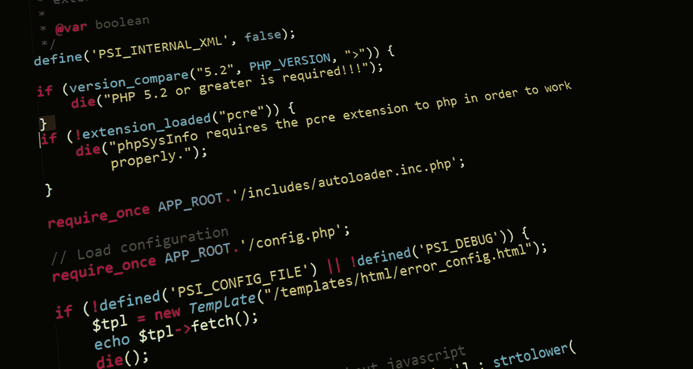
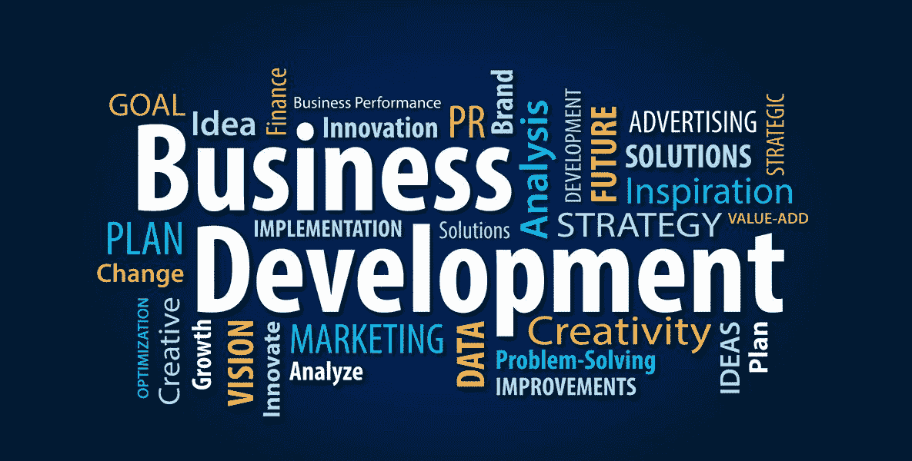
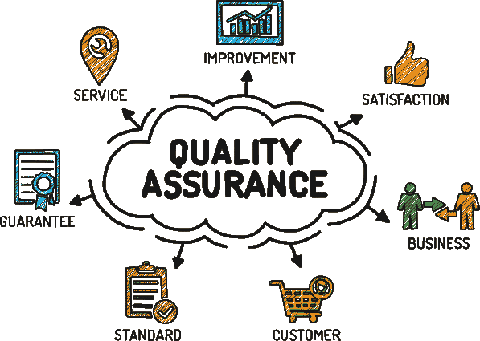
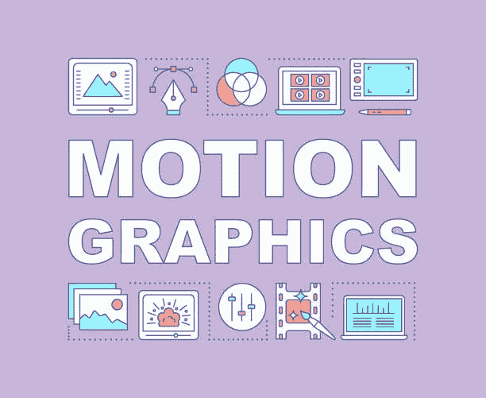
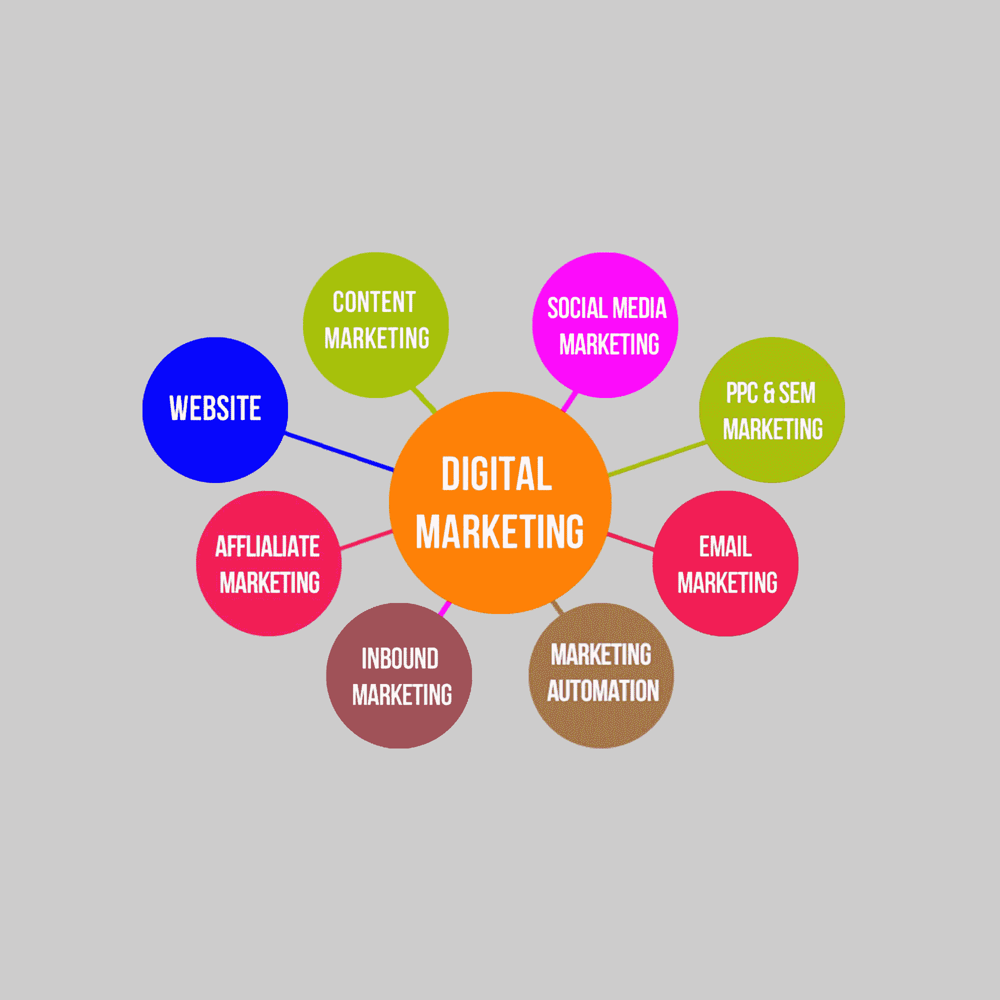
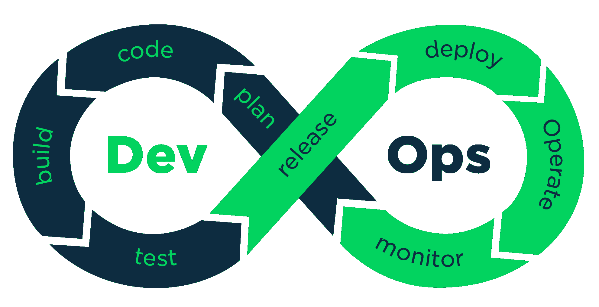
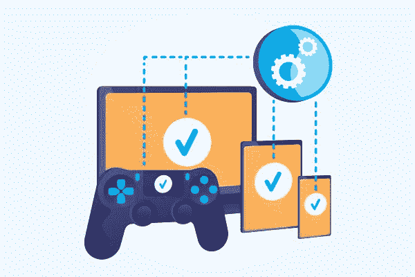

# 如何在 2022 年选择科技职业——职业改变者指南

> 原文：<https://www.freecodecamp.org/news/how-to-choose-a-tech-career/>

选择科技职业可能很棘手，因为有许多可能的途径可供选择。有 Web 开发、机器学习、数据科学、DevOps 等等。

但好消息是，在科技世界里，你不一定要成为一名开发者。

这篇文章是为那些努力向科技转型的人准备的指南。它将解释你可以考虑的各种科技职业。我们还将讨论如何知道一条特定的道路是否适合你或你的个性。

这是基于我的观点和经验，但我希望我的见解会有所帮助。

## 目录

*   [UI/UX 设计路径](#what-is-ui-ux-design)
*   [前端路径](#frontend-development)
*   [后端路径](#backend-development)
*   [数据分析&数据科学路径](#data-analysis-and-data-science)
*   [网络安全路径](#cybersecurity)
*   [平面设计路径](#graphic-design)
*   [程序管理路径](#program-management)
*   [人力资源路径](#human-resources)
*   [成长管理路径](#growth-manager)
*   [业务发展路径](#business-development)
*   [社区管理路径](#community-manager)
*   [开发者关系路径](#developer-relations-devrel-)
*   [技术作家路径](#technical-writer)
*   [质量保证路径](#quality-assurance-testing)
*   [运动设计路径](#motion-designer)
*   [数字营销路径](#digital-marketing)
*   [移动开发路径](#mobile-app-developer)
*   [开发者运营路径](#devops)
*   [游戏开发路径](#game-development)

# 可能的科技职业

## 用户界面/UX 设计

UI/UX Illustration

如果你热爱美学，喜欢设计东西，那么 UI/UX 设计可能是你的职业。

### 什么是 UI/UX 设计？

**UI** 代表用户界面，是指用户在网页或应用程序中与之交互的屏幕、页面和视觉图标(按钮、图标等)。一个设计良好的用户界面可以帮助非技术人员和所有终端用户在线与产品或服务进行交互。

**UX** 代表用户体验，包括帮助产品或服务改善其客户服务。一个好的 UX 还可以帮助品牌增加追随者。

作为一名 UI/UX 开发人员，你的工作是为一个品牌或公司设计和构建用户体验。

UI/UX 开发人员必须知道并理解如何使用以下内容:

*   [**线框**](https://www.freecodecamp.org/news/designing-a-website-ui-with-prototyping/) :线框是剥离了视觉设计的网页布局。您可以使用它来根据用户需求区分页面元素的优先级。
*   [**原型**](https://www.freecodecamp.org/news/designing-a-website-ui-with-prototyping/) :原型是用于测试和收集反馈的最终产品的样本或模拟。低保真度的原型可能被绘制在纸上，并且不允许用户交互。高保真原型通常基于计算机，允许鼠标和键盘交互。
*   模型:模型可以让设计者了解最终网页或应用程序的真实视觉模型。
*   **用户流**:用户流是一种绘制每个用户使用产品或服务的步骤的方式。这有助于改善用户体验。

### 成为一名 UI/UX 开发者需要什么工具？

如果您是一名 UI/UX 开发人员，您可能会使用以下工具:

*   [Adobe XD](https://www.adobe.com/products/xd.html)
*   [图](https://www.figma.com/)
*   [Photoshop](https://www.adobe.com/products/photoshopfamily.html)
*   [草图](https://www.sketch.com/)

有很多工具，但这些是最流行的。

UI/UX 开发人员设计网站和 web 应用程序，并帮助改善用户体验，上面提到了需要知道的内容。如果你想沿着这条路走下去，你可以从行为或运球中获得灵感。

### 这里有一些资源可以帮助你开始成为一名 UI/UX 设计师:

*   [Figma UI 设计教程-初学者教程](https://youtu.be/jwCmIBJ8Jtc)
*   [UI / UX 设计教程——图玛](https://youtu.be/c9Wg6Cb_YlU)中的线框、实体模型&设计
*   [UX 设计初学者教程](https://youtu.be/I0-vBdh4sZ8)

## 前端开发

Frontend Tools Illustration

如果你喜欢创建网站，你应该考虑前端开发。

前端开发人员确保访问者可以轻松地与网页进行交互。他们使用设计工具、各种框架和库以及编码来构建网站。

前端开发人员也是客户端开发人员，因为他们直接在用户和客户端交互的网站和应用程序上构建元素。

前端开发人员使用的领先 web 技术有:

*   HTML(超文本标记语言):

HTML 让你建立网页和网站的框架。标记语言定义了网络。你可以把它想象成一个房子的结构，因为它容纳了所有的文本，并定义了网站的每个标题。

*   CSS(级联样式表):

**CSS** 负责让网站变漂亮。你可以把它想象成房子的装饰。在 HTML 显示文本后，您可以用它来为页面添加颜色、动画等。

*   JavaScript:

**JavaScript** 处理网站的响应。它赋予网站生命，让它在每个设备上看起来都很棒，并使它更具互动性。

你需要这些语言的基础知识来成功地建立一个独特的交互式网站。只知道一种提到的技术技能不足以构建生产质量的应用程序，因为你只能创建一个半有用的网站。

有时，前端开发人员与 UI/UX 开发人员携手合作。

### 成为前端开发人员需要知道哪些工具？

#### 代码编辑器或 IDE(集成开发环境)

代码编辑器/IDE 是您编写代码、调试代码和预览代码的地方。

有许多编辑器/IDE 可供选择，但最受欢迎的是 [Visual Studio 代码](https://code.visualstudio.com/)、 [Atom](https://atom.io/) 和 [Sublime 文本编辑器](https://www.sublimetext.com/)。

#### [Chrome 开发者工具](https://developer.chrome.com/docs/devtools/)

你使用 Chrome DevTools 在 Chrome 上调试实时应用。它让您了解和访问 web 应用程序的重要内部信息。DevTools 还帮助你了解如何优化加载流程，以及浏览器现在在做什么。

#### [Git 和 GitHub](https://github.com/) 用于版本控制

我知道你在想什么-[什么是版本控制系统](https://www.freecodecamp.org/news/git-and-github-for-beginners/)？这是一个帮助你分阶段回顾你的代码并跟踪你(和其他人)的修改的系统。Git 是一个版本控制系统，GitHub 是一个 Git 库的在线托管服务。

假设你正在做一个登陆页面，你弄乱了页脚，在代码库中，它似乎很难调试。您可以快速返回到您的存储库上先前提交的代码，并查看您的最后更改。尽管如此，当您提交您的回购时，您只能看到您以前的提交。

GitHub 帮助团队成员更有效地合作，你可以用它来为开源项目做贡献。

### 这里有一些资源可以帮助您开始前端开发:

*   【2022 年前端开发者指南
*   【HTML、CSS、JavaScript 前端开发
*   [响应式网页设计课程](https://www.freecodecamp.org/learn/2022/responsive-web-design/)

## 后端开发

Backend Tools Illustration

如果你喜欢和依赖于你的东西一起工作和构建，你应该成为一名后端开发人员。

后端开发人员构建和维护支持客户端开发组件所需的技术或软件。他们也被称为服务器端开发人员。

他们的工作包括:

*   建立/维护数据库
*   使用数据和应用程序集成
*   使用 API
*   构建核心应用程序逻辑

### 成为后端开发人员需要什么工具？

后端开发人员使用与前端开发人员几乎相同的工具。以下内容会对你有所帮助:

*   代码编辑器/IDE:用于编写代码、调试和预览代码库。
*   Chrome 开发者工具:这可以帮助你调试代码。
*   Git 和 GitHub :这有助于你分阶段审查你的代码，使团队建设、协作和开源贡献更加容易。如果资源库是公开的，任何开发人员都可以为您的项目做出贡献。
*   SQL 或 NoSQL 服务器:SQL 代表结构化查询语言。这有助于您在构建应用程序时查询数据库并与之交互。
*   数据库知识

### 这里有一些资源可以帮助您开始后端开发:

*   [后端开发和 API 认证](https://www.freecodecamp.org/learn/back-end-development-and-apis/)
*   [后端路线图](https://youtu.be/Q0prVO3DCtU)
*   [后端开发和 API-FreeCodeCamp 教程](https://youtu.be/hHLmb3OD7Mo)

## 数据分析和数据科学

Data Science/Analysis Skills Illustration

如果你喜欢计算、数学或统计，考虑一下数据分析师的职业。

数据分析包括以特定的方式检查、转换和排列给定的数据集，以研究其组成部分并提取有用的信息。它处理数据的解释、分析和可视化。

用外行人的话来说，数据分析包括从数据中收集见解，以帮助业务决策。

数据科学使用机器学习、算法和统计来处理数据。它是数据字段的统计部分。数据科学家为调查收集、清理和解释数据集。所以数据科学包括统计分析数据。

从数据分析师开始，然后过渡到数据科学总是更好，因为数据分析是数据科学的基础。虽然它们可能在同一条道路上，但数据科学和数据分析之间有一条细线。

每个行业都有数据，所以哪里都需要数据科学家和分析师。

#### 数据科学必须具备的基本技能:

*   [MySQL](https://www.mysql.com/) 的实现
*   [Python 编程语言](https://www.python.org/)
*   数学
*   统计数字
*   [R 编程语言](https://www.r-project.org/about.html)

### 你会在这个领域使用什么工具:

*   [微软 Excel](https://www.microsoft.com/en-us/microsoft-365/excel)
*   [谷歌电子表格](https://www.google.com/sheets/about/)
*   表
*   [SQL 服务器](https://www.sqlservertutorial.net/getting-started/what-is-sql-server/)
*   [power I](https://powerbi.microsoft.com/en/)

### 这里有一些资源可以帮助您开始学习数据分析和数据科学:

*   [发现数据分析](https://docs.microsoft.com/en-us/learn/modules/data-analytics-microsoft/)
*   [面向初学者的数据科学](https://youtu.be/ua-CiDNNj30)
*   [数据分析认证](https://www.freecodecamp.org/learn/data-analysis-with-python/)

## 产品管理

Product Management Skills Illustration

如果你擅长组织产品和团队，这是给你的。

产品经理管理和协调产品开发项目。产品经理是团队中客户的代言人。

他们确保正在构建的产品包含满足客户所需的特性和需求。他们还负责为该产品起草路线图，从想象，一直到推出。他们也是决定在 v1 或 V2 中包含什么特性的人。

他们的职责包括:

*   了解用户需求，
*   为正在生产的产品草拟路线图。
*   定义产品的愿景
*   开发竞争分析
*   优先考虑产品特性

还有更多。

### 产品经理使用的常用工具:

*   有许多用户跟踪和分析工具，如 [Pendo](https://www.pendo.io/) 或[振幅](https://amplitude.com/)。这些应用可以洞察用户在软件或网站上的活动。
*   [产品计划](https://www.productplan.com/)是一款制定和管理产品计划的路线图软件。他们还可以处理版本控制问题，这些问题会减缓产品的开发进度。
*   像 [Typeform](https://www.typeform.com/surveys/) 这样的调查工具非常方便。项目经理使用它们来进行客户或用户调查，以帮助改进产品来满足用户的需求。产品经理可以使用这些工具轻松跟踪和分析结果。
*   特性标记工具，如 [Split.io](https://www.split.io/) 帮助团队在用户标记特定特性时快速转向它们。这在显著特征或产品发布或测试过程中很有用。
*   流程图工具，如 [Visio](https://www.microsoft.com/en-us/microsoft-365/visio/flowchart-software) 有助于创建产品开发工作流程，并帮助产品经理组织用户的产品之旅。

### 以下是开始产品管理的一些资源:

*   [产品管理基础知识](https://youtu.be/lF70OuNWdrM)
*   [产品管理简介](https://youtu.be/ravLfnYuqmA)
*   [产品管理初学者教程](https://youtu.be/NsqyFcycBTw)

## 网络安全

Cyber Security Skills Illustration

如果你对安全充满热情，可以考虑从事网络安全工作。

网络安全涉及方方面面，从加密到发现和防范恶意软件或病毒，再到通过黑客攻击来发现系统中的安全漏洞并加以修复。

网络安全专家保护个人、公司、企业和政府的数字信息。

他们的任务包括:

*   测试、分析和实施安全系统开发
*   管理系统漏洞
*   应对安全威胁和攻击
*   制定威胁预防策略
*   直接向管理员和主管汇报

### 网络安全分析师使用的工具:

*   网络安全监控工具，如 [Splunk](https://www.splunk.com/) 或 [Argus](https://argus-sec.com/) 。这些工具跟踪网络威胁并分析网络数据。
*   加密工具如 [VeraCrypt](https://www.veracrypt.fr/code/VeraCrypt/) 和 [TrueCrypt](http://truecrypt.sourceforge.net/) 。这些工具用于加密，将纯文本加密为未经授权的用户无法访问的代码。
*   漏洞扫描器，如 [Nikto](https://cirt.net/Nikto2) 和 [Burp Suite](https://portswigger.net/burp) 。这些工具使用 [SQL 注入](https://www.freecodecamp.org/news/what-is-sql-injection-how-to-prevent-it/)和跨站点脚本扫描软件以识别安全漏洞。

### 以下是一些网络安全入门资源:

*   [完整的道德黑客课程-面向初学者的网络渗透测试](https://youtu.be/3Kq1MIfTWCE)
*   [初学者网络安全完整课程](https://youtu.be/U_P23SqJaDc)
*   [网络安全培训课程](https://www.youtube.com/watch?v=nzZkKoREEGo&list=PL9ooVrP1hQOGPQVeapGsJCktzIO4DtI4_)

## 装帧设计艺术

Graphic Design Skills Illustration

如果你喜欢设计传单、标志和其他图形元素，考虑从事图形设计。许多人会认为平面设计不是一个技术职业，但这是因为它有助于将想法带入生活，就像 UI/UX 设计一样。

平面设计师负责以数字方式美化公司的品牌，组合图像向消费者展示品牌，并为品牌制作动画。

### 平面设计作为一项技术职业包括:

*   创建布局
*   数字编辑
*   排版
*   展示设计产品

### 你应该知道的一些图形设计工具:

*   [Adobe Illustrator](https://www.adobe.com/products/illustrator.html)
*   [生育](https://procreate.art/)
*   [Adobe Photoshop](https://www.adobe.com/products/photoshop.html)
*   [亲和力](https://affinity.serif.com/en-us/photo/)
*   [坎瓦](https://www.canva.com/)

这些工具将帮助你充分利用你的设计，它们被全世界的设计师所使用。

### 以下是开始平面设计的一些资源:

*   [平面设计初学者教程](https://youtu.be/9QTCvayLhCA)
*   [初学 Photoshop】](https://youtu.be/IyR_uYsRdPs)
*   [平面设计速成班](https://www.youtube.com/watch?v=pz-lwONtVmM&list=PLlz0muypSBNZ02BPF227DXRGBsK5QjcUV)

## 程序管理

Program Management Skills Illustration

如果你喜欢创建和管理结构，考虑成为一名项目经理。

项目经理监督公司目标的实现。他们管理实际项目，协调多个项目之间的活动，但不执行它们。他们还专注于实施项目、项目策略和委派任务。

他们参与了:

*   销售流程
*   员工培训
*   创建营销计划
*   开放新设施
*   产品发布

### 项目管理中使用的工具:

*   敏捷工具，如特雷罗、T2、吉拉和 T3。

### 作为项目经理，以下是一些入门资源:

*   [项目管理标准概要&PgMP 介绍](https://youtu.be/CESfWcOO_fs)
*   [PgMP 的一切(项目管理专业)](https://youtu.be/dPrvOWRI5WQ)
*   [项目经理概述](https://youtu.be/RiZRA08KMWA)

## 人力资源

Human Resources Skills Illustration

如果你善于与人相处，喜欢帮助他们解决冲突和问题，你可以考虑成为一名人力资源专员。 **HR** 代表人力资源。

人力资源管理是招募人才和发展一个坚实的公司的劳动力。人力资源部门识别公司的技能或人力资源，评估潜在候选人，并雇用人才。他们还负责为一家公司发布招聘广告。

人力资源专员负责筛选、招聘、面试和安置新员工。

### 其他人力资源职责包括:

*   处理员工关系
*   处理工资单
*   管理员工福利和培训
*   就战略规划向高管提供咨询

### 人力资源人员使用的工具和技术:

*   [程序化招聘广告工具](https://www.selectsoftwarereviews.com/buyer-guide/programmatic-job-advertising-software)
*   [就业前评估工具](https://geekflare.com/pre-employment-assessment-tools/)
*   [人才管理解决方案](https://peoplemanagingpeople.com/tools/talent-management-system/)
*   [专家判断](https://www.wrike.com/project-management-guide/faq/what-is-expert-judgment-in-project-management/#:~:text=Expert%20judgment%20is%20a%20technique,knowledge%20of%20the%20product%2Fmarket.)
*   网络——他们使用 LinkedIn 这样的平台来接触人才。

### 以下是一些人力资源入门资源:

*   [人力资源基础知识](https://www.youtube.com/watch?v=A2HFusWQIeE&list=PLdinyWzDfipPVYqpTc8EhWNDvEx14Nc1E)
*   [面向初学者的完整人力资源通才教程](https://youtu.be/hhIVo27PaQg)
*   [人力资源原则](https://www.youtube.com/watch?v=w_wIMveGlrI&list=PLPjSqITyvDeXSqZIgYD2XKKLGZtjrhDtl)

## 增长经理

Growth Skills Illustration

如果你热衷于把事情做得更好或更大，成长经理的职业可能适合你。

增长经理负责执行企业产品的增长战略，以引导消费者。此外，他们还与主要的金融合作伙伴协调行动。

成长经理处理公司的财务增长，从销售和营销到网络和商业利益相关者管理到人员管理，几乎与每个部门合作。他们为每个部门的员工设定目标。

### 增长管理中使用的工具:

*   发展
*   [萨帕尔](https://zapier.com/)
*   [生长栏](https://www.growthbarseo.com/)
*   科里布里
*   [气动工作台](https://www.airtable.com/)

这些工具都是用来跟踪公司或产品的活动增长的。

### 如何成为一名成长经理:

*   [成长经理课程](https://www.youtube.com/watch?v=JnD_m10cjo0)
*   [新手成长黑客](https://www.classcentral.com/course/youtube-growth-hacking-for-beginners-53179)
*   [成长管理课程](https://www.hubspot.com/resources/courses/growth-marketing)

## 业务发展

Business Developer Skills Illustration

如果你擅长建立人际关系，并且 100%以商业为导向，那么这个职业适合你。

业务开发人员或业务开发分析师负责帮助组织获得更好的品牌认知度和财务增长。

他们提出有助于改善业务的想法、倡议和活动，包括通过建立战略伙伴关系和制定业务战略来增加收入、业务扩张的增长条件和盈利能力。

### 其他业务拓展工作职责包括:

*   与公司高管协调活动
*   回顾当前的市场趋势
*   提出新的商业想法以增加收入
*   与潜在合作伙伴建立关系

在大型科技公司，业务开发人员与非技术团队和首席执行官或董事会合作，帮助发展业务。

### 用于业务发展的工具:

*   社会管理工具
*   电子邮件列表
*   [客户关系软件](https://www.pcmag.com/picks/the-best-crm-software)
*   项目管理工具，如[吉拉](https://www.atlassian.com/software/jira)或 [Accelo](https://www.accelo.com/)
*   SEO(搜索引擎优化)工具

### 以下是开始业务发展的一些资源:

*   [业务分析师 2 小时完整课程](https://youtu.be/f9DzS6NdgwU)
*   [业务发展课程](https://youtu.be/b3NNk7G658k)
*   [商业分析课程](https://www.youtube.com/watch?v=_Dcmk9mEP9s)

## 社区经理

Community Manager Skills Illustration

如果你善于与人相处，能够推动团队对话，并善于激励他人，这是适合你的。每个技术社区都需要一个社区经理，如果你擅长与人交流，这绝对适合你！

社区经理负责沟通，是公司的形象代言人。他们是社区的声音、面孔和基调。此外，他们还负责数字参与，以在线和面对面的方式建立社区的存在和信任。他们是社区和用户之间的纽带。

### 社区经理参与:

*   沟通
*   PR(公共关系)
*   社交媒体管理
*   事件
*   内容创作

### 社区管理中使用的工具:

*   [观念](https://www.notion.so/)
*   特雷罗
*   [AhoyConnect](https://www.ahoyconnect.com/)
*   [轨道](https://orbitapp.io/)

### 以下是开始社区管理的一些资源:

*   [社区管理大师班](https://www.youtube.com/watch?v=NmdKaNAX0uo&list=PL0P8AylSU5frSxUCe-Pxq9Cq8awvvIqeO)
*   [吸引观众的社区管理课程](https://youtu.be/a7U0YWIpHCM)
*   [Meta 社区经理在线课程](https://www.facebookblueprint.com/student/path/205897-facebook-community-manager-online-courses)

## 开发者关系(DevRel)

Devrel Illustration

如果你热爱营销，DevRel 是你的职业道路。

开发者关系的工作职责类似于社区经理、技术作者、开发者传道者、开发者倡导者，有时甚至是成长黑客和营销人员。

他们的主要职责是与团队中的开发人员建立积极的关系。他们在产品、工程和营销团队之间工作。

### 要在 DevRel 技术领域工作，您需要:

*   成为社区的一部分
*   在社区中树立形象
*   学习如何与社区成员互动
*   创建博客文章、文章或视频等内容

没有开发人员倡导者使用的特定工具，因为他们的角色与其他领域相似，所以我将提到一些基本工具:

*   [观念](https://www.notion.so/)
*   特雷罗
*   代码编辑器——因为他们也经常编码。

### 以下是开发人员关系的一些入门资源:

*   [DevRel 简介](https://www.youtube.com/watch?v=LKvkd7m2wBY)
*   [DevRel 的完整指南](https://www.youtube.com/watch?v=CN4Zzdg49VI)
*   [在开发人员关系中建立职业原型](https://www.youtube.com/watch?v=rO3WTfPIM5M)

## 技术作家

Tech Writer Skills Illustration

如果你喜欢写作和分享各种技术相关话题的知识，这是最适合你的。

一个技术写作者在团队工作的时候会对内容产生创新的想法。他们研究产品、服务、技术和概念，并清晰简明地记录/解释它们，以便任何读者都能理解产品或工具是如何工作的。想要在这个领域出类拔萃，需要编程之类的技能。

### 技术写作人员的工作职责包括:

*   产生内容和工作流解决方案的想法
*   与专家会面，确保他们恰当地涵盖和理解专业主题
*   分析和解释有关产品、工具、政策、表格文件和程序的信息。
*   此外，他们还审阅和编辑由其他团队成员开发的内容。

### 技术作者使用的工具:

*   Markdown 编辑器如 [StackEdit](https://stackedit.io/) 、 [Typora](https://typora.io/) 、[迪林杰](https://dillinger.io/)、 [IA](https://ia.net/writer) 。
*   API 文档工具如 [Bump](https://bump.sh/) 、 [Redocly](https://redocly.com/) 、 [Postman](https://www.postman.com/api-documentation-tool/) 、 [GitBook](https://www.gitbook.com/) 。
*   发布工具如 [Document360](https://document360.com/) 和 [Adobe Robohelp](https://www.adobe.com/products/robohelp.html) 。
*   编辑工具包括[语法上的](https://www.grammarly.com/)、[复制。Ai](https://www.copy.ai/) 、 [Adobe Acrobat](https://acrobat.adobe.com/us/en/acrobat.html) 、 [Dropbox](https://www.dropbox.com/) 、 [Google Docs](https://docs.google.com/) 、 [Evernote](https://evernote.com/) 。
*   媒体管理工具，如 [Snipaste](https://www.snipaste.com/) 、 [Loom](https://www.loom.com/) 、 [Camtasia](https://www.techsmith.com/video-editor.html) 。

请注意，不同的组织使用不同的工具，但上面提到的是每个类别最常用的工具。

### 以下是一些开始技术写作的资源:

*   [技术写作课程](https://www.youtube.com/watch?v=LTDsgd0ytbE&list=PL9RLbEIB-lv-bRTz14iEK4YSxRzxLQfdx)
*   [科技写作工作坊](https://www.youtube.com/watch?v=pMXLm18lFks)
*   技术写作指南
*   初学者的技术写作

## 质量保证测试

QA Skills Illustration

如果你喜欢编写和测试代码，这是给你的。

质量保证(QA)测试人员在向消费者交付高质量、正常运行的软件和 web 应用程序方面至关重要。他们测试和评估新的和现有的程序，并帮助识别和消除错误，故障和其他用户体验问题。

### QA 测试人员使用的工具:

*   [测试严格度](https://testrigor.com/)
*   [Testim](https://www.testim.io/)
*   [科比顿](https://www.kobiton.com/)
*   [库阿里提](https://www.kualitee.com/)

### 下面是一些 QA 测试人员的入门资源:

*   [质量保证认证](https://www.freecodecamp.org/learn/quality-assurance/)
*   [软件测试全程](https://youtu.be/sO8eGL6SFsA)
*   [QA 人工测试课程](https://www.youtube.com/watch?v=QJqNYhiHysM)

## 运动设计师

Motion Skills Illustration

如果你喜欢 CGI，这是给你的。

运动设计师为 web、电视和电影创作艺术作品，包括电影剪辑、预告片、广告等等。

他们使用被称为视觉效果、动画和其他电影技术的特殊效果来给他们创作的作品带来生命。

### 运动设计中使用的工具:

*   [土坯后效](https://www.adobe.com/africa/products/aftereffects.html)
*   [3D 搅拌机](https://www.blender.org/)
*   [Cinema4D](https://www.maxon.net/en/cinema-4d)
*   [玛雅](https://play.google.com/store/apps/details?id=com.paymaya&hl=en&gl=US)

### 这里有一些资源可以让你开始成为一名动作设计师:

*   [运动图形教程](https://www.youtube.com/watch?v=5PNotJrwkYY&list=PLWYr0cX0QTLCzRlSioyNG90GgvblR33j7)
*   [运动设计简介](https://www.youtube.com/watch?v=ZR2n3Gd-SqU)
*   [运动设计课程](https://www.skillshare.com/browse/motion-design)

## 数字营销

Digital Marketer Skills Illustration

如果你喜欢在网上销售产品，这是给你的！

数字营销人员通过营销活动来帮助维护品牌。它是在线营销，因为它通过互联网推广品牌，并将潜在用户或消费者与产品联系起来。

数字营销是数字传播的另一种形式。这不仅限于电子邮件、社交媒体和基于网络的广告，还包括作为营销渠道的文本和多媒体消息。

### 数字营销人员的职责包括:

*   创建内容以帮助营销活动
*   做市场调查
*   与营销团队一起制定战略

### 用于数字营销的工具:

*   [萌芽社交](https://sproutsocial.com/)
*   [隐隐约约地](https://www.loomly.com/)
*   观众
*   [发送网格](https://sendgrid.com/)
*   [AHRS](https://ahrefs.com/)

### 以下是开始成为数字营销人员的一些资源:

*   [新手数字营销教程](https://youtu.be/rchKaSMQ__8)
*   [7 小时数字营销课程](https://youtu.be/hiEb1m7CXH4)
*   [免费数字营销课程](https://www.youtube.com/watch?v=wfOp0lsCXAY&list=PLifnQOsGyOSRMYndHku6pNlLYckbBuOGU)

## 移动应用开发者

Mobile Developer Skills Illustration

如果你喜欢创建应用程序，这是给你的。

移动开发技术领域非常广阔，您将使用的工具和技术取决于您选择的专业领域——Android 应用程序开发和 iOS 开发。

移动开发人员将代码转换成用户友好的应用程序。他们与其他开发人员合作，在快节奏的环境中开发功能性移动应用程序。

### 用于 android 开发的工具:

*   [安卓工作室](https://developer.android.com/studio)
*   [月食](https://www.eclipse.org/downloads/packages/)
*   Instabug

### 用于 iOS 开发的工具:

*   [Xcode](https://developer.apple.com/xcode/) 或 [App 代码](https://www.jetbrains.com/objc/)
*   [运输机](https://apps.apple.com/us/app/transporter/id1450874784?mt=12)
*   [布料](https://cocoapods.org/pods/Fabric)

### 应用程序开发人员的一些主要职责:

*   设计应用程序，
*   测试应用程序，
*   发布应用程序
*   支持应用程序。

### 以下是移动开发人员入门的一些资源:

*   [面向初学者的 Android 开发-完整课程](https://youtu.be/fis26HvvDII)
*   [iOS 开发新手教程](https://youtu.be/09TeUXjzpKs)
*   [初学颤振课程](https://youtu.be/VPvVD8t02U8)

## DevOps

DevOps Skills Illustration

如果你喜欢使用基础设施和云技术，这是给你的。

DevOps 工程师直接与开发人员和 IT 人员合作，监督代码的发布，并为工程和编码集思广益。

他们的职责包括:

*   为自动代码部署实现自动化工具和框架，
*   代码库的质量控制和管理，
*   设计系统故障排除和维护程序
*   为服务质量分析、监控和运营编写脚本。

### 作为 DevOps 工程师您需要的技能:

*   [Linux](https://www.linux.org/)
*   [Python](https://www.python.org/) 编程语言基础知识
*   云平台知识。

### DevOps 工程师使用的工具:

*   构建工具如 [Gradle](https://gradle.org/) 和 [Apache](https://www.apache.org/) 。
*   包管理者如 [Npm](https://www.npmjs.com/) 和 [Mache](https://maven.apache.org/)
*   CI/CD 工具，如[詹金斯](https://www.jenkins.io/)。

### 以下是 DevOps 工程师入门的一些资源:

*   [DevOps 初学者教程](https://youtu.be/hQcFE0RD0cQ)
*   [微软认证:Azure 基础知识](https://docs.microsoft.com/en-us/learn/certifications/azure-fundamentals/)
*   [面向初学者的 DevOps 工程课程](https://youtu.be/j5Zsa_eOXeY)

## 游戏开发

Game Design Illustration

如果你喜欢游戏，这是一条适合你的科技之路。

游戏设计师将设计理念转化为功能性的游戏代码。他们开发网页游戏、手机游戏和 iOS 游戏。

他们的职责包括:

*   编写游戏的基本引擎，
*   生成游戏脚本和故事板，
*   “润色”游戏，维护代码，修复错误，解决重复出现的问题
*   参与音频和动画设计，以及
*   创建游戏规范和设计扩展包。

### 游戏开发者使用的工具:

*   [GameFroot](https://blog.sagipl.com/game-development-tools/#GameFroot)
*   [Flowlab](https://blog.sagipl.com/game-development-tools/#Flowlab)
*   [辉煌](https://blog.sagipl.com/game-development-tools/#Sploder)
*   [构造](https://blog.sagipl.com/game-development-tools/#Construct_2)

### 以下是游戏开发的一些入门资源:

*   [学习 Unity -初学游戏开发教程](https://youtu.be/gB1F9G0JXOo)
*   [游戏设计的基本原则](https://youtu.be/G8AT01tuyrk)
*   【Unity 游戏开发简介

## 结论

既然你有不同的选择来进入科技世界，我希望你不要那么困惑。

选择一条道路并开始行动——科技领域非常广阔，因此角色会不断出现。不要烦恼，因为学习可能具有挑战性。请记住，即使是高级技术人员也会患上骗子综合症。