# 如何选择和配对字体

> 原文：<https://www.freecodecamp.org/news/how-to-choose-and-pair-typefaces-98fee945d13c/>

作者 Zell Liew

选择两种字体的行为可能是你在创建一个新设计时要做的第一件事(通常也是最困难的一件事)。许多人被困在这里，包括我自己。

最近，我发现了一个有效配对字体的简单方法，我很乐意与你分享。(提示:是 3×3 的网格)。

使用这个 3×3 的网格有一个先决条件(我将很快揭示)——知道如何对字体进行分类。所以，让我们从这里开始。

### 分类字体

从广义上讲，字体可以分为六类。它们是:

1.  无衬线字体
2.  衬线
3.  平板衬线(或埃及文)
4.  单一间隔
5.  手写体(或草书)
6.  展示(或装饰)

通过查看衬线的**风格，你可以将字体分为**前三类**。**

如果字体包含*无衬线*，它们就属于*无衬线类别*。(sans 的意思是没有)。无衬线字体的例子包括 Helvetica 字体和吉尔字体。

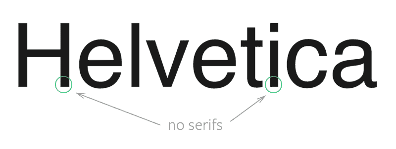

如果字体包含看起来像块状的衬线，它们就属于 T2 衬线类别。(slab 的意思是大厚块)。平板衬线也被称为*埃及文*，尽管衬线和埃及文字没有任何关系。平板衬线的例子包括 Archer 和 Museo 平板。

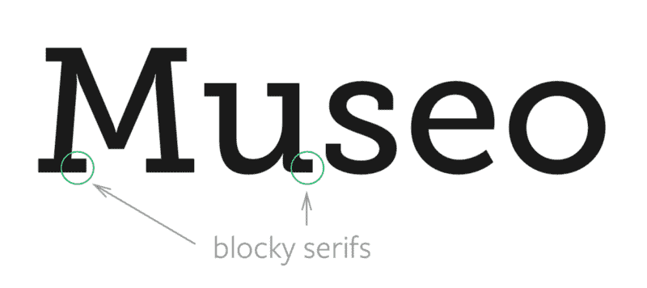

任何其他*包含衬线*的字体都属于*衬线*的范畴。例子包括 Garamond 和乔治亚州。

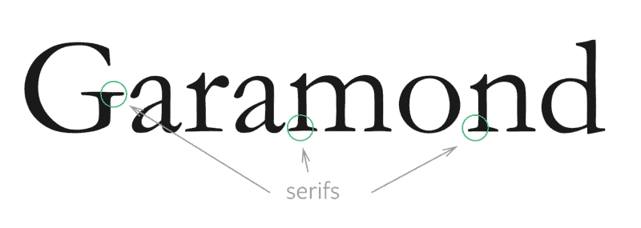

对于我们开发者来说，等宽字体并不陌生。它们的字体占据了相同的水平空间。它们经常用在表格数据和代码中。例子包括门罗和摩纳哥。

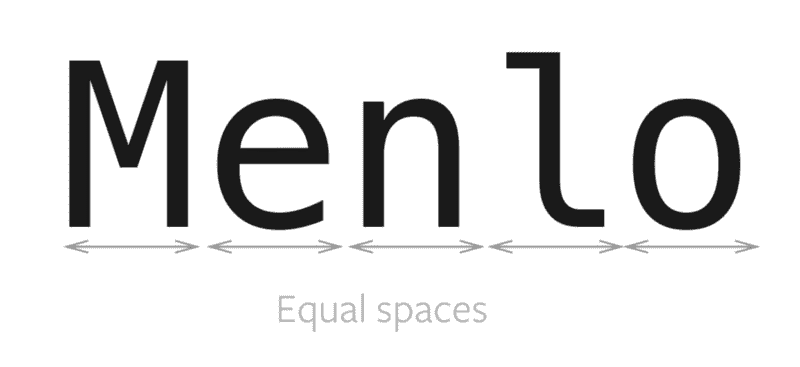

书法字体通常是书法性质的。它们通常用于简短的标题、邀请和表达性文本。例子包括舞蹈剧本和龙虾。

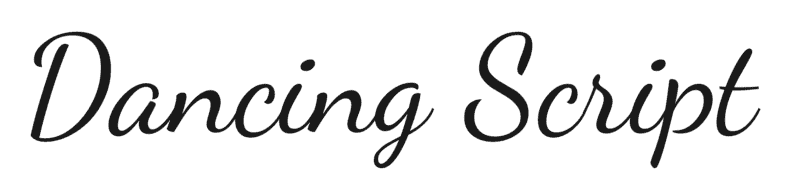

最后，*显示字体*是只用于大标题的字体。许多显示字体都是衬线字体和无衬线字体，经过特别调整，在大尺寸时看起来很好。展示字体还包括*装饰字体*和*装饰字体*，它们可以有各种形式和风格。例子包括货物展示和 Abril Fatface。

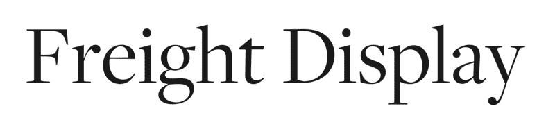

现在你知道如何将字体分为六大类，这太棒了！不幸的是，这些主要类别过于宽泛。

为了有效地配对字体，我们通常需要更深入地研究子类别。随着我们深入研究，我们只看无衬线字体、衬线字体和平板衬线字体，因为大多数字体选择都是在那里做出的。

当你开始细分时，事情开始变得混乱。有很多子类，包括但不限于*人文主义*、*新人文主义*、*旧式*、*怪诞*、*新怪诞*、*过渡*、*几何*和*现代*。

*记住*这些子类别的名称，*区分*它们，以及*正确地将字体放入它们之中*是人们面临的三大挑战，包括我自己。经过大量研究后，我注意到你可以将这些子类分成一个简单的 **3×3 网格**。

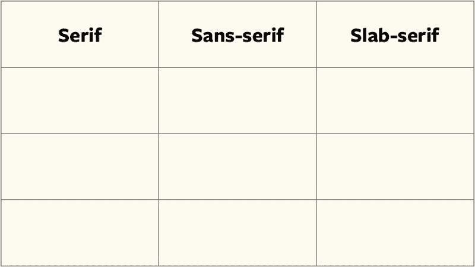

填满 3×3；网格，我们可以看看字体的三个属性。它们是:

1.  字体
2.  笔画
3.  倾斜

对于前两个属性，看一下字母 *e* 和 *o* 就足够了。第三个是我想出来的外行术语？。

让我们来看看每一个。

### 字体

注意字母的*形状，尤其是字母 *e* 和 *o* 。它们看起来像圆形还是方形？如果是这样，我们可以立即将该字体归类为**几何字体**。*

几何字体包含基于形状的字体。它们看起来像是构造出来的，而不是手写的。因为它们看起来很有结构感，它们也散发出一种*现代*、*酷*和*非个人*的氛围。

几何子类别仅适用于 sans-serif 和 slab-serif 字体。因此，我们可以如下填充 3×3 网格:

接下来，我们看看中风。

### 笔画的对比

字体的*笔画*是组成字体的线条*。注意这几行。它们在字母的不同部分大小不同吗？*

当我们看字体的笔画时，我们只对用它来分类衬线感兴趣。这是因为无衬线和平板衬线很少在笔画上表现出任何差异。

如果有*小的笔画对比*(最细和最粗的部分差别很小)，我们可以把字体归类为**旧式衬线**。

旧式衬线是最古老的可读字体的衬线(根据我们目前的标准。Blackletter 在前，现在几乎不可读)。他们模仿手写，因此本质上是书法性的，这导致他们的字母倾斜得更多(稍后会有更多的倾斜)。由于他们模仿笔迹，他们通常被视为*真实的*、*移情的*和*传统的*。它们也被称为**人文主义衬线**。

另一方面，如果有*巨大的笔画对比*，我们可以将字体归类为**现代衬线**。

现代衬线是故意构造突出。他们的字体通常是直立的，零倾斜，这使得他们*酷*和*没有人情味*，就像几何字体一样。它们也被称为**有理衬线**和**底纹**。

最后，介于现代衬线和旧式衬线之间的是**过渡型**衬线。他们的*笔画对比*明显比旧式衬线*大，但*没有现代*衬线大。*

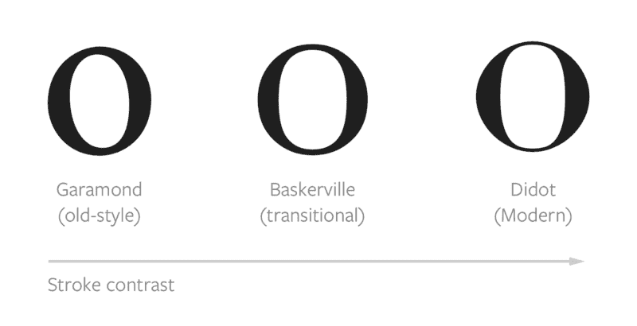

经过笔划后，我们的 3×3 网格变成:

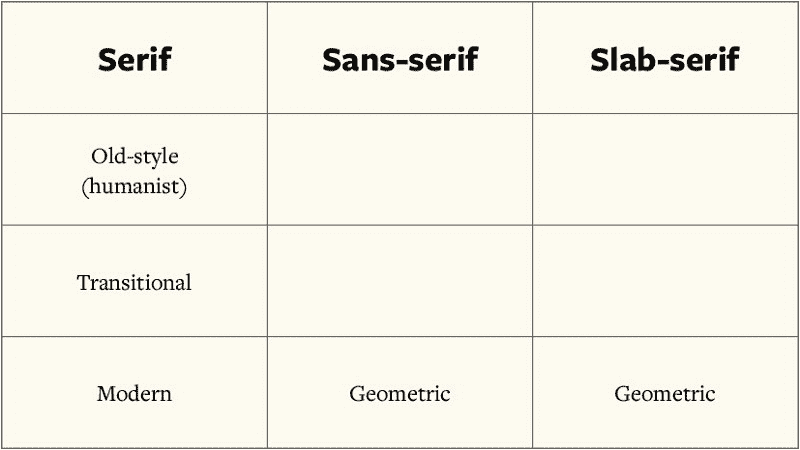

让我们继续倾斜。

### 倾斜

如果你在笔画最细的地方画一条线，你会看到字母的重音。

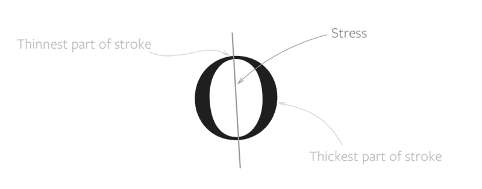

如果你已经注意到了，你会注意到重音只能用来区分衬线子类，因为你需要在字体最细的部分画一条线。

虽然看重音似乎没有意义，因为我们已经将衬线分类到各自的类别中，但我发现区分无衬线人文字体和怪诞字体很有帮助。

让我解释一下。

带有对角线重音的字体(像旧式衬线)看起来像是倾斜了一个角度。因为它们是倾斜的，所以它们模仿了手工创造的*字母。(我们并没有完全直立地握笔，不是吗？).*

虽然字母 *o* 和 *e* 不能告诉我们有没有*重音*，但是我们可以看看其他字母，尤其是有肩章的，像 *h* 、 *m* 和 *n* 。如果这些肩膀中的任何一个看起来是倾斜的(或者如果有任何压力)，我们可以将这种字体归类为人文主义字体。

展现这种行为的人文主义无衬线字体的一个例子是 Lucida Sans。

另一方面，如果字母看起来是直立的，我们可以把它们归类为**奇形怪状的**字体。你可以想象，怪诞的字体介于人文字体和几何字体之间。

仅仅是为了增加你的排版词汇，根据语言的不同，奇形怪状的字体也被称为 *grotesk* 或 *gothic* 。所以，如果你在字体上看到这些名字，你会马上知道它们属于哪一类。

想要个例子吗？Aktiv Grotesk 怎么样？:)

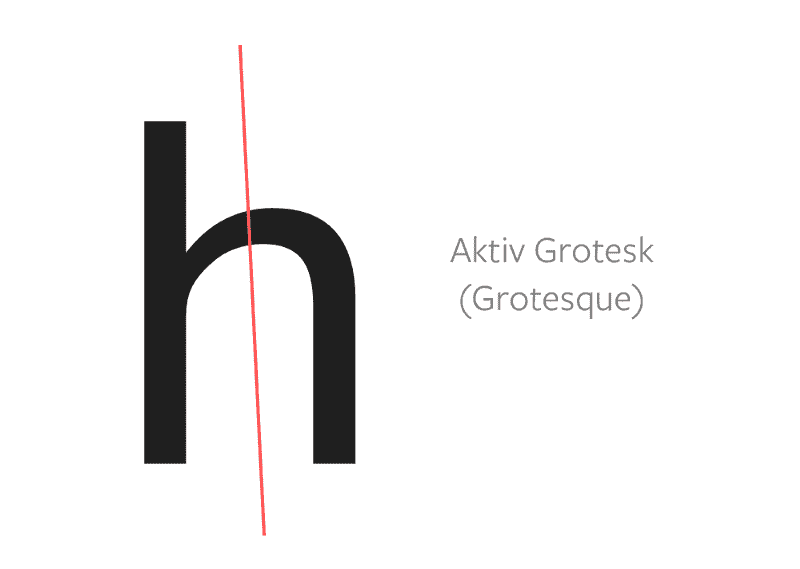

看完*倾斜*，我们终于可以完成 3×3 网格了:

这样，我们就完成了将字体分类到它们各自的类别和子类别中。

在我们进入下一部分之前，我想强调一下*字体分类是非常主观的*。每个人对字体的分类都不一样，所以你只需要自己决定。有些字体也可以分成多个子类。一个例子是 Proxima Nova，它可以同时属于所有三个无衬线子类。

### 使用 3×3 网格

如果你搜索字体配对规则，你会经常遇到以下两个规则:

1.  将无衬线字体与衬线字体(或平板衬线字体)配对
2.  同一时代的成对字体

如果你遵循第一条规则，你会自动用你的两种字体产生对比，这是一件好事。我解释了为什么对比在我的字体设计课程中如此重要。

专家之所以建议你把同一时代(甚至同一设计师)的字体配对，是因为这些字体包含了相似的字体。相似的字体通过重复产生一种熟悉感，这就是为什么不同的字体可以很好地融合在一起。([阅读这篇文章](https://zellwk.com/blog/why-vertical/rhythm)解释为什么重复会产生熟悉感。)

巧合的是(可能不是！)，我们的 3×3 网格可以帮助您识别同一时代创建的字体，而无需记住子类别。它是这样使用的:

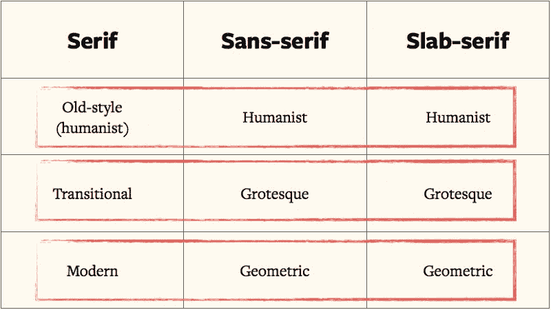

(这是令人兴奋的，不是吗？？)

### 包扎

今天，你学习了如何将字体分成六个主要的子类别，以及它们各自的子类别。您还学习了一种将它们配对的技术(使用 3×3 网格)。

现在去玩玩这个技术，让我知道你的想法吧！

这篇文章是我的响应式排版课程[掌握响应式排版](https://mastering-responsive-typography.com/)的样本。你可以去看看，也可以在[我的博客](https://zellwk.com/blog/)上了解更多关于排版的知识。