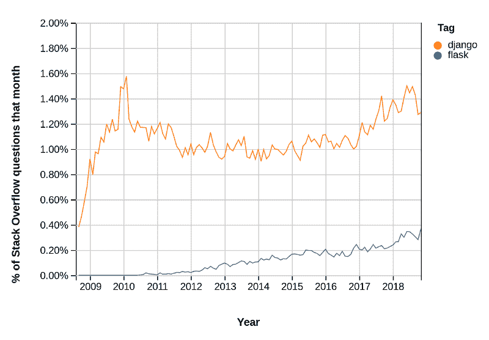
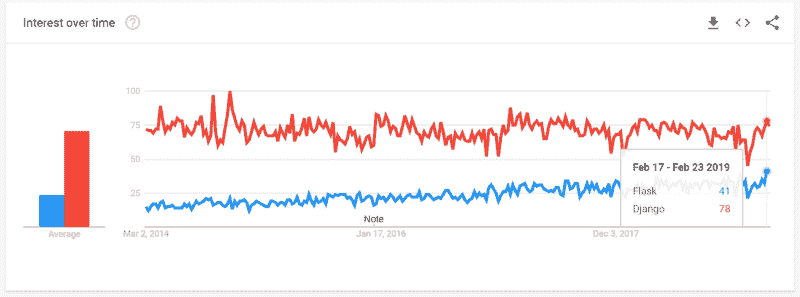
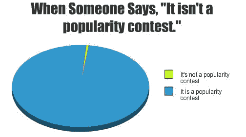

# 如何使用流行度在开源库之间进行选择

> 原文：<https://www.freecodecamp.org/news/how-to-choose-between-open-source-libraries-using-popularity-c71677785542/>

通过一个闪光信号

# 如何使用流行度在开源库之间进行选择

在我作为产品经理的职业生涯中，我与工程师密切合作开发了许多技术产品(甚至我自己也和[一起开发了一些技术产品](https://medium.com/@ashishsingal1/introducing-betalyzer-a-fintech-tutorial-110ac9abda58))。

当开发技术产品时，我们可以做出的最关键的选择之一是在相互竞争的库和框架集之间进行选择。一个关键因素是**相对受欢迎程度**，原因如下:

1.  **代理最好的**。尤其是在开源领域，“市场”是相当高效的。开发人员通常倾向于最好的技术，并用脚投票。
2.  **帮助**。虽然正式文档非常重要，但是堆栈溢出问题和中等教程有时甚至更有利于学习曲线的上升和调试。从业者提供的代码片段和技巧极大地提高了开发速度和影响力。
3.  **天赋**。一个库越受欢迎，你就越有可能找到知道如何使用它来帮助你开发产品的人。
4.  **未来增强功能**。活跃的用户群和社区确保了项目在未来的持续发展，减少了项目过时的可能性。

#### 受欢迎程度的代表

有几种方法可以衡量操作系统库的受欢迎程度:

1.  [堆栈溢出问题](http://stackoverflow.com)
2.  [Github 明星](https://github.com/)
3.  [谷歌趋势](https://trends.google.com/trends/?geo=US)

作为寻找流行工具的好方法，StackShare 在这里也应该得到一个荣誉奖。

#### 判断动量

然而，这些措施需要一个基于时间的组成部分。如果不考虑公制动力，上述措施纯粹是向后看——它们有助于告知什么是最好的技术，而不是什么是 T2，什么是 T3，或者什么是 T4。

Momentum helps us look into the future instead of the past

因此，更多时候，在评估竞争对手的库时，我会经常查看这些统计数据的图表。有几个应用程序允许我们这样做:

1.  [**堆栈溢出趋势**](http://sotagtrends.com/) 。[开源](https://github.com/robianmcd/tag-trends)工具由 [Rob McDiarmid](https://www.linkedin.com/in/rob-mcdiarmid-b56930140/) 开发。也直接从[栈溢出](https://insights.stackoverflow.com/trends)。
2.  [**Github 星际历史**](https://timqian.com/star-history/) 。类似的工具还有 [StarTrack](https://seladb.github.io/StarTrack-js/) ， [Stargraph](https://stargraph.co/) ，以及[这个项目](https://stars.przemeknowak.com/)。不幸的是，大多数人使用 Github API 来做这件事，这看起来很不可靠，而且漏洞百出。
3.  [**【谷歌趋势】**](https://trends.google.com/trends/?geo=US) 当然，开箱即用，但似乎比其他两个指标更尖锐，信息量更少。

谷歌云还将[栈溢出](https://console.cloud.google.com/marketplace/details/stack-exchange/stack-overflow?filter=solution-type:dataset&q=stack%20overflow&id=46a148ff-896d-444c-b08d-360169911f59)和 [Github](https://console.cloud.google.com/marketplace/details/github/github-repos?filter=solution-type:dataset&q=github&id=46ee22ab-2ca4-4750-81a7-3ee0f0150dcb) 数据作为其[公共数据集](https://cloud.google.com/public-datasets/)项目的一部分。这里有一篇[帖子](https://towardsdatascience.com/these-are-the-real-stack-overflow-trends-use-the-pageviews-c439903cd1a)深入探讨了堆栈溢出的一些见解。

#### 例如:弗拉斯克对姜戈

Flask 和 Django 是两个流行的 Python web 应用程序框架，我个人对此很有经验。Flask 更轻，更灵活，而 Django 有更多的内置，功能更丰富。

让我们用上面的方法来看看这些是如何排列的:

1.  Github 明星 : [Django](https://github.com/django/django) 目前在 Github 上有 40k 明星，而 [Flask](https://github.com/pallets/flask) 有 42k 明星——他们并驾齐驱。我尝试了几个 Github 历史跟踪器，但它们都超时了。
2.  **栈溢出** : [Django](https://stackoverflow.com/questions/tagged/django) 有 191k 题，[烧瓶](https://stackoverflow.com/questions/tagged/flask)有 26k 题。趋势显示烧瓶回升，但仍有很长的路要走。
3.  根据谷歌趋势，Django 目前的受欢迎程度是 Flask 的两倍。

Stack Overflow questions asked by month: Flask v Django

Google Trends search popularity: Flask v Django

**注意**当然，相对受欢迎程度只是选择图书馆的一个因素。例如，在 Flask 和 Django 之间，我倾向于选择 Flask 用于快速原型开发，以及当我开发一个非传统的应用程序并需要大量的灵活性时。当我想要用户帐户、管理和内置 ORM 等现成的功能时，我倾向于选择 Django。

Yes, popularity matters!

希望这有所帮助！感谢阅读。