# 如何使用 AWS Lambda 为发布/订阅消息选择最佳事件源

> 原文：<https://www.freecodecamp.org/news/how-to-choose-the-best-event-source-for-pub-sub-messaging-with-aws-lambda-31ca4db9be69/>

作者:崔琰

# 如何使用 AWS Lambda 为发布/订阅消息选择最佳事件源

AWS 为实现消息模式提供了丰富的选项，例如使用 AWS Lamb da 的`Publish/Subscribe`(通常简称为发布/订阅)。在本文中，我们将比较和对比其中的一些选项。

### 发布/订阅模式

发布/订阅是一种消息传递模式，发布者和订阅者通过中间消息代理(ZeroMQ、Rab bit MQ、SNS 等)进行交换。

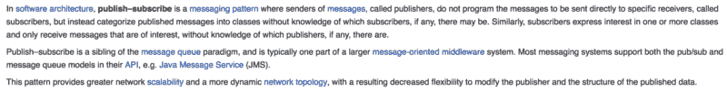

Source: [Publish Subscribe Pattern (Wikipedia)](https://en.wikipedia.org/wiki/Publish%E2%80%93subscribe_pattern)

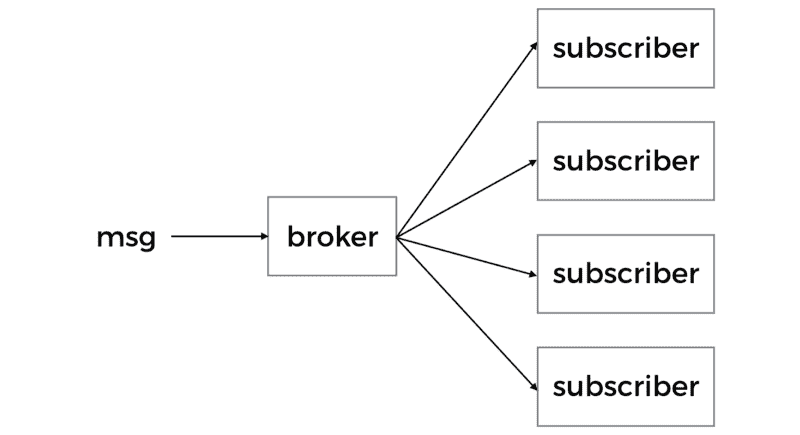

在 AWS 生态系统中，代理角色的明显区别是简单通知服务(SNS)。

在将消息发送到死信队列(DLQ)之前，SNS 将为您的 Lambda 函数进行三次尝试，以处理该消息(如果为该函数指定了 DLQ)。然而，根据通用电气公司人员的分析，重试的次数可能多达六次。

另一个需要注意的是这个设置提供的平行度。对于每条消息，SNS 都会为您的功能创建一个新的邀请。因此，如果你发布 100 条消息到 SNS，那么你可以有 100 个当前执行的订阅 Lamb 函数。

如果你选择错过吞吐量，这很好。

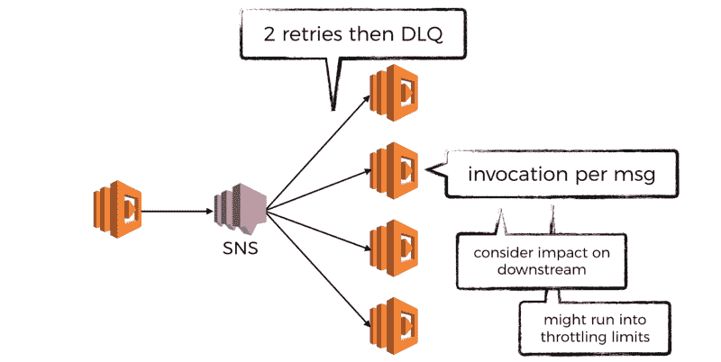

然而，我们经常受到下游依赖项所能处理的最大吞吐量的限制——数据库、S3、内部/外部服务等等。

如果突发吞吐量很短，那么很有可能重试是足够的(在重试之间也有一个随机的、暂时的后退)，并且您不会错过任何消息。

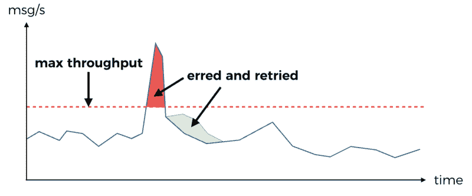

Erred messages are retried 2 times with exponential back off. If the burst is short-lived then the retry is likely to succeed, resulting in no message loss.

如果突发吞吐量长时间保持不变，那么您可以用尽最大重试次数。此时，您必须依靠 DLQ 和可能的人工干预来恢复第一次无法处理的消息。

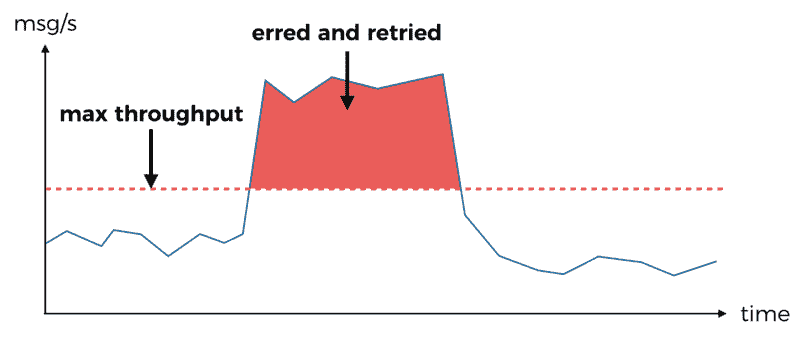

Erred messages are retried 2 times with exponential back off. But the burst in message rate overlaps with the retries, further exacerbating the problem and eventually the max number of retries are exhausted and erred messages have to be delivered to the DLQ instead (if one is specified).

类似地，如果下游依赖于超时，那么在超时期间接收和重试的所有消息都必然会失败。

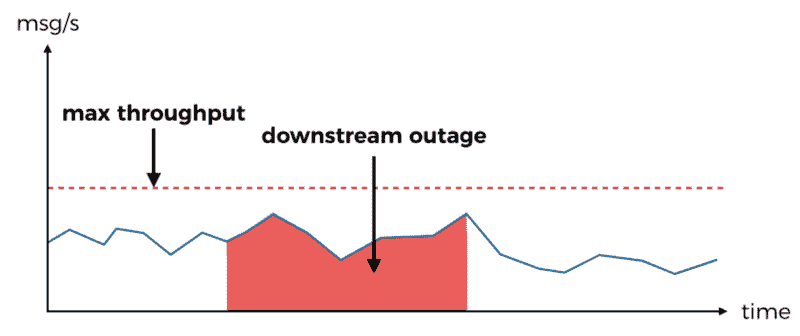

Any message received or retried during the downstream message will fail and be sent to the DLQ.

你也可以在一个地区的当前执行数量上碰到一个 [Lamb da lim it](http://docs.aws.amazon.com/lambda/latest/dg/limits.html) 。由于这是一个帐户范围的限制，它还会影响帐户内依赖 AWS Lamb da 的其他系统:API、事件处理、cron 作业等等。

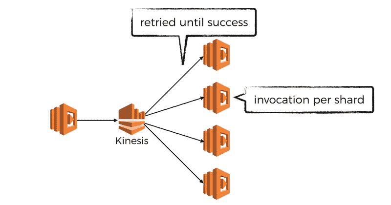

SNS 也容易受到诸如流量突发、下游老化等问题的影响。另一方面，Kine sis 对这些问题的处理要好得多，如下所述:

*   并行度受碎片数量的限制，碎片数量可用于在消息速率中控制突发

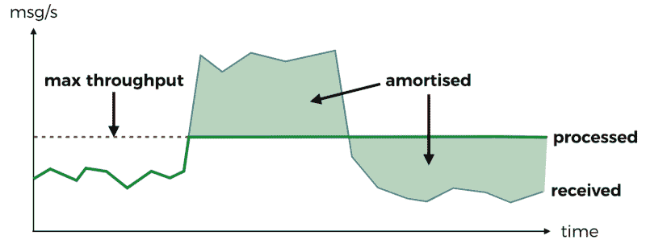

Bursts in message rate is amortised, as the max throughput is determined by no. of shards * max batch size * 5 reads per second. Which gives you two levers to adjust the max throughput with.

*   记录将被重试，直到成功，除非超时时间超过您在流上的保留策略(默认为 24 小时)。你甚至可以处理这些记录

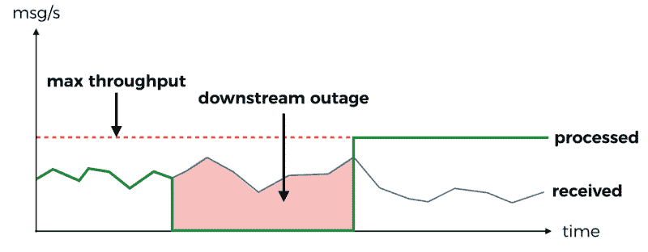

The impact of a downstream outage is absorbed by the retry-until-success invocation policy.

但是 Kine sis Streams 也有自己的问题。事实上，根据我使用 Kine sis Streams 和 Lamb da 的经验，我发现了一些需要理解的注意事项，以便有效地使用这项服务。

你可以在我写的另一篇文章中读到这些警告。

有趣的是，Kine sis Streams 并不是 AWS 上唯一可用的流媒体选项。还有 DynamoDB 流。

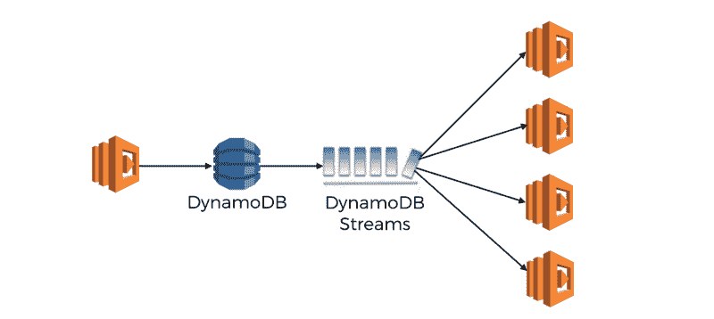

DynamoDB Streams can be used as a like-for-like replacement for Kinesis Streams.

总的来说，DynamoDB Streams + Lamb da 的工作方式与 Kine sis Streams + Lamb da 相同。在操作上，它确实有一些有趣的变化:

*   DynamoDB 流自动缩放碎片的数量
*   如果您使用 AWS Lamb da 处理 DynamoDB 流，那么您不需要为 DynamoDB 流的读取付费(但是您仍然需要为 DynamoDB 表本身的读写容量付费)

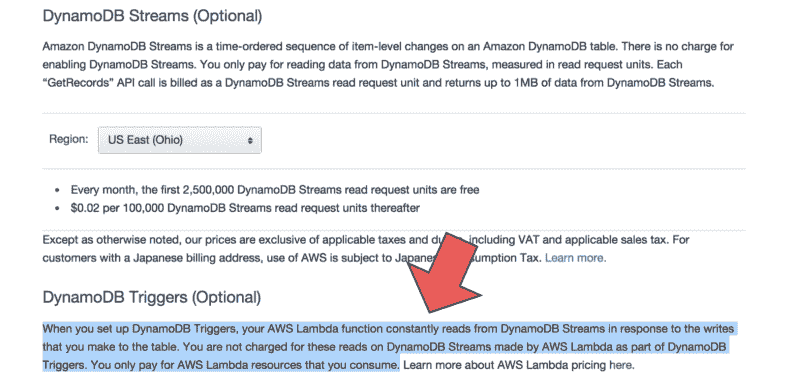

Source: [DynamoDB Pricing](https://aws.amazon.com/dynamodb/pricing/)

*   Kine sis Streams 提供将数据保留期延长至 7 天的选项，但 DynamoDB Streams 不提供此选项

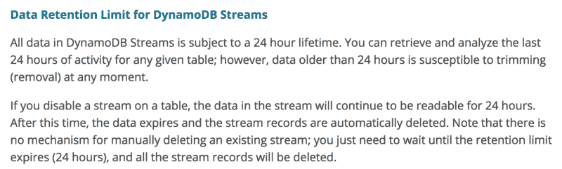

Source: [Working with DynamoDB Streams](https://docs.aws.amazon.com/amazondynamodb/latest/developerguide/Streams.html)

DynamoDB Streams 自动缩放碎片数量的事实可能是一把双刃剑。一方面，它消除了您管理和扩展流的需要(或者提出自制的[自动扩展解决方案](https://read.acloud.guru/auto-scaling-kinesis-streams-with-aws-lambda-299f9a0512da))。但另一方面，它也能降低你传递给下游系统的负荷峰值的能力。

据我所知，没有办法限制一个 DynamoDB 流可以扩展到的片段数，这是你在实现自己的自动扩展解决方案时肯定会遇到的事情。

我认为最有意思的问题是

在 DynamoDB 中写入一行是否会影响系统的状态？在大多数围绕数据库建立的多层系统中，情况确实如此，不太考虑它是 RDBMS 还是 NoSQL 数据库。

在事件源系统中，状态被建模为一系列事件(相对于快照)，事实的来源很可能是 Kine sis 流。例如，一旦一个事件被写到流中，它就被连接到系统的状态。

然后，围绕成本、自动扩展等还有其他冲突。

从开发的角度来看，DynamoDB 流也有一些限制和缺点:

*   每个流仅限于一个表中的事件
*   记录描述的是 DynamoDB 事件，而不是来自您的领域的事件，我在处理这些事件时总是感到不舒服

除了用于处理消息的 Lamb 数据处理成本之外，以下是使用 SNS、Kine sis 流和 DynamoDB 流作为代理的一些成本预测。我假设吞吐量是不变的，每条消息的大小是 1KB。

**以 1 消息/秒的月成本**

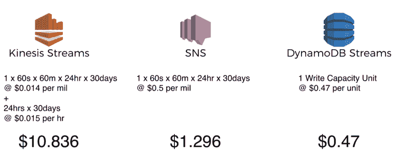

**每月 1000 条消息/秒的费用**

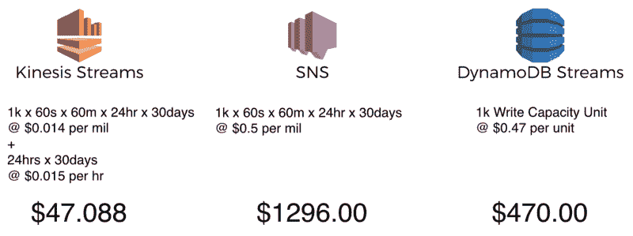

这些建议不应被视为表面价值。首先，关于完全一致的吞吐量和消息大小的假设是不可靠的，即使你没有达到限制，你也需要一些带有 Kine sis 和 DynamoDB 流的顶部空间。

也就是说，这些项目告诉我的是:

1.  你可以从 Kine sis 流中的每个碎片中获得很多
2.  虽然使用 Kine sis 流有一个基本成本，但与 SNS 和 DynamoDB 流相比，当使用量增加时，成本会下降，这要归功于每百万次请求的成本不能再低了

虽然 SNS、Kine sis 和 DynamoDB 流是您的基本选择，但 Lamb 函数也可以以其自身的权利充当 bro ker，并为其他服务提供门户事件。

这是 awslabs 的 [aws-lamb da-fanout](https://github.com/awslabs/aws-lambda-fanout) 项目使用的方法。它允许您将来自 Kine sis 和 DynamoDB 流的 gate 事件支持到无法直接提交给三个基本选择的代理的其他服务(因为帐户/区域限制或它们不被支持)。

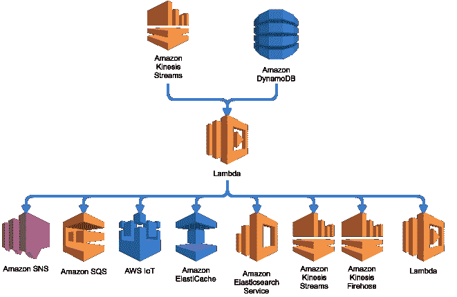

The aws-lambda-fanout project from awslabs propagates events from Kinesis and DynamoDB Streams to other services across multiple accounts and regions.

虽然这是一个很好的想法，并且明确地满足了一些特定的需求，但是值得记住它所带来的额外的复杂性，例如处理部分故障、处理下游的老化、错误配置等等。

### 结论

那么用 AWS Lamb da 做 pub-sub 最好的事件源是什么呢？像大多数技术决策一样，这取决于你试图解决的问题和你面临的 T2 限制。

在这篇文章中，我们看了 SNS，Kine sis 流和 DynamoDB 流，作为经纪人角色的参考。我们浏览了许多案例，以了解事件源的选择如何影响可伸缩性、并行性以及针对临时问题和成本的弹性。

使用 Lamb da 时，您现在应该对各种事件源之间的权衡有了更好的理解。

下次见！