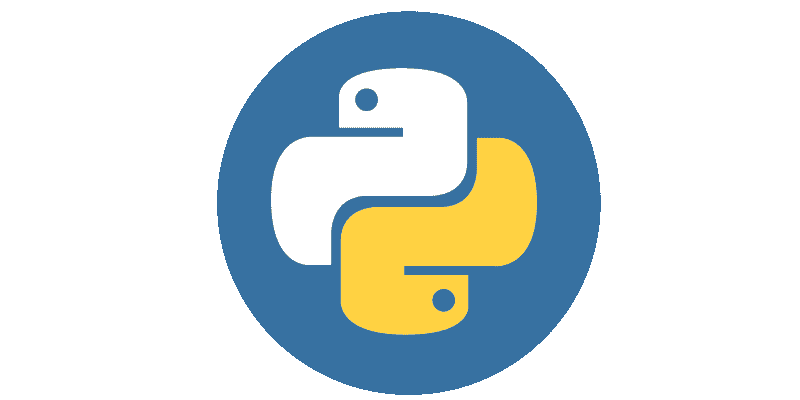
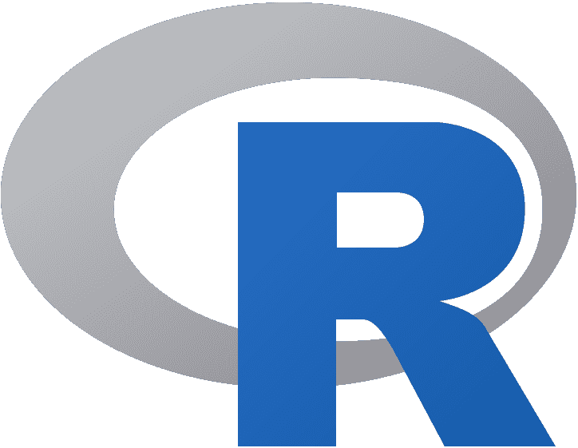
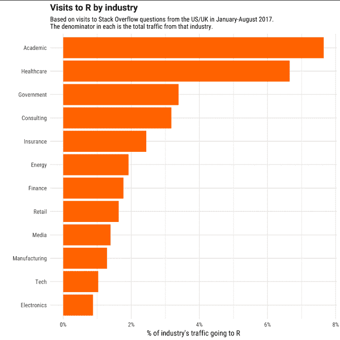
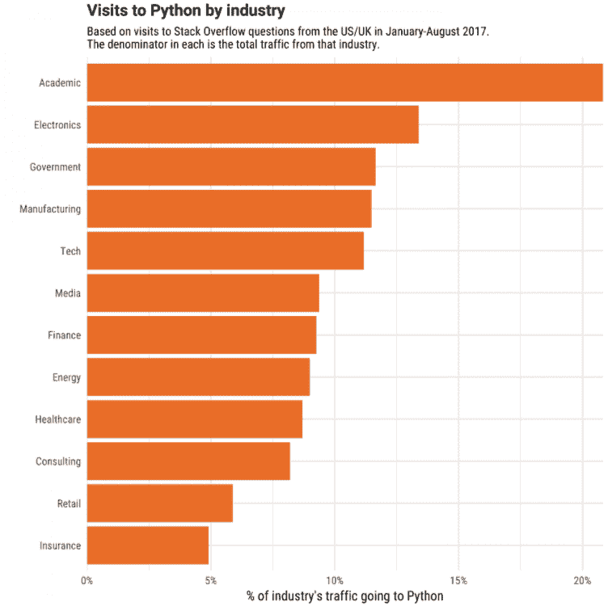

# 如何为您的数据科学项目选择最佳编程语言

> 原文：<https://www.freecodecamp.org/news/how-to-choose-the-best-programming-language-for-your-data-science-project/>

编程语言之争一直是科技界的热门话题。考虑到技术进步的速度，我们每隔几个月就会有新的编程语言或框架。

这使得开发人员、分析人员和研究人员更难选择最好的语言，以最低的成本高效地完成任务。

但是我认为我们倾向于错误地看待选择语言的原因。导致选择某种语言的因素有很多。随着数据科学项目充斥市场，问题不是“哪种语言是最好的”，而是“哪种语言适合您的项目需求和环境(工作环境)？”

因此，在这篇文章中，我将为您提供一组正确的问题，您应该问这些问题来决定哪种编程语言最适合您的数据科学项目。

## 数据科学最常用的编程语言

**Python 和 R** 是统计分析或以机器学习为中心的项目中使用最广泛的语言。但是还有其他的——比如 Java、Scala 或者 Matlab。

Python 和 R 都是一流的开源编程语言，拥有强大的社区支持。我们不断学习新的库和工具，使我们能够实现更高水平的性能和复杂性。

### 计算机编程语言

Python 以其易学易读的语法而闻名。有了 Python 这样的通用语言，你就可以构建完整的科学生态系统，而不用太担心兼容性或接口问题。

Python 代码的维护成本较低，而且可以说更加健壮。从数据争论到特征选择、网页抓取和部署我们的机器学习模型，Python 可以在所有主要 ML 和深度学习 API(如 Theano、TensorFlow 和 PyTorch)的集成支持下完成几乎所有事情。

### 稀有

r 是由学者和统计学家在二十多年前开发的。r 今天使许多统计学家、分析师和开发人员能够有效地执行他们的分析。我们在 CRAN(一个开源库)中有超过 12000 个可用的包。

因为它是在考虑统计学家的情况下开发的，所以 R 通常是所有核心科学和统计分析的首选。R 中有一个包，可以用于几乎所有类型的分析。

此外，像 [RStudio](https://rstudio.com/) 这样的工具使数据分析变得非常容易，让您可以用简洁优雅的报告交流您的结果。

## 4 个问题帮助您选择最适合您项目的语言

那么，如何为手头的工作做出正确的选择呢？

试着回答以下 4 个问题:

### 1.在您的组织/行业中，哪种语言/框架是首选的？

看你所从事的行业，以及你的同行和竞争对手最常用的语言。如果你们说同一种语言可能会更容易些。

这是数据科学家[大卫·罗宾逊](https://stackoverflow.blog/author/david-robinson/)进行的分析。这反映了 R 在每个行业中的受欢迎程度，你可以看到 R 在学术界和医疗保健中被大量使用。

因此，如果你想从事研究、学术或生物信息学，你可以考虑 R 而不是 Python。

Source: [https://stackoverflow.blog/2017/10/10/impressive-growth-r/](https://stackoverflow.blog/2017/10/10/impressive-growth-r/)

硬币的另一面涉及软件行业、应用驱动的组织和基于产品的公司。您可能必须使用您组织的基础架构的技术堆栈，或者您的同事/团队正在使用的语言。

这些组织/行业中的大多数都有基于 Python 的基础设施，包括学术界:

Source: [https://stackoverflow.blog/2017/09/14/python-growing-quickly/](https://stackoverflow.blog/2017/09/14/python-growing-quickly/)

**作为一名有抱负的数据科学家，**因此，你应该专注于学习应用最多、能增加你就业机会的语言和技术。

### 2.你的项目范围是什么？

这是一个重要的问题，因为在你学会一门语言之前，你必须对你的项目有一个议程。

例如，如果您想通过数据集简单地解决一个统计问题，执行一些多变量分析，并准备一份报告或一个仪表板来解释这些见解，该怎么办？在这种情况下，R 可能是更好的选择。它有一些非常强大的可视化和通信库。

另一方面，如果您的目标是首先进行探索性分析，开发深度学习模型，然后在 web 应用程序中部署该模型，该怎么办？然后 Python 的 web 框架和所有主要云提供商的支持使它成为明显的赢家。

### 3.你在数据科学领域有多少经验？

对于一个对[统计和数学概念不太熟悉的数据科学初学者来说，](https://towardsdatascience.com/practical-reasons-to-learn-mathematics-for-data-science-1f6caec161ea?source=---------6------------------) **Python** 可能是一个更好的选择，因为它让你可以轻松地编写算法的片段。

有了像 [NumPy](https://towardsdatascience.com/numpy-essentials-for-data-science-25dc39fae39?source=---------7------------------) 这样的库，你可以自己操作矩阵和编码算法。作为新手，从零开始学习构建东西总是比使用机器学习库要好。

但是如果你已经知道机器学习算法的基础，你可以选择任何一种语言开始学习。

### 4.你手头有多少时间，学习的成本是多少？

你可以投入的时间量为你的选择提供了另一个理由。根据您的编程经验和项目的交付时间，您可能会选择一种语言而不是另一种语言来开始这个领域的工作。

如果有一个高优先级的项目，而你不知道这两种语言中的任何一种，R 可能是你开始的一个更容易的选择，因为你需要有限的/没有编程经验。您可以使用现有的库，用几行代码编写统计模型。

如果您有一些带宽来探索库并了解探索数据集的方法，Python(通常是程序员的选择)是一个很好的选择。(对于 R，这可以在 Rstudio 中快速完成。)

另一个重要因素是与 R 相比，Python 导师更多。如果你的 python/R 项目需要帮助，你可以在这里寻找[编码导师，使用此链接还可以获得 10 美元的注册积分，用于第一次导师会议。](https://www.codementor.io/?partner=harshittyagi)

## 结论

一言以蔽之，R 和 Python 的能力差距越来越小。大多数工作都可以用两种语言来完成。两者都有丰富的生态系统来支持你。

为您的项目选择语言将取决于:

*   你以前在数据科学[(统计和数学)](https://towardsdatascience.com/practical-reasons-to-learn-mathematics-for-data-science-1f6caec161ea?source=---------6------------------)和编程方面的经验。
*   手头项目的领域和所需的统计或科学处理的程度。
*   您项目的未来范围。
*   在你的团队、组织和行业中得到最广泛支持的语言/框架。

你可以在这里查看这个博客的视频版本，

[https://www.youtube.com/embed/beX64BUmKpQ?feature=oembed](https://www.youtube.com/embed/beX64BUmKpQ?feature=oembed)

### Harshit 的数据科学

[https://www.youtube.com/embed/-pVOoKrBtL8?feature=oembed](https://www.youtube.com/embed/-pVOoKrBtL8?feature=oembed)

通过这个渠道，我计划推出几个涵盖整个数据科学领域的[系列。以下是你应该订阅](https://towardsdatascience.com/hitchhikers-guide-to-learning-data-science-2cc3d963b1a2?source=---------8------------------)[频道](https://www.youtube.com/channel/UCH-xwLTKQaABNs2QmGxK2bQ)的原因:

*   该系列将涵盖每个主题和子主题的所有必需/要求的高质量教程，如 [Python 数据科学基础](https://towardsdatascience.com/python-fundamentals-for-data-science-6c7f9901e1c8?source=---------5------------------)。
*   解释了为什么我们在 ML 和深度学习中做这些事情的数学和推导。
*   与谷歌、微软、亚马逊等公司的数据科学家和工程师以及大数据驱动型公司的首席执行官的播客。
*   [项目和说明](https://towardsdatascience.com/building-covid-19-analysis-dashboard-using-python-and-voila-ee091f65dcbb?source=---------2------------------)实施到目前为止所学的主题。

如果这个教程有帮助，你应该看看我在 [Wiplane Academy](https://www.wiplane.com/) 上的数据科学和机器学习课程。它们全面而紧凑，帮助您建立一个坚实的工作基础来展示。