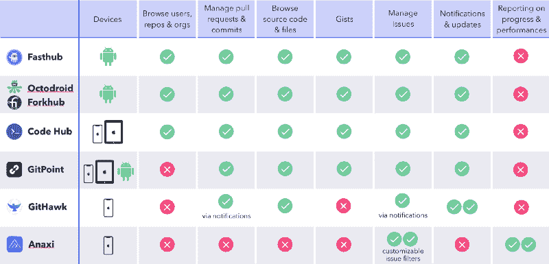
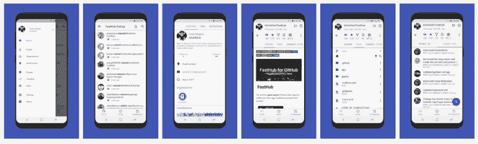
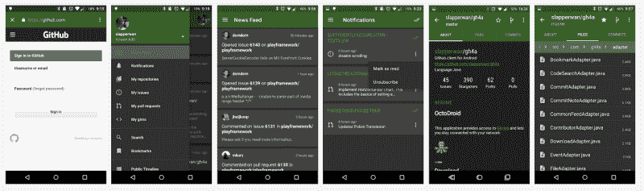
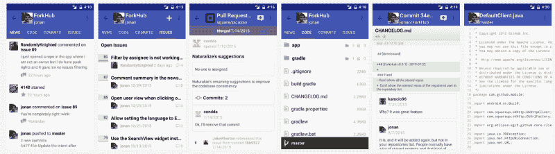
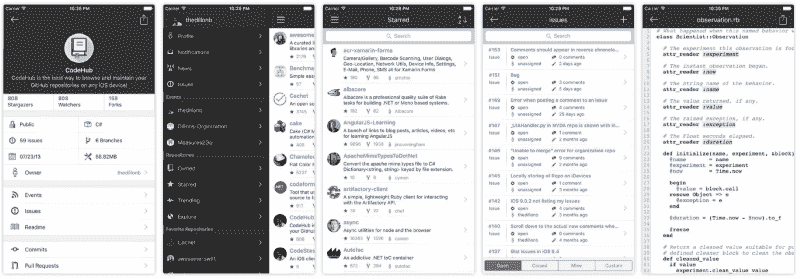
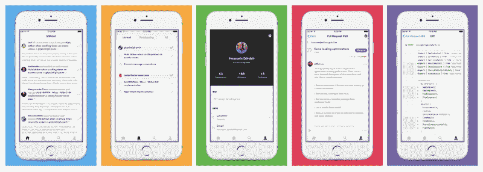
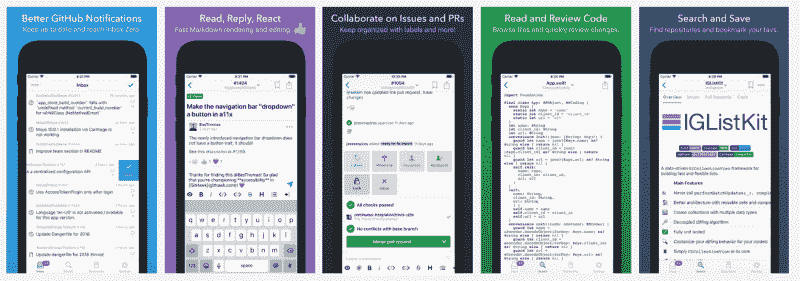

# 如何为你的 GitHub 项目选择合适的移动应用

> 原文：<https://www.freecodecamp.org/news/how-to-choose-the-right-mobile-app-for-your-github-projects-1f6f283b9d95/>

约翰·拉弗勒尔

# 如何为你的 GitHub 项目选择合适的移动应用

在 GitHub 上，你现在有[150 万个组织，2500 万个活跃的存储库](https://octoverse.github.com/)。平均每个组织有 17 个活跃的回购！开发者同时参与越来越多的 GitHub 项目。尽管如此，GitHub 没有任何官方的移动客户端。让我们来看看为什么，有哪些移动应用程序可供选择，以便了解是否有一个你绝对应该得到的。

在过去的几年里，我为两个开发者平台的开发做出了贡献——coding ame 和 T2 tech . io。他们总共有 100 多万开发人员。我最近联合创立了一个名为 [Anaxi](http://anaxi.com) 的工程智能平台。可以将它视为整个工程组织的可操作商业智能。所以我工作的一部分就是识别软件开发工具的发展趋势。换句话说，这种事情我想的还挺多的！

所以我们先来理解一下为什么 GitHub 没有把任何资源集中在任何移动客户端上。

### 为什么 GitHub 不开发移动应用？

GitHub 甚至考虑构建一些移动客户端的基本理由可能是，在他们看来，价值超过了成本。有很多方法可以解决这个问题。

想到的第一个想法:你在 GitHub 上做得最多的是什么？代码评审，代码合并，任何关于编码的事情。但是你在手机上编码过吗？我没有。即使你想对代码做一些小的改动，你如何测试你修改的代码呢？

当然，你可能也想评论 GitHub 的问题，这是真的。我认为这种行为更有可能发生在移动设备上。正如事实证明并非每封电子邮件都是严肃的散文一样，GitHub 中发生的事情也并非都是有意义的编程。有时候你只是想对一个问题做些小调整。

但实际上，在这件事上，那不是重要的。重要的问题是，GitHub 通过控制用户交互获得了什么吗？无论你是否从手机上评论问题，你几乎总是会去他们的 web 应用程序进行代码审查和合并。

GitHub 的重点一直是成为软件开发过程中不可避免的一部分。为了做到这一点，它需要构建一个强大的 API，以便第三方开发人员可以围绕他们的版本服务为一切构建出色的用户体验。移动客户端只是这些用户体验的一部分。

这种情况会随着微软的收购而改变吗？也许吧。即使在被收购之前，GitHub 最近也在开发新的项目管理工具。微软在项目管理工具方面非常强大。它实际上是这方面的世界领导者。尤其是如果你像我一样，认为微软 Excel 是所有东西的替代品！因此，你可能会认为他们会投入更多的资源，把战争带到 Atlassian，试图拥有工程项目管理。

我们现在还剩下什么？我们在移动领域有哪些最佳选择？有哪些用例？

### 你的 GitHub 项目有哪些潜在的移动应用？

如果你像我一样，你更喜欢在一个好的旧电子表格中比较东西。对于这个基准测试，我只关注了我认为最值得关注的应用。其实还有几十个。所以如果你觉得这个列表遗漏了其他一些值得举起雷神之锤的应用，请留下评论！

他们中的许多人都提供相同的功能。注意，都是免费的。因此，让我们更深入地了解一下这些应用程序吧！

#### Fasthub(安卓)

在我看来，如果你想在手机上拥有 GitHub 的所有功能，Fasthub 是最好的 Android 移动客户端。它有一个可定制的主题和一个非常干净的用户界面。Fasthub 的用户体验侧重于提要(理解来自所有项目的通知)、问题和拉取请求。这与您当前使用 GitHub 的主要案例不谋而合。与大多数其他 Android 客户端相比，Fasthub 仍在积极开发中。

Fasthub (no. 1 in the US for Android)

#### OctoDroid 和 Forkhub (Android)

它们代表下载量最大的 GitHub Android 客户端，由个人制作，不再开发——有很多这样的应用。

与 Fasthub 相比，他们似乎只是想复制 Github 的特性，而没有考虑我们的用例。它没有任何可定制的主题。但是，它们的功能是完整的。

Octodroid (no. 1 in France for Android)

Forkhub (no. 1 in Canada for Android)

#### CodeHub (iPhone / iPad)

CodeHub 是 iOS GitHub 客户端，它在一个接一个的界面和功能性 UI 中提供了所有 GitHub 功能。app 结构不适应我们之前提到的移动用例——快速更新。但是它什么都有。这是目前 iOS 上最受欢迎的应用。

CodeHub

#### GitPoint (iOS 和 Android)

GitPoint 由 React Native 构建，是一个可以在 Android 和 iPhone 上运行的替代产品。它很容易使用，但不如 CodeHub 完整。不过注意，这个 app 上没有更多的开发了:(。

GitPoint

#### GitHawk(仅限 iOS)

GitHawk 的重点是帮助你“零收件箱”所以它的主要接口是通知，然后你可以深入其中，检查一个拉请求，并合并它。

这款应用的主要问题是它们不过滤通知，你可能对所有通知都不感兴趣。尽管如此，他们让你很容易地管理他们。我认为这实际上是一个很棒的应用程序，因为他们专注于你的移动用例，并调整应用程序来做到这一点。

GitHawk

#### Anaxi(仅限 iOS 很快也会在 Android 上推出)

Anaxi 的重点是帮助你在你的项目上后退一步。我们在下一个版本中还有多少拦截器错误？网络问题呢？所有的问题都在你自己的团队中很好地分配了吗？

Anaxi 可让您建立过滤后的问题列表(称为报告)，以便您可以跟踪项目的进展情况。用户可以设置阈值，因此报告在报警情况下显示为红色。这些颜色指示器一目了然地向您展示需要您注意的内容。 [**Anaxi**](https://itunes.apple.com/us/app/anaxi/id1317529886?mt=8) **显然不是 GitHub 客户端**；**带来了 GitHub 没有的**功能。这就是为什么它非常有趣！

Anaxi

### 你应该买哪个应用程序？

我认为一个移动应用可以而且应该帮助你以更好的方式管理和处理你的 GitHub 项目。它应该是 web 应用程序的补充。

我宁愿开始使用一个了解我的需求的应用程序，它将为我提供一些使用工具时无法获得的价值，而不是仅仅复制工具的功能，甚至不考虑我的用例。

在这种情况下，两个应用程序脱颖而出。

#### 对 Anaxi 项目的见解

Anaxi 通过其报告带来了新的知识和见解，而这些是用户仅在 GitHub 上无法获得的。这有助于你准确地了解自己所处的位置，并可能质疑你的优先事项。它帮助你有更好的后见之明，因此作为一名开发人员或经理，**成为一名更有影响力的贡献者**。

#### 用 GitHawk 处理通知

尽管 GitHawk 代表了 GitHub 功能的一个子集，但它确实简化了适用于移动设备的特定用例的体验。

最后，GitHawk 和 Anaxi 明白，你手机上最有可能的用例是了解你感兴趣的问题或总体项目的最新情况。它围绕着代码，但不管理代码本身。

但是，请注意，这两个应用程序在任何方面都不具有可比性。Anaxi 是一个平台，而 GitHawk 是一个有用的 GitHub 工具。Anaxi 将很快与吉拉等其他工具集成，并拥有其他客户端——Android 和 web——并将带来其他报告功能。这就是为什么它不把自己描述成一个 GitHub 客户端，而是一个平台。它有一个完整的团队在积极开发它，而 GitHawk 是个人的伟大作品。

如果你最终测试了 Anaxi，请留下评论，告诉我们你对它的看法。我们才刚刚开始漫长的旅程！

PS:我在下面添加了我评论过的应用程序列表，我仍然认为这些应用程序不值得推荐。当然，有了原因。工作副本:笨重的界面，很难保持最新或访问任何你想访问的内容，而且不是完全免费的。

### 在你走之前…

学到了什么？请按住。说“谢谢”并帮助别人找到它！如果你对关于工程和产品领导、生产力以及如何扩展团队的文章感兴趣，订阅我们的时事通讯！

或者加入我们的[工程领导社区](https://community.anaxi.com/#interested-in-weekly-bytes)。

[**工程领导社区| Anaxi**](https://community.anaxi.com/#interested-in-weekly-bytes)
[*由社区策划的关于工程领导、生产力、如何扩展团队的高质量趋势文章……*community.anaxi.com](https://community.anaxi.com/#interested-in-weekly-bytes)

您也可以在 [Twitter](http://twitter.com/JeanLafleur) 上关注我，保持联系。谢谢大家！

*最初发布于 2018 年 9 月 11 日[anaxi.com](https://anaxi.com/blog/2018/09/11/the-one-app-you-need-to-get-on-top-of-your-github-projects/)。*