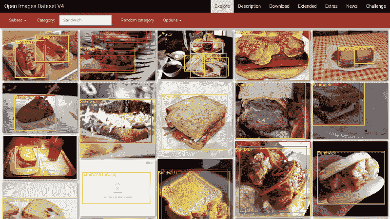
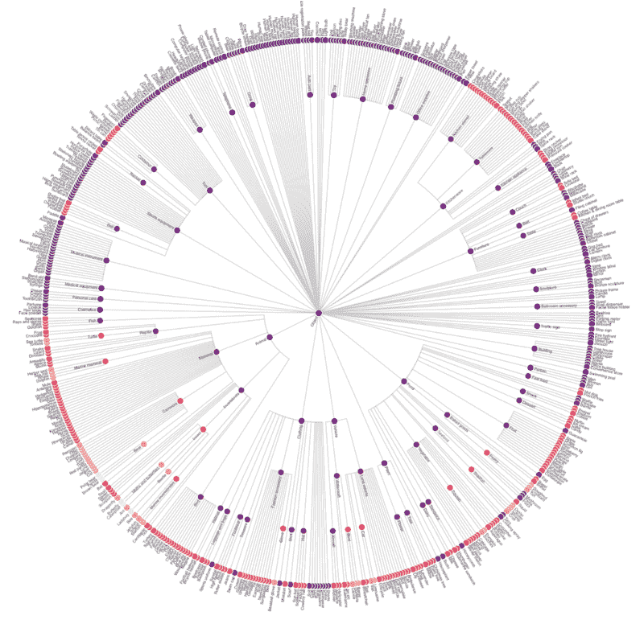
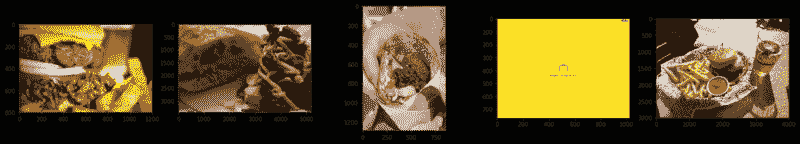
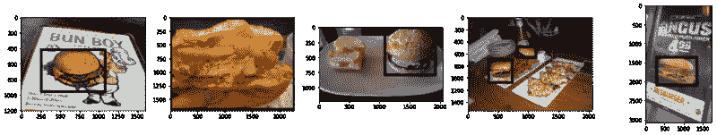

# 如何使用 900 万张开放图像对 600 类照片进行分类

> 原文：<https://www.freecodecamp.org/news/how-to-classify-photos-in-600-classes-using-nine-million-open-images-65847da1a319/>

阿列克谢·比洛古尔

# 如何使用 900 万张开放图像对 600 类照片进行分类



Sandwiches, visualized using the [Google Open Images Explorer](https://storage.googleapis.com/openimages/web/visualizer/index.html?set=train&c=%2Fm%2F0l515)

如果你正在寻找建立一个图像分类器，但需要训练数据，只需看看 [Google Open Images](https://storage.googleapis.com/openimages/web/index.html) 。

这个庞大的图像数据集包含超过 3000 万张图像和 1500 万个边界框。那是 18tb 的图像数据！

此外，在此比例下，Open Images 比某些其他影像数据集更加开放和易于访问。例如，ImageNet 具有限制性许可。

然而，对于单机上的开发人员来说，筛选这么多数据并不容易。你需要下载和处理多个元数据文件，并滚动自己的存储空间(或者申请访问一个谷歌云桶)。

另一方面，在野外没有很多定制的图像训练集，因为坦率地说，创建和共享它们是一种痛苦。

在本文中，我们将使用开放图像构建并分发一个简单的端到端机器学习管道。

我们将看到如何围绕开放图像边界框数据中包含的 600 个标签中的任何一个创建您自己的数据集。

我们将通过制作“开放式三明治”来展示我们的杰作。这些是简单的、可重复的图像分类器，用来回答一个古老的问题:[汉堡包是三明治吗](https://english.stackexchange.com/questions/246580/is-a-hamburger-considered-a-sandwich)？

想看看代码吗？您可以跟随 GitHub 上的库[。](https://github.com/quiltdata/open-images)

### 下载数据

我们需要先下载相关数据，然后才能进行任何操作。

这是使用 Google Open Images(或任何外部数据集)时的核心挑战。没有简单的方法来下载数据的子集。我们需要写一个脚本来为我们做这些。

我已经编写了一个 Python 脚本，在 [Open Images 数据集](https://github.com/openimages/dataset)中搜索您指定的关键字的元数据。它会找到相应图片的原始网址(在 [Flickr](https://www.flickr.com/) 上)，然后下载到磁盘上。

这证明了 Python 的强大，只需 50 行代码就可以完成所有这些工作:

此脚本使您能够下载原始图像的子集，其中包含我们选择的任何类别子集的边界框信息:

```
$ git clone https://github.com/quiltdata/open-images.git$ cd open-images/$ conda env create -f environment.yml$ source activate quilt-open-images-dev$ cd src/openimager/$ python openimager.py "Sandwiches" "Hamburgers"
```

类别是以分层的方式组织的。

比如`sandwich`和`hamburger`都是`food`的子标签(但是`hamburger`不是`sandwich`的子标签——嗯)。

我们可以使用 Vega 将本体可视化为辐射状的树:



你可以在这里查看这个图表的交互式注释版本(并下载它背后的代码)。

并非打开图像中的所有类别都有与之关联的边界框数据。

但是这个脚本将允许您下载 600 个标签中的任何子集。以下是一些可能的尝试:

`football`，`toy`，`bird`，`cat`，`vase`，`hair dryer`，`kangaroo`，`knife`，`briefcase`，`pencil case`，`tennis ball`，`nail`，`high heels`，`sushi`，`skyscraper`，`tree`，`truck`，`violin`，`wine`，`wheel`，`whale`，`pizza cutter`，`bread`，`helicopter`，`lemon`，`dog`，`elephant`，`elephant`，】

出于本文的目的，我们将只限于两个:`hamburger`和`sandwich`。

### 清理它，修剪它

一旦我们运行了脚本并本地化了图像，我们就可以用`matplotlib`来检查它们，看看我们得到了什么:

```
import matplotlib.pyplot as pltfrom matplotlib.image import imread%matplotlib inlineimport os
```

```
fig, axarr = plt.subplots(1, 5, figsize=(24, 4))for i, img in enumerate(os.listdir('../data/images/')[:5]):    axarr[i].imshow(imread('../data/images/' + img))
```



Five example {hamburger, sandwich} images from Google Open Images V4.

这些图像不容易训练。他们面临着使用公共互联网的外部资源构建数据集的所有相关问题。

这个小样本展示了我们的目标类中可能存在的不同大小、方向和遮挡。

有一次，我们甚至没有成功下载到实际的图像。相反，我们得到一个占位符，告诉我们我们想要的图像已经被删除了！

下载这些数据可以让我们得到几千张这样的样本图像。下一步是利用边界框信息将我们的图像剪切成三明治和汉堡包的形状。

这是另一个图像数组，这次包含了边界框，以演示这需要什么:



Bounding boxes. Notice (1) the dataset includes “depictions” and (2) raw images can contain many object instances.

[在](https://github.com/quiltdata/open-images/blob/master/notebooks/build-dataset.ipynb)[演示 GitHub 库](https://github.com/quiltdata/open-images)中的这个带注释的 Jupyter 笔记本就是做这个工作的。

我将省略在这里显示的代码，因为它有点复杂。这尤其是因为我们还需要(1)重构我们的图像元数据以匹配剪辑的图像输出，以及(2)提取已经被删除的图像。如果你想看代码，一定要看看这个笔记本。

运行笔记本代码后，我们将在磁盘上有一个包含所有裁剪图像的`images_cropped`文件夹。

### 构建模型

一旦我们下载了数据，并对其进行了裁剪和清理，我们就可以开始训练模型了。

我们将对数据训练一个[卷积神经网络](https://medium.freecodecamp.org/an-intuitive-guide-to-convolutional-neural-networks-260c2de0a050)(或‘CNN’)。

CNN 是一种特殊类型的神经网络，它从图像中常见的像素组中逐步构建更高级别的特征。

然后对图像在这些不同特征上的得分进行加权，以生成最终的分类结果。

这种架构工作得非常好，因为它利用了本地性。这是因为任何一个像素都可能与附近的像素比远处的像素有更多的共同点。

CNN 还有其他吸引人的特性，比如噪声容限和尺度不变性(在一定程度上)。这些进一步提高了它们的分类性能。

如果你不熟悉 CNN，我推荐浏览布兰登·罗勒的优秀的“[卷积神经网络如何工作](https://brohrer.github.io/how_convolutional_neural_networks_work.html)”来了解更多。

我们将训练一个非常简单的卷积神经网络，并看看它如何在我们的问题上获得像样的结果。我使用 [Keras](https://keras.io/) 来定义和训练模型。

我们首先将图像布置在特定的目录结构中:

```
images_cropped/    sandwich/        some_image.jpg        some_other_image.jpg        ...    hamburger/        yet_another_image.jpg        ...
```

然后，我们使用以下代码将 Keras 指向该文件夹:

Keras 将检查输入文件夹，并确定在我们的分类问题中有两个类。它将根据子文件夹的名称分配类名，并创建“图像生成器”来为这些文件夹提供服务。

但是我们不仅仅返回图像本身。相反，我们从图像中随机返回子采样、倾斜和缩放的选择(通过`train_datagen.flow_from_directory`)。

这是一个数据扩充的例子。

数据扩充是向图像分类器提供输入数据集的随机裁剪和扭曲版本的实践。这有助于我们克服数据集小的问题。我们可以在一个图像上多次训练我们的模型。每次我们使用稍微不同的图像片段，以稍微不同的方式进行预处理。

定义了数据输入后，下一步是定义模型本身:

这是一个简单的卷积神经网络模型。它只包含三个卷积层:输出层之前的一个密集连接的后处理层，以及以丢弃层和`relu`激活形式的强正则化。

这些因素共同作用，使得这个模型更难适应 T1。考虑到我们的输入数据集很小，这一点很重要。

最后，最后一步实际上是拟合模型。

该代码选择由我们的图像样本大小和选择的批量大小确定的纪元步长(16)。然后它根据这些数据训练 50 个时期。

训练可能会因`EarlyStopping`回调而提前暂停。如果在之前的四个时期中验证分数没有改善，这将在 50 个时期限制之前返回最佳执行模型。

我们选择如此大的耐心值是因为模型验证损失中存在大量的可变性。

这个简单的训练方案产生了具有大约 75%准确度的模型:

```
 precision    recall  f1-score   support           0       0.90      0.59      0.71      1399           1       0.64      0.92      0.75      1109   micro avg       0.73      0.73      0.73      2508   macro avg       0.77      0.75      0.73      2508weighted avg       0.78      0.73      0.73      2508
```

有趣的是，我们的模型在对汉堡分类(0 类)时信心不足，但在对汉堡分类(1 类)时信心过度。

归类为汉堡的图片，90%其实都是汉堡。但是只有 59%的汉堡包被正确分类。

另一方面，只有 64%被归类为三明治的图像实际上是三明治。但是 92%的三明治都分类正确。

这些结果与 Francois Chollet 通过将一个非常相似的模型应用于经典的[猫对狗](https://www.kaggle.com/c/dogs-vs-cats)数据集的相似大小的子集而获得的 80%的准确性一致。

这种差异可能主要是由于谷歌开放图像 V4 数据集中遮挡和噪声水平的增加。

该数据集还包括插图以及摄影图像。这些有时需要很大的艺术自由度，使得分类更加困难。您可以选择在自己构建模型时删除这些内容。

使用[迁移学习](https://towardsdatascience.com/keras-transfer-learning-for-beginners-6c9b8b7143e)技术可以进一步提高这种性能。要了解更多信息，请查看 Keras 作者 Francois Chollet 的博客文章“[使用非常少的数据建立强大的图像分类模型](https://blog.keras.io/building-powerful-image-classification-models-using-very-little-data.html)”。

### 分发模型

现在，我们已经建立了一个自定义数据集并训练了一个模型，如果我们不共享它，那将是一个遗憾。

机器学习项目应该是可复制的。我在之前的一篇文章中概述了以下策略，“[用四行代码](https://blog.quiltdata.com/reproduce-a-machine-learning-model-build-in-four-lines-of-code-b4f0a5c5f8c8)复制一个机器学习模型”。

*   将依赖项分为数据、代码和环境组件。
*   数据依赖性版本控制(1)模型定义和(2)训练数据。将这些保存到版本化的 blob 存储中，例如[亚马逊 S3](https://aws.amazon.com/s3/) 与[棉被 T4](https://github.com/quiltdata/t4) 。
*   代码依赖版本控制用于训练模型的代码(使用 git)。
*   环境依赖项版本控制用于训练模型的环境。在生产环境中，这可能是一个 Docker 文件，但是您可以在本地使用`pip`或`conda`。
*   为了给某人提供模型的可再训练副本，给他们相应的`{data, code, environment}`元组。

遵循这些原则可以让您训练自己的模型副本所需的一切都包含在几行代码中:

```
git clone https://github.com/quiltdata/open-images.gitconda env create -f open-images/environment.ymlsource activate quilt-open-images-devpython -c "import t4; t4.Package.install('quilt/open_images', dest='open-images/', registry='s3://quilt-example')"
```

要了解更多关于`{data, code, environment}`的信息，请参见[GitHub 库](https://github.com/quiltdata/open-images)和/或[相应的文章](https://blog.quiltdata.com/reproduce-a-machine-learning-model-build-in-four-lines-of-code-b4f0a5c5f8c8)。

### 结论

在本文中，我们展示了一个端到端的图像分类机器学习流水线。我们涵盖了从下载/转换数据集到训练模型的所有内容。然后我们以一种让其他人可以在以后自己重建的方式来分发它。

因为自定义数据集很难生成和分发，随着时间的推移，出现了一个在任何地方都可以使用的示例数据集小集团。这并不是因为他们真的那么好(他们不是)。相反，这是因为它们很容易。

例如，谷歌最近发布的机器学习速成课程大量使用了[加州住房数据集](https://scikit-learn.org/stable/modules/generated/sklearn.datasets.fetch_california_housing.html)。这些数据已经有近 20 年的历史了！

考虑探索新的视野。使用来自互联网的真实图片，并进行有趣的分类。比你想象的容易！