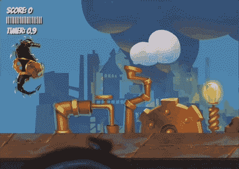

# 如何使用 JavaScript、HTML 和 CSS 编写一个 2D 游戏

> 原文：<https://www.freecodecamp.org/news/how-to-code-a-2d-game-using-javascript-html-and-css/>

JavaScript 是一种非常好的编程语言，可以用来创建 2D 游戏。尤其是你想在几乎任何设备上玩的游戏。

我们刚刚在 freeCodeCamp.org YouTube 频道上发布了一门课程，将教你如何使用 JavaScript、HTML、CSS 和 HTML Canvas 编写一个 2D 游戏。

弗兰克实验室的弗兰克开发了这个课程。弗兰克是一个受欢迎的教练，总是想出超级有创意的教程。

你将完全从零开始构建一个游戏，从精灵动画到视差背景。该游戏仅使用 HTML、CSS 和普通 JavaScript，没有框架或库。

You will make this game.

以下是游戏中涉及的部分。

*   HTML 和 CSS 设置
*   基本 JavaScript 设置
*   用 JavaScript 进行面向对象编程
*   创建玩家和游戏对象
*   动画循环
*   键盘输入
*   制造射弹
*   周期性事件
*   绘画游戏用户界面
*   基地敌人阶级
*   矩形之间的碰撞检测
*   抽签游戏分数
*   赢输条件
*   计算游戏时间
*   动画视差背景
*   使用 JavaScript 的精灵动画
*   创建调试模式
*   动画敌人精灵表
*   夜钓者敌人级
*   幸运鱼敌人级
*   收集 ups 电源
*   将投射物画成图像
*   自定义字体和游戏文本
*   清理
*   粒子效应和物理学
*   粒子旋转
*   调整和修复
*   蜂巢鲸敌级
*   无人机敌人级
*   灰尘效果动画
*   火焰效果动画
*   调整游戏难度
*   下一步做什么？

观看 freeCodeCamp.org YouTube 频道的全部课程(2.5 小时观看)。

[https://www.youtube.com/embed/7BHs1BzA4fs?feature=oembed](https://www.youtube.com/embed/7BHs1BzA4fs?feature=oembed)