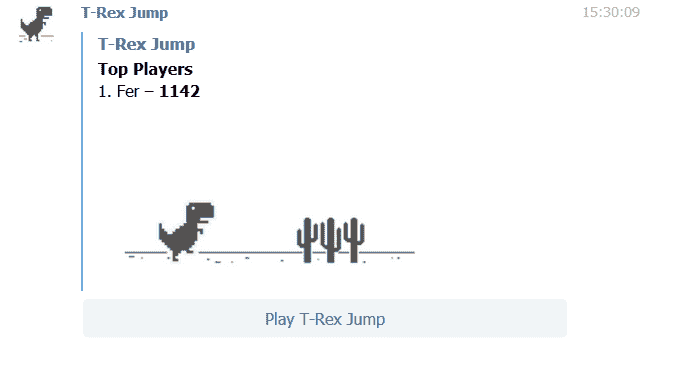
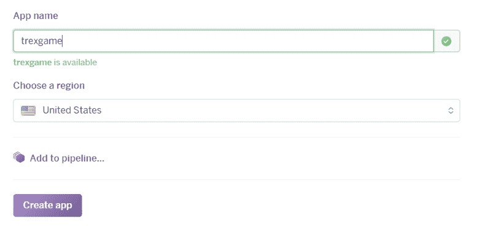

# 如何用 Node.js 把 Chrome 的 T-Rex 编码成电报游戏

> 原文：<https://www.freecodecamp.org/news/how-to-code-chromes-t-rex-as-a-telegram-game-using-node-js-cbcf42f76f4b/>

费尔南多·加西亚·Á·阿尔瓦雷斯

# 如何用 Node.js 把 Chrome 的 T-Rex 编码成电报游戏



上个月，我非常想了解 Telegram 游戏平台是如何工作的。由于我也厌倦了独自玩 Chrome 的 T-Rex 游戏，我决定让它成为一款电报游戏。

在开发它的时候，我注意到没有很多 Telegram 游戏机器人教程。教程将解释整个过程中建立它，从开始到结束。所以我决定写下来。

如果你想看结果，游戏在 Telegram 中以 [trexjumpbot](https://telegram.me/trexjumpbot) 的名字提供，并在[这里](https://trexgame.herokuapp.com)托管。

### 要求

您需要安装 [Node.js](https://nodejs.org)

### 步骤 1:创建我们的机器人

为了创建一个游戏，我们必须首先创建一个内嵌的机器人。我们通过与[机器人父亲](https://telegram.me/botfather)对话并发送命令来做到这一点

`/newbot`

然后，我们被要求输入我们的机器人的名称和用户名，我们得到一个 API 令牌。我们需要保存它，因为我们以后会需要它。

我们也可以通过改变它的描述来完成我们的机器人信息(当用户在“这个机器人能做什么？”部分)与

`/setdescription`

并且还设置了它的图片，以便与聊天列表区分开来。图像必须是方形的，我们可以用下面的命令设置它:

`/setuserpic`

我们还可以设置“关于”文本，它将出现在机器人的个人资料页面上，也可以在与其他用户共享时出现

`/setabouttext`

我们的机器人必须是内嵌的，以便能够在我们的游戏中使用它。为了做到这一点，我们只需执行下面的代码并按照说明进行操作

`/setinline`

### 步骤 2:创建我们的游戏

现在我们已经完全设置好了内嵌机器人，是时候让机器人父亲创建一个游戏了:

`/newgame`

我们只是简单地按照说明，最后我们必须为我们的游戏指定一个简短的名字。这将作为它的唯一标识符，稍后我们将需要它和我们的 bot API 令牌一起使用

### 第三步:获取霸王龙游戏源代码

由于 Chromium 是开源的，一些用户已经从中提取了 T-Rex 游戏，我们可以很容易地在网上找到它的源代码。

为了制作游戏，我使用了 GitHub repo 中的代码，所以继续克隆它:

```
git clone https://github.com/wayou/t-rex-runner.git
```

### 步骤 4:设置相关性

首先，进入克隆的文件夹，将其所有文件移动到一个名为“public”的新文件夹中

```
mkdir public && mv * public/.
```

启动这个项目

```
npm init
```

您可以根据需要填充请求的信息(可以保留默认值)，将入口点保留为 index.js

我们需要 Express 和 node-telegram-bot-api，以便轻松地与 telegram 的 api 进行交互

```
npm install express --savenpm install node-telegram-bot-api --save
```

我们将添加一个启动脚本，因为这是将游戏部署到 Heroku 所必需的。打开 package.json 并在 scripts 部分下添加启动脚本:

```
"scripts": {
```

```
"test": "echo \"Error: no test specified\" && exit 1",
```

```
"start": "node index.js"
```

```
}
```

### 步骤 5:编写我们的服务器

现在我们已经设置了所有的依赖项，是时候为我们的机器人编写服务器代码了。继续创建 index.js 文件:

```
const express = require("express");
```

```
const path = require("path");
```

```
const TelegramBot = require("node-telegram-bot-api");
```

```
const TOKEN = "YOUR_API_TOKEN_GOES_HERE";
```

```
const server = express();
```

```
const bot = new TelegramBot(TOKEN, { polling: true } );
```

```
const port = process.env.PORT || 5000;
```

```
const gameName = "SHORT_NAME_YOUR_GAME";
```

```
const queries = {};
```

上面的代码非常简单。我们只需要我们的依赖项，并设置我们从 BotFather 获得的令牌以及我们定义为游戏标识符的短名称。此外，我们设置端口，初始化 Express 并声明一个查询空对象。这将作为一个映射，将电报用户对象存储在他的 id 下，以便以后检索。

接下来，我们需要将公共目录的内容作为静态文件提供

```
server.use(express.static(path.join(__dirname, 'public')));
```

现在我们将开始定义我们的机器人逻辑。首先，让我们编写/help 命令

```
bot.onText(/help/, (msg) => bot.sendMessage(msg.from.id, "This bot implements a T-Rex jumping game. Say /game if you want to play."));
```

我们必须在 onText 的第一个参数上将命令指定为正则表达式，然后用 sendMessage 指定机器人的回复。注意，我们可以访问用户 id，以便使用 msg.from.id 进行回复

当我们的 bot 收到/start 或/game 命令时，我们将使用 bot.sendGame 将游戏发送给用户

```
bot.onText(/start|game/, (msg) => bot.sendGame(msg.from.id, gameName));
```

现在，用户将看到游戏的标题，他的高分和一个按钮来玩它，但播放按钮仍然不起作用。所以，我们要实现它的逻辑

```
bot.on("callback_query", function (query) {
```

```
 if (query.game_short_name !== gameName) {
```

```
 bot.answerCallbackQuery(query.id, "Sorry, '" + query.game_short_name + "' is not available.");
```

```
 } else {
```

```
 queries[query.id] = query;
```

```
 let gameurl = "https://YOUR_URL_HERE/index.html?  id="+query.id;
```

```
 bot.answerCallbackQuery({
```

```
 callback_query_id: query.id,
```

```
 url: gameurl
```

```
 });
```

```
 }
```

```
});
```

当用户点击播放按钮时，电报会给我们一个回拨。在上面的代码中，当我们收到这个回调时，我们首先检查请求的游戏实际上是我们的游戏，如果不是，我们向用户显示一个错误。

如果一切都正确，我们将查询存储到前面在其 id 下定义的查询对象中，以便以后在必要时检索它来设置高分。然后我们需要通过提供游戏的 URL 来回答回调。稍后我们将把它上传到 Heroku，所以你必须在这里输入网址。注意，我将 id 作为 URL 中的查询参数传递，以便能够设置一个较高的分数。

现在我们有一个功能齐全的游戏，但我们仍然缺少高分和线内行为。让我们从实现内联和提供我们的游戏开始:

```
bot.on("inline_query", function(iq) {
```

```
 bot.answerInlineQuery(iq.id, [ { type: "game", id: "0", game_short_name: gameName } ] );
```

```
});
```

最后，我们将实现高分逻辑:

```
server.get("/highscore/:score", function(req, res, next) {
```

```
 if (!Object.hasOwnProperty.call(queries, req.query.id)) return   next();
```

```
 let query = queries[req.query.id];
```

```
 let options;
```

```
 if (query.message) {
```

```
 options = {
```

```
 chat_id: query.message.chat.id,
```

```
 message_id: query.message.message_id
```

```
 };
```

```
 } else {
```

```
 options = {
```

```
 inline_message_id: query.inline_message_id
```

```
 };
```

```
 }
```

```
 bot.setGameScore(query.from.id, parseInt(req.params.score),  options,
```

```
 function (err, result) {});
```

```
});
```

在上面的代码中，我们监听类似/highscore/300？id=5721。我们只需从 queries 对象中检索用户，给出其 id(如果存在)，并使用 bot.setGameScore 将高分发送到 Telegram。如果用户是否内联调用机器人，选项对象是不同的，所以我们检查两种情况，如[电报机器人 API](https://core.telegram.org/bots/api#setgamescore) 中所定义的

我们在服务器上要做的最后一件事就是监听之前定义的端口:

```
server.listen(port);
```

### 第六步:修改霸王龙游戏

我们必须修改我们从 GitHub repo 克隆的 T-Rex 游戏，以便它将高分发送到我们的服务器。

打开 public 文件夹下的 index.js 文件，在它的顶部添加以下行，以便从 url 中检索玩家 id:

```
var url = new URL(location.href);
```

```
var playerid = url.searchParams.get("id");
```

最后，我们将找到 setHighScore 函数，并在它的末尾添加以下代码，以便将高分提交给我们的服务器:

```
// Submit highscore to Telegram
```

```
var xmlhttp = new XMLHttpRequest();
```

```
var url = "https://YOUR_URL_HERE/highscore/" + distance  +
```

```
"?id=" + playerid;
```

```
xmlhttp.open("GET", url, true);
```

```
xmlhttp.send();
```

### 步骤 7:部署到 Heroku

我们的游戏完成了，但是如果不上传到服务器，我们就不能在 Telegram 上测试，Heroku 为我们提供了一个非常简单的上传方法。

首先创建一个新应用程序:



用实际的 URL 替换我们的 URL 占位符(用您自己的替换):

用 setHighScore 函数替换 URL

```
var url = "https://trexgame.herokuapp.com/highscore/" + distance +
```

```
"?id=" + playerid;
```

以及服务器上的回调:

```
let gameurl = "https://trexgame.herokuapp.com/index.html?id="+query.id;
```

最后，让我们把游戏上传到 Heroku。让我们按照 Heroku 页面上详细介绍的步骤:安装 [Heroku CLI](https://devcenter.heroku.com/articles/heroku-cli) 后，从项目文件夹登录并推送文件:

```
heroku logingit initheroku git:remote -a YOUR_HEROKU_APP_NAMEgit add .git commit -m "initial commit"git push heroku master
```

就是这样！，现在你终于有一个完全工作的电报游戏。去试试吧！

这个例子的完整源代码可以在 [GitHub](https://github.com/fercarcedo/T-Rex-Telegram-game) 上找到

### 参考

*   [http://wimi 5 . com/how-create-un-bot-to-games-on-telegraph-con-nodejs/](http://wimi5.com/como-crear-un-bot-para-juegos-en-telegram-con-nodejs/)
*   [https://core.telegram.org/bots/api#setgamescore](https://core.telegram.org/bots/api#setgamescore)
*   [https://github.com/wayou/t-rex-runner](https://github.com/wayou/t-rex-runner)