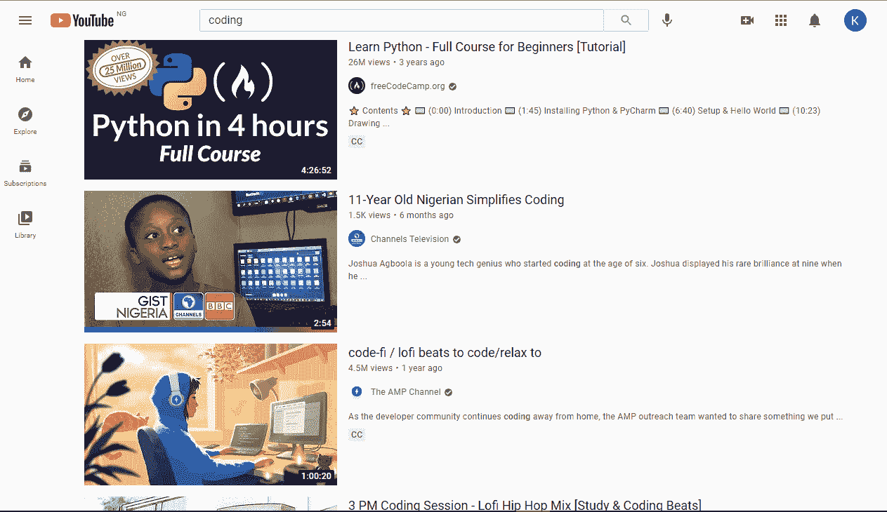
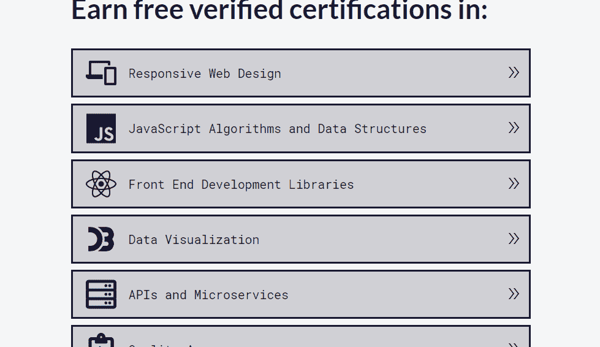
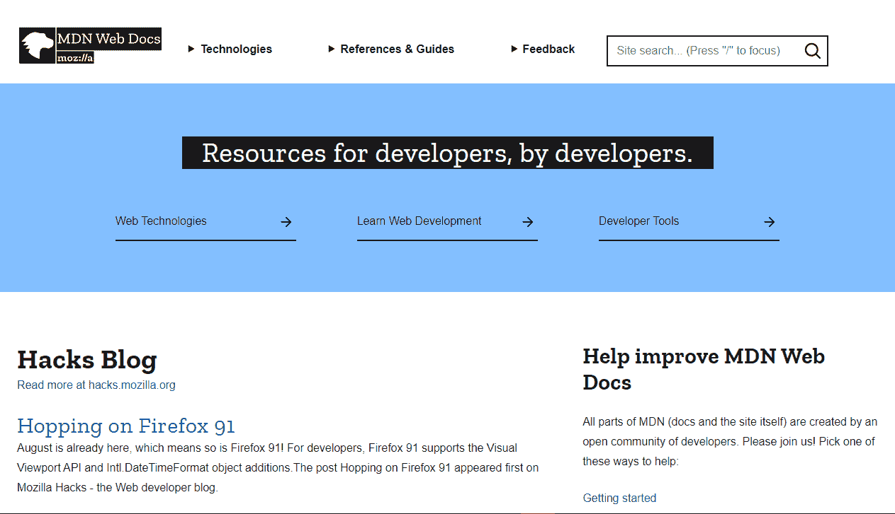
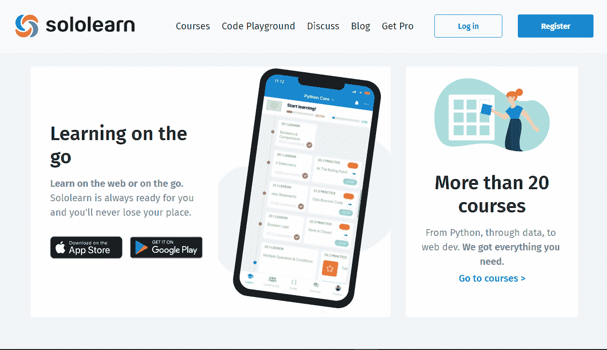

# 如何编码——面向初学者的编码以及如何免费学习编程

> 原文：<https://www.freecodecamp.org/news/how-to-code-coding-for-beginners-and-how-to-learn-programming-for-free/>

如今，有很多学习如何编码的资源。其中许多都可以在网上免费获得，所以选择一个可能会让人不知所措。

但这绝对有一个好处:你不再需要为了学习如何编码而参加付费训练营或大学。可以自学。

在这篇文章中，我将分享一些关于初学者如何免费学习编码的技巧和信息。我还会向您介绍免费的学习平台和资源。

## 什么是编码？

“编码”是计算机编程的常用术语。一些人将它与编程互换使用，而另一些人则认为它们并不完全相同。

根据定义，“代码”是指告诉计算机做什么的一组指令。计算机不懂人类语言，所以久而久之，人类创造了计算机能理解的语言。开发者通过这些语言与他们交流。

编码语言的例子包括 HTML、GitHub Markdown、CSS、JavaScript 和 Python 等等。

当你学会如何编码时，你就能写指令让计算机遵循。这让你可以制作网站、应用程序和软件，以及做一些其他很酷的事情。

## 什么是编程？

如果编码是编写指令让计算机执行的行为，那么编程是什么？

许多开发人员将编程视为比编码更高级的术语，还有许多人将这两个词互换使用。

编程仍然包括编写指令供计算机遵循，但现在数据结构和算法很重要。HTML、CSS、Markdown 等一些编码语言不使用算法和数据结构，而 JavaScript、Python、Java、C++等则大量使用。

这带来了许多开发人员所做的区分。在 web 开发行业，许多开发人员不认为 HTML 是严格意义上的“编程语言”，因为它不执行任何逻辑。它只是决定了一个网站的结构。

另一方面，像 JavaScript、Python、C++和 Java 这样的语言都是“官方”编程语言，因为它们处理复杂的功能和交互性。

有些开发人员把只用 HTML 和 CSS 编码的人称为编码员，把用 JavaScript、Java、C++和其他编程语言编码的人称为程序员。

所以你可以说所有的程序员都是程序员，但不是所有的程序员都是程序员。但不是每个人都有这种感觉，所以在你站在哪一边之前，做自己的研究和学习技巧是很重要的:)

你可以[在这里](https://www.freecodecamp.org/news/programming-coding-developement-whats-the-difference/)阅读更多关于编程和编码的区别。

## 你为什么要学习如何编码？

世界正在变成一个地球村。编码是它发生的一个重要原因。

你应该学习如何编码的原因有很多，我将在这里提到其中的一些。

*   首先，学习编码极大地增强了你的分析和解决问题的能力。

*   你的收入潜力增加:有些高级开发人员一年能挣 40 万美元。因此，通过学习如何编码，你可以实现你的梦想，并获得经济保障。

*   你可以为最大的科技公司工作:学习如何编码为你打开了在最大的科技公司工作的大门，比如谷歌、亚马逊、微软和脸书。如果你是 FAANG 的粉丝，你绝对应该考虑学习编码。

*   你可以独立工作:很多开发人员在他们各自的行业都有多年的经验，并且从未作为员工为任何其他人或公司工作过。通过为自己工作，你按照自己的时间表、自己的节奏和自己的方式工作。

## 如何免费学习如何编码

正如我前面指出的，网上有大量学习如何编码的资源。你可以通过在谷歌上搜索找到任何你想要的资源，但这只是冰山一角。

### 在 YouTube 上学习编码

YouTube 经常被描述成一所免费的“大学”。通过观看 YouTube 视频并将所学付诸实践，许多人已经成为软件工程师、web 开发人员、数据分析师、数据库工程师和管理员。

[freeCodeCamp](https://freecodecamp.org/) 有一个 [YouTube 频道](https://www.youtube.com/channel/UC8butISFwT-Wl7EV0hUK0BQ)，里面有超过 1000 个关于网络开发、数据科学、机器学习、自由职业、数据库以及一切与科技相关的视频。

除了 freeCodeCamp 频道，还有很多其他的好频道，比如 [Traversy Media](https://www.youtube.com/user/TechGuyWeb) 、 [NetNinja](https://www.youtube.com/channel/UCW5YeuERMmlnqo4oq8vwUpg) 、 [WebDevSimplified](https://www.youtube.com/channel/UCFbNIlppjAuEX4znoulh0Cw) 、 [Florin Pop](https://www.youtube.com/channel/UCeU-1X402kT-JlLdAitxSMA) 、 [AmigosCode](https://www.youtube.com/user/djdjalas) 等等。

### 用 freeCodeCamp 学习编码

从谷歌搜索和 YouTube 上稍微缩小一下范围， [freeCodeCamp](https://freecodecamp.org/) 是一个很好的平台，你可以在那里学习如何编码——实际上，它是世界上最好的平台之一。

最棒的部分是。你不需要支付任何费用来学习编码，因为 freeCodeCamp 是一个非营利组织，它的所有资源都是完全免费的。

要开始使用 freeCodeCamp，您可以[登录课程网站并注册](https://www.freecodecamp.org/learn/)。然后，您将获得整个 3000 多小时课程的全部权限，从零到英雄，从新手到忍者，从初学者到编码专家。

除了课程之外，freeCodeCamp 在 YouTube 上还有很强的英语和西班牙语版本。

还有一个类似 StackOverflow 的[论坛](https://forum.freecodecamp.org/)，在这里你可以和其他露营者(freeCodeCamp 用户就是这么称呼的)互动，提出问题，解决你的编码问题。

当然还有 [freeCodeCamp 的出版物](https://freecodecamp.org/news)，也就是你现在所在的地方，它包含了超过 7000 个关于广泛技术主题的教程。

### 学习用 MDN (Mozilla 开发者网络)编码

MDN 拥有最大的 web 技术和 API(如 HTML、CSS、JavaScript)文档集。

如果你是那种喜欢通过阅读来学习的人，MDN 是学习编码和 web 开发的好地方。

MDN 的美妙之处在于它的文档会定期更新，因此您可以用现代的方式了解一切。

### 用 Sololearn 学习编码

Sololearn 是一个社交和互动平台，在这里你可以学习任何编程语言和许多流行的框架和库。我自己在开始的时候也使用过这个平台，所以我可以证明它是多么的有用。

课程并不是 Sololearn 最吸引人的地方，而是社区。全世界数百万人可以就编码进行互动和头脑风暴，因此您可以公开提问并解决您的问题，发布您的项目并获得反馈。

此外，你还有机会和其他人进行智力竞赛，并向他们发送直接信息。

Sololearn 有网页版和手机版。您可以从 app store 下载手机应用程序。

## 结论

编码正日益成为我们世界不可或缺的一部分。学习编码已经改变了很多人的生活，因为它可以给你找到一份好工作和获得财务自由的技能。现在有大量的就业机会。

如果你愿意学习如何编码，你不需要担心费用。正如我们在本文中看到的，网上有大量免费资源可供你探索。

你还在等什么？立即学习如何编码。