# 如何在手机上构建网络应用——Python & Pydroid Android 应用教程

> 原文：<https://www.freecodecamp.org/news/how-to-code-on-your-phone-python-pydroid-android-app-tutorial/>

嘿，你好吗？我是一名 18 岁的后端开发人员，也是一名有抱负的机器学习工程师。在这篇文章中，我将讲述如何使用 Python 在你的手机上构建一个 web 应用程序😁。让我们深入研究一下。


## **要求**

这里首先需要的是一部安卓手机，至少 6.0 及以上版本。但是如果我告诉你这就是我们所需要的呢？似乎好得难以置信。

现在我们需要做的下一件事是在我们的手机上安装一个名为 pydroid3 的移动应用程序。

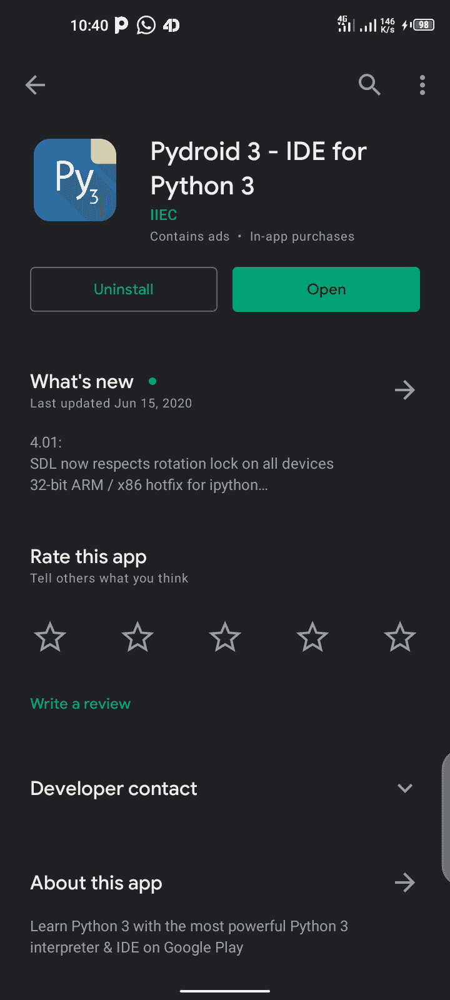

正如您所看到的，pydroid3 是一个移动应用程序，可以让您在手机上编写 Python，所以继续安装它吧。

我们需要做的下一件事是安装 Django。如果你不熟悉 Django，请点击这里查看 Django 文档。

要安装 Django，我们需要在 pydroid3 中打开侧面导航，然后选择终端:

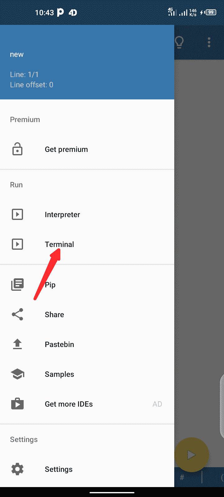

然后点击它，我们应该看到这个:

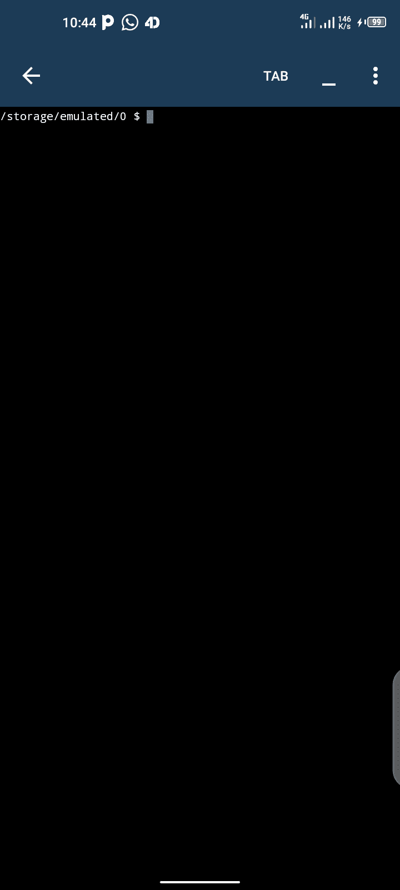

完成后，您需要做的就是键入以下命令:

```
pip install django
```

你应该得到下面的。我收到一条“满足要求”的消息，因为我已经安装了它。

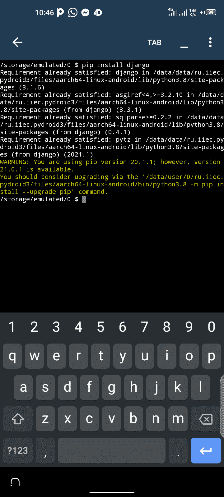

它已成功安装，但让我们确认一下。在终端中键入`django-admin`并按回车键。

你应该知道这个:

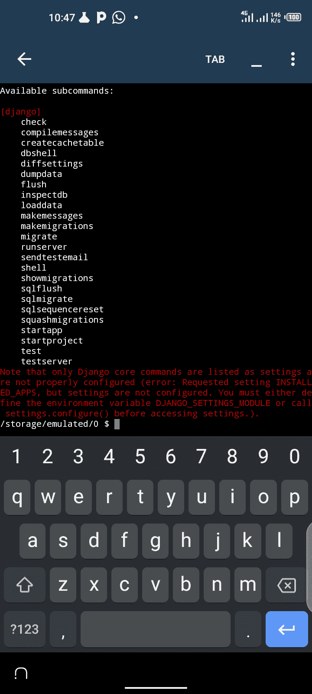

这意味着它实际上已经安装好了。

## 如何构建我们的项目

所以让我们开始构建我们的项目。打开您的终端，键入以下命令:

`django-admin startproject myapp`

这将在根文件夹中创建一个名为 myapp 的 Django 应用程序。

通过输入`cd myapp`和`python manage.py runserver`来改变目录。那么你应该知道这个:

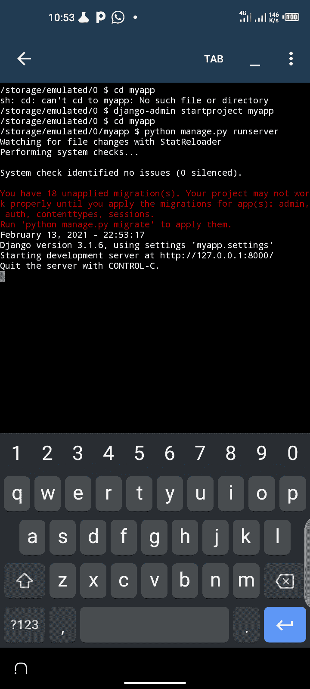

现在服务器已经启动了。接下来，要在浏览器中测试它，请访问 [127.0.0.1:8000](http://127.0.0.1:8000) 。

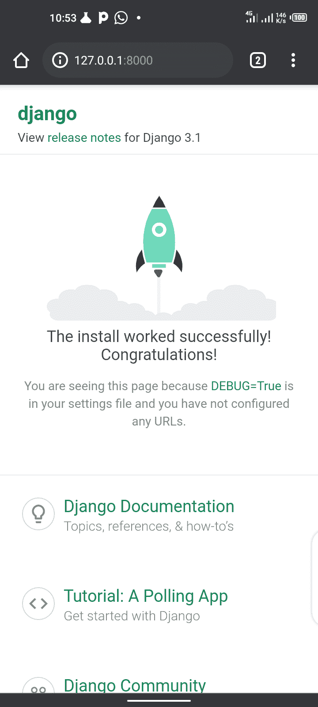

然后嘣！您应该看到 Django 已经成功设置。

接下来我们需要做的是创建我们的 Django 应用程序。在 Django 中，项目文件夹作为根，而 app 作为应用程序本身。

要创建 Django 应用程序，请确保您仍在目录中，然后键入`python manage.py startapp todo`。这在我们的 myapp 项目中创建了一个待办事项应用程序，如下所示:

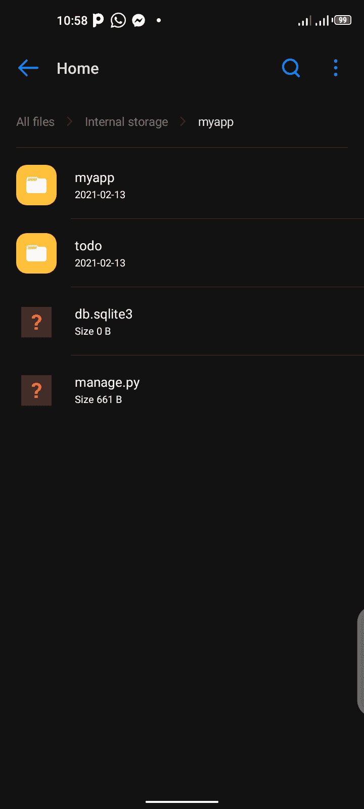

然后在 todo 文件夹中，我们应该会看到类似这样的内容:

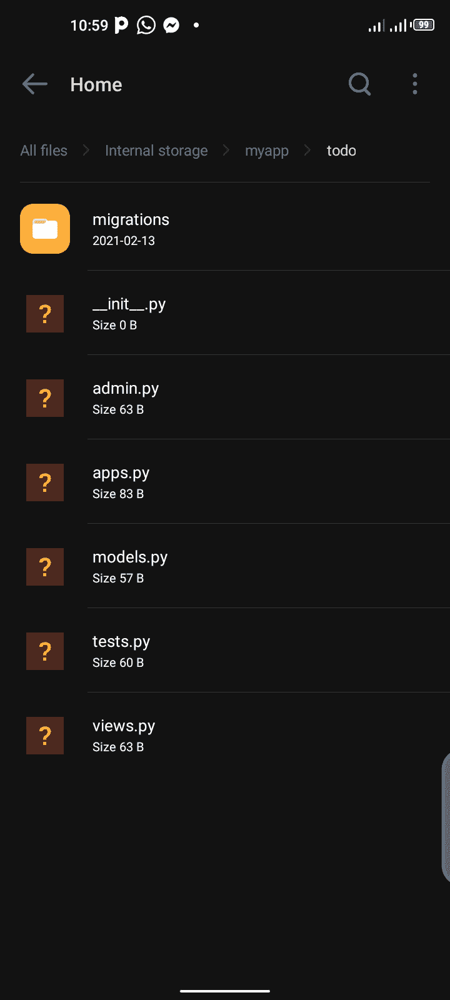

当我们开始处理这些文件时，我们将进一步查看它们。

## 如何配置我们的应用程序

现在让我们让 Django 项目为应用程序提供服务成为可能。首先，打开 myapp 文件夹中的`settings.py`文件，将`'todo'`添加到已安装的应用程序中，如下所示:

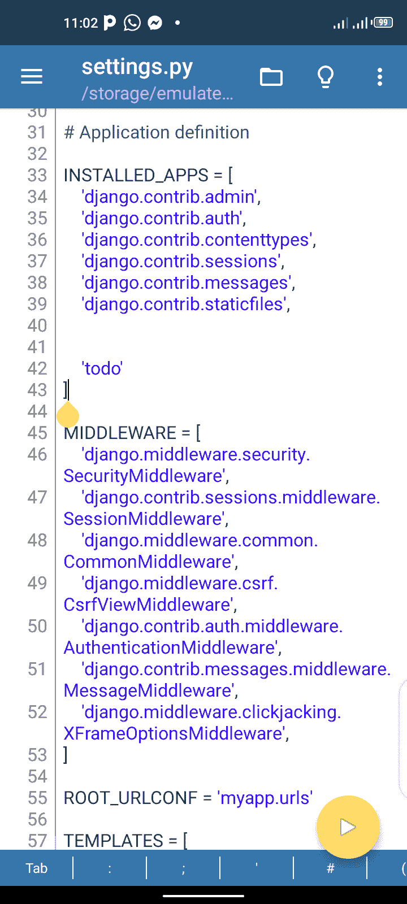

接下来，我们需要打开我们的`urls.py`,将以下内容添加到您的代码中:

```
from django.urls import path, include

path('', include('todo.urls'))
```

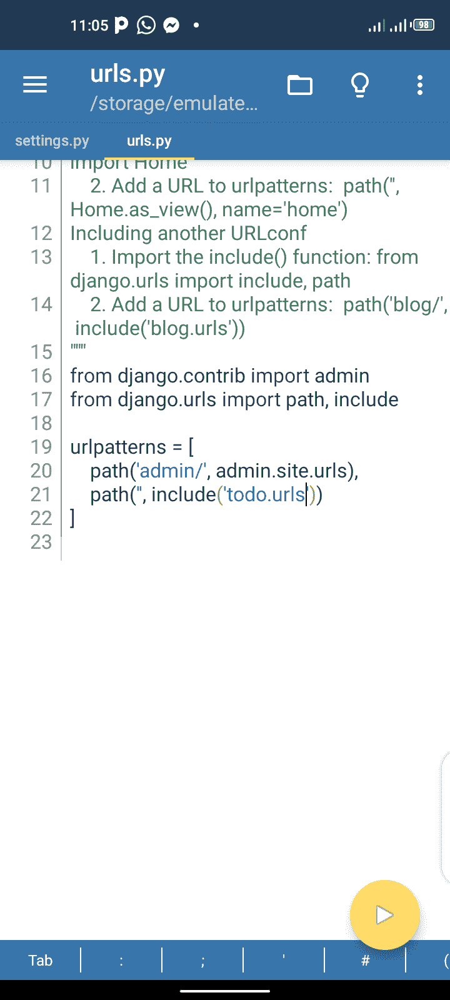

实际发生的情况是，我将`include`添加到了 from`django.urls`导入路径。在路径(`admin`)下面，我们创建了一个空路径，指向或包含 todo 应用程序目录中的`urls.py`文件。我希望这很清楚。

接下来，我们需要在 todo 文件目录中创建一个名为`urls.py`的新文件，并在其中添加以下代码:

```
from django.urls import path
from . import views

urlpatterns = [
	path('', views.index, name='home')
 ]
```

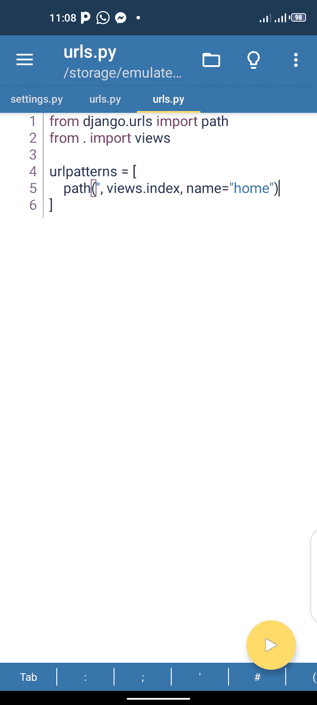

我们从`Django.urls`导入了`path`，也从根目录导入了`views`。然后我们用第一部分作为根链接创建了我们的`urlpatterns`。正如你所看到的，views.index 意味着我们将这个视图指向`views.py`文件中的索引函数。你马上就会看到它是如何工作的。

让我们继续前进到我们的`views.py`文件并添加一些代码。

在顶部，像这样导入`HttpResponse`:

`from django.http import HttpResponse`

在它下面加上这个:

```
def index(request):
	return HttpResponse('Hello')
```

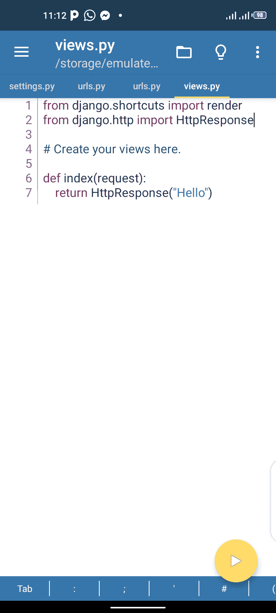

如您所见，我们创建了在`urls.py`中调用的索引函数，并向其传递了一个请求参数。然后我们回了一个`HttpResponse`。

但是在`HttpResponse`可以工作之前，我们必须从`django.http import HttpResponse`导入它——就像 ABC 一样简单。让我们试试这个:打开你的终端和 cd 进入 myapp，输入`python manage.py runserver`来测试它。


如您所见，它返回了响应。所以接下来我们将加载我们的模板 HTML 文件。

要加载我们的 HTML 文件，我们需要在 todo 目录中按以下顺序创建一个这样的文件夹:

`todo/templates/todo`

在 todo 目录中，创建一个名为 templates 的文件夹。在该文件夹中，创建一个名为 todo 的文件夹，就这么简单。

然后创建一个名为 index.html 的简单 HTML 文件，并在其中写入以下内容:

`<h1>Hello world</h1>`

要加载它，让您的`views.py`代码看起来像这样:

```
def index(request):
	return render(request, 'todo/index.html')
```

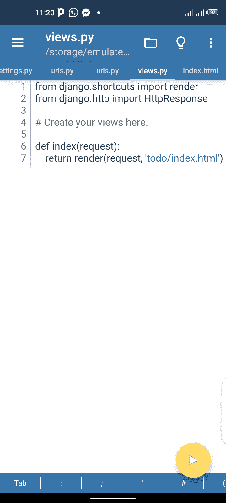

现在，我们没有返回响应，而是返回了一个渲染视图，允许我们现在渲染我们的 HTML 模板，将这个打开您的终端 cd 保存到 myapp 中并运行它。我们应该有这个

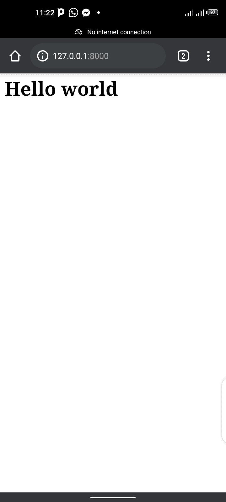

正如你所看到的，它工作得很好——进入下一步。

## 如何设置静态文件

现在要设置静态文件，在您的 todo 目录中创建一个新文件夹，并将其命名为 static。在该文件夹中，创建一个文件夹并将其命名为 todo。

所以应该是这样的:`/static/todo/`。

在 todo 目录中，创建一个文件并将其命名为`main.css`。然后让我们在里面写一点造型:

```
body {
background-color: red;
}
```

并保存它。

现在让我们通过编写以下代码来重新编辑我们的`index.html`文件:

```

<!Doctype html>
<html>
<head>
<title>My page</title>
<link rel="stylesheet" href="" >
</head>
<body>
Hello
</body>
</html>
```

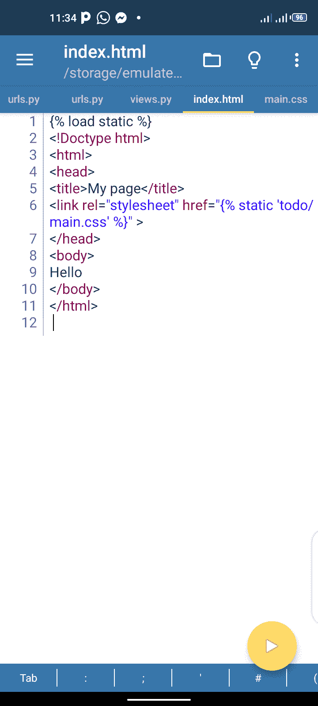

现在让我们运行它:

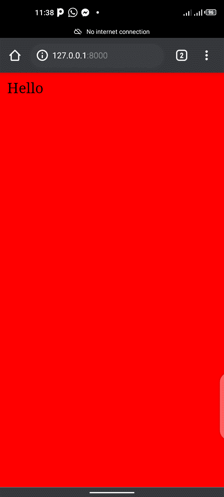

如果你跟随我，那么你应该有以上。

## 如何加载模型和管理面板

现在加载我们的管理面板，我们需要创建一个超级用户。这很容易做到——只需打开你的终端，将 cd 放入 myapp 文件夹，然后输入`python manage.py createsuperuser`并按回车键。您应该看到这个:

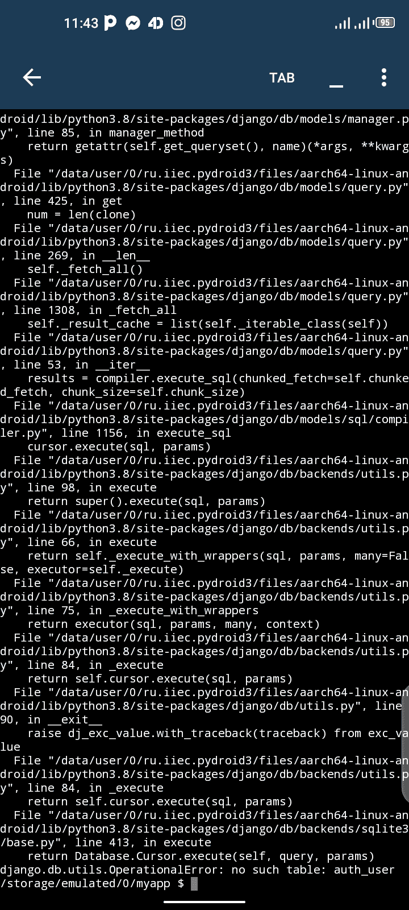

我们得到一个错误，因为我们还没有运行`python manage.py migrate`。因此，键入并按回车键，您应该会看到类似这样的内容:

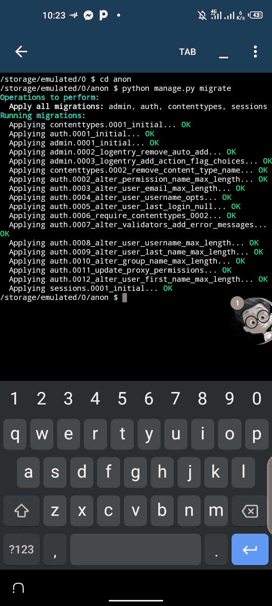

现在输入`python manage.py createsuperuser`并按回车键:

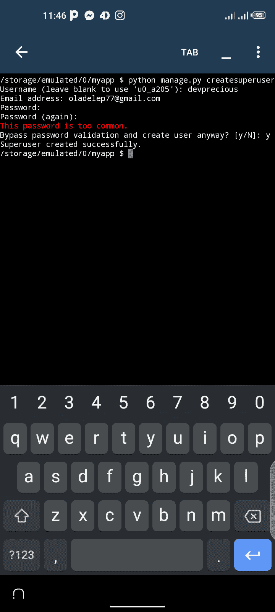

只需填写凭证。我们需要做的下一件事是运行我们的服务器并指向 127.0.0.1:8000/admin。

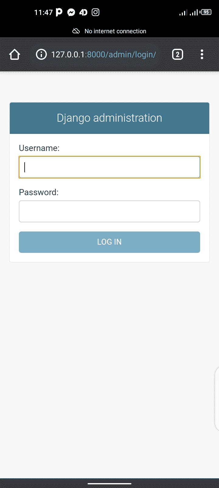

登录后，您将被定向到控制面板:

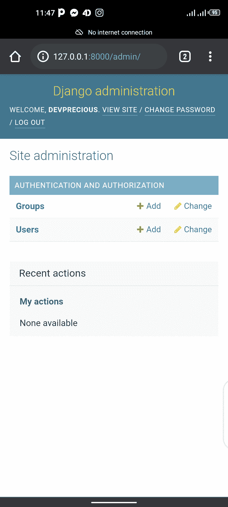

现在，我们已经完成了管理面板，让我们与模型(数据库)的工作。我们将创建一个收集内容的模型。因此，打开您的`models.py`文件，键入以下代码:

```
class Post(models.Model):
	content = models.CharField(max_length=255, null=False)

    def __str__(self):
    	return self.content
```

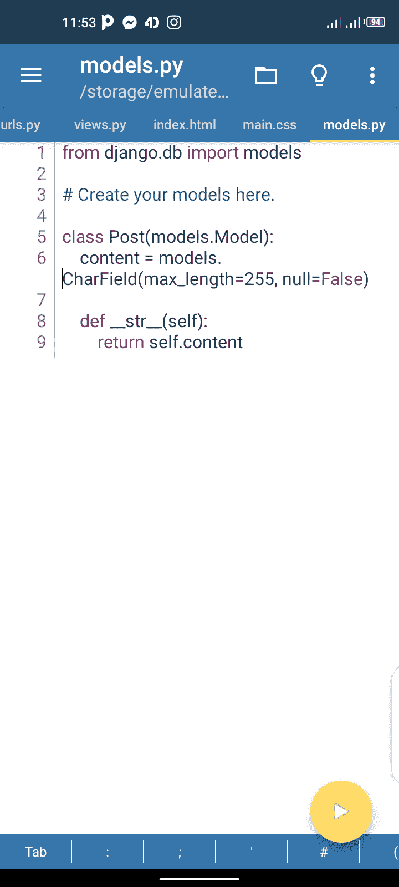

我们创建一个具有参数`models.Model`的类，并给出一个包含`CharField()`的变量`content`，更像是一个文本字段。最后，我们创建了一个神奇的`str`，它返回模型的名称，而不是一个对象。

因此，接下来我们需要运行迁移。打开你的终端，cd 进入 myapp，输入`python manage.py makemigrations`。您应该看到这个:

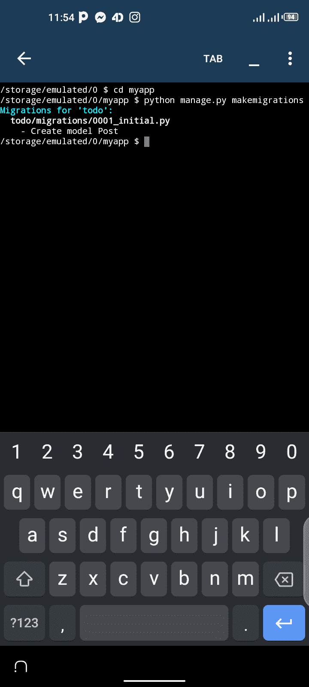

这意味着它已经在我们的数据库中创建了 Post 表。然后运行`python manage.py migrate`，这将导致以下结果:

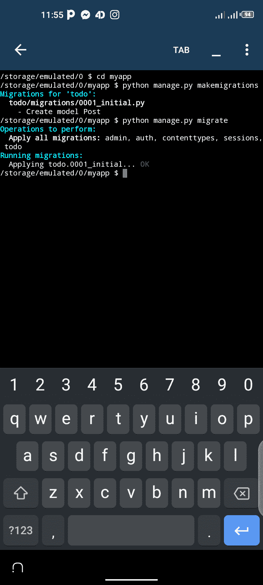

这意味着一切都清楚了。现在将它添加到管理页面，打开`admin.py`并输入以下代码:

```
from .models import *

admin.site.register(Post)
```

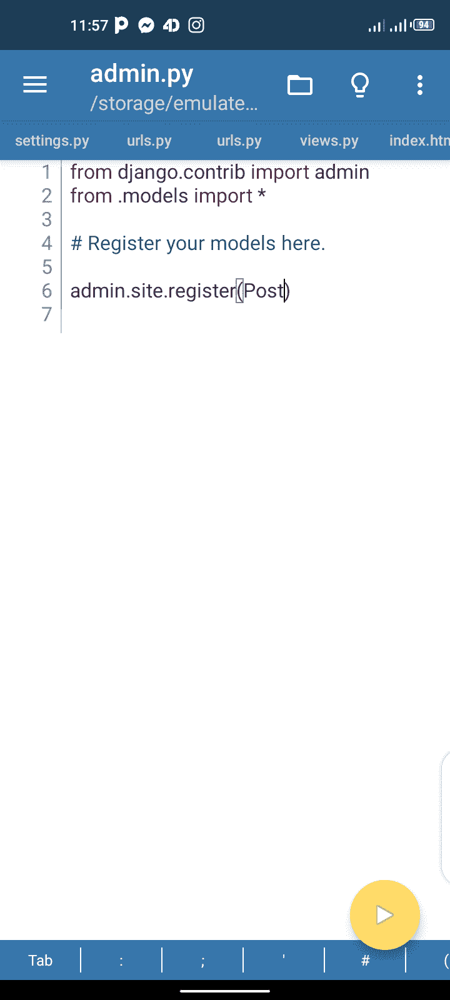

我们从模型中导入了所有的模型类，并在管理面板中注册了 post 模型。现在，如果我们打开管理面板，我们应该看到文章，并保存一些数据。

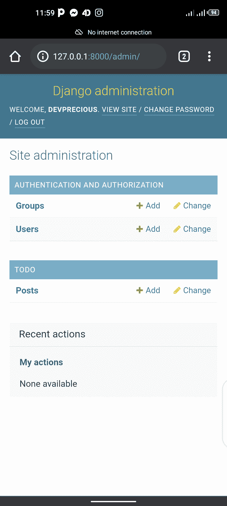

请注意，它现在位于待办事项应用列表中:

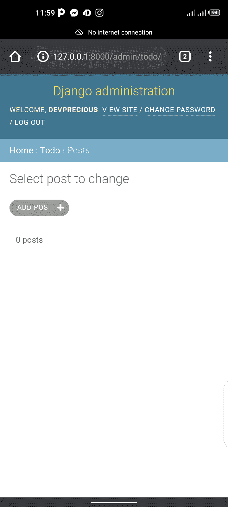

点击之后，您应该会看到:

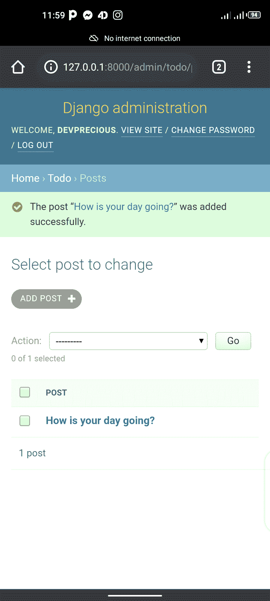

如果你愿意，你可以创建一个帖子。

## 如何将数据从数据库渲染到视图

最后，我们将从数据库中获取数据。为此，我们需要如下更新我们的`views.py`:

```
from .models import *

def index(request):
	content = Post.objects.all()
    context = {'content': content}
    return render(request, 'todo/index.html', context)
```

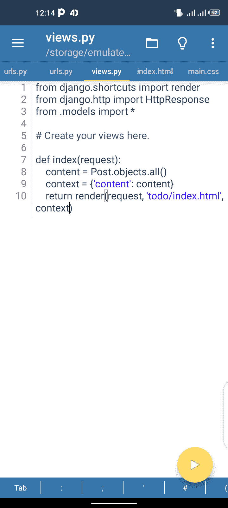

就这么简单:我们从`models.py`导入所有数据，创建一个名为`content`的变量，并从表 Post 中检索所有数据。然后我们把它作为字典传递给我们的视图。因此，在我们的 index.html，要让它工作，只需添加以下内容:

```

{{content.content}}

```

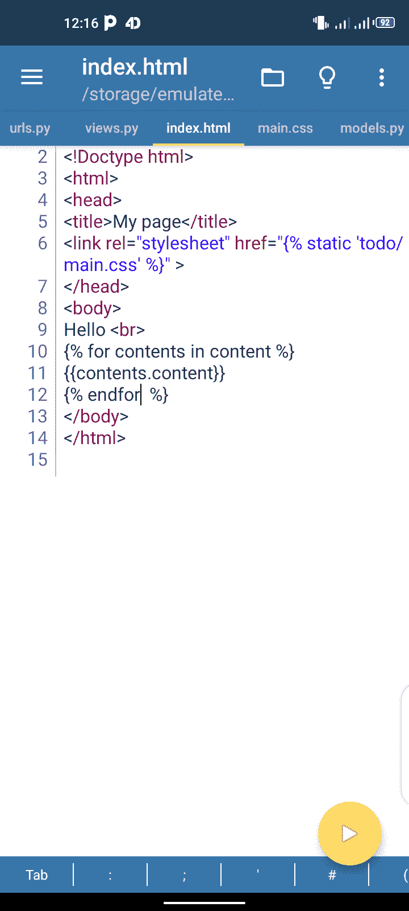

这里，我们使用 templates 标记编写了一个循环，并获取了所有数据内容。现在打开您的终端，cd 进入 myapp，运行服务器来看看神奇的事情发生了:

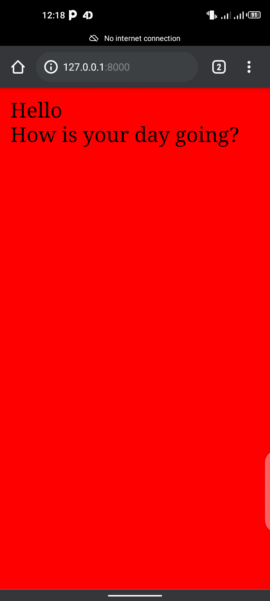

这是可行的，但是让我们来确认一下:

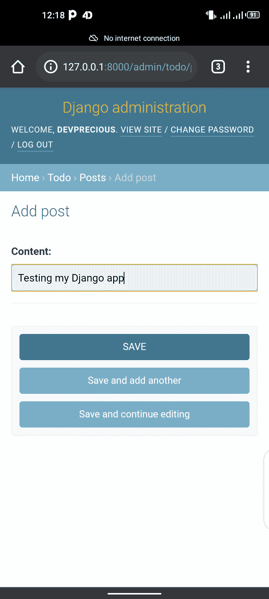

结果应该是这样的:

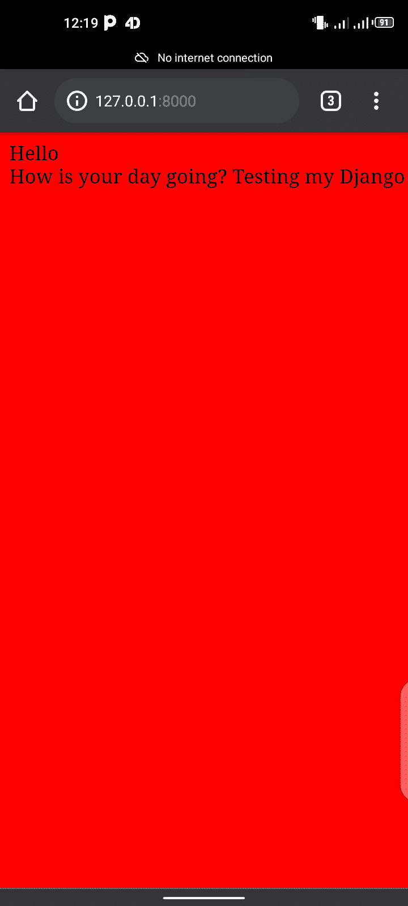

violà——工作正常。最后，你可以添加一个换行符，这样你可以读得更清楚。我们完事了。

感谢您的阅读。如果你想深入学习 Django 教程，请访问我的 YouTube 频道 [Devstack](https://youtube.com/channel/UCLcHGKxbEO1XGVETXqzYXLA) 并订阅。