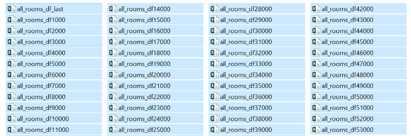

# 如何用 8 行代码组合多个 CSV 文件

> 原文：<https://www.freecodecamp.org/news/how-to-combine-multiple-csv-files-with-8-lines-of-code-265183e0854/>

### 你为什么需要这个？

如果您没有太多的文件要处理，手动复制粘贴是很好的。

但是想象一下，如果您要连接 100 多个文件，您愿意手动完成吗？重复做这件事既乏味又容易出错。



如果所有文件都有相同的表结构(相同的标题和列数)，让这个小小的 [Python 脚本](https://github.com/ekapope/Combine-CSV-files-in-the-folder/blob/master/Combine_CSVs.py)来完成这项工作。

#### 步骤 1:导入包并设置工作目录

将“/mydir”更改为您想要的工作目录。

```
import os
import glob
import pandas as pd
os.chdir("/mydir")
```

#### 步骤 2:使用 glob 来匹配模式“csv”

匹配模式(“csv”)并将文件名列表保存在“all_filenames”变量中。可以查看[这个链接](https://regexr.com/)了解更多关于正则表达式匹配的知识。

```
extension = 'csv'
all_filenames = [i for i in glob.glob('*.{}'.format(extension))]
```

#### 步骤 3:合并列表中的所有文件并导出为 CSV 格式

使用 pandas 连接列表中的所有文件并导出为 CSV。输出文件名为“combined_csv.csv ”,位于您的工作目录中。

```
#combine all files in the list
combined_csv = pd.concat([pd.read_csv(f) for f in all_filenames ])
#export to csv
combined_csv.to_csv( "combined_csv.csv", index=False, encoding='utf-8-sig')
```

添加 encoding = 'utf-8-sig '是为了解决导出'非英语'语言时的问题。

然后…完成了！

这篇文章的灵感来自于我的实际日常问题，代码结构来自于对 [stackoverflow](https://stackoverflow.com/questions/9234560/find-all-csv-files-in-a-directory-using-python/12280052) 的讨论。GitHub 上的[记录了这个操作指南的完整脚本。](https://github.com/ekapope/Combine-CSV-files-in-the-folder/blob/master/Combine_CSVs.py)

感谢您的阅读。请尝试一下，玩得开心，并让我知道你的反馈！

如果你喜欢我的做法，可以考虑在 [GitHub](https://ekapope.github.io/) 、 [Medium](https://medium.com/@ekapope.v) 和 [Twitter](https://twitter.com/EkapopeV) 上关注我。确保[在 GitHub](https://github.com/Ekapope) 上启动:P