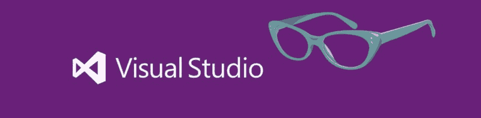
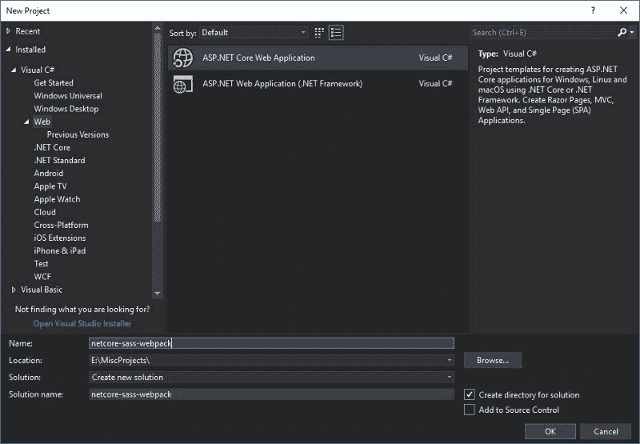
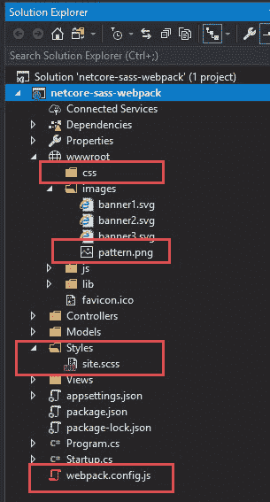
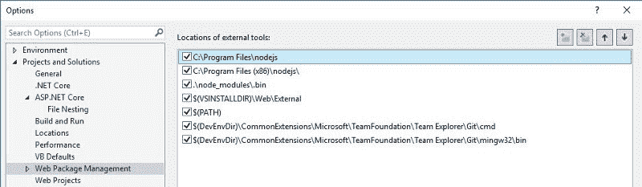
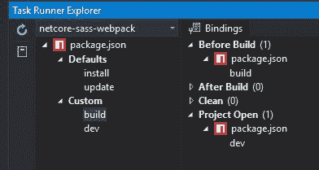
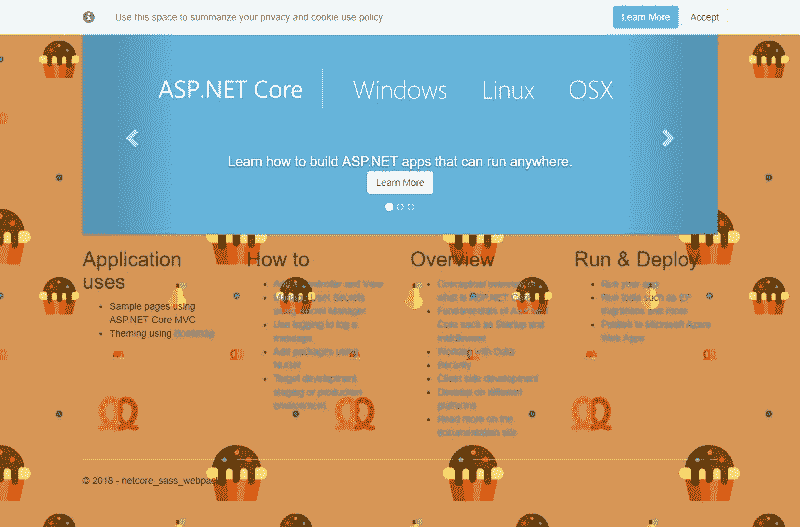

# 如何在 Visual Studio 和 Webpack 中编译 Sass 文件

> 原文：<https://www.freecodecamp.org/news/how-to-compile-sass-files-in-visual-studio-and-webpack-6e45cdc1c14c/>

Sass 是一个非常流行的 CSS 预处理器。本教程的目的是向您展示如何使用 Webpack 在 Visual Studio 中编译 Sass 文件。我们的讨论将包括生产中的缩小和自动修复。



Visual Studio meets Sass

当然，Visual Studio Marketplace 中有一些插件，只安装一个插件而忘记配置可能会很好。但是，如果插件不再受支持，并且停止与较新的 Visual Studio 版本一起工作，会发生什么情况呢？太糟糕了。市场上最流行的编译器插件之一就是这种情况。

通过自己配置编译，您将完全控制输出。此外，供应商前缀将自动添加到您的 CSS 规则中。多酷啊。

#### 先决条件

你需要安装 Node，你可以在这里找到它[。真的就是这样。您还需要 npm，但它也将与 Node 一起安装。](https://nodejs.org/en/)

### 创建项目

**注意:**我们将创建一个. NET 核心 MVC 应用，但同样的原则适用于任何 ASP.NET MVC 应用。您只需要稍微修改一下 Webpack 配置，就可以将 CSS 文件输出到`Content`目录。

打开 Visual Studio，新建一个**ASP.NET 核心 Web 应用**，然后选择 **Web 应用(模型-视图-控制器)**。我将我的项目命名为 *netcore-sass-webpack* 。



Creating the project

在项目的根目录下创建一个`Styles`文件夹。在其中，创建一个 Sass 文件，并将其命名为`site.scss`。打开这个新的 Sass 文件，复制以下内容:

```
/* Please see documentation at https://docs.microsoft.com/aspnet/core/client-side/bundling-and-minification\ 
for details on configuring this project to bundle and minify static web assets. */
body {
    padding-top: 50px;
    padding-bottom: 20px;
    background: #D69655 url('../wwwroot/images/pattern.png') repeat;
}

/* Wrapping element */
/* Set some basic padding to keep content from hitting the edges */
.body-content {
    padding-left: 15px;
    padding-right: 15px;
}

/* Carousel */
.carousel-caption p {
    font-size: 20px;
    line-height: 1.4;
}

/* Make .svg files in the carousel display properly in older browsers */
.carousel-inner .item img[src$=".svg"] {
    width: 100%;
}

/* QR code generator */
#qrCode {
    margin: 15px;
}

/* Hide/rearrange for smaller screens */
@media screen and (max-width: 767px) {
    /* Hide captions */
    .carousel-caption {
        display: none;
    }
}
```

您会注意到这与我们创建项目时 Visual Studio 提供的 CSS 是一样的，除了`body`标记中的`background`规则。现在删除提供的位于`wwwroot/css`下的 CSS(两个文件:`site.css`和`site.min.css`)。别担心，我们会用 Webpack 自动生成这些。

现在，下载[pattern.png](https://github.com/esausilva/netcore-sass-webpack/tree/master/netcore-sass-webpack/wwwroot/images)，放在`wwwroot/images`下面。

在应用程序的根目录下创建一个空的 JavaScript 文件，并将其命名为`webpack.config.js`。我们稍后会处理这件事。您最终应该得到以下项目结构:



Project Structure

**注意:**你不需要对每个项目都做下面两个步骤，只需要做一次(除非你卸载并重新安装 Visual Studio)。

您需要向 Visual Studio 提供节点安装路径。回到您的项目，选择左边的**工具- >选项**ns**ne 项目和解决方案- > Web 包管理**管理，并在 l `ist ( C:\Program Files\`节点`js or C:\Program Files (x86)\` nodejs 的顶部添加节点安装的路径，这取决于您安装的是 x64 还是 x86 版本)。



Node path

最后下载 [NPM 任务运行器](https://marketplace.visualstudio.com/items?itemName=MadsKristensen.NPMTaskRunner)并安装它——但是你需要先关闭 Visual Studio。

### Webpack 和 NPM 依赖关系

打开**命令提示符**，导航到项目的根目录，安装所需的依赖项:

```
cd netcore-sass-webpack\netcore-sass-webpack
npm init -y
npm i -D webpack webpack-cli node-sass postcss-loader postcss-preset-env sass-loader css-loader cssnano mini-css-extract-plugin cross-env file-loader
```

第一个`npm`命令初始化您的`package.json`，第二个命令安装您的依赖项。

*   **网页包，网页包-CLI**—bundler 模块
*   **Node-sass**—Node 到 LibSass 的绑定；为 Sass 提供支持
*   **postcss-loader，postcss-preset-env** —用于 Webpack 的 postcss 加载程序，用于处理自动修复和缩小
*   **sass-loader，css-loader** — Webpack 需要特定的加载器来支持 sass 和 css
*   **cssnano** — CSS minifier
*   **mini-css-extract-plugin**—将 CSS 提取到一个单独的文件中
*   **跨环境** —为 Windows 用户提供环境变量支持。我们将使用 NODE _ 环境变量
*   **文件加载器** —在我们的 CSS 规则中提供对文件(图像)的支持

此时，您可以在 Visual Studio 中重新打开该项目。项目加载完成后，打开`package.json`并添加以下脚本:

```
"scripts": {
    "dev": "webpack --watch",
    "build": "cross-env NODE_ENV=production webpack"
  },
```

*   **dev** —每当项目打开时，我们将绑定这个脚本，Webpack 将不断地观察源 Sass 文件的变化，编译它们，并输出单独的 CSS 文件
*   **build** —我们将在每个项目构建之前绑定这个脚本，并将生成生产 CSS 文件，包括缩小和自动修复

**注意:**NPM 脚本将使用**任务运行器**窗口自动运行。稍后会详细介绍。

是时候进行我们的 Webpack 配置了。打开`webpack.config.js`并复制以下内容:

```
const path = require("path");
const MiniCssExtractPlugin = require("mini-css-extract-plugin");
const postcssPresetEnv = require("postcss-preset-env");
// We are getting 'process.env.NODE_ENV' from the NPM scripts
// Remember the 'dev' script?
const devMode = process.env.NODE_ENV !== "production";
module.exports = {
  // Tells Webpack which built-in optimizations to use
  // If you leave this out, Webpack will default to 'production'
  mode: devMode ? "development" : "production",
// Webpack needs to know where to start the bundling process,
  // so we define the Sass file under './Styles' directory
  entry: ["./Styles/site.scss"],
// This is where we define the path where Webpack will place
  // a bundled JS file. Webpack needs to produce this file,
  // but for our purposes you can ignore it
  output: {
    path: path.resolve(__dirname, "wwwroot"),
// Specify the base path for all the styles within your
    // application. This is relative to the output path, so in
    // our case it will be './wwwroot/css'
    publicPath: "/css",
// The name of the output bundle. Path is also relative
    // to the output path, so './wwwroot/js'
    filename: "js/sass.js"
  },
  module: {
    // Array of rules that tells Webpack how the modules (output)
    // will be created
    rules: [
      {
        // Look for Sass files and process them according to the
        // rules specified in the different loaders
        test: /\.(sa|sc)ss$/,
// Use the following loaders from right-to-left, so it will
        // use sass-loader first and ending with MiniCssExtractPlugin
        use: [
          {
            // Extracts the CSS into a separate file and uses the
            // defined configurations in the 'plugins' section
            loader: MiniCssExtractPlugin.loader
          },
          {
            // Interprets CSS
            loader: "css-loader",
            options: {
              importLoaders: 2
            }
          },
          {
            // Use PostCSS to minify and autoprefix with vendor rules
            // for older browser compatibility
            loader: "postcss-loader",
            options: {
              ident: "postcss",
// We instruct PostCSS to autoprefix and minimize our
              // CSS when in production mode, otherwise don't do
              // anything.
              plugins: devMode
                ? () => []
                : () => [
                    postcssPresetEnv({
                      // Compile our CSS code to support browsers
                      // that are used in more than 1% of the
                      // global market browser share. You can modify
                      // the target browsers according to your needs
                      // by using supported queries.
                      // https://github.com/browserslist/browserslist#queries
                      browsers: [">1%"]
                    }),
                    require("cssnano")()
                  ]
            }
          },
          {
            // Adds support for Sass files, if using Less, then
            // use the less-loader
            loader: "sass-loader"
          }
        ]
      },
      {
        // Adds support to load images in your CSS rules. It looks for
        // .png, .jpg, .jpeg and .gif
        test: /\.(png|jpe?g|gif)$/,
        use: [
          {
            loader: "file-loader",
            options: {
              // The image will be named with the original name and
              // extension
              name: "[name].[ext]",
// Indicates where the images are stored and will use
              // this path when generating the CSS files.
              // Example, in site.scss I have
              // url('../wwwroot/images/pattern.png') and when generating
              // the CSS file, file-loader will output as
              // url(../images/pattern.png), which is relative
              // to '/css/site.css'
              publicPath: "../images",
// When this option is 'true', the loader will emit the
              // image to output.path
              emitFile: false
            }
          }
        ]
      }
    ]
  },
  plugins: [
    // Configuration options for MiniCssExtractPlugin. Here I'm only
    // indicating what the CSS output file name should be and
    // the location
    new MiniCssExtractPlugin({
      filename: devMode ? "css/site.css" : "css/site.min.css"
    })
  ]
};
```

请参考代码中的注释来理解配置。(更多可读文件[此处](https://github.com/esausilva/netcore-sass-webpack/blob/master/netcore-sass-webpack/webpack.config.js)。)

现在我们需要在**任务运行器浏览器**中创建一些绑定。导航到**视图- >其他窗口- >任务执行人经验**传说。窗口将显示在底部，您将看到您在`package.json`中创建的脚本列在**的**自定义下。你也会在 De faults 下看到一些任务**，但是你可以直接忽略它们。**

我们需要两个绑定:

*   在构建之前右键单击**构建- >绑定->——Visual Studio 将在每次构建之前运行该任务。请记住，这个 npm 脚本运行 Webpack 进行生产，并将优化 CSS 文件。**
*   右键单击**dev->Bindings->Projec**t Open—当您打开项目时，Visual Studio 将运行此任务。记住，这个 npm 脚本在监视模式下运行 Webpack，*将*监视 Sass 文件中的任何变化，并输出处理后的 CSS 文件。

任务运行器浏览器应该是这样的:



Task Runner Explorer

**注意:**由于某些原因，Visual Studio 有时会在打开项目时无法启动 **dev** 任务。如果发生这种情况，只需打开任务浏览器并手动运行任务。

你可以从 [GitHub 库](https://github.com/esausilva/netcore-sass-webpack)获得完整代码。

### 最后的想法

这就是全部了。因为您已经打开了 Visual Studio，所以没有任何任务正在运行。继续操作，*右击*任务 **dev** 并选择 run。您将看到任务正在加载，当它完成时，您将看到在 `wwwroot/css`目录下创建了一个`site.css`文件。打开`site.scss`，进行更改并保存。现在打开`site.css`，你会看到你的变化反映在那里。酷！！

按下 **Ctrl + F5** 运行你的项目，你会看到在`wwwroot/css`目录下创建了一个`site.min.css`文件。这个文件是任务运行器*在构建项目之前运行`build`脚本*时创建的。

最终的站点应该是这样的:



Final site

我知道，我知道，背景很糟糕…但是我需要一张图片来展示 Webpack `file-loader`的运行。

有了这个配置，您甚至可以将 transpile modern JavaScript (ES6+)添加到 ES5 中。看看这些:`@babel/core`、`babel-loader`、`@babel/preset-env`。

谢谢你的阅读，我希望你喜欢它。如果你有任何问题、建议或更正，请在下面的评论中告诉我。别忘了给这篇文章分享一下，你可以在 [Twitter](https://twitter.com/_esausilva) 、 [GitHub](https://github.com/esausilva/) 、 [Medium](https://medium.com/@_esausilva) 、 [LinkedIn](https://www.linkedin.com/in/esausilva/) 关注我。

你也可以访问我的个人博客网站。

* * *

**2019 年 8 月 25 日更新:** 我一直在建一个祷告 web app，叫“**我的安静时光——祷告日志**”。如果你想继续参与，请通过以下链接报名:[http://b.link/mqt](http://b.link/mqt)

该应用程序将在年底前发布，我对这个应用程序有很大的计划。点击下面的链接可以看到一些截图:[http://pc.cd/Lpy7](http://pc.cd/Lpy7)

如果您对该应用程序有任何疑问，我在 Twitter 上的 DMs 是开放的。