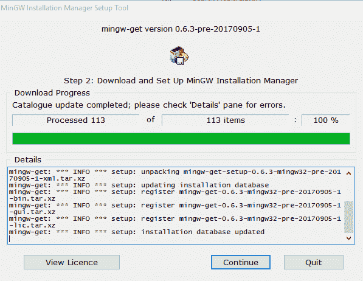
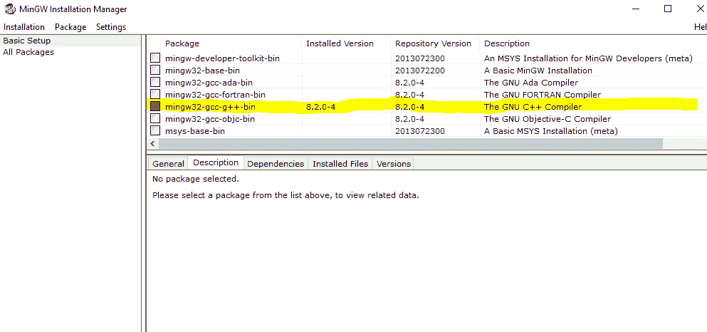
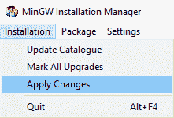
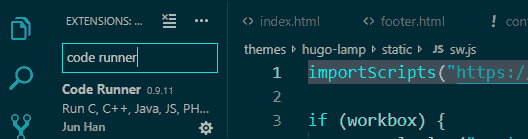
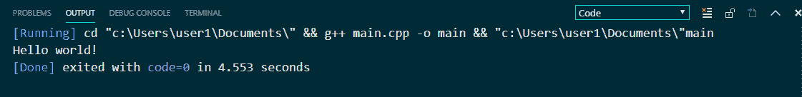

# 如何在 Visual Studio 代码中编译 C++代码

> 原文：<https://www.freecodecamp.org/news/how-to-compile-your-c-code-in-visual-studio-code/>

> PS:这个发表在我的博客[这里](https://bolajiayodeji.com/how-to-compile-your-c-code-in-visual-studio-code-cjxu6aool001n7ls1d5nfo1mt)。

C++是一种静态类型、自由形式、(通常)编译、多范例、中级通用中级编程语言。

简单地说，C++是一种基于 C 的复杂、高效、通用的编程语言。

它是由比雅尼·斯特劳斯特鲁普在 1979 年发明的。

C++的主要特性之一是编译器。这是用来编译和运行 C++代码的。

> 编译器是一种特殊的程序，它处理用 C++等特定编程语言编写的语句，并将它们转换成机器语言或计算机处理器使用的“代码”。([来源](https://en.wikipedia.org/wiki/Compiler))

实际上，我写这篇文章是因为我有一个 C++作业，需要使用编译器。像往常一样，每个人都在使用 [CodeBlocks IDE](http://www.codeblocks.org/) 和 [Visual Studio IDE](https://visualstudio.microsoft.com/) 。但是我已经习惯了 Visual Studio 代码来编写我所有的程序。

然后我开始寻找一种在我自己的 VsCode 编辑器中直接编译 C++的方法，因此有了这篇文章:)。

在本文中，我将向您展示如何在 VsCode 中设置编译器，并为您提供一些最佳 C++资源的链接。


# 先决条件

*   C++的先验知识
    (我假设你正在学习 C++，即将开始学习，或者只是为了好玩才读这个。本文不是 C++ 101 教程——需要对 C++有所了解。)
*   Visual Studio 代码编辑器
    在这里下载[，阅读](https://code.visualstudio.com/#alt-downloads) [Windows](https://code.visualstudio.com/docs/?dv=win) 、 [Linux](https://code.visualstudio.com/docs/?dv=linux64_deb) 和 [Mac](https://code.visualstudio.com/docs/?dv=osx) 的安装文档
*   **互联网连接(！重要)**

### **免责声明！**

在本文中，我将使用 Windows 操作系统，但是我将提供一些资源链接，这些资源将对使用其他操作系统的人有所帮助。

现在让我们开始吧！

# 下载并安装一个 C++编译器

*   前往 www.mingw.org，点击“下载/安装程序”链接下载 MinGW 安装文件，或者点击[此处【Windows，](https://osdn.net/projects/mingw/downloads/68260/mingw-get-setup.exe/)[此处【Linux，以及](http://www.mingw.org/wiki/LinuxCrossMinGW)[此处](https://brewinstall.org/Install-mingw-w64-on-Mac-with-Brew/)Mac

> MinGW 是“极简 GNU for Windows”的缩写，是一个用于原生 Microsoft Windows 应用程序的极简开发环境。([来源](https://mingw.osdn.io/))

*   下载后，安装 MinGW，等待“MinGW 安装管理器”出现。



*   当“MinGW 安装管理器”出现时，点击`mingw32-gcc-g++`，然后选择“标记安装”



*   在左上角的菜单中，点击“安装>应用更改”



*   等待并允许完全安装。在此过程中，请确保您有稳定的互联网连接。

# 编辑 PATH 环境变量，以包含 C++编译器所在的目录

> PATH 是类 Unix 操作系统、DOS、OS/2 和 Microsoft Windows 上的环境变量，指定可执行程序所在的一组目录。通常，每个正在执行的进程或用户会话都有自己的路径设置。——[维基百科](https://en.wikipedia.org/wiki/PATH_(variable))

安装 MinGW 后，可以在`C:\MinGW\bin`中找到。现在，您必须在环境变量 PATH 中包含这个目录。如果你使用电脑已经有一段时间了，你应该已经知道如何做到这一点，但如果你没有，这里有一些资源:

*   点击[此处](https://www.computerhope.com/issues/ch000549.htm)获取 Windows 操作系统指南
*   点击[此处](https://www.cyberciti.biz/faq/unix-linux-adding-path/)为 Linux
*   点击[此处](https://hathaway.cc/2008/06/how-to-edit-your-path-environment-variables-on-mac/)获取 Mac OS 指南

# 在 VS 代码中安装代码运行器扩展

现在我们已经设置了编译器，让我们安装代码运行器

代码运行器允许您运行多种语言的代码片段或代码文件:

> C，C++，Java，JavaScript，PHP，Python，Perl，Perl 6，Ruby，Go，Lua，Groovy，PowerShell，BAT/CMD，BASH/SH，F# Script，F#(。NET 核心)、C#脚本、C#(。NET Core)、VBScript、TypeScript、CoffeeScript、Scala、Swift、Julia、Crystal、OCaml Script、R、AppleScript、Elixir、Visual Basic。NET、Clojure、Haxe、Objective-C、Rust、Racket、AutoHotkey、AutoIt、Kotlin、Dart、Free Pascal、Haskell、Nim、D、Lisp、Kit 和自定义命令。

*   点击[此处](https://marketplace.visualstudio.com/items?itemName=formulahendry.code-runner)下载
*   或者在 VsCode marketplace 选项卡中搜索



*   安装后重启 VsCode
*   在 Vscode 中打开 C++文件。下面是一个基本的 hello world 程序:

```
#include <iostream>
using namespace std;
int main() 
{
    cout << "Hello world!";
    return 0;
} 
```

将该文件另存为`test.cpp`

# 使用代码运行器运行您的代码

*   使用快捷键`Ctrl+Alt+N`
*   或者按 F1，然后选择/键入运行代码
*   或者右击文本编辑器，然后在编辑器上下文菜单中单击运行代码

代码将运行，输出将显示在输出窗口中。使用“Ctrl+快捷键”打开输出窗口。



# 停止正在运行的代码

*   使用快捷键`Ctrl+Alt+M`
*   或者按 F1，然后选择/键入停止代码运行
*   或者右键单击输出通道，然后单击上下文菜单中的“停止代码运行”

万岁，你刚刚在 VsCode 中成功设置了你的 C++环境！

# 结论

这里有一个快速提示:默认情况下，VsCode 的输出终端是只读的。如果您正在运行需要用户输入的代码，例如:

```
#include <iostream>
using namespace std;

const double pi = 3.14159; 

void calculate()
{
  double area; 
  double radius;

  cout<<"Enter Radius: "<<endl; 
  cin>>radius;

  area = pi * radius * radius; 

  cout<<"area is: "<<area<<endl;
 }

int main()
{
  calculate(); 
  return 0;
} 
```

您将无法在终端中键入内容，`Cannot edit in read-only terminal`。
要解决这个问题，您需要手动启用读写。

*   在 VsCode 中，转到文件>首选项>设置。
*   在左侧面板的用户选项卡中，找到扩展部分
*   滚动并找到“运行代码配置”
*   滚动并找到一个复选框`Run in Terminal`(是否在集成终端中运行代码)选中该复选框。

运筹学

*   在您的`setting.json`文件中，添加:

```
"code-runner.runInTerminal": true 
```

万岁，大功告成，准备出发:)。

# C++资源

这里有一些 C++资源，你可以用来开始学习 C++

*   [https://www.learncpp.com/](https://www.learncpp.com/)
*   [https://www.codecademy.com/learn/learn-c-plus-plus](https://www.codecademy.com/learn/learn-c-plus-plus)
*   [https://www.udemy.com/free-learn-c-tutorial-beginners/](https://www.udemy.com/free-learn-c-tutorial-beginners/)
*   [https://www.sololearn.com/Course/CPlusPlus/](https://www.sololearn.com/Course/CPlusPlus/)
*   [https://www.youtube.com/watch?v=vLnPwxZdW4Y](https://www.youtube.com/watch?v=vLnPwxZdW4Y)
*   [https://www . tutorialspoint . com/cplusplus/CPP _ useful _ resources . htm](https://www.tutorialspoint.com/cplusplus/cpp_useful_resources.htm)
*   [https://makeawebsitehub.com/learning-c/](https://www.tutorialspoint.com/cplusplus/cpp_useful_resources.htm)

# 信用

*   [MinGW 项目](http://www.mingw.org/)
*   [电码跑者](https://marketplace.visualstudio.com/items?itemName=formulahendry.code-runner)作者[韩军](https://marketplace.visualstudio.com/publishers/formulahendry)

感谢您的阅读！