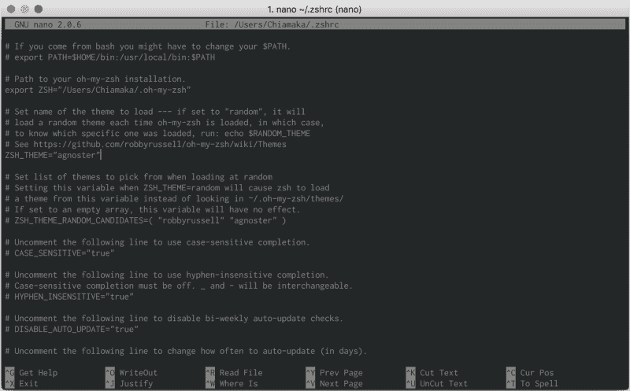
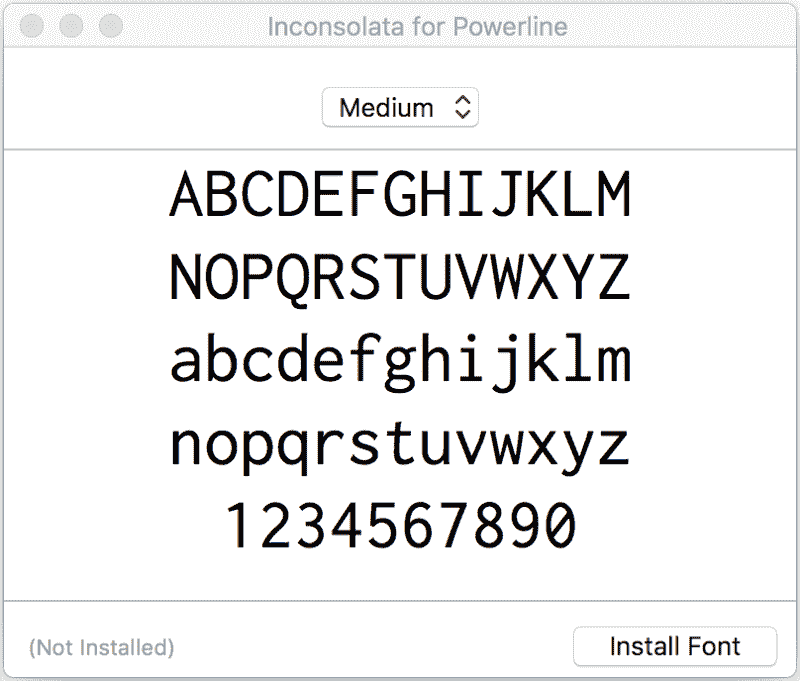
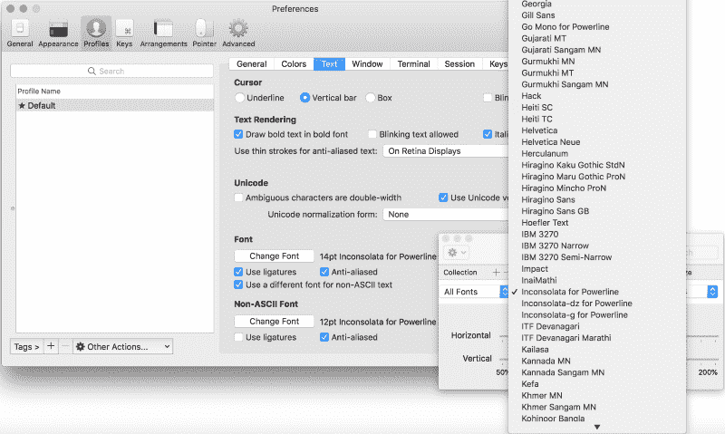
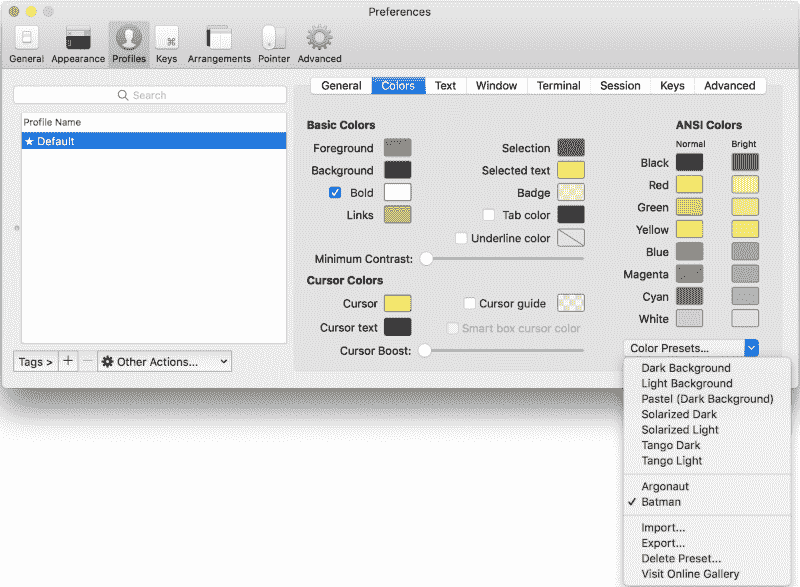
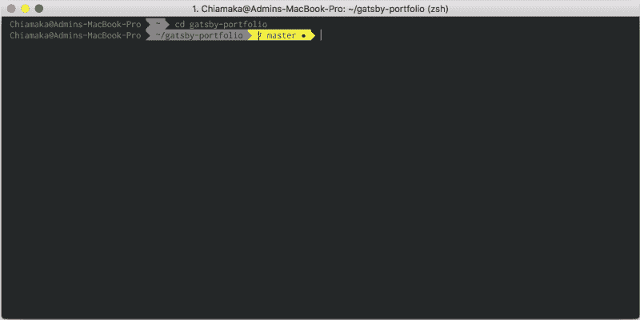
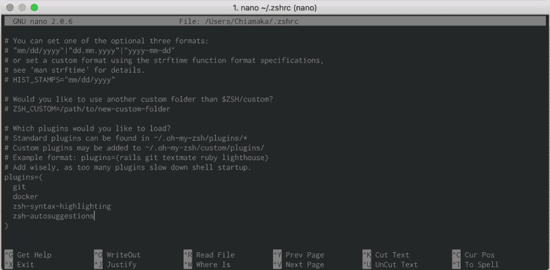
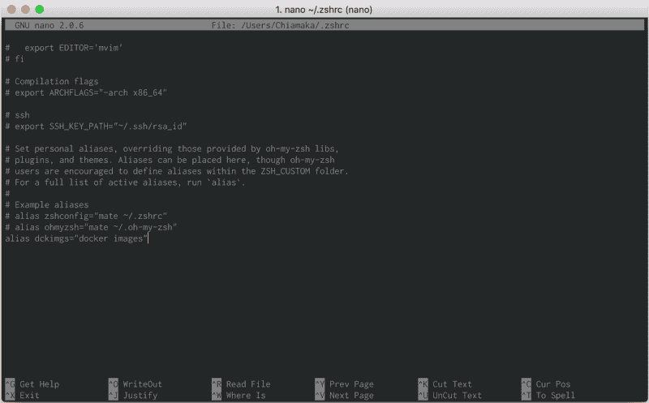

# 如何像专业人士一样用 Zsh 配置你的 macOs 终端

> 原文：<https://www.freecodecamp.org/news/how-to-configure-your-macos-terminal-with-zsh-like-a-pro-c0ab3f3c1156/>

作者 Chiamaka Ikeanyi

有时候，使用默认终端很糟糕。你想与众不同，给枯燥的终端增添活力，提高你的生产力。

[Z shell](https://en.wikipedia.org/wiki/Z_shell) (Zsh)是一个构建在 bash(MAC OS 的默认 shell)之上的 Unix shell，有大量的改进。

在本演练中，我们将使用 ZSH 及其依赖项来配置 iTerm2。这是一个显而易见的问题，在此之后，你会思考为什么没有早点发现 ZSH。好吧，既然你已经在这里了，让我们开始吧。

### 主题演讲

*   自制安装
*   iTerm2 安装
*   ZSH 和我的 ZSH 装置
*   设置依赖关系以创建漂亮的终端

### 步骤 1:安装自制软件

[Homebrew](https://brew.sh/) 是一款免费开源的软件包管理系统，简化了苹果 macOS 上的软件安装。

在安装家酿之前，我们需要安装 Xcode 的 CLI 工具。打开您的终端并运行命令:

```
xcode-select —-install
```

如果出现错误，运行`xcode-select -r` 重置`xcode-select`。

然后，安装家酿。

```
/usr/bin/ruby -e "$(curl -fsSL https://raw.githubusercontent.com/Homebrew/install/master/install)" 
```

### 步骤 2:安装 iTerm2

iTerm2 是 terminal 的替代品，也是 iTerm 的继任者。大多数软件工程师更喜欢 i [Term2](https://www.iterm2.com/) 而不是 macOS 自带的默认终端，这是因为它的[酷功能](https://www.iterm2.com/features.html)。您可以将 zsh 集成到 iTerm2 中以提高生产率。

要安装 iTerm2，请运行以下命令:

```
brew cask install iterm2
```

### 第三步:安装 ZSH

> Zsh 是一个为交互使用而设计的 shell，尽管它也是一种强大的脚本语言。

默认情况下，macOs 附带的 zsh 位于`/bin/zsh`。

让我们使用 brew 安装 zsh 并让 iTerm2 使用它。

```
brew install zsh
```

### 步骤 4:安装我的天啊

> “哦，我的 Zsh 是一个开源的、社区驱动的框架，用于管理您的 [zsh](https://www.zsh.org/) 配置。它不会让你成为 10 倍的开发者…但你可能会觉得自己像一个”

> —罗比·拉塞尔

它运行在 Zsh 上，提供可在~/内配置的出色功能。zhrc 配置文件。通过运行命令安装 [Oh My Zsh](https://github.com/robbyrussell/oh-my-zsh)

```
sh -c "$(curl -fsSL https://raw.githubusercontent.com/robbyrussell/oh-my-zsh/master/tools/install.sh)"
```

检查安装的版本

```
zsh --version
```

您可以升级它以获得它提供的最新功能。

```
upgrade_oh_my_zsh
```

重启 iTerm2，深入体验使用 Zsh 的新体验。欢迎来到“哦，我的 Zsh”世界？。

这还不是全部。现在，我们将安装依赖项以充分利用 Zsh。

### 步骤 5:更改默认主题

哦，我的 Zsh 捆绑了很多主题。默认主题是 robbyrussell，但是您可以将其更改为您选择的任何主题。在这种情况下，我将其更改为 agnoster，这是一个已经预装的主题。

然后你需要在你的`~/.zshrc`中选择这个主题。要打开配置文件(。zshrc)，运行命令:

```
nano ~/.zshrc
```



Zsh theme set to agnoster

或者在文本编辑器中使用

```
open ~/.zshrc
```


设置 zsh 主题并更新您的更改

```
source ~/.zhrc
```

### 使用自定义主题

要安装另一个未预装的主题，请将存储库克隆到`custom/themes`目录中。在这个场景中，我们将安装 [powerlevel9k](https://github.com/bhilburn/powerlevel9k/wiki/Install-Instructions#option-2-install-for-oh-my-zsh) ，

```
$ git clone https://github.com/bhilburn/powerlevel9k.git ~/.oh-my-zsh/custom/themes/powerlevel9k
```

然后，在您的`~/.zshrc`中选择该主题

```
ZSH_THEME="powerlevel9k/powerlevel9k"
```

通过运行命令`source ~/.zshrc`更新您的更改

如果您希望更改终端的背景颜色，请导航至`iTerm2 > Preferences > Profiles > Colors`。

此方案中所选的主题需要电力线字体。所以，让我们安装它。

### 步骤 6:安装字体

我将使用[伤心药](https://github.com/powerline/fonts/tree/master/Inconsolata)。从这些[电力线字体](https://github.com/powerline/fonts)中选择你喜欢的字体。然后，下载并安装它。



或者下载整个字体。

```
git clone https://github.com/powerline/fonts.git

cd fonts

./install.sh
```

要更改字体，导航至`iTerm2 > Preferences > Profiles > Text > Change Font`。

现在，你可以看到 Inconsolata 被列为字体之一。选择您喜欢的字体。对于支持连字的字体，如 [FiraCode](https://github.com/tonsky/FiraCode) ，选择“使用连字”选项，以时尚的方式查看箭头和其他运算符，如( **→** )。



Select a powerline font

### 步骤 7:安装配色方案

让我们改变配色方案，以突出我们终端的美感。导航至[ITER m2-配色方案](https://github.com/mbadolato/iTerm2-Color-Schemes)并下载 ZIP 文件夹。然后，解压下载的文件夹，因为我们需要的东西在 schemes 文件夹中。

导航至`iTerm2 > Preferences > Profile > Colors > Color Presets > Import`

*   导航到“方案”文件夹，选择您喜欢的颜色方案进行导入。
*   单击特定的配色方案将其激活。在这个场景中，我激活了蝙蝠侠，这是我喜欢的配色方案。



Tada！？我们已经完成了基本设置。



Batman color scheme

### 步骤 8:安装插件

哦，我的 ZSH 预装了一个 git 插件。要添加更多功能，例如 docker、自动建议、语法突出显示等等:

*   克隆 Git 存储库

```
git clone https://github.com/zsh-users/zsh-docker.git ${ZSH_CUSTOM:-~/.oh-my-zsh/custom}/plugins/zsh-docker
```

*   前往`.oh-my-zsh > custom > plugins`目录查看克隆的目录。要访问它，运行命令`open ~/.oh-my-zsh`
*   将插件添加到配置文件`~/.zshrc`的插件部分，如下所示
*   通过运行命令`source ~/.zshrc`更新您的更改



### 步骤 9:添加别名

别名是用来减少键入命令所花时间的快捷方式。向您在下面显示的部分中运行的命令添加别名。



Typing `**dckimgs**` executes docker images command

***感谢阅读*。**

如果你知道其他使用 ZSH 提高生产力的方法，你可以把它们放在评论区，我会很高兴收到你的来信。