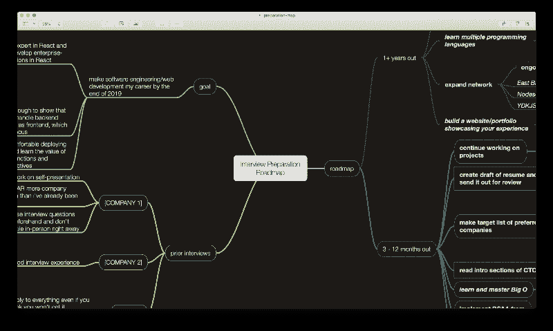

# 如何克服恐惧，不再讨厌工作面试

> 原文：<https://www.freecodecamp.org/news/how-to-conquer-your-fear-and-stop-hating-job-interviews-dd8ae3d66069/>

作者鲁本·雷耶斯

# 如何克服恐惧，不再讨厌工作面试

两件事:第一，停止说你不够好。

第二，开始练习，你内心的王牌开发者就流出来了。

在这篇文章中，我分享了我经历面试的过山车，为什么我没有放弃开发人员的工作，以及我在这个过程中学到了什么。

Photo by [José Alejandro Cuffia](https://unsplash.com/@alecuffia) on Unsplash

### 面试糟透了

你可能会像我一样。你整天都在做白日梦，想着写伟大的代码，炫耀你惊人的工作。你最不想做的事情就是在面试过程中挣扎。你把你的技能放在那里接受批评，这让你自己变得脆弱。你会被拒绝。

现在不要气馁。事实是，面试是每个开发人员技能的重要组成部分。它不仅展示了你的技能:它给你机会分享你解决技术问题的独特方法，它让你有机会与其他开发人员交流并向他们请教，最重要的是，面试让你成为一名更好的程序员。

为什么？你炫耀你的优点和缺点。你自省。如果你做得好，你会得到一份工作！如果你没有，你知道你需要做什么。事实是，面试对你来说总是双赢的。

糟糕的是，除非你得到了这份工作，否则你几乎不会有这种感觉。

### 我最初的挣扎

在开始涉足编程之前，我是一名大学机械工程专业的学生。我害怕工作面试和人际交往。然而，我还是去了招聘会，递上简历，拿回名片。我知道这是不可避免的邪恶。

有时候我会接到电话。每一次，当我在电话里把我练习过的电梯推销给那个友好的人大约两分钟后，我都会僵住。

作为一名机械工程师，我对自己的工作并没有特别的热情。每当我与招聘人员交谈时，它就会显示出来。我说得很好，能接到电话。之后，也许由于不喜欢我的领域的惯性，我不会做任何其他准备。

这些电话没有任何结果，除了为下一个电话制造焦虑。

You merely adopted the rejection letter.

大约一年半前，我决定投身于 web 开发。2017 年 7 月，我认为自己足够优秀，可以开始寻找实习机会。我选择 web 开发是出于对它的热爱。我不仅仅是被驱使着在这个行业找到一份工作…然而有一段时间，结果还是和以前一样。

我会坚持不懈地学习。我会从头到尾阅读 Django 文档。我的 [GitHub 贡献图](https://github.com/radotreyes)比 Richard Hendricks 试图将 Pied Piper 作为音乐播放器出售更环保。**有些事情必须改变，那就是我的心态。**

### 路线图:让面试成为你的难题

正如我上面所说的，面试对你来说总是一个双赢的局面，尽管一开始看起来可能不是这样。克服面试恐惧的第一步是改变你对面试的看法。

要记住的最重要的事情是**你不会失去什么，你会得到一切！**

#### 净化空气

没有什么神奇的方法可以让你变得擅长面试，或者摆脱随之而来的焦虑。面试能带来工作，而工作是你想要的——很容易对最终结果产生偏见。这是我最重要的建议:不要。

相反，专注于你自己。你为什么想成为一名开发者？如果你已经有了一份工作，你为什么要改变呢？你擅长什么？你想达到什么目的？你打算怎么做？回答这些问题是为了你自己，而不是其他人…并且要诚实。考虑把它写下来，并记录下这段内心独白。

I keep a running log of what my goals are and what I learn from every interview.

揭示这些问题的答案会让你对自己想要追求的东西有信心，让你清楚自己的优势，并找到一条前进的道路。在为自己明确设定目标的过程中，你会对自己的优势和知识差距有所了解。

你对自己越了解，你就能更好地向他人传达你的目标。这意味着面试官。它还可以帮助您与可能和您走在同一条路上的其他开发人员建立联系！

#### 设定期望

面试不是为了得到一份工作。面试就是分享你的技能。面试是关于提高你的技能。让它深入人心。这与得到这份工作无关。是关于提高。

想想你的其他爱好。对我来说，是[奥运举重](https://en.wikipedia.org/wiki/Olympic_weightlifting)。举重有两种:抓举和挺举。我不是特别擅长[抓举](https://www.youtube.com/watch?v=3jdGt9cftyU)，但我知道其他人擅长，所以我经常向我的运动员同伴询问他们的技术。

我们可能会聊上几个小时，来回发送视频，讨论电梯的机械结构。“当杠铃离开地面时，你如何保持稳定的姿势？” *“当你要抓住它的时候，你在想什么？”*

我问这些问题的目的是提高我的技术，这样我就可以举起更多的重量。为此，我当然希望提出诚实的问题，并得到诚实的回答。更多的时候，我会带着以前没有的知识离开谈话，并将其应用到我的培训中。

我相信你明白这个类比的意思。我在这些对话中的目标是交流知识。通常对话的双方最终都会更好。

这也适用于发展世界。当你面试时，你是在用对公司的了解来交换对自己的了解。每个人都变得更聪明，对如何改进有了更好的想法。你是否得到这份工作只是一个副作用！

希望这能减轻一些压力。最重要的是，**成为一名更好的开发人员难道不是你的主要目标**，而不是在脸书谋得一份好差事吗？

### 投入工作

这是最难的部分。我希望你们没有人站起来，因为我是一个糟糕的励志演说家。你会想坐下来听这个关于 **~THE GRIND~** 的平庸演讲。

#### 第一步:只写代码！

找到一个朋友或同伴，加入 Skype 通话，开始一个结对编程会话！挑选一些你们都想解决的问题，并在这个过程中互相指导。

如果你在网上做这件事，我推荐使用 [JSFiddle 的“协作”功能](https://jsfiddle.net/)(免费！)或者 [CodeSandbox 的【Live】](https://codesandbox.io/docs/live)(不免费！？)，这样您就可以看到相同的代码。

在这样做的过程中，你会习惯于通过你的思考过程来交流。你学习如何最好地与团队中的其他人交流解决问题的方法。如果你或你的同伴开始挣扎，你将学会如何互相帮助度过难关。和别人一起编码绝对会让你成为一个更好、更自信的程序员。这会让你进入分享作品的状态。

#### 第二步:在项目上合作

第二步和第一步很相似，只是你和其他志同道合的人为了一个共同的目标团结在一起。目标是让这个该死的网站以某种方式工作。

我在第一步中强调过，结对编程非常有助于你在讲述步骤时建立自信和专业知识。然而，与他人一起构建项目是一种新的游戏:你将学会对你的代码做出决定。你会发现自己的风格与其他人不同，是什么让你与众不同。你将学会在团队冲突中工作。你将学习如何在团队中编写代码。

顺便说一句，这是一个进入开源软件的好机会！为开源做贡献会让你接触到新技术。它让你练习阅读、调试和改进他人的代码，以及我在本节中所说的一切。在撰写本文时，是[**Hacktoberfest 2018**](https://hacktoberfest.digitalocean.com/)，这意味着如果你在 GitHub 上贡献开源，你会得到一件病衫！

除了开源，我推荐看看 Chingu。这是一个为你和其他人牵线搭桥的社区，让你在一个生产规模的项目上进行合作！

#### 第三步:面试时间到了，宝贝！

直面你的恐惧。变得强大。征服面试。

Plus ultra, baby. Image by [steamXO](https://www.flickr.com/photos/158561476@N06/) on Flickr

如果你想和同龄人一起开始练习，那太好了！我建议你们两人一组，用来自 [LeetCode](https://leetcode.com/) 的问题，来自 [freeCodeCamp](https://learn.freecodecamp.org/coding-interview-prep/algorithms) 的面试模块，或者你喜欢的其他资源来互相测验。

如果你想在网上合作，我强烈推荐 [Pramp。Pramp 是一项为你和陌生人配对的服务。你们两个轮流做采访者和被采访者。您将收到来自同事的反馈，并找出您需要改进的地方！](https://www.pramp.com/)

模拟面试是通过真实面试的真正关键。你需要反应迅速，能够回答关于你自己的问题，并且能够在压力下工作。在没有真正利害关系的练习中，这正是你最终要关注的！

刚开始会不舒服。请这样想:在前面的步骤中，您只是花了大量的时间来学习如何沟通和解决技术问题。你也对自己有了更多的了解。这些技能对于面试的成功至关重要。因为你已经练习了这么多，剩下的唯一一步就是将这些技巧应用到实际的面试中。

#### 第四步:再做一次

一次又一次的练习面试，在过程中不断成长。现在是时候发出你的简历，开始真正的面试了。这次唯一不同的是赌注，对吗？

一点也不。你没有冒任何风险。真正面试中最糟糕的情况是得不到工作。这不会让你有任何损失，因为你一开始就没有损失任何东西。相反，想想你会得到什么:

*   你会发现为什么雇主可能会拒绝你，你会在这些方面有所改进
*   你在扫描市场，寻找雇主想要什么，你可以据此调整你的学习。
*   如果一切顺利，你最终会得到一份新工作！太棒了。

当你把焦点放在自己身上时，面试每次都是双赢的。得到这份工作会随之而来。

### 分手建议

我希望这篇文章有助于解释为什么面试如此可怕。我希望能激励你如何度过难关。请记住，面试和实际编码一样是重要的技能。对于开发人员来说，知道如何沟通你所做的对你每天的工作至关重要。无论是向应用程序推出一个伟大的新功能，还是解释你如何解决堆栈溢出的问题。

我们写的很多代码都是给别人看的，而不仅仅是给我们自己看的。学会分享你的技能，你的成功很快就会到来！

我也在博客上发了这个帖子， [*试编码，很好玩*](https://trycodingitsfun.com/posts/stop-hating-interviews/) *！*