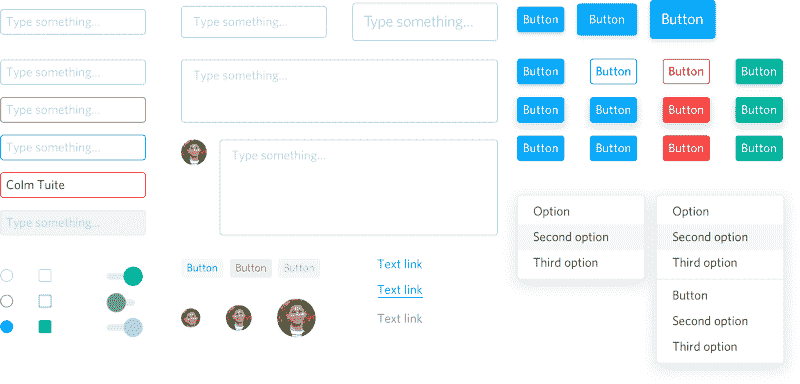
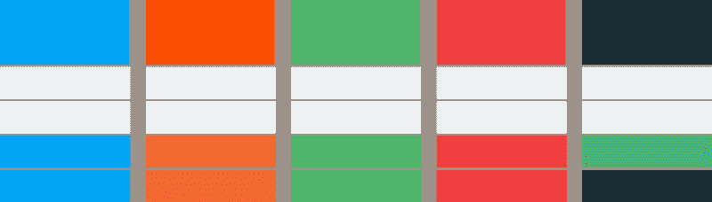
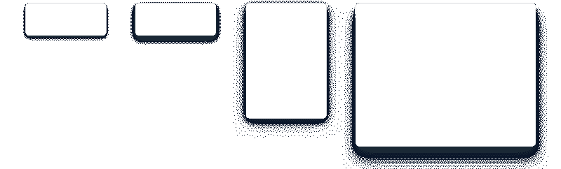
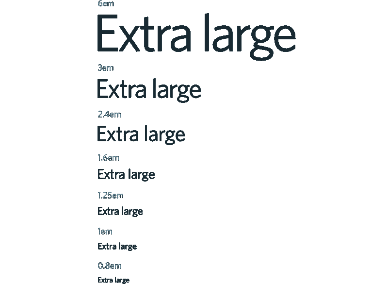
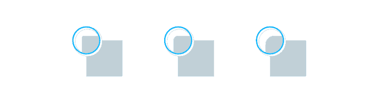
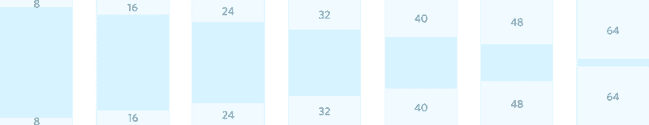
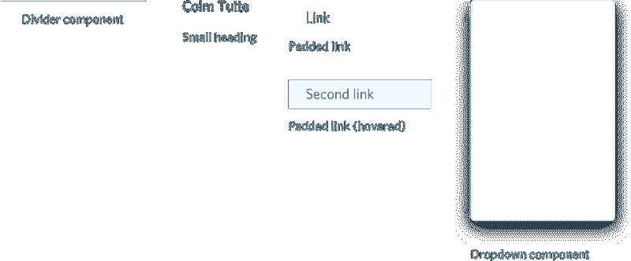
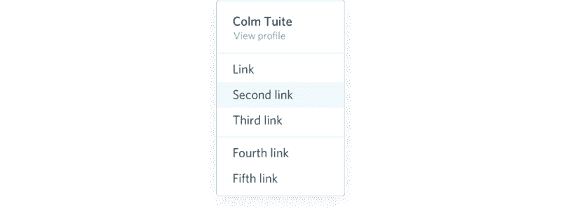

# 如何构建设计体系

> 原文：<https://www.freecodecamp.org/news/how-to-construct-a-design-system-864adbf2a117/>

科尔姆·图伊特

# 如何构建设计体系

#### 设计和构建一致设计系统的技巧。

毫无疑问，我最常被问到的是设计系统。因此，在过去几年的大部分时间里，我一直在思考如何设计、构建和展示像漫威、T2、矮脚鸡和 T4 这样的产品的设计系统，我想我应该分享一下我在这个过程中学到的东西。

#### 什么是设计系统？

众所周知，设计师喜欢好的 UI 套件。然而，除了把工具包和风格指南放在一起，最近似乎有越来越多的重点放在设计系统，旨在把整个产品联系在一起。像 Shopify 和 T2 Intercom 这样的公司正在组建专注于系统设计的内部团队。人们开始意识到系统设计的重要性。这令人鼓舞。谁知道呢，也许有一天我们会有一个设计工具，它不会假设我们每次打开一个新文档都是从零开始…？

设计系统(因为它与技术产品相关)不仅仅是一个框架、UI 工具包或组件库。它不仅仅是一个风格指南或一套代码指南。它甚至超过了这些部分的总和。设计系统是一个控制产品构成的不断发展的规则集。

任何好的设计系统都有许多方面——从公司文化/使命开始，一路渗透到品牌、文案、组件库和其他设计语言。更高层次的观点可以说是任何设计系统中最重要的方面，但就本文的目的而言，我将假设作为一家公司，你知道你是谁，你的使命是什么，你的产品应该如何看，感觉和功能。

一旦你有了这些关键因素，你就可以将这些知识转化成一种有凝聚力的设计语言。

### 设计样式调色板

在我们开始设计闪亮的组件之前，我们需要为这些组件打下基础。我们需要把产品分解成最简单的形式。

即使是最简单的标题组件也是多个可重用样式的集合…

我们需要把事情分解，直到达到不可减少的最小值；最基本的款式。一个好的起点是 [CSS 样式属性](https://www.w3schools.com/cssref/)的完整列表。这些属性中的大多数只接受固定值，因此可以在互联网上的每个网站上重用。接受自定义值的属性最终会将我们的产品与其他产品区分开来。这些自定义值将定义我们的全局样式调色板。我们的全球风格调色板将用于设计和构建我们所有产品的每一个方面。

当我们完成时，我们的产品中不应该有任何一种风格是在我们的全局风格调色板中预定义的。

#### 颜色

让我们从最明显的样式属性开始——现代设计工具似乎认为唯一可以命名、存储和重用的样式属性:颜色。

对于我们的主要品牌颜色，让我们选择蓝色。对于我们的第二品牌颜色，让我们用它的互补对应物:橙色。

Brand colours

利用颜色来传达成功和失败是一种常见的设计模式，所以让我们在调色板中加入绿色和红色。像黑色和黄色这样的颜色可能也不错。

Success and failure colours

最后，我们需要一些灰色。大多数用户界面至少需要以下灰色:

*   非常浅的灰色作为背景
*   略深的灰色用于边框、线条、笔画或分隔线。
*   副标题和支持正文的中灰色。
*   主标题、正文和背景为深灰色。

当然，你可能需要更多的灰色。正文可能需要三种不同的色调。你可能更喜欢两种不同的笔画颜色。这取决于你。这里的要点是，您预先定义了您需要的任何样式，以便它们可以在以后的整个产品中重用。

最后，我们可能还想为每种颜色添加色调或阴影变化。当设计添加浅色背景或深色描边的组件时，这些会很有用。

Our final colour palette

#### 阴影

阴影是大多数 ui 中另一个常用的样式属性。据我所见，许多设计师只是在设计组件时即兴想到阴影。实际上，大多数样式属性也是如此。像这样孤立的设计通常会导致不一致的用户界面。

让我们后退一步，考虑一下我们试图用阴影达到的目的。很明显，我们试图给用户界面增加一些视角，但是很可能很多组件都可以从同样的效果中受益。因此，让我们将样式从单个组件中抽象出来，放到我们的全局样式调色板中。

这四个阴影应该足以设计我们系统中的每个组件:

*   一个微妙的阴影，以提高互动组件和增加启示。
*   组件上悬停效果的阴影更加明显。
*   一个强烈的阴影，给下拉/弹出和其他类似的组成部分的观点。
*   模态分量的远处阴影。

Our range of shadows from subtle to distant.

#### 类型标度

为了在每个屏幕上创建一个合适的视觉层次，我们需要定义一些不同的字体大小。

就像音乐中的音符一样，我们的字体应该遵循一个音阶。这有助于保持平稳的垂直节奏。起初这听起来有点令人生畏，但幸运的是，一些非常聪明的人已经在过去的几年里为我们解决了这一切。Tim Brown 建了一个很棒的网站来展示各种型号的秤。[亚当·摩斯](https://twitter.com/mrmrs_)已经开源了他的[全音阶类型音阶](http://ty-p.cc/)的实现。我总的来说发现“大三分之一”的比例对大多数网络产品来说都很好。

下一步是大致决定我们需要的字体大小，然后在我们的“大三分之一”字体标度上绘制它们。

*   默认(1em)标准文本将出现在我们营销网站、UI 等的许多地方。16px 是默认的浏览器字体大小，让我们使用它。
*   例如，对于博客中的大正文，尺寸稍大。
*   标题和副标题的尺寸要大一些。
*   章节标题的超大尺寸。
*   例如，对于定价页面上的价格来说，尺寸大得离谱。
*   我们还需要一些较小的尺寸，用于较小的正文、输入提示和其他次要文本。

Type scale

#### 边界半径

现在只需要对接受自定义值的每个样式属性应用相同的过程。对于圆角，我们需要以下圆角半径值:

*   复选框、标记和标签等微小组件的小边框半径。
*   按钮、输入和类似组件的中等边框半径。
*   卡片、模型和其他大型组件的大边界半径。

2px, 4px and 8px border radii

*注意:我们还需要 50%的边界半径来构建圆形组件，如头像等。*

#### 间距标度

几乎所有设计中最常用的样式属性是空白。无论我们是在标题中分隔链接，在网格中分隔项目，在头像和链接之间增加一些距离，还是填充下拉组件——我们产品中的空白不应该是任意的或无意的。

与文字一样，通过坚持间距比例，我们可以确保我们的每个组件和布局都是统一的。我最喜欢的间距尺度是 [Material design 的 8dp 网格](https://material.io/guidelines/layout/metrics-keylines.html#metrics-keylines-baseline-grids)。Elliot Dahl 写了一篇关于 8pt 网格系统及其好处的文章[。](https://medium.com/built-to-adapt/intro-to-the-8-point-grid-system-d2573cde8632#.8unqq6lz0)

坚持 8dp 增量，我们可以绘制出一些间距值，用于设计我们产品套件中的每个组件和布局。

我们还可以使用这些间距值来定义一组宽度、高度和行高，我们可以重复使用这些值来调整按钮、表单输入、头像和其他类似组件的大小。由于这些组件经常在整个 web 产品中并排出现，所以如果它们遵循相同的规模，将有助于避免任何不必要的差异。

#### 字母间距

正如我前面提到的，字体大小不是我们定义文本组件所需的唯一样式属性。字母间距是另一个有用的属性，我们可以用它来收紧大标题或者让小标题透气。

3 或 4 个字母间距值应该就可以了。

### 构建组件库

既然我们已经定义了我们的全局样式面板，我们可以开始构建组件库了。在很大程度上，设计组件不是一个创造性的过程——我们只是将预定义的样式映射到组件。

在这个阶段，我们不应该需要一个尚未在我们的风格调色板中定义的单一风格。创意过程发生在风格调色板设计阶段。从这一点开始，无论是颜色、字体大小、边距/填充值、宽度/高度还是其他，我们用来设计组件和布局的每一种风格都应该从我们的风格调色板中选取。几乎不需要引入任何新内容。这听起来可能极端或不合理，但相反，这是我认为很多人误入歧途的地方。

Dave Rupert 最近在 Twitter 上发起了一项民意调查，比如，如果按钮在模态组件中，那么将覆盖按钮组件样式的代码放在哪里。

Harry Roberts(看看这个了不起的作品)然后[在他自己的文章中解释了他对这个](https://csswizardry.com/2017/02/code-smells-in-css-revisited/)的想法。在那之后，乔纳森·史努克[用他自己的思想](https://snook.ca/archives/html_and_css/coding-css-for-context)扩展。虽然我同意哈里和乔纳森得出的结论，但最终，我认为整个辩论是不必要的。

设计一个组件并打算全局重用它，然后只在产品的一个特定部分修改该组件，这是矛盾的。这违背了创建全局组件库的初衷。每当我看到超越其他风格的风格时，通常要么是为了适应狭小的空间而砍掉一个组件，要么是因为在早期设计阶段没有足够的规划而加入一个组件的变体。

每当您在产品的一个区域覆盖一个全局组件时，您也在侵蚀您的设计系统的一致性。当你对分散在产品中的组件进行足够多的零星修改时，你就不再有一个一致的设计系统了。你只有一个不一致的混乱的设计系统。

让我们来看几个常见的组件，看看如何只使用我们在上面的调色板中定义的样式来构建它们。

#### 不起眼的按钮

让我们从一个简单的按钮组件开始，来说明如何只使用我们在样式面板中预定义的样式来构造组件。

#### 更多组件

同样，这些颜色、字体大小、阴影和填充值都是直接从我们上面预定义的样式调色板中选取的。

#### 让我们试试更新奇的东西…

当我们设计并构建了一些组件后，我们就可以开始组合多个组件来创建更复杂的组件，比如这个下拉组件。

这个下拉组件不使用我们之前定义的基本样式面板之外的单一样式。使用这种方法，我们可以设计一个完整的组件库，然后移动到更宽的布局，最后全屏显示。

### 路上的小贴士

*   某些组件将需要我们的样式面板中没有定义的值，例如，侧边栏的宽度。有时这些值只是视口宽度的 1/3 或类似的值。其他时候，这些值将是任意的和不可重用的，这完全没问题。重点是考虑哪些样式应该是可重用的(大多数)，哪些样式不应该。
*   让组件做它们自己的事。不要试图给按钮、输入、标题或其他组件增加边距。在组件级别，您应该只定义在该组件的每个实例中出现的统一样式。由于不同情况下的边距不同，最好使用包装器`div`来应用它们。哈里·罗伯特写了一篇极好的文章谈到了这一点。

*我正在开发一个基于 [Bantam CSS 框架](https://github.com/colmtuite/bantam)的成熟的 CSS 工具包，它将包括本文中显示的所有组件以及更多。该项目是为 [Modulz](https://github.com/colmtuite/modulz-ui) ，一个我正在工作的产品，但如果你有兴趣自己使用这个 UI 工具包，让我知道在 [Twitter](https://twitter.com/colmtuite) 。如果我有足够的兴趣，我会开源它。*